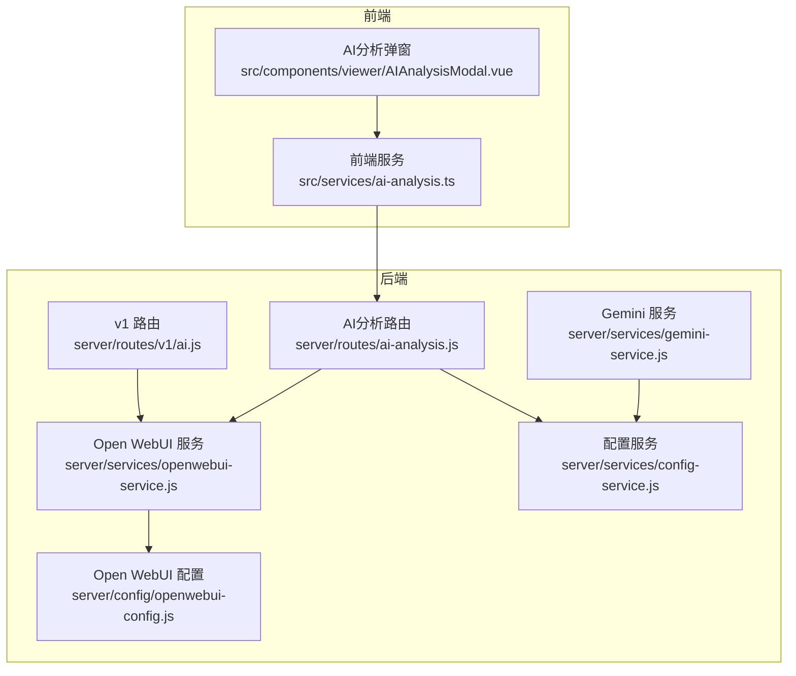
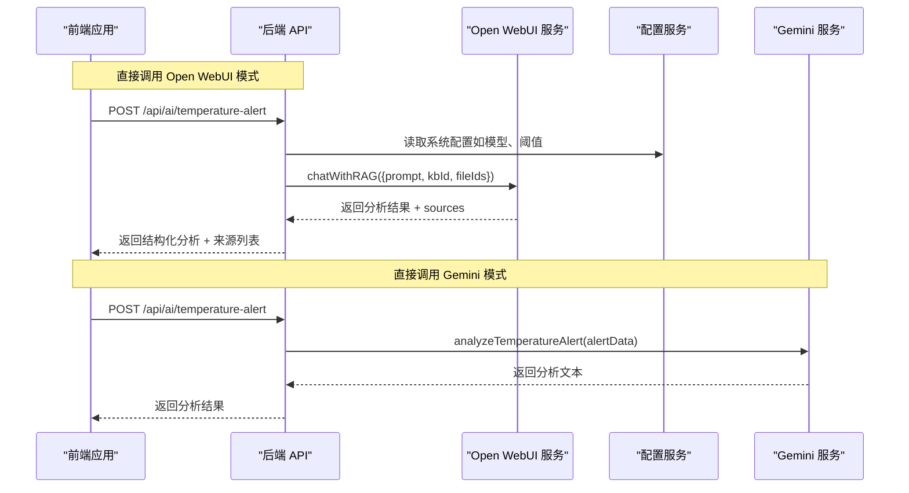
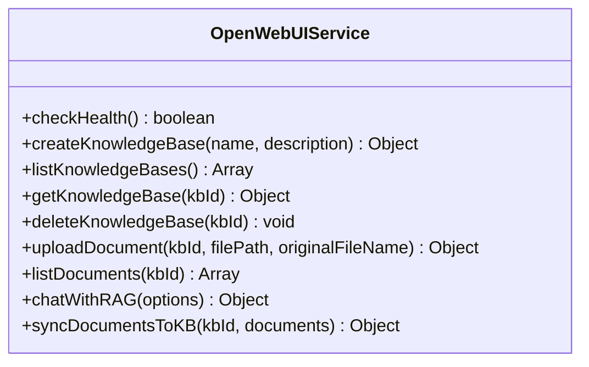
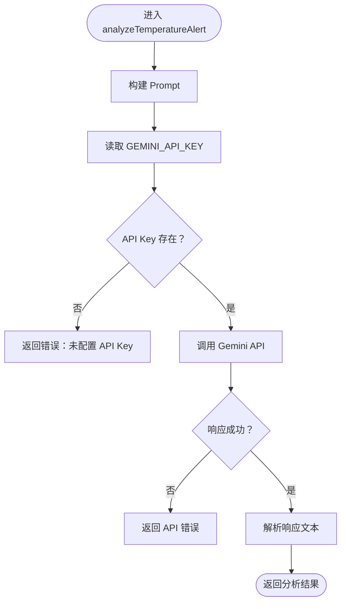
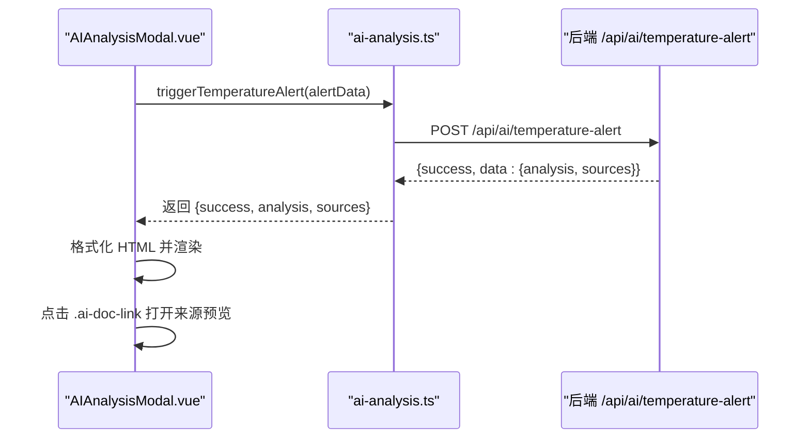
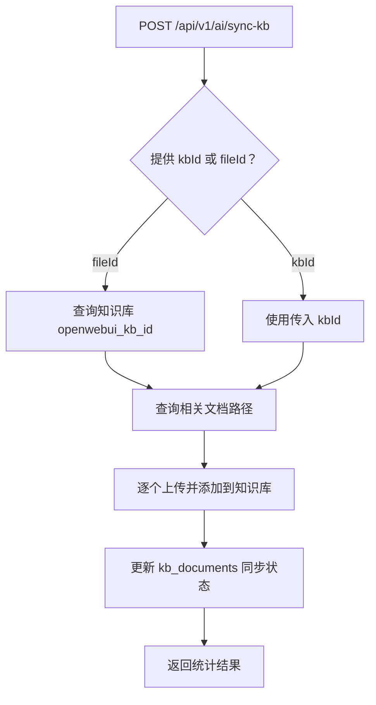
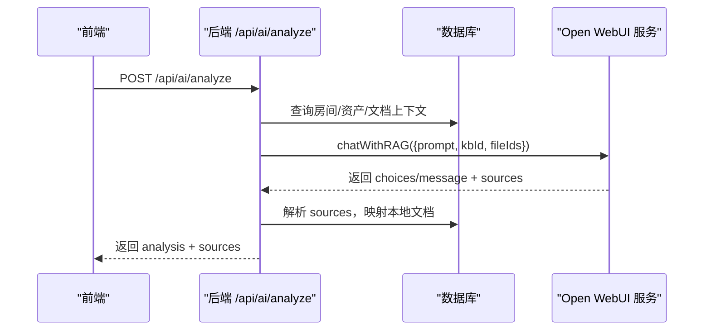
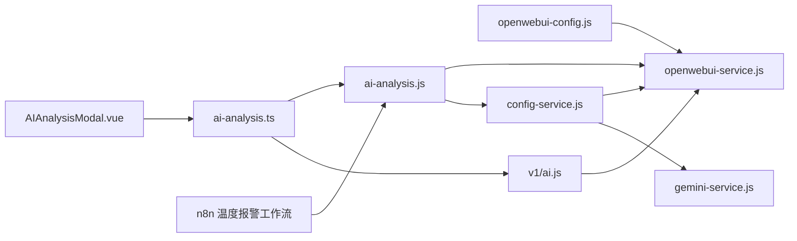

# AI分析API

<cite>
**本文引用的文件**
- [server/routes/v1/ai.js](file://server/routes/v1/ai.js)
- [server/routes/ai-analysis.js](file://server/routes/ai-analysis.js)
- [server/services/openwebui-service.js](file://server/services/openwebui-service.js)
- [server/services/gemini-service.js](file://server/services/gemini-service.js)
- [server/services/config-service.js](file://server/services/config-service.js)
- [server/config/openwebui-config.js](file://server/config/openwebui-config.js)
- [src/services/ai-analysis.ts](file://src/services/ai-analysis.ts)
- [src/components/viewer/AIAnalysisModal.vue](file://src/components/viewer/AIAnalysisModal.vue)
- [n8n-workflows/temperature-alert.json](file://n8n-workflows/temperature-alert.json)
</cite>

## 目录
1. [简介](#简介)
2. [项目结构](#项目结构)
3. [核心组件](#核心组件)
4. [架构总览](#架构总览)
5. [详细组件分析](#详细组件分析)
6. [依赖分析](#依赖分析)
7. [性能考虑](#性能考虑)
8. [故障排查指南](#故障排查指南)
9. [结论](#结论)
10. [附录](#附录)

## 简介
本技术文档面向希望在 TwinSight 平台中集成 AI 分析能力的开发者与产品团队，系统性说明以下内容：
- 触发文档内容分析、知识提取、智能问答的后端 API 端点与调用方式
- 如何提交文档ID或文本内容给 Open WebUI 知识库与 Google Gemini 模型进行处理，并获取结构化结果
- 与 Open WebUI 知识库的交互：创建知识库条目、执行语义搜索、批量同步文档
- 请求参数（如 documentId、prompt 模板、fileId、allowWebSearch 等）与响应格式（分析摘要、关键词、建议、来源等）
- gemini-service.js 中调用 Google AI 模型的流程，包括 API 密钥管理、请求限流与错误重试策略
- 前端集成示例：如何在 Vue 应用中调用后端 API 并渲染 AI 分析结果
- 分析任务的异步执行模式与结果回调机制

## 项目结构
本项目的 AI 分析能力由三层组成：
- 前端服务层：提供用户界面与调用封装，位于 src/
- 后端路由层：暴露 REST API，位于 server/routes/
- 服务层：对接 Open WebUI 与 Google Gemini，位于 server/services/

图表来源
- [server/routes/v1/ai.js](file://server/routes/v1/ai.js#L1-L416)
- [server/routes/ai-analysis.js](file://server/routes/ai-analysis.js#L1-L1234)
- [server/services/openwebui-service.js](file://server/services/openwebui-service.js#L1-L359)
- [server/services/gemini-service.js](file://server/services/gemini-service.js#L1-L111)
- [server/services/config-service.js](file://server/services/config-service.js#L1-L111)
- [server/config/openwebui-config.js](file://server/config/openwebui-config.js#L1-L56)
- [src/services/ai-analysis.ts](file://src/services/ai-analysis.ts#L1-L179)
- [src/components/viewer/AIAnalysisModal.vue](file://src/components/viewer/AIAnalysisModal.vue#L1-L499)

章节来源
- [server/routes/v1/ai.js](file://server/routes/v1/ai.js#L1-L416)
- [server/routes/ai-analysis.js](file://server/routes/ai-analysis.js#L1-L1234)
- [server/services/openwebui-service.js](file://server/services/openwebui-service.js#L1-L359)
- [server/services/gemini-service.js](file://server/services/gemini-service.js#L1-L111)
- [server/services/config-service.js](file://server/services/config-service.js#L1-L111)
- [server/config/openwebui-config.js](file://server/config/openwebui-config.js#L1-L56)
- [src/services/ai-analysis.ts](file://src/services/ai-analysis.ts#L1-L179)
- [src/components/viewer/AIAnalysisModal.vue](file://src/components/viewer/AIAnalysisModal.vue#L1-L499)

## 核心组件
- Open WebUI 服务：封装知识库管理、文件上传、RAG 查询、健康检查等能力
- Gemini 服务：直接调用 Google Gemini API，用于温度异常分析等场景
- 配置服务：从数据库读取系统配置（如 API Key），并带缓存与过期控制
- 前端 AI 服务：封装后端 API 调用，统一返回结构化结果
- AI 分析路由：对外暴露温度报警分析、手动分析、上下文获取、引用格式化等端点
- v1 路由：知识库管理、同步、查询、上下文、来源格式化等端点

章节来源
- [server/services/openwebui-service.js](file://server/services/openwebui-service.js#L1-L359)
- [server/services/gemini-service.js](file://server/services/gemini-service.js#L1-L111)
- [server/services/config-service.js](file://server/services/config-service.js#L1-L111)
- [src/services/ai-analysis.ts](file://src/services/ai-analysis.ts#L1-L179)
- [server/routes/ai-analysis.js](file://server/routes/ai-analysis.js#L1-L1234)
- [server/routes/v1/ai.js](file://server/routes/v1/ai.js#L1-L416)

## 架构总览
AI 分析的整体流程分为两条路径：
- 直接调用 Open WebUI：后端路由直接向 Open WebUI 发起 RAG 查询，结合知识库与具体文件 ID，返回结构化分析结果与来源
- n8n 工作流：后端路由将请求转发至 n8n 温度报警工作流，由 n8n 调用 Gemini 完成分析，再由后端进行来源映射与格式化

图表来源
- [server/routes/ai-analysis.js](file://server/routes/ai-analysis.js#L1-L881)
- [server/services/openwebui-service.js](file://server/services/openwebui-service.js#L248-L310)
- [server/services/gemini-service.js](file://server/services/gemini-service.js#L1-L111)
- [server/services/config-service.js](file://server/services/config-service.js#L1-L111)

## 详细组件分析

### Open WebUI 服务（知识库与 RAG）
- 知识库管理：创建、列出、删除、查询知识库；列出知识库中的文档
- 文件上传与同步：上传文件到 Open WebUI 文件系统，轮询检查处理状态，再添加到知识库
- RAG 查询：支持传入 prompt、kbId、fileIds 与模型，返回 AI 回复与 sources
- 健康检查：检查 Open WebUI 服务可用性

图表来源
- [server/services/openwebui-service.js](file://server/services/openwebui-service.js#L1-L359)

章节来源
- [server/services/openwebui-service.js](file://server/services/openwebui-service.js#L1-L359)

### Gemini 服务（直接调用 Google Gemini）
- analyzeTemperatureAlert：构建温度异常分析 Prompt，调用 Gemini API，返回结构化分析文本与元数据
- API 密钥管理：通过配置服务从数据库读取 GEMINI_API_KEY
- 错误处理：对响应状态与异常进行捕获与返回

图表来源
- [server/services/gemini-service.js](file://server/services/gemini-service.js#L1-L111)
- [server/services/config-service.js](file://server/services/config-service.js#L71-L76)

章节来源
- [server/services/gemini-service.js](file://server/services/gemini-service.js#L1-L111)
- [server/services/config-service.js](file://server/services/config-service.js#L1-L111)

### 前端 AI 服务与 UI 组件
- 前端服务：封装后端 API 调用，统一返回结构化结果（analysis、sources、error）
- UI 组件：接收分析文本与来源，格式化 HTML，支持点击来源打开预览

图表来源
- [src/services/ai-analysis.ts](file://src/services/ai-analysis.ts#L1-L179)
- [src/components/viewer/AIAnalysisModal.vue](file://src/components/viewer/AIAnalysisModal.vue#L1-L499)
- [server/routes/ai-analysis.js](file://server/routes/ai-analysis.js#L1-L881)

章节来源
- [src/services/ai-analysis.ts](file://src/services/ai-analysis.ts#L1-L179)
- [src/components/viewer/AIAnalysisModal.vue](file://src/components/viewer/AIAnalysisModal.vue#L1-L499)
- [server/routes/ai-analysis.js](file://server/routes/ai-analysis.js#L1-L881)

### v1 路由（知识库与查询）
- 健康检查：检查 Open WebUI 连接状态
- 知识库管理：列出、创建、删除知识库
- 批量同步：将文档同步到知识库，记录同步状态
- RAG 查询：按 kbId 或 fileId 查询知识库，支持允许联网搜索
- 上下文获取：按房间编码与文件 ID 获取房间、设备、文档与知识库信息
- 来源格式化：将来源文档名转换为系统内可点击的预览 URL

图表来源
- [server/routes/v1/ai.js](file://server/routes/v1/ai.js#L84-L192)

章节来源
- [server/routes/v1/ai.js](file://server/routes/v1/ai.js#L1-L416)

### AI 分析路由（温度报警与手动分析）
- 温度报警分析：支持两种模式
  - 直接调用 Open WebUI：构建 Prompt，查询知识库与文件 ID，调用 chatWithRAG，解析 sources，格式化 HTML 链接，自动生成“参考的文档”
  - 使用 n8n 工作流：将请求转发至 n8n 温度报警工作流，由 n8n 调用 Gemini 完成分析，后端进行来源映射与格式化
- 手动分析：支持资产或房间类型的目标对象，可选问题，返回结构化分析
- 上下文获取：供 n8n 工作流使用，返回资产、文档、kbId、fileIds
- 引用格式化：将 AI 文本中的 [source X]、[id: X]、[X] 等引用格式化为可点击链接，并自动生成“参考的文档”

图表来源
- [server/routes/ai-analysis.js](file://server/routes/ai-analysis.js#L884-L1234)
- [server/services/openwebui-service.js](file://server/services/openwebui-service.js#L248-L310)

章节来源
- [server/routes/ai-analysis.js](file://server/routes/ai-analysis.js#L1-L1234)
- [server/services/openwebui-service.js](file://server/services/openwebui-service.js#L1-L359)

## 依赖分析
- Open WebUI 配置：通过 openwebui-config.js 动态读取 baseUrl 与 apiKey，避免静态导入导致的环境变量未加载问题
- 配置服务：从数据库读取系统配置（如 GEMINI_API_KEY），带缓存与过期控制
- n8n 工作流：温度报警工作流由 n8n 节点链式执行，最终通过 webhook 返回结果
- 前端依赖：Vue 组件通过 ai-analysis.ts 调用后端 API，渲染分析结果与来源

图表来源
- [server/config/openwebui-config.js](file://server/config/openwebui-config.js#L1-L56)
- [server/services/openwebui-service.js](file://server/services/openwebui-service.js#L1-L359)
- [server/services/config-service.js](file://server/services/config-service.js#L1-L111)
- [server/services/gemini-service.js](file://server/services/gemini-service.js#L1-L111)
- [server/routes/ai-analysis.js](file://server/routes/ai-analysis.js#L1-L1234)
- [server/routes/v1/ai.js](file://server/routes/v1/ai.js#L1-L416)
- [src/services/ai-analysis.ts](file://src/services/ai-analysis.ts#L1-L179)
- [src/components/viewer/AIAnalysisModal.vue](file://src/components/viewer/AIAnalysisModal.vue#L1-L499)
- [n8n-workflows/temperature-alert.json](file://n8n-workflows/temperature-alert.json#L1-L143)

章节来源
- [server/config/openwebui-config.js](file://server/config/openwebui-config.js#L1-L56)
- [server/services/openwebui-service.js](file://server/services/openwebui-service.js#L1-L359)
- [server/services/config-service.js](file://server/services/config-service.js#L1-L111)
- [server/services/gemini-service.js](file://server/services/gemini-service.js#L1-L111)
- [server/routes/ai-analysis.js](file://server/routes/ai-analysis.js#L1-L1234)
- [server/routes/v1/ai.js](file://server/routes/v1/ai.js#L1-L416)
- [src/services/ai-analysis.ts](file://src/services/ai-analysis.ts#L1-L179)
- [src/components/viewer/AIAnalysisModal.vue](file://src/components/viewer/AIAnalysisModal.vue#L1-L499)
- [n8n-workflows/temperature-alert.json](file://n8n-workflows/temperature-alert.json#L1-L143)

## 性能考虑
- 配置缓存：配置服务对系统配置进行缓存，减少数据库访问频率
- 文件处理轮询：Open WebUI 文件上传后采用轮询检查处理状态，避免长时间阻塞
- Prompt 构建与来源映射：在后端进行多轮正则与映射，建议控制 Prompt 长度与来源数量，避免超长文本影响性能
- 健康检查：提供轻量级健康检查端点，便于快速判断外部服务可用性

章节来源
- [server/services/config-service.js](file://server/services/config-service.js#L1-L111)
- [server/services/openwebui-service.js](file://server/services/openwebui-service.js#L150-L237)
- [server/routes/ai-analysis.js](file://server/routes/ai-analysis.js#L1-L881)

## 故障排查指南
- Open WebUI 未配置 API Key：检查 OPENWEBUI_API_KEY 是否正确设置
- Gemini API Key 未配置：检查 GEMINI_API_KEY 是否在系统配置中设置
- 知识库同步失败：检查文件格式是否受支持、文件上传是否成功、知识库添加是否成功
- RAG 查询无来源：确认 kbId 与 fileIds 是否正确，以及 Open WebUI 返回的 sources 是否存在
- n8n 工作流调用失败：检查 n8n webhook 地址与端口，确认工作流节点配置正确

章节来源
- [server/services/openwebui-service.js](file://server/services/openwebui-service.js#L1-L359)
- [server/services/config-service.js](file://server/services/config-service.js#L1-L111)
- [server/routes/ai-analysis.js](file://server/routes/ai-analysis.js#L1-L881)
- [n8n-workflows/temperature-alert.json](file://n8n-workflows/temperature-alert.json#L1-L143)

## 结论
本项目提供了完善的 AI 分析能力集成方案，既支持直接调用 Open WebUI 进行 RAG 查询，也支持通过 n8n 工作流与 Gemini 模型实现温度报警分析。通过 v1 路由与 AI 分析路由，开发者可以便捷地创建知识库、同步文档、执行查询与获取结构化结果。前端组件与服务层提供了统一的调用与渲染体验，便于快速集成到业务场景中。

## 附录

### API 端点与参数说明

- v1 路由（知识库与查询）
  - GET /api/v1/ai/health
    - 作用：检查 Open WebUI 连接状态
    - 响应：success、data.openwebui、timestamp
  - GET /api/v1/ai/knowledge-bases
    - 作用：列出知识库
    - 响应：success、data（知识库列表）
  - POST /api/v1/ai/knowledge-bases
    - 参数：name、description、fileId（可选）
    - 作用：创建知识库，并可保存与文件的映射
    - 响应：success、data（知识库信息）
  - POST /api/v1/ai/sync-kb
    - 参数：kbId 或 fileId（二选一）、documentIds（可选）
    - 作用：批量同步文档到知识库，记录同步状态
    - 响应：success、data（统计与结果）
  - POST /api/v1/ai/query
    - 参数：prompt、kbId、fileId、allowWebSearch（可选）
    - 作用：基于知识库与文件 ID 进行 RAG 查询
    - 响应：success、data（查询结果）
  - GET /api/v1/ai/context
    - 参数：roomCode、fileId（可选）
    - 作用：获取房间、设备、文档与知识库上下文
    - 响应：success、data（space、assets、documents、knowledgeBase、fileId）
  - POST /api/v1/ai/format-sources
    - 参数：sources（数组）、fileId（可选）
    - 作用：将来源文档名转换为系统内可点击的预览 URL
    - 响应：success、data.formattedSources

- AI 分析路由（温度报警与手动分析）
  - GET /api/ai/health
    - 作用：检查 AI 服务（Open WebUI）可用性
    - 响应：success、data.openwebui、timestamp
  - POST /api/ai/temperature-alert
    - 参数：roomCode、roomName、temperature、threshold（可选）、alertType（'high' | 'low'）、fileId（可选）
    - 作用：触发温度报警分析（支持直接调用 Open WebUI 或 n8n 工作流）
    - 响应：success、data.analysis、data.sources、data.alert
  - POST /api/ai/analyze
    - 参数：type（'asset' | 'room'）、target（对象）、question（可选）、fileId
    - 作用：请求手动分析（资产或房间）
    - 响应：success、data（分析结果）
  - GET /api/ai/context
    - 参数：roomCode、roomName、fileId
    - 作用：供 n8n 工作流使用的上下文获取
    - 响应：success、assets、documents、kbId、fileIds
  - POST /api/ai/format-citations
    - 参数：analysisText、sourceIndexMap、sources
    - 作用：格式化引用与来源，自动生成“参考的文档”
    - 响应：success、formattedText、sources

章节来源
- [server/routes/v1/ai.js](file://server/routes/v1/ai.js#L1-L416)
- [server/routes/ai-analysis.js](file://server/routes/ai-analysis.js#L1-L1234)

### 响应格式与字段
- 通用响应结构：success、data、error（可选）
- 温度报警分析响应：analysis（分析文本）、sources（来源列表）、alert（报警元数据）
- 手动分析响应：analysis（分析文本）
- 来源格式化响应：formattedText（格式化后的文本）、sources（来源列表）

章节来源
- [server/routes/ai-analysis.js](file://server/routes/ai-analysis.js#L1-L881)
- [server/routes/v1/ai.js](file://server/routes/v1/ai.js#L1-L416)

### 前端集成示例
- 在 Vue 组件中调用前端服务：
  - 导入 triggerTemperatureAlert，传入房间编码、温度、阈值、报警类型与文件 ID
  - 接收返回的 analysis 与 sources，渲染到 AIAnalysisModal.vue
  - 点击来源链接打开文档预览或下载

章节来源
- [src/services/ai-analysis.ts](file://src/services/ai-analysis.ts#L1-L179)
- [src/components/viewer/AIAnalysisModal.vue](file://src/components/viewer/AIAnalysisModal.vue#L1-L499)

### n8n 工作流说明
- 温度报警工作流：Webhook 触发 -> 解析报警数据 -> 调用 Gemini -> 格式化结果 -> 响应 Webhook
- 适用于需要在 n8n 中编排复杂流程或与其他节点联动的场景

章节来源
- [n8n-workflows/temperature-alert.json](file://n8n-workflows/temperature-alert.json#L1-L143)
- [server/routes/ai-analysis.js](file://server/routes/ai-analysis.js#L1-L265)