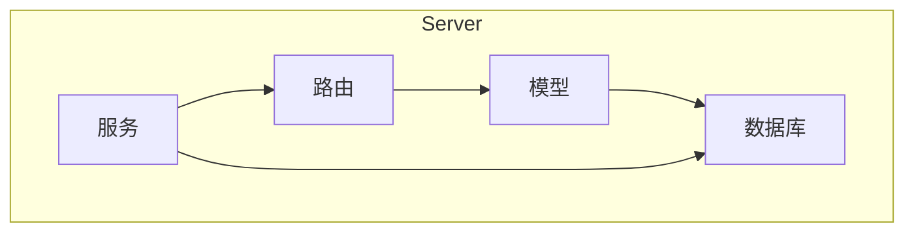
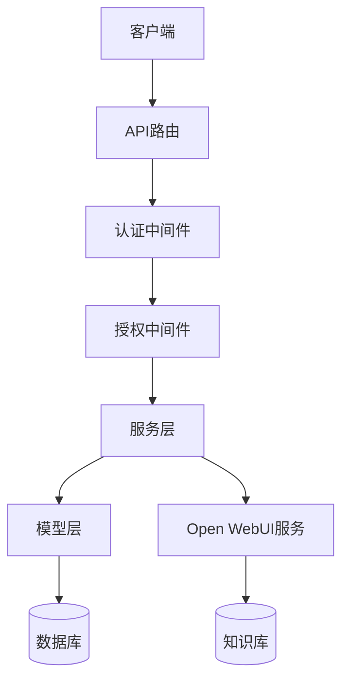
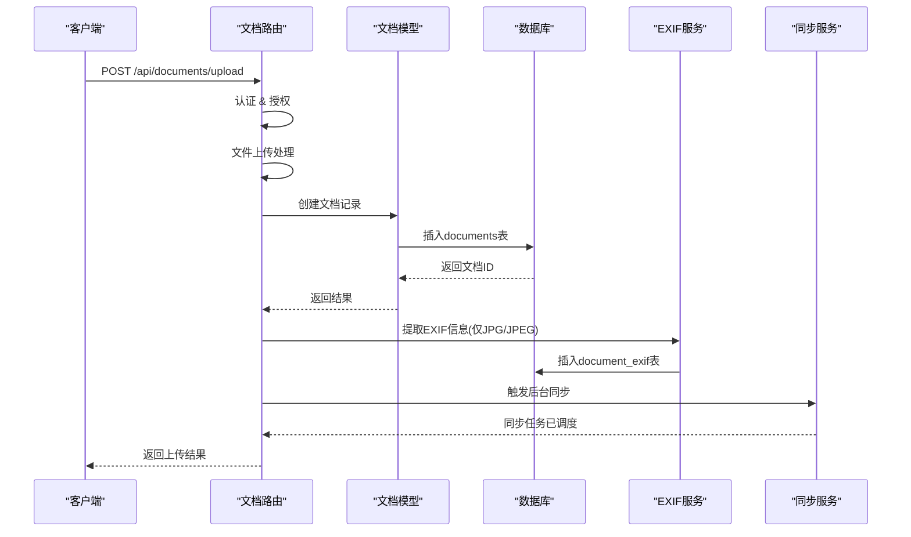
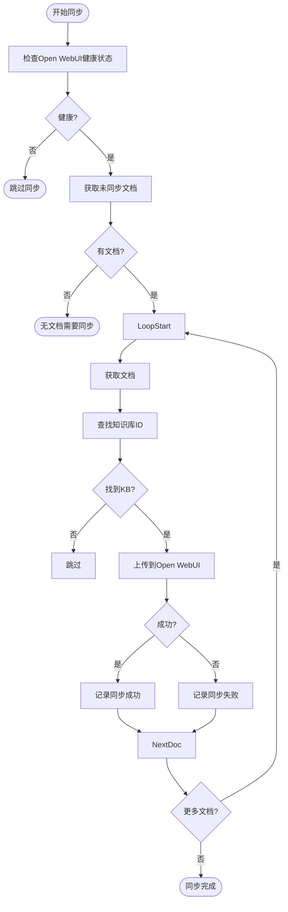
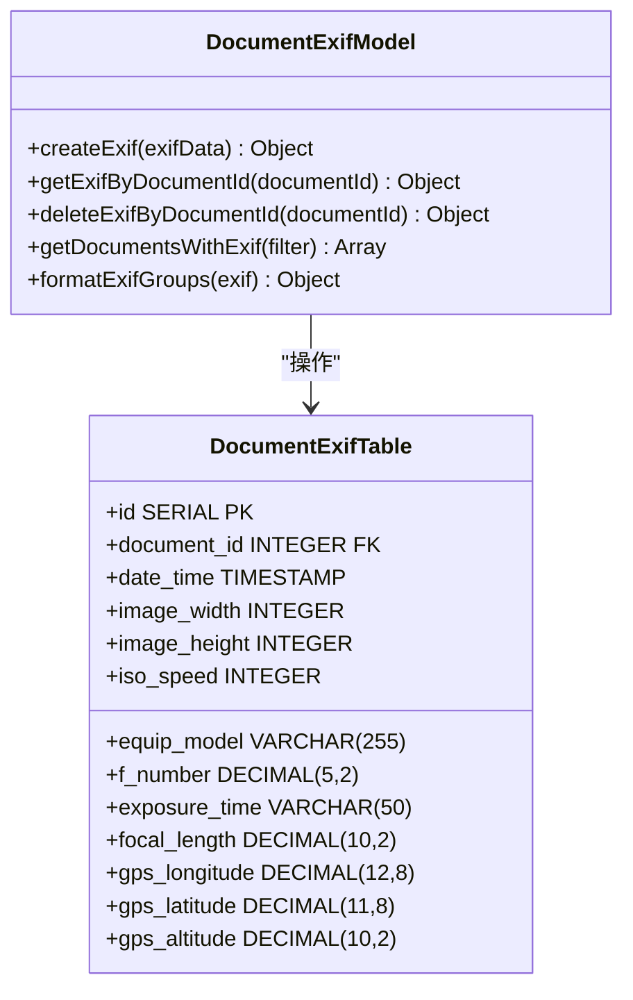
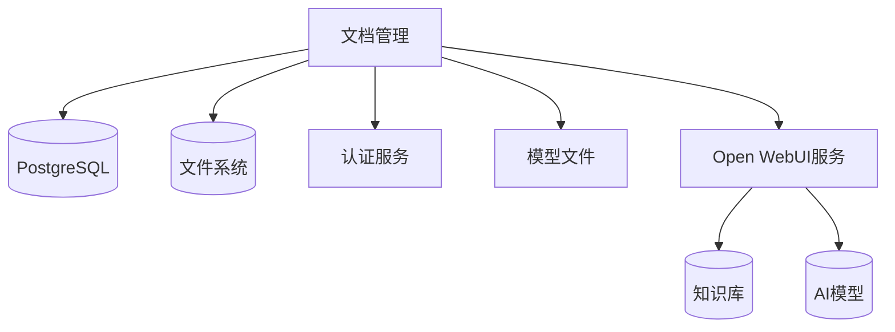

# 文档管理API

<cite>
**本文档引用的文件**  
- [documents.js](file://server/routes/documents.js)
- [document.js](file://server/models/document.js)
- [document-exif.js](file://server/models/document-exif.js)
- [document-sync-service.js](file://server/services/document-sync-service.js)
- [openwebui-service.js](file://server/services/openwebui-service.js)
- [create_documents_table.sql](file://server/db/create_documents_table.sql)
- [create_document_exif_table.sql](file://server/db/create_document_exif_table.sql)
- [auth.js](file://server/middleware/auth.js)
- [auth.js](file://server/config/auth.js)
</cite>

## 目录
1. [简介](#简介)
2. [项目结构](#项目结构)
3. [核心组件](#核心组件)
4. [架构概述](#架构概述)
5. [详细组件分析](#详细组件分析)
6. [依赖分析](#依赖分析)
7. [性能考虑](#性能考虑)
8. [故障排除指南](#故障排除指南)
9. [结论](#结论)

## 简介
本文档提供了文档管理API的完整参考，详细描述了文档上传、查询、更新、删除以及与资产/空间关联的端点。文档上传使用multipart/form-data格式，包含file、name、classificationId、spaceId、assetId等字段。定义了响应中document对象的结构，包括id、fileId、url、metadata等。解释了文档上传后如何触发同步至Open WebUI知识库的后台流程（通过document-sync-service）。提供了上传示例（curl与axios），并说明了进度监听和错误恢复机制。涵盖了文档分类、标签管理、EXIF信息提取（document-exif表）等扩展功能。说明了权限控制策略，确保用户只能访问其有权限的文档。

## 项目结构
文档管理功能主要位于server目录下，包括路由、模型、服务和数据库脚本。核心文件包括documents.js（路由）、document.js（模型）、document-sync-service.js（同步服务）和相关数据库表创建脚本。

**图表来源**  
- [documents.js](file://server/routes/documents.js#L1-L451)
- [document.js](file://server/models/document.js#L1-L167)
- [document-sync-service.js](file://server/services/document-sync-service.js#L1-L250)

**章节来源**  
- [server/routes/documents.js](file://server/routes/documents.js#L1-L451)
- [server/models/document.js](file://server/models/document.js#L1-L167)
- [server/services/document-sync-service.js](file://server/services/document-sync-service.js#L1-L250)

## 核心组件
文档管理API的核心组件包括文档上传路由、文档模型、EXIF信息提取、文档同步服务和权限控制。上传功能支持PDF、JPG、PNG、SVG、MP4等格式，最大200MB。上传后自动提取JPG/JPEG文件的EXIF信息并存储。文档会通过后台服务同步到Open WebUI知识库。所有操作都受JWT认证和基于角色的权限控制保护。

**章节来源**  
- [server/routes/documents.js](file://server/routes/documents.js#L1-L451)
- [server/models/document.js](file://server/models/document.js#L1-L167)
- [server/services/document-sync-service.js](file://server/services/document-sync-service.js#L1-L250)

## 架构概述
文档管理API采用分层架构，包括路由层、服务层、模型层和数据层。上传请求由路由处理，经过认证和授权后调用模型层进行数据库操作。EXIF信息提取和文档同步由独立的服务处理。权限控制通过中间件实现，确保用户只能访问其有权限的资源。

**图表来源**  
- [server/routes/documents.js](file://server/routes/documents.js#L1-L451)
- [server/middleware/auth.js](file://server/middleware/auth.js#L1-L120)
- [server/services/document-sync-service.js](file://server/services/document-sync-service.js#L1-L250)

## 详细组件分析

### 文档上传分析
文档上传功能支持multipart/form-data格式，包含file、assetCode、spaceCode、specCode、viewId和title字段。上传的文件存储在服务器上，元数据存储在documents表中。支持的文件类型包括PDF、JPG、PNG、SVG、MP4，最大200MB。中文文件名会自动进行编码转换。

**图表来源**  
- [server/routes/documents.js](file://server/routes/documents.js#L145-L223)
- [server/models/document.js](file://server/models/document.js#L58-L82)
- [server/models/document-exif.js](file://server/models/document-exif.js#L12-L69)

**章节来源**  
- [server/routes/documents.js](file://server/routes/documents.js#L145-L223)
- [server/models/document.js](file://server/models/document.js#L58-L82)

### 文档同步分析
文档同步服务定期检查未同步的文档，并将其上传到Open WebUI知识库。同步过程包括查找对应的知识库、上传文件、记录同步状态。支持的文档格式包括PDF、DOCX、XLSX、PPTX、MD、TXT、CSV、JSON。同步失败的文档会被记录，避免无限重试。

**图表来源**  
- [server/services/document-sync-service.js](file://server/services/document-sync-service.js#L23-L217)
- [server/services/openwebui-service.js](file://server/services/openwebui-service.js#L146-L237)

**章节来源**  
- [server/services/document-sync-service.js](file://server/services/document-sync-service.js#L23-L217)
- [server/services/openwebui-service.js](file://server/services/openwebui-service.js#L146-L237)

### EXIF信息提取分析
EXIF信息提取功能专门处理JPG/JPEG图像文件，提取拍摄时间、图像尺寸、相机型号、光圈值、曝光时间、ISO速度、焦距和GPS坐标等信息。提取的EXIF数据存储在document_exif表中，与文档记录通过document_id关联。

**图表来源**  
- [server/models/document-exif.js](file://server/models/document-exif.js#L7-L169)
- [server/db/create_document_exif_table.sql](file://server/db/create_document_exif_table.sql#L1-L48)

**章节来源**  
- [server/models/document-exif.js](file://server/models/document-exif.js#L7-L169)
- [server/db/create_document_exif_table.sql](file://server/db/create_document_exif_table.sql#L1-L48)

## 依赖分析
文档管理API依赖于多个内部和外部服务。内部依赖包括数据库、认证服务、模型文件服务。外部依赖主要是Open WebUI服务，用于知识库管理和RAG查询。文档上传和同步过程涉及文件系统操作。

**图表来源**  
- [server/routes/documents.js](file://server/routes/documents.js#L1-L451)
- [server/services/document-sync-service.js](file://server/services/document-sync-service.js#L1-L250)
- [server/services/openwebui-service.js](file://server/services/openwebui-service.js#L1-L359)

**章节来源**  
- [server/routes/documents.js](file://server/routes/documents.js#L1-L451)
- [server/services/document-sync-service.js](file://server/services/document-sync-service.js#L1-L250)

## 性能考虑
文档上传和同步过程考虑了性能优化。文件上传使用multer进行流式处理，避免内存溢出。EXIF信息提取使用exif-parser库，支持大文件。文档同步采用批量处理和定时任务，避免频繁请求。数据库查询使用索引优化，包括asset_code、space_code、spec_code和created_at字段。

## 故障排除指南
常见问题包括文件上传失败、EXIF提取失败、文档同步失败。上传失败可能是文件类型不支持或大小超限。EXIF提取失败通常是文件损坏或格式不正确。同步失败可能是Open WebUI服务不可用或API密钥错误。所有错误都会记录在日志中，便于排查。

**章节来源**  
- [server/routes/documents.js](file://server/routes/documents.js#L211-L222)
- [server/services/document-sync-service.js](file://server/services/document-sync-service.js#L132-L149)
- [server/services/openwebui-service.js](file://server/services/openwebui-service.js#L57-L61)

## 结论
文档管理API提供了一套完整的文档生命周期管理功能，从上传、存储、元数据提取到知识库同步。通过严格的权限控制和错误处理，确保了系统的安全性和可靠性。后台同步服务实现了文档与知识库的无缝集成，为AI驱动的应用提供了数据基础。