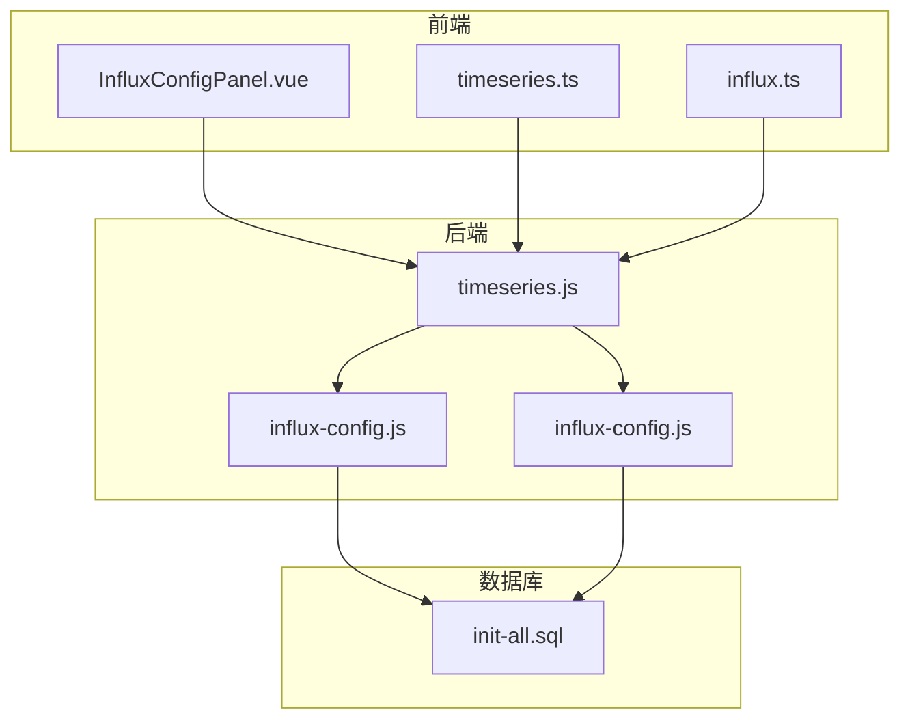
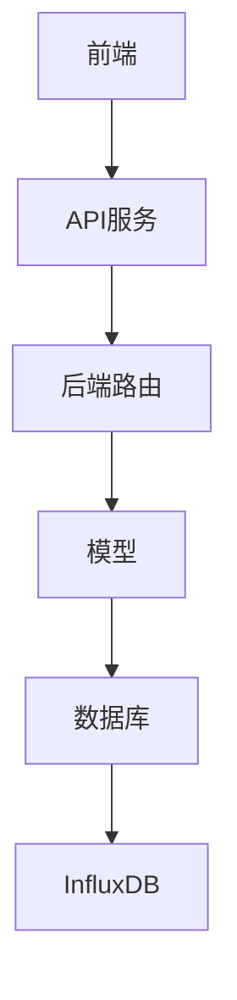
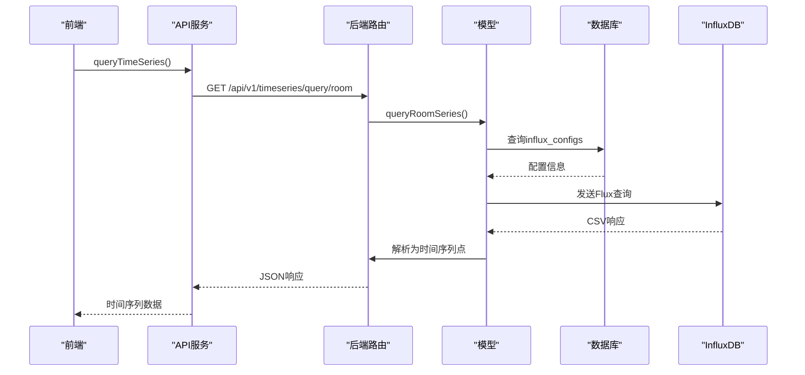
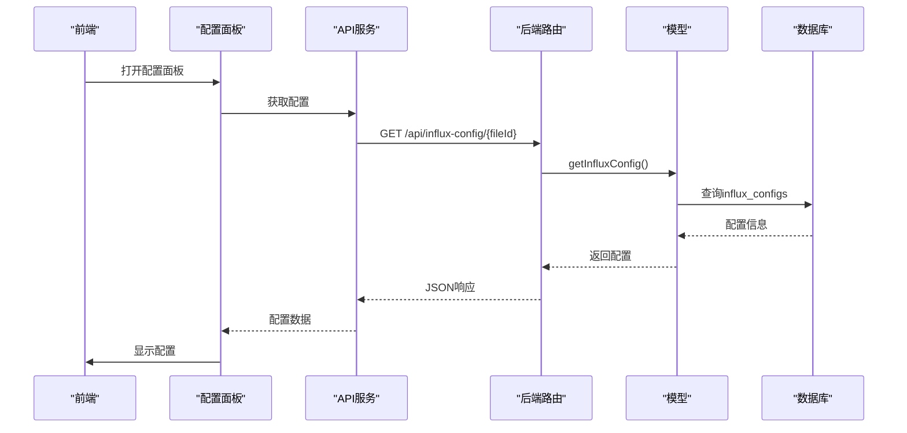
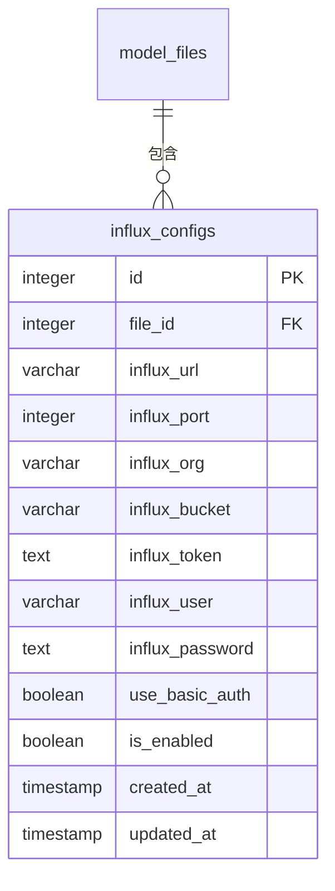
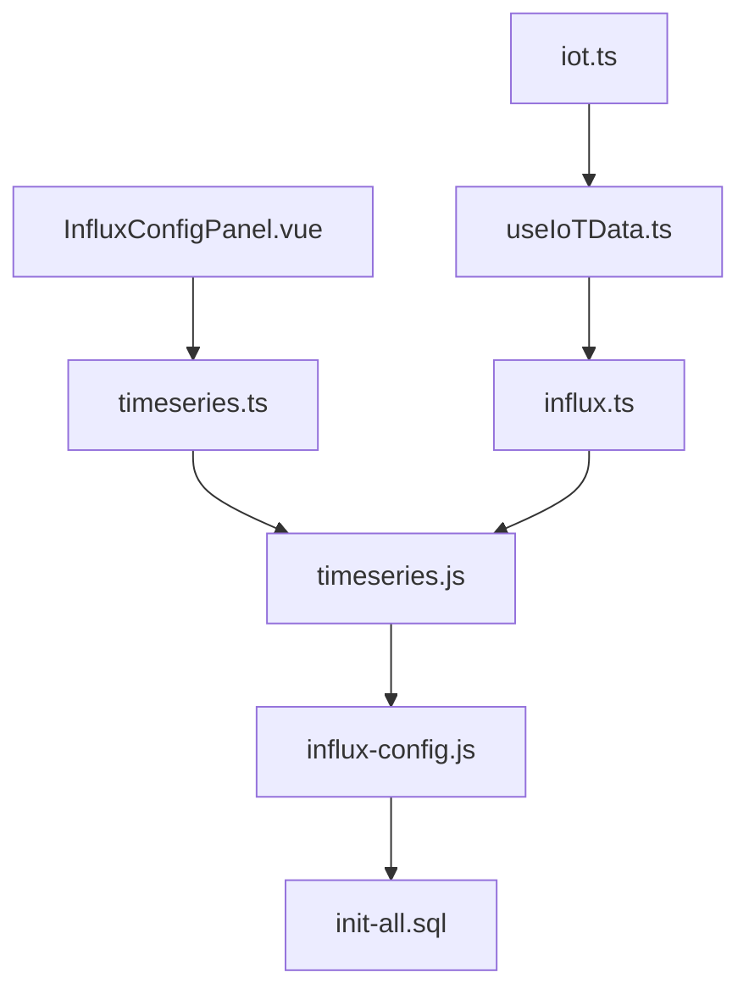

# 时序数据API

<cite>
**本文档引用的文件**
- [timeseries.js](file://server/routes/timeseries.js)
- [influx-config.js](file://server/models/influx-config.js)
- [influx-config.js](file://server/routes/influx-config.js)
- [timeseries.ts](file://src/services/api/timeseries.ts)
- [influx.ts](file://src/services/influx.ts)
- [InfluxConfigPanel.vue](file://src/components/InfluxConfigPanel.vue)
- [init-all.sql](file://server/db/init-all.sql)
- [useIoTData.ts](file://src/composables/useIoTData.ts)
- [iot.ts](file://src/stores/iot.ts)
</cite>

## 目录
1. [简介](#简介)
2. [项目结构](#项目结构)
3. [核心组件](#核心组件)
4. [架构概述](#架构概述)
5. [详细组件分析](#详细组件分析)
6. [依赖分析](#依赖分析)
7. [性能考虑](#性能考虑)
8. [故障排除指南](#故障排除指南)
9. [结论](#结论)

## 简介
本文档详细描述了时序数据API的设计与实现，重点介绍如何查询InfluxDB中的设备监控数据。文档涵盖了API的请求结构、返回格式、实时数据拉取与历史数据批量查询两种模式，以及`influx-config`表在存储InfluxDB连接信息中的作用。通过configId引用配置，实现了灵活的数据查询机制。文档还提供了典型查询示例、错误处理策略和性能优化建议。

## 项目结构
时序数据API的实现分布在多个目录中，主要包括服务器端路由、模型定义、前端服务和组件。服务器端的路由和模型定义位于`server/routes`和`server/models`目录下，而前端的服务和组件则位于`src/services`和`src/components`目录中。数据库表结构定义在`server/db`目录下的SQL文件中。



**图表来源**
- [timeseries.js](file://server/routes/timeseries.js)
- [influx-config.js](file://server/models/influx-config.js)
- [influx-config.js](file://server/routes/influx-config.js)
- [init-all.sql](file://server/db/init-all.sql)

**章节来源**
- [timeseries.js](file://server/routes/timeseries.js)
- [influx-config.js](file://server/models/influx-config.js)
- [init-all.sql](file://server/db/init-all.sql)

## 核心组件
时序数据API的核心组件包括处理时序数据查询的路由、管理InfluxDB配置的模型和路由，以及前端的API服务和组件。这些组件协同工作，实现了从数据查询到前端展示的完整流程。

**章节来源**
- [timeseries.js](file://server/routes/timeseries.js)
- [influx-config.js](file://server/models/influx-config.js)
- [timeseries.ts](file://src/services/api/timeseries.ts)

## 架构概述
时序数据API采用分层架构，前端通过API服务调用后端路由，后端路由处理请求并调用模型进行数据库操作。InfluxDB配置通过`influx-config`表存储，查询时通过configId引用。这种设计实现了配置与查询的解耦，提高了系统的灵活性和可维护性。



**图表来源**
- [timeseries.js](file://server/routes/timeseries.js)
- [influx-config.js](file://server/models/influx-config.js)

## 详细组件分析

### 时序数据查询分析
时序数据查询功能通过`timeseries.js`中的路由实现，支持多种查询模式，包括平均值查询、房间数据查询和最新值查询。查询请求通过HTTP GET或POST方法发送，参数包括时间范围、聚合窗口和文件ID等。

#### 时序数据查询类图
```mermaid
classDiagram
class TimeSeriesQuery {
+string roomCode
+number startTime
+number endTime
+string aggregateWindow
}
class TimeSeriesPoint {
+number timestamp
+number value
}
class LatestValue {
+string roomCode
+number value
+number timestamp
}
class timeseriesApi {
+queryTimeSeries(query : TimeSeriesQuery) : Promise~TimeSeriesPoint[]~
+queryMultipleTimeSeries(roomCodes : string[], startTime : number, endTime : number, aggregateWindow? : string) : Promise~Record~string, TimeSeriesPoint[]~~
+getLatestValues(roomCodes : string[]) : Promise~LatestValue[]~
+getLatestValue(roomCode : string) : Promise~LatestValue | null~
+getStatistics(roomCode : string, startTime : number, endTime : number) : Promise~{ min : number; max : number; avg : number; count : number }~
}
TimeSeriesQuery --> TimeSeriesPoint : "查询返回"
LatestValue --> TimeSeriesPoint : "继承"
timeseriesApi --> TimeSeriesQuery : "使用"
timeseriesApi --> TimeSeriesPoint : "返回"
timeseriesApi --> LatestValue : "返回"
```

**图表来源**
- [timeseries.ts](file://src/services/api/timeseries.ts)

#### 时序数据查询序列图


**图表来源**
- [timeseries.js](file://server/routes/timeseries.js)
- [timeseries.ts](file://src/services/api/timeseries.ts)

**章节来源**
- [timeseries.js](file://server/routes/timeseries.js)
- [timeseries.ts](file://src/services/api/timeseries.ts)

### InfluxDB配置管理分析
InfluxDB配置管理功能通过`influx-config.js`中的路由和模型实现，支持配置的获取、保存、删除和连接测试。配置信息存储在`influx_configs`表中，通过文件ID关联。

#### InfluxDB配置管理类图
```mermaid
classDiagram
class InfluxConfig {
+number id
+number file_id
+string influx_url
+number influx_port
+string influx_org
+string influx_bucket
+string influx_token
+string influx_user
+string influx_password
+boolean use_basic_auth
+boolean is_enabled
+datetime created_at
+datetime updated_at
}
class InfluxConfigPanel {
+string influxUrl
+number influxPort
+string influxOrg
+string influxBucket
+string influxToken
+string influxUser
+string influxPassword
+boolean useBasicAuth
+boolean isEnabled
}
class InfluxConfigService {
+getInfluxConfig(fileId : number) : Promise~InfluxConfig | null~
+saveInfluxConfig(fileId : number, config : InfluxConfig) : Promise~InfluxConfig~
+deleteInfluxConfig(fileId : number) : Promise~InfluxConfig | null~
+testInfluxConnection(config : InfluxConfig) : Promise~{ success : boolean; status : string; message : string }~
}
InfluxConfigPanel --> InfluxConfigService : "调用"
InfluxConfigService --> InfluxConfig : "操作"
```

**图表来源**
- [influx-config.js](file://server/models/influx-config.js)
- [InfluxConfigPanel.vue](file://src/components/InfluxConfigPanel.vue)

#### InfluxDB配置管理序列图


**图表来源**
- [influx-config.js](file://server/routes/influx-config.js)
- [InfluxConfigPanel.vue](file://src/components/InfluxConfigPanel.vue)

**章节来源**
- [influx-config.js](file://server/routes/influx-config.js)
- [influx-config.js](file://server/models/influx-config.js)
- [InfluxConfigPanel.vue](file://src/components/InfluxConfigPanel.vue)

### 数据库表结构分析
`influx_configs`表用于存储InfluxDB的连接配置，通过文件ID与模型文件关联。表结构设计合理，包含了连接所需的所有信息，并通过外键约束保证了数据完整性。

#### influx_configs表结构


**图表来源**
- [init-all.sql](file://server/db/init-all.sql)

**章节来源**
- [init-all.sql](file://server/db/init-all.sql)

## 依赖分析
时序数据API的组件之间存在明确的依赖关系。前端组件依赖于API服务，API服务依赖于后端路由，后端路由依赖于模型，模型依赖于数据库。这种分层依赖结构保证了系统的模块化和可维护性。



**图表来源**
- [timeseries.js](file://server/routes/timeseries.js)
- [influx-config.js](file://server/models/influx-config.js)
- [init-all.sql](file://server/db/init-all.sql)

**章节来源**
- [timeseries.js](file://server/routes/timeseries.js)
- [influx-config.js](file://server/models/influx-config.js)
- [init-all.sql](file://server/db/init-all.sql)

## 性能考虑
时序数据API在设计时考虑了性能优化。通过合理使用索引、避免全表扫描、使用聚合窗口减少数据量等方法，提高了查询效率。此外，API还支持批量查询，减少了网络请求次数，进一步提升了性能。

## 故障排除指南
时序数据API的错误处理机制完善，能够处理数据库连接失败、语法错误等常见问题。通过返回详细的错误信息，帮助开发者快速定位和解决问题。例如，当InfluxDB连接失败时，API会返回具体的错误原因，便于排查网络或配置问题。

**章节来源**
- [timeseries.js](file://server/routes/timeseries.js)
- [influx-config.js](file://server/models/influx-config.js)

## 结论
时序数据API设计合理，功能完善，能够满足设备监控数据的查询需求。通过分层架构和模块化设计，保证了系统的可维护性和可扩展性。未来可以进一步优化查询性能，增加更多的查询模式，提升用户体验。