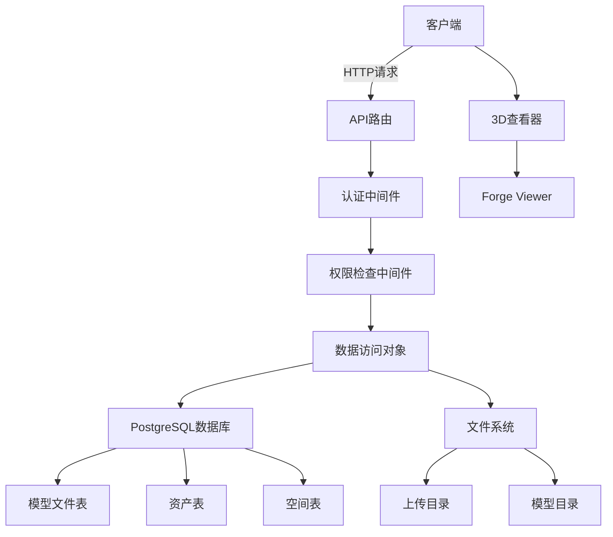
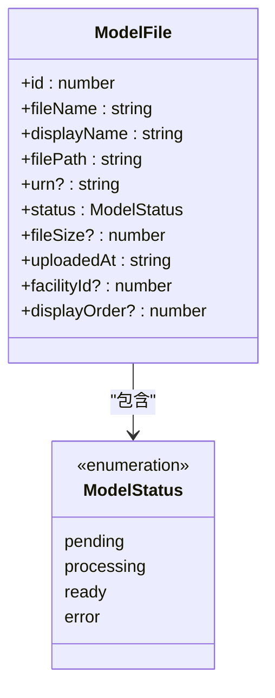
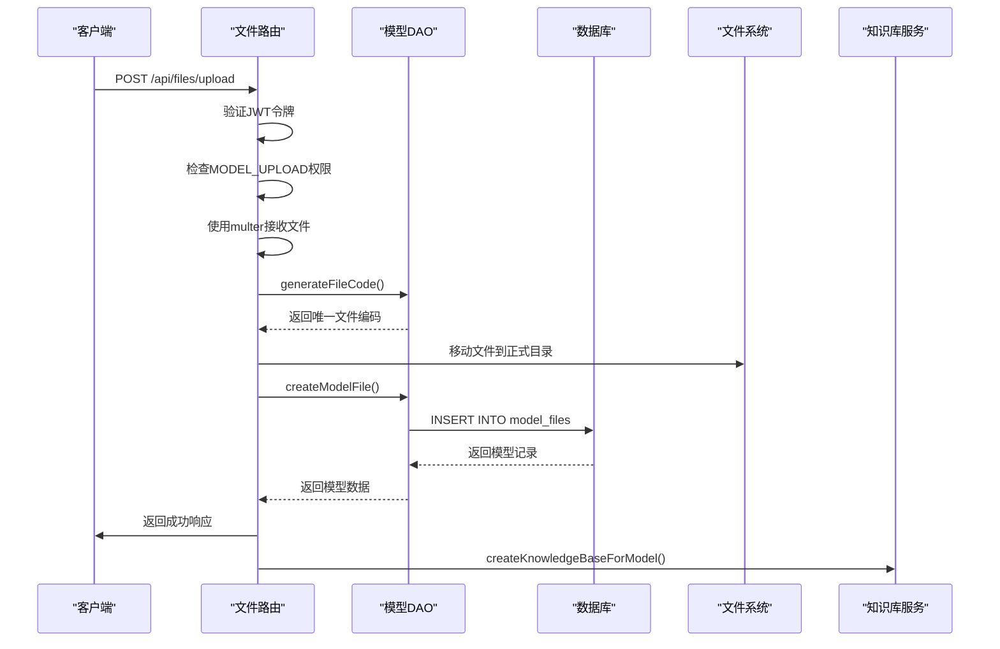
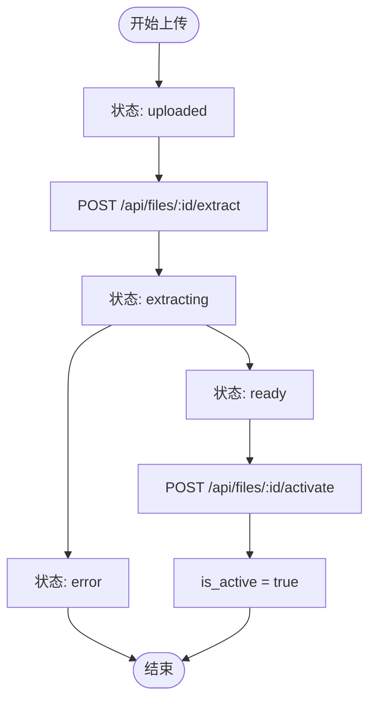
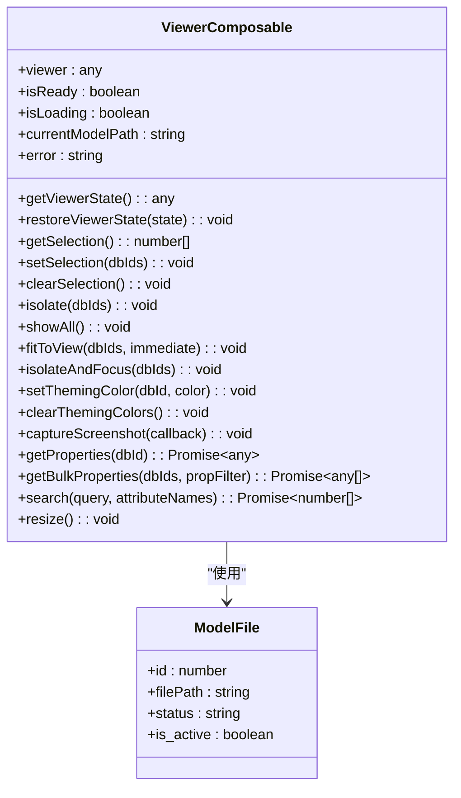
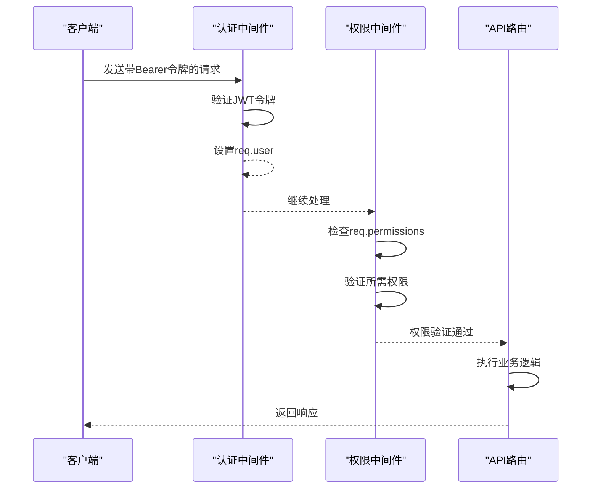
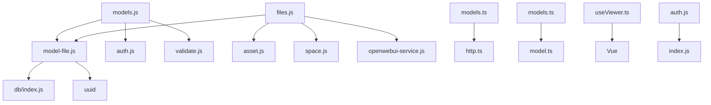

# 模型管理API

<cite>
**本文档引用的文件**   
- [models.js](file://server/routes/v1/models.js)
- [model-file.js](file://server/models/model-file.js)
- [files.js](file://server/routes/files.js)
- [models.ts](file://src/services/api/models.ts)
- [model.ts](file://src/types/model.ts)
- [models.ts](file://src/stores/models.ts)
- [schema.sql](file://server/db/schema.sql)
- [auth.js](file://server/config/auth.js)
- [auth.js](file://server/middleware/auth.js)
- [useViewer.ts](file://src/composables/useViewer.ts)
</cite>

## 目录
1. [简介](#简介)
2. [项目结构](#项目结构)
3. [核心组件](#核心组件)
4. [架构概述](#架构概述)
5. [详细组件分析](#详细组件分析)
6. [依赖分析](#依赖分析)
7. [性能考虑](#性能考虑)
8. [故障排除指南](#故障排除指南)
9. [结论](#结论)

## 简介
本文档详细描述了TwinSight平台的模型管理API，涵盖BIM模型（SVF/RVT/IFC）的上传、状态查询、元数据获取等核心功能。文档解释了模型文件上传流程及其与资产体系的关联机制，定义了模型状态（上传中、转换中、就绪、失败）及其对应的API响应字段。同时，文档提供了查询模型树结构、构件属性、几何信息等接口说明，并结合`models.js`路由逻辑，阐述了模型预处理流程（如Forge转换）和与3D查看器的集成方式。此外，文档还说明了权限控制机制，确保用户只能访问其所属项目的模型资源。

## 项目结构
模型管理功能分布在服务器端和客户端多个目录中。服务器端的路由、模型和数据库逻辑位于`server/`目录下，而客户端的API服务、状态管理和类型定义位于`src/`目录下。

```mermaid
graph TD
subgraph "服务器端"
A[server/routes/v1/models.js] --> B[server/models/model-file.js]
B --> C[server/db/schema.sql]
D[server/routes/files.js] --> B
E[server/config/auth.js] --> F[server/middleware/auth.js]
end
subgraph "客户端"
G[src/services/api/models.ts] --> H[src/types/model.ts]
I[src/stores/models.ts] --> H
J[src/composables/useViewer.ts] --> K[src/components/viewer]
end
A < --> D
G < --> I
```

**图示来源**
- [models.js](file://server/routes/v1/models.js)
- [model-file.js](file://server/models/model-file.js)
- [schema.sql](file://server/db/schema.sql)
- [files.js](file://server/routes/files.js)
- [models.ts](file://src/services/api/models.ts)
- [model.ts](file://src/types/model.ts)
- [models.ts](file://src/stores/models.ts)
- [useViewer.ts](file://src/composables/useViewer.ts)

**本节来源**
- [models.js](file://server/routes/v1/models.js)
- [model-file.js](file://server/models/model-file.js)
- [schema.sql](file://server/db/schema.sql)
- [files.js](file://server/routes/files.js)
- [models.ts](file://src/services/api/models.ts)
- [model.ts](file://src/types/model.ts)
- [models.ts](file://src/stores/models.ts)

## 核心组件
模型管理API的核心组件包括模型文件路由、数据访问对象、类型定义和状态管理。服务器端通过`models.js`和`files.js`提供RESTful API，`model-file.js`作为数据访问层与PostgreSQL数据库交互。客户端通过`models.ts`服务和`models.ts`状态存储与API通信，并使用`useViewer.ts`与3D查看器集成。

**本节来源**
- [models.js](file://server/routes/v1/models.js)
- [model-file.js](file://server/models/model-file.js)
- [models.ts](file://src/services/api/models.ts)
- [models.ts](file://src/stores/models.ts)
- [useViewer.ts](file://src/composables/useViewer.ts)

## 架构概述
模型管理API采用分层架构，包括路由层、服务层、数据访问层和数据库层。客户端通过API服务与服务器通信，服务器通过中间件进行认证和权限检查，然后调用数据访问对象操作数据库。



**图示来源**
- [models.js](file://server/routes/v1/models.js)
- [files.js](file://server/routes/files.js)
- [auth.js](file://server/middleware/auth.js)
- [model-file.js](file://server/models/model-file.js)
- [schema.sql](file://server/db/schema.sql)
- [useViewer.ts](file://src/composables/useViewer.ts)

## 详细组件分析

### 模型文件管理分析
模型文件管理组件负责处理BIM模型的上传、状态管理和元数据操作。系统支持SVF ZIP格式的模型文件上传，并通过断点续传机制确保大文件上传的可靠性。

#### 模型文件数据结构


**图示来源**
- [model.ts](file://src/types/model.ts)
- [model-file.js](file://server/models/model-file.js)

### 模型上传流程分析
模型上传流程包括文件接收、数据库记录创建和知识库关联。系统使用multer处理文件上传，并生成唯一文件编码。

#### 模型上传序列图


**图示来源**
- [files.js](file://server/routes/files.js)
- [model-file.js](file://server/models/model-file.js)
- [schema.sql](file://server/db/schema.sql)

### 模型状态管理分析
模型状态管理组件跟踪模型文件的生命周期，从上传到就绪的完整过程。

#### 模型状态流程图


**图示来源**
- [files.js](file://server/routes/files.js)
- [model-file.js](file://server/models/model-file.js)

### 3D查看器集成分析
3D查看器集成组件通过`useViewer.ts` Composable封装与Forge Viewer的交互逻辑，提供模型加载、选择、隔离等操作。

#### 查看器功能类图


**图示来源**
- [useViewer.ts](file://src/composables/useViewer.ts)
- [model-file.js](file://server/models/model-file.js)

### 权限控制分析
权限控制系统确保用户只能访问其权限范围内的模型资源。系统采用基于角色的访问控制（RBAC）模型。

#### 权限控制序列图


**图示来源**
- [auth.js](file://server/middleware/auth.js)
- [models.js](file://server/routes/v1/models.js)

## 依赖分析
模型管理API依赖于多个内部和外部组件。系统通过清晰的依赖关系确保各组件的松耦合和高内聚。



**图示来源**
- [models.js](file://server/routes/v1/models.js)
- [model-file.js](file://server/models/model-file.js)
- [files.js](file://server/routes/files.js)
- [models.ts](file://src/services/api/models.ts)
- [models.ts](file://src/stores/models.ts)
- [useViewer.ts](file://src/composables/useViewer.ts)
- [auth.js](file://server/config/auth.js)

**本节来源**
- [models.js](file://server/routes/v1/models.js)
- [model-file.js](file://server/models/model-file.js)
- [files.js](file://server/routes/files.js)
- [models.ts](file://src/services/api/models.ts)
- [models.ts](file://src/stores/models.ts)
- [useViewer.ts](file://src/composables/useViewer.ts)
- [auth.js](file://server/config/auth.js)

## 性能考虑
模型管理API在设计时考虑了多项性能优化：
1. 大文件上传支持断点续传，避免网络中断导致的重复上传
2. 数据库查询使用索引优化，提高查询效率
3. 文件操作使用流式处理，减少内存占用
4. 异步处理知识库创建，避免阻塞主请求响应
5. 3D查看器采用懒加载和增量渲染技术

## 故障排除指南
### 常见问题及解决方案
- **问题：模型上传失败**
  - 检查文件是否为ZIP格式
  - 确认文件大小不超过500MB限制
  - 验证用户具有MODEL_UPLOAD权限
  - 检查服务器磁盘空间

- **问题：模型无法激活**
  - 确认模型状态为"ready"
  - 检查解压目录是否存在
  - 验证文件路径是否正确

- **问题：3D查看器无法加载模型**
  - 确认模型已激活
  - 检查URN是否正确生成
  - 验证Forge Viewer配置

- **问题：权限拒绝**
  - 检查JWT令牌是否有效
  - 确认用户角色具有所需权限
  - 验证权限映射配置

**本节来源**
- [files.js](file://server/routes/files.js)
- [model-file.js](file://server/models/model-file.js)
- [useViewer.ts](file://src/composables/useViewer.ts)
- [auth.js](file://server/middleware/auth.js)

## 结论
模型管理API为TwinSight平台提供了完整的BIM模型生命周期管理功能。系统通过清晰的分层架构和模块化设计，实现了模型上传、状态管理、元数据关联和3D查看器集成等核心功能。权限控制系统确保了资源访问的安全性，而断点续传和异步处理机制则保证了大文件操作的可靠性。整体设计既满足了当前业务需求，又为未来功能扩展提供了良好的基础。