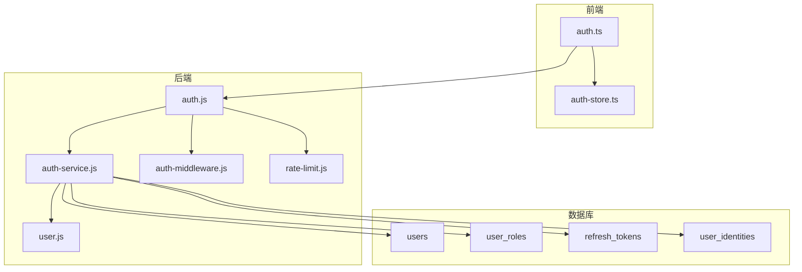
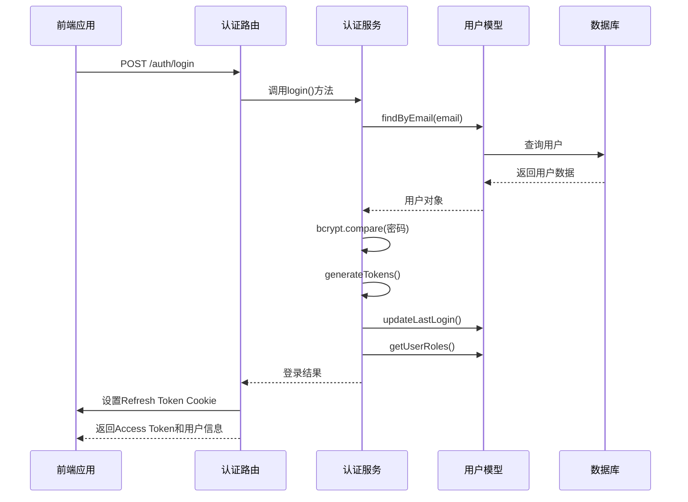
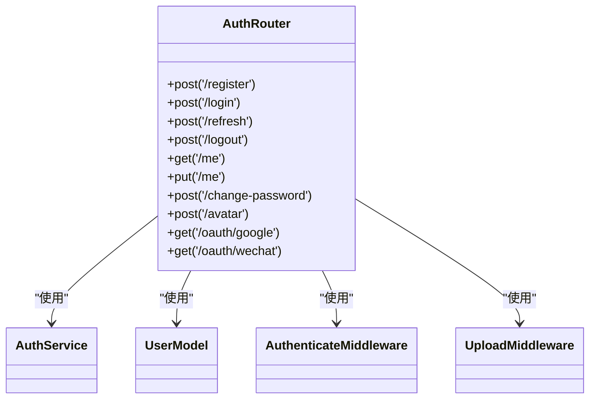
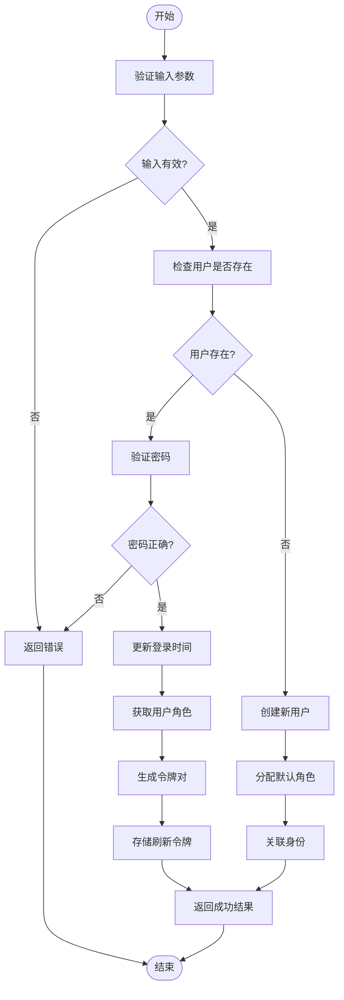
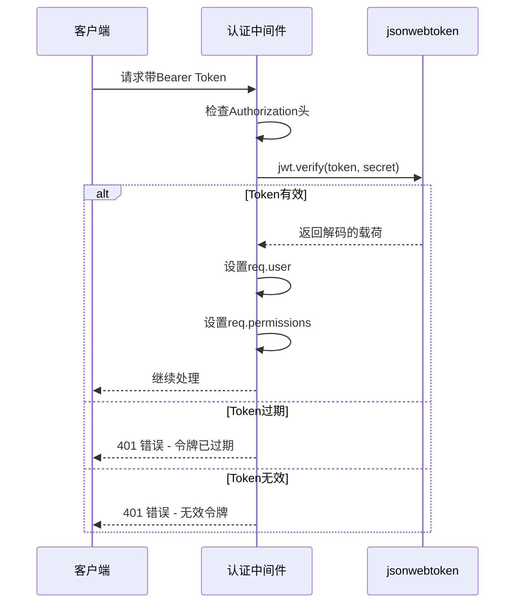
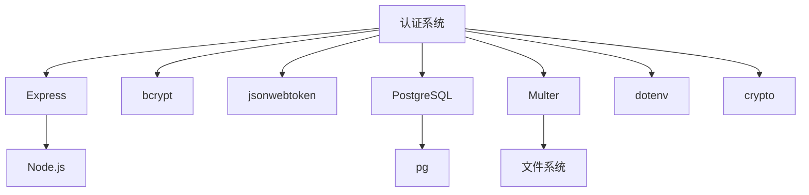

# 用户与认证API

<cite>
**本文档引用的文件**   
- [auth.js](file://server/routes/v1/auth.js)
- [auth-service.js](file://server/services/auth-service.js)
- [auth.js](file://server/middleware/auth.js)
- [user.js](file://server/models/user.js)
- [auth.js](file://server/config/auth.js)
- [index.js](file://server/config/index.js)
- [rate-limit.js](file://server/middleware/rate-limit.js)
- [users.js](file://server/routes/v1/users.js)
- [validate.js](file://server/middleware/validate.js)
- [auth.ts](file://src/services/auth.ts)
- [auth.ts](file://src/stores/auth.ts)
- [.env](file://.env)
- [create-auth-tables.sql](file://server/db/migrations/create-auth-tables.sql)
</cite>

## 目录
1. [简介](#简介)
2. [项目结构](#项目结构)
3. [核心组件](#核心组件)
4. [架构概述](#架构概述)
5. [详细组件分析](#详细组件分析)
6. [依赖分析](#依赖分析)
7. [性能考虑](#性能考虑)
8. [故障排除指南](#故障排除指南)
9. [结论](#结论)
10. [附录](#附录)

## 简介
本文档详细描述了TwinSight系统的用户与认证API，涵盖用户注册、登录（邮箱+密码）、JWT令牌发放与刷新机制。文档详细说明了关键端点如`/auth/login`、`/auth/refresh-token`、`/users/me`的请求体结构和响应格式。解释了JWT的签发、验证流程及Bearer Token在Authorization头中的使用方式。同时描述了用户信息获取、密码更新、邮箱验证等操作。结合`auth-service.js`中的bcrypt密码加密和jsonwebtoken实现，说明了安全最佳实践。文档还涵盖了登录失败重试限制（rate-limit中间件）和会话管理策略。

## 项目结构
用户与认证功能主要分布在服务器端的`server/routes/v1/auth.js`、`server/services/auth-service.js`、`server/middleware/auth.js`等文件中。前端相关代码位于`src/services/auth.ts`和`src/stores/auth.ts`。数据库表结构定义在`server/db/migrations/create-auth-tables.sql`中。配置文件包括`server/config/auth.js`和`server/config/index.js`。

**Diagram sources**
- [auth.js](file://server/routes/v1/auth.js#L1-L363)
- [auth-service.js](file://server/services/auth-service.js#L1-L328)
- [user.js](file://server/models/user.js#L1-L252)
- [create-auth-tables.sql](file://server/db/migrations/create-auth-tables.sql#L1-L78)

**Section sources**
- [auth.js](file://server/routes/v1/auth.js#L1-L363)
- [auth-service.js](file://server/services/auth-service.js#L1-L328)
- [create-auth-tables.sql](file://server/db/migrations/create-auth-tables.sql#L1-L78)

## 核心组件
核心认证组件包括：认证路由处理（`auth.js`）、认证服务逻辑（`auth-service.js`）、JWT验证中间件（`auth.js`）、用户模型（`user.js`）和权限配置（`auth.js`）。这些组件协同工作，实现了完整的用户认证和授权功能。

**Section sources**
- [auth.js](file://server/routes/v1/auth.js#L1-L363)
- [auth-service.js](file://server/services/auth-service.js#L1-L328)
- [auth.js](file://server/middleware/auth.js#L1-L120)
- [user.js](file://server/models/user.js#L1-L252)
- [auth.js](file://server/config/auth.js#L1-L142)

## 架构概述
系统采用基于JWT的无状态认证架构。用户登录后，服务器生成包含用户信息的JWT Access Token和用于刷新的Refresh Token。Access Token通过响应体返回，Refresh Token通过HttpOnly Cookie设置，提供额外的安全保护。权限管理采用基于角色的访问控制（RBAC）模型，支持管理员、经理、编辑、查看者等角色。

**Diagram sources**
- [auth.js](file://server/routes/v1/auth.js#L82-L119)
- [auth-service.js](file://server/services/auth-service.js#L56-L100)
- [user.js](file://server/models/user.js#L22-L28)

## 详细组件分析

### 认证路由分析
认证路由处理所有与用户认证相关的HTTP请求，包括注册、登录、令牌刷新、登出和用户信息获取等操作。

#### 认证路由类图

**Diagram sources**
- [auth.js](file://server/routes/v1/auth.js#L45-L362)

**Section sources**
- [auth.js](file://server/routes/v1/auth.js#L45-L362)

### 认证服务分析
认证服务是核心业务逻辑的实现，处理用户注册、登录、令牌管理等关键功能。使用bcrypt进行密码加密，jsonwebtoken进行JWT令牌的签发和验证。

#### 认证服务流程图

**Diagram sources**
- [auth-service.js](file://server/services/auth-service.js#L19-L327)

**Section sources**
- [auth-service.js](file://server/services/auth-service.js#L19-L327)

### JWT认证中间件分析
JWT认证中间件负责验证请求中的Bearer Token，解析JWT载荷，并将用户信息注入到请求对象中，供后续处理函数使用。

#### JWT认证序列图

**Diagram sources**
- [auth.js](file://server/middleware/auth.js#L12-L54)

**Section sources**
- [auth.js](file://server/middleware/auth.js#L12-L54)

## 依赖分析
认证系统依赖于多个核心组件和外部库。主要依赖关系包括：Express框架、bcrypt密码加密库、jsonwebtoken库、PostgreSQL数据库和Multer文件上传中间件。

**Diagram sources**
- [package.json](file://package.json#L1-L20)
- [auth-service.js](file://server/services/auth-service.js#L1-L15)
- [auth.js](file://server/routes/v1/auth.js#L1-L15)

**Section sources**
- [package.json](file://package.json#L1-L20)
- [auth-service.js](file://server/services/auth-service.js#L1-L15)

## 性能考虑
认证系统的性能主要受密码哈希计算、数据库查询和JWT签发的影响。bcrypt的SALT_ROUNDS设置为10，提供了良好的安全性和性能平衡。系统使用数据库索引优化用户查询性能，并通过连接池管理数据库连接。对于高并发场景，建议实施适当的缓存策略和负载均衡。

## 故障排除指南
常见问题包括：登录失败、令牌过期、权限不足等。对于登录失败，检查邮箱和密码是否正确，账户是否被禁用。对于令牌过期问题，实现自动刷新机制。权限不足时，检查用户角色和权限配置。系统日志记录了所有认证相关操作，便于问题排查。

**Section sources**
- [auth-service.js](file://server/services/auth-service.js#L69-L72)
- [auth.js](file://server/middleware/auth.js#L43-L52)
- [auth.js](file://server/routes/v1/auth.js#L113-L117)

## 结论
TwinSight的用户与认证系统提供了安全、可扩展的认证解决方案。系统实现了基于JWT的无状态认证，结合RBAC权限模型，支持灵活的访问控制。通过bcrypt密码加密和HttpOnly Cookie保护，确保了用户凭证的安全。未来可扩展支持第三方登录（Google/微信）和多因素认证，进一步提升安全性和用户体验。

## 附录

### API端点参考表
| 端点 | 方法 | 描述 | 认证要求 |
|------|------|------|----------|
| /api/v1/auth/register | POST | 用户注册 | 无需认证 |
| /api/v1/auth/login | POST | 用户登录 | 无需认证 |
| /api/v1/auth/refresh | POST | 刷新访问令牌 | 需要Refresh Token |
| /api/v1/auth/logout | POST | 用户登出 | 需要认证 |
| /api/v1/auth/me | GET | 获取当前用户信息 | 需要认证 |
| /api/v1/auth/me | PUT | 更新用户信息 | 需要认证 |
| /api/v1/auth/change-password | POST | 修改密码 | 需要认证 |
| /api/v1/auth/avatar | POST | 上传头像 | 需要认证 |

### 权限角色定义
| 角色 | 权限 |
|------|------|
| admin | 所有权限 |
| manager | 资产、空间、模型、设施、文档的读写权限 |
| editor | 资产、空间、模型、文档的读写权限 |
| viewer | 资产、空间、模型、文档的只读权限 |
| guest | 资产、空间、模型的只读权限 |