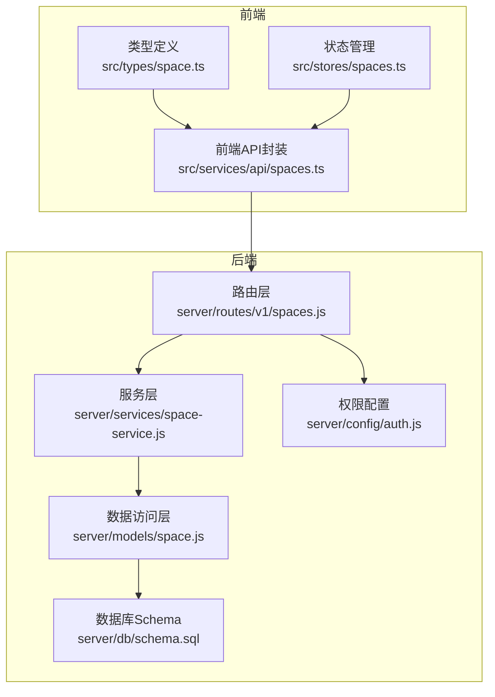
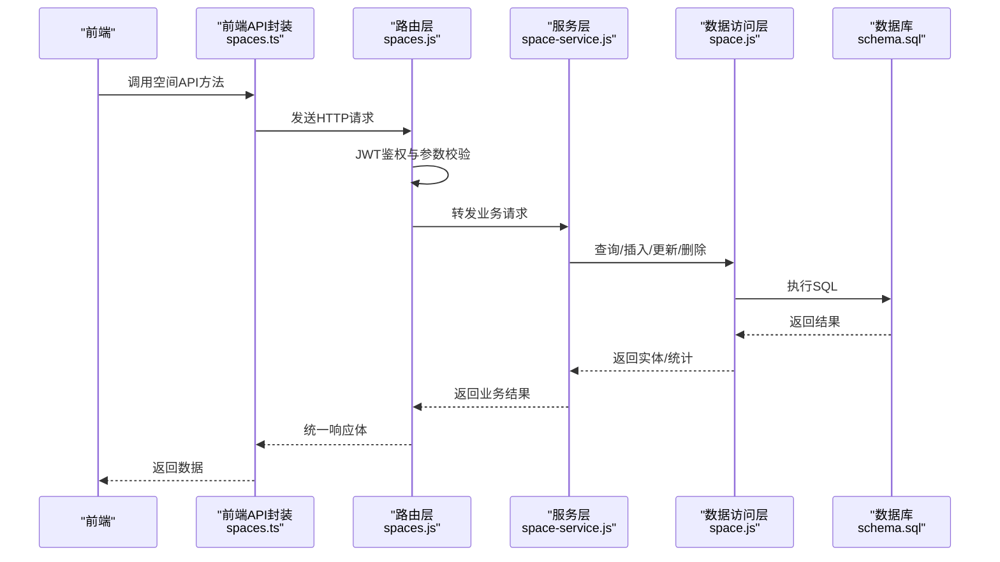
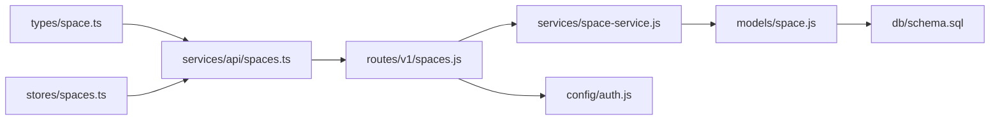

# 空间管理API

<cite>
**本文引用的文件**
- [server/routers/v1/spaces.js](file://server/routes/v1/spaces.js)
- [server/services/space-service.js](file://server/services/space-service.js)
- [server/models/space.js](file://server/models/space.js)
- [server/db/schema.sql](file://server/db/schema.sql)
- [server/config/auth.js](file://server/config/auth.js)
- [src/services/api/spaces.ts](file://src/services/api/spaces.ts)
- [src/types/space.ts](file://src/types/space.ts)
- [src/stores/spaces.ts](file://src/stores/spaces.ts)
- [src/composables/useDataExport.ts](file://src/composables/useDataExport.ts)
- [src/composables/useViewer.ts](file://src/composables/useViewer.ts)
- [server/db/create_documents_table.sql](file://server/db/create_documents_table.sql)
</cite>

## 目录
1. [简介](#简介)
2. [项目结构](#项目结构)
3. [核心组件](#核心组件)
4. [架构总览](#架构总览)
5. [详细组件分析](#详细组件分析)
6. [依赖分析](#依赖分析)
7. [性能考虑](#性能考虑)
8. [故障排查指南](#故障排查指南)
9. [结论](#结论)
10. [附录](#附录)

## 简介
本技术文档面向“空间管理API”，覆盖空间的增删改查、层级结构（楼层/房间）组织、树形视图、空间与资产/文档的关联、空间编码规则及在3D模型中的定位作用，并结合后端路由与业务服务层，解释空间树的构建与维护机制。同时提供权限校验策略，确保用户仅能操作授权空间；并给出获取空间树、平铺列表、路径导航等不同视图的API调用方式。

## 项目结构
空间管理API由三层构成：
- 路由层：接收HTTP请求，进行参数校验与权限控制，转发至服务层。
- 服务层：封装业务逻辑，执行数据聚合与统计。
- 数据访问层：直接与数据库交互，提供CRUD与批量导入能力。

图表来源
- [server/routes/v1/spaces.js](file://server/routes/v1/spaces.js#L1-L221)
- [server/services/space-service.js](file://server/services/space-service.js#L1-L244)
- [server/models/space.js](file://server/models/space.js#L1-L224)
- [server/db/schema.sql](file://server/db/schema.sql#L56-L101)
- [server/config/auth.js](file://server/config/auth.js#L1-L52)

章节来源
- [server/routes/v1/spaces.js](file://server/routes/v1/spaces.js#L1-L221)
- [server/services/space-service.js](file://server/services/space-service.js#L1-L244)
- [server/models/space.js](file://server/models/space.js#L1-L224)
- [server/db/schema.sql](file://server/db/schema.sql#L56-L101)
- [server/config/auth.js](file://server/config/auth.js#L1-L52)

## 核心组件
- 路由层（spaces.js）：提供GET/POST/PUT/DELETE与批量导入接口，内置JWT鉴权与权限校验。
- 服务层（space-service.js）：封装空间查询、创建、更新、删除、批量导入、楼层与统计等业务逻辑。
- 数据访问层（space.js）：提供DAO方法，支持按文件ID、楼层、分类编码等条件查询，以及批量导入与事务处理。
- 数据库Schema（schema.sql）：定义spaces表结构、索引与约束，明确空间编码、楼层、dbId等字段用途。
- 权限配置（auth.js）：定义SPACE_READ/CREATE/UPDATE/DELETE权限常量，供路由中间件使用。
- 前端API封装（spaces.ts）：统一暴露空间API调用方法，便于前端组件使用。
- 类型定义（space.ts）：定义Space、SpaceCreateRequest、SpaceUpdateRequest等接口。
- 状态管理（spaces.ts）：前端空间列表、选择状态与楼层过滤等。
- 数据导出与Viewer交互（useDataExport.ts、useViewer.ts）：从3D模型读取空间属性并映射到空间数据，dbId用于与Viewer联动定位。

章节来源
- [server/routes/v1/spaces.js](file://server/routes/v1/spaces.js#L1-L221)
- [server/services/space-service.js](file://server/services/space-service.js#L1-L244)
- [server/models/space.js](file://server/models/space.js#L1-L224)
- [server/db/schema.sql](file://server/db/schema.sql#L56-L101)
- [server/config/auth.js](file://server/config/auth.js#L1-L52)
- [src/services/api/spaces.ts](file://src/services/api/spaces.ts#L1-L88)
- [src/types/space.ts](file://src/types/space.ts#L1-L42)
- [src/stores/spaces.ts](file://src/stores/spaces.ts#L1-L167)
- [src/composables/useDataExport.ts](file://src/composables/useDataExport.ts#L208-L681)
- [src/composables/useViewer.ts](file://src/composables/useViewer.ts#L1-L235)

## 架构总览
空间管理API采用经典的三层架构，请求流如下：
- 前端通过src/services/api/spaces.ts发起HTTP请求。
- Express路由层进行鉴权与参数校验，再调用服务层。
- 服务层执行业务逻辑，必要时调用数据访问层。
- 数据访问层通过PostgreSQL执行SQL，返回结果。
- 路由层将结果封装为统一格式返回给前端。

图表来源
- [src/services/api/spaces.ts](file://src/services/api/spaces.ts#L1-L88)
- [server/routes/v1/spaces.js](file://server/routes/v1/spaces.js#L1-L221)
- [server/services/space-service.js](file://server/services/space-service.js#L1-L244)
- [server/models/space.js](file://server/models/space.js#L1-L224)
- [server/db/schema.sql](file://server/db/schema.sql#L56-L101)

## 详细组件分析

### 路由与权限
- 鉴权与权限：路由层使用authenticate与authorize中间件，基于PERMISSIONS常量进行权限校验。
- 接口清单：
  - GET /api/v1/spaces：获取空间列表，支持fileId与floor筛选。
  - GET /api/v1/spaces/:code：按编码获取空间。
  - POST /api/v1/spaces：创建空间。
  - PUT /api/v1/spaces/:code：更新空间。
  - DELETE /api/v1/spaces/:code：删除空间。
  - POST /api/v1/spaces/batch：批量导入空间。
  - GET /api/v1/spaces/floors：获取楼层列表。

章节来源
- [server/routes/v1/spaces.js](file://server/routes/v1/spaces.js#L1-L221)
- [server/config/auth.js](file://server/config/auth.js#L1-L52)

### 服务层业务逻辑
- 查询：getAllSpaces、getSpaceByCode、getSpacesByFileId、getSpacesByFloor。
- 写入：createSpace、updateSpace、deleteSpace。
- 批量导入：batchUpsertSpaces，内部根据是否存在spaceCode决定插入或更新。
- 统计与聚合：getFloors、getSpaceStats、getSpaceStatsByFloor、getSpaceCountByClassification。

章节来源
- [server/services/space-service.js](file://server/services/space-service.js#L1-L244)

### 数据访问层DAO
- upsertSpace、batchUpsertSpaces、batchUpsertSpacesWithFile：支持事务与批量写入。
- getSpaceByCode、getSpacesByFloor、getSpacesByClassification、getSpacesByFileId、deleteAllSpaces、updateSpace：提供多维度查询与更新。
- updateSpace允许动态字段更新，限定允许字段集合。

章节来源
- [server/models/space.js](file://server/models/space.js#L1-L224)

### 数据库Schema与字段语义
- spaces表关键字段：
  - space_code：空间编码（唯一键：file_id+space_code），用于标识空间。
  - name：空间名称。
  - classification_code/classification_desc：OmniClass空间分类编码与描述。
  - floor：楼层。
  - area/perimeter：面积与周长。
  - db_id：Forge Viewer中的dbId，用于与3D模型对象关联。
  - file_id：所属模型文件ID，用于多模型隔离。
  - uuid：全局唯一标识。
- 索引：idx_spaces_floor、idx_spaces_db_id、idx_spaces_uuid等，提升查询性能。

章节来源
- [server/db/schema.sql](file://server/db/schema.sql#L56-L101)

### 前端API封装与类型
- 前端API封装：提供getSpaces、getSpaceByCode、getSpacesByFileId、createSpace、updateSpace、deleteSpace、batchImportSpaces等方法。
- 类型定义：Space、SpaceCreateRequest、SpaceUpdateRequest，明确请求与响应字段。
- 状态管理：spaces.ts提供按楼层过滤、按fileId过滤、楼层集合等getter与actions。

章节来源
- [src/services/api/spaces.ts](file://src/services/api/spaces.ts#L1-L88)
- [src/types/space.ts](file://src/types/space.ts#L1-L42)
- [src/stores/spaces.ts](file://src/stores/spaces.ts#L1-L167)

### 空间树的构建与维护机制
- 层级结构：空间具备楼层字段，支持按楼层筛选与统计；前端store提供楼层集合与过滤。
- 树形组织：当前仓库未提供显式的父子关系字段（如parentId）。空间树通常可通过“楼层-房间”两级结构实现；若需更深层级，可在后续扩展中引入parentId或path字段。
- 维护机制：批量导入会先清理旧数据再写入，保证与模型文件的一致性；更新操作通过space_code定位。

章节来源
- [server/services/space-service.js](file://server/services/space-service.js#L111-L139)
- [server/models/space.js](file://server/models/space.js#L127-L172)
- [src/stores/spaces.ts](file://src/stores/spaces.ts#L74-L90)

### 空间编码规则与3D模型定位
- 空间编码：space_code来自模型构件的编号属性，作为空间的唯一标识，且与file_id共同构成唯一约束。
- 3D模型定位：db_id来自Forge Viewer，用于与模型构件建立关联，前端可通过dbId进行选中、隔离与聚焦等操作。
- 属性采集：useDataExport.ts从Viewer读取属性并映射到空间数据，其中包含编号、名称、分类等字段。

章节来源
- [server/db/schema.sql](file://server/db/schema.sql#L56-L101)
- [src/composables/useViewer.ts](file://src/composables/useViewer.ts#L1-L235)
- [src/composables/useDataExport.ts](file://src/composables/useDataExport.ts#L208-L681)

### 空间与资产、文档的关联
- 资产关联：空间与资产通过dbId与模型构件关联，前端可基于dbId在Viewer中进行联动。
- 文档关联：数据库已提供documents表结构，支持与资产、空间、规格三者之一关联，应用层负责保证三选一的约束。
- 批量绑定资产到空间：当前仓库未提供直接的“批量绑定资产到空间”的API；可通过以下方式间接实现：
  - 使用批量导入空间接口导入空间数据，确保space_code与资产所在房间一致；
  - 在资产侧通过dbId与Viewer联动，前端根据dbId定位资产所在空间；
  - 若需强关联，可在业务层增加资产-空间绑定接口并在应用层维护。

章节来源
- [server/db/create_documents_table.sql](file://server/db/create_documents_table.sql#L1-L48)
- [src/composables/useViewer.ts](file://src/composables/useViewer.ts#L1-L235)

### 不同视图的API调用方式
- 平铺列表：GET /api/v1/spaces（可选fileId与floor筛选）。
- 楼层列表：GET /api/v1/spaces/floors（可选fileId）。
- 按编码获取：GET /api/v1/spaces/:code。
- 创建/更新/删除：POST/PUT/DELETE /api/v1/spaces/:code。
- 批量导入：POST /api/v1/spaces/batch（spaces数组，每项含spaceCode等）。

章节来源
- [server/routes/v1/spaces.js](file://server/routes/v1/spaces.js#L1-L221)
- [src/services/api/spaces.ts](file://src/services/api/spaces.ts#L1-L88)

### 请求参数与返回结构
- 通用字段（SpaceCreateRequest/SpaceUpdateRequest）：
  - spaceCode：必填（创建时），空间编码。
  - name：可选，空间名称。
  - floor：可选，楼层。
  - area：可选，数值。
  - dbId：可选，Viewer中的dbId。
  - fileId：可选，模型文件ID。
  - classificationCode：可选，OmniClass空间分类编码。
  - properties：可选，动态属性。
- 返回结构：统一success与data字段；具体字段以spaces表为准。

章节来源
- [src/types/space.ts](file://src/types/space.ts#L1-L42)
- [server/db/schema.sql](file://server/db/schema.sql#L56-L101)
- [server/routes/v1/spaces.js](file://server/routes/v1/spaces.js#L1-L221)

## 依赖分析
- 路由依赖服务层，服务层依赖数据访问层，数据访问层依赖数据库Schema。
- 权限依赖auth.js中的PERMISSIONS常量。
- 前端依赖类型定义与API封装，状态管理依赖空间列表与过滤逻辑。

图表来源
- [server/routes/v1/spaces.js](file://server/routes/v1/spaces.js#L1-L221)
- [server/services/space-service.js](file://server/services/space-service.js#L1-L244)
- [server/models/space.js](file://server/models/space.js#L1-L224)
- [server/db/schema.sql](file://server/db/schema.sql#L56-L101)
- [server/config/auth.js](file://server/config/auth.js#L1-L52)
- [src/services/api/spaces.ts](file://src/services/api/spaces.ts#L1-L88)
- [src/types/space.ts](file://src/types/space.ts#L1-L42)
- [src/stores/spaces.ts](file://src/stores/spaces.ts#L1-L167)

章节来源
- [server/routes/v1/spaces.js](file://server/routes/v1/spaces.js#L1-L221)
- [server/services/space-service.js](file://server/services/space-service.js#L1-L244)
- [server/models/space.js](file://server/models/space.js#L1-L224)
- [server/db/schema.sql](file://server/db/schema.sql#L56-L101)
- [server/config/auth.js](file://server/config/auth.js#L1-L52)
- [src/services/api/spaces.ts](file://src/services/api/spaces.ts#L1-L88)
- [src/types/space.ts](file://src/types/space.ts#L1-L42)
- [src/stores/spaces.ts](file://src/stores/spaces.ts#L1-L167)

## 性能考虑
- 索引优化：spaces表对floor、db_id、uuid等字段建立索引，有助于查询与去重。
- 批量导入：服务层与数据访问层均提供批量导入能力，建议在导入前清理旧数据，避免重复写入。
- 分页与筛选：前端可结合fileId与floor筛选减少数据量；后端提供按fileId与floor的查询接口。
- 事务与回滚：批量导入使用事务，失败自动回滚，保障数据一致性。

章节来源
- [server/db/schema.sql](file://server/db/schema.sql#L97-L101)
- [server/services/space-service.js](file://server/services/space-service.js#L111-L139)
- [server/models/space.js](file://server/models/space.js#L127-L172)

## 故障排查指南
- 权限不足：确认用户角色是否具备SPACE_READ/CREATE/UPDATE/DELETE权限；检查路由中间件authorize是否生效。
- 参数校验失败：检查body/query参数是否符合路由定义（如spaceCode非空、area为数值等）。
- 空间不存在：当按编码查询或更新/删除时，若未找到对应记录会返回未找到错误。
- 批量导入异常：查看batchUpsertSpacesWithFile的错误日志，确认事务回滚原因。

章节来源
- [server/routes/v1/spaces.js](file://server/routes/v1/spaces.js#L1-L221)
- [server/config/auth.js](file://server/config/auth.js#L1-L52)

## 结论
本空间管理API提供了完善的空间增删改查能力，支持按文件ID与楼层筛选、批量导入与统计聚合。通过dbId与Viewer联动，空间编码在3D模型中具备定位意义。当前未提供显式的父子关系字段，但可通过楼层-房间两级结构实现树形组织。权限校验严格遵循SPACE_*权限常量，确保最小授权原则。未来可扩展父子关系字段或新增资产-空间绑定接口，进一步完善空间树与资产关联能力。

## 附录

### API定义与调用示例（路径与参数）
- 获取空间列表
  - 方法与路径：GET /api/v1/spaces
  - 查询参数：fileId（可选）、floor（可选）
  - 返回：success、data（空间数组）
- 根据编码获取空间
  - 方法与路径：GET /api/v1/spaces/:code
  - 路径参数：code（必填）
  - 返回：success、data（单个空间）
- 创建空间
  - 方法与路径：POST /api/v1/spaces
  - 请求体：SpaceCreateRequest
  - 返回：success、data（新建空间）
- 更新空间
  - 方法与路径：PUT /api/v1/spaces/:code
  - 路径参数：code（必填）
  - 请求体：SpaceUpdateRequest
  - 返回：success、data（更新后的空间）
- 删除空间
  - 方法与路径：DELETE /api/v1/spaces/:code
  - 路径参数：code（必填）
  - 返回：success、message
- 批量导入空间
  - 方法与路径：POST /api/v1/spaces/batch
  - 请求体：{ spaces: SpaceCreateRequest[] }
  - 返回：success、data（包含总数与批量结果统计）
- 获取楼层列表
  - 方法与路径：GET /api/v1/spaces/floors
  - 查询参数：fileId（可选）
  - 返回：success、data（楼层数组）

章节来源
- [server/routes/v1/spaces.js](file://server/routes/v1/spaces.js#L1-L221)
- [src/services/api/spaces.ts](file://src/services/api/spaces.ts#L1-L88)
- [src/types/space.ts](file://src/types/space.ts#L1-L42)