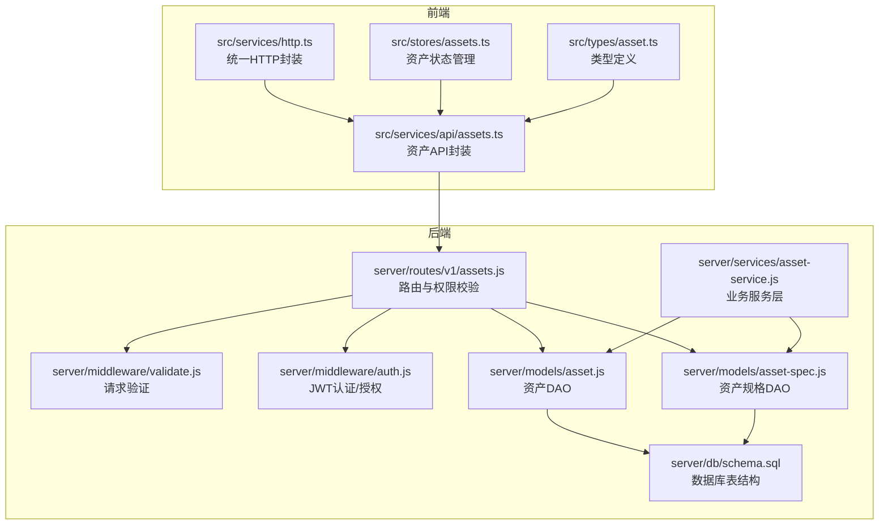
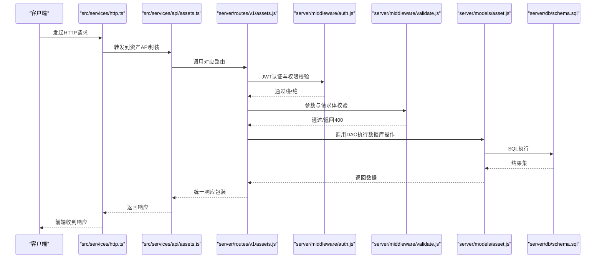
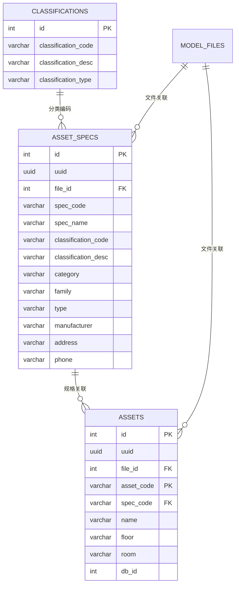
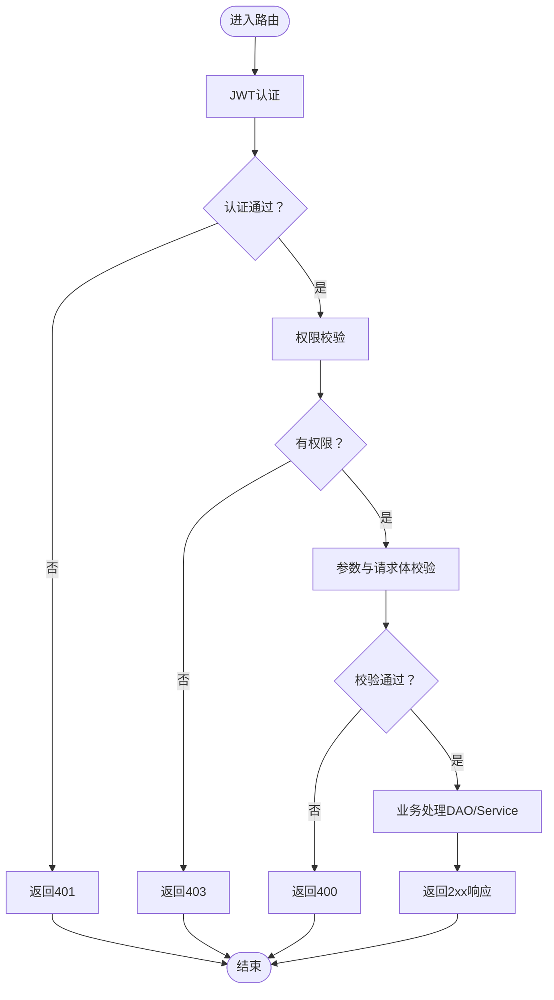
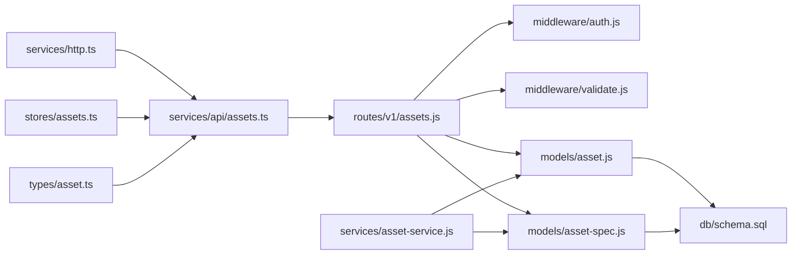

# 资产管理API

<cite>
**本文引用的文件**
- [server/routes/v1/assets.js](file://server/routes/v1/assets.js)
- [server/models/asset.js](file://server/models/asset.js)
- [server/models/asset-spec.js](file://server/models/asset-spec.js)
- [server/services/asset-service.js](file://server/services/asset-service.js)
- [server/middleware/validate.js](file://server/middleware/validate.js)
- [server/middleware/auth.js](file://server/middleware/auth.js)
- [server/config/auth.js](file://server/config/auth.js)
- [server/db/schema.sql](file://server/db/schema.sql)
- [src/services/api/assets.ts](file://src/services/api/assets.ts)
- [src/services/http.ts](file://src/services/http.ts)
- [src/stores/assets.ts](file://src/stores/assets.ts)
- [src/types/asset.ts](file://src/types/asset.ts)
</cite>

## 目录
1. [简介](#简介)
2. [项目结构](#项目结构)
3. [核心组件](#核心组件)
4. [架构总览](#架构总览)
5. [详细组件分析](#详细组件分析)
6. [依赖分析](#依赖分析)
7. [性能考虑](#性能考虑)
8. [故障排查指南](#故障排查指南)
9. [结论](#结论)
10. [附录](#附录)

## 简介
本文件面向资产管理API的使用者与维护者，系统性梳理资产的增删改查、批量导入、资产规格查询等接口，明确HTTP方法、URL路径、认证方式、请求体与响应体结构、状态码及典型调用示例（含curl与前端axios风格调用），并结合后端路由与模型定义说明数据验证、错误处理与权限控制机制。同时对资产编码（MC编码）生成规则、分类体系集成方式、与空间（space）和模型（model）的外键关系进行说明。

## 项目结构
资产管理API位于后端server目录，前端通过src/services/api封装调用；数据库表结构由server/db/schema.sql定义。

图表来源
- [server/routes/v1/assets.js](file://server/routes/v1/assets.js#L1-L254)
- [server/middleware/auth.js](file://server/middleware/auth.js#L1-L120)
- [server/middleware/validate.js](file://server/middleware/validate.js#L1-L72)
- [server/models/asset.js](file://server/models/asset.js#L1-L257)
- [server/models/asset-spec.js](file://server/models/asset-spec.js#L1-L170)
- [server/services/asset-service.js](file://server/services/asset-service.js#L1-L216)
- [server/db/schema.sql](file://server/db/schema.sql#L1-L202)
- [src/services/api/assets.ts](file://src/services/api/assets.ts#L1-L108)
- [src/services/http.ts](file://src/services/http.ts#L1-L220)
- [src/stores/assets.ts](file://src/stores/assets.ts#L1-L174)
- [src/types/asset.ts](file://src/types/asset.ts#L1-L65)

章节来源
- [server/routes/v1/assets.js](file://server/routes/v1/assets.js#L1-L254)
- [server/db/schema.sql](file://server/db/schema.sql#L1-L202)

## 核心组件
- 路由层：提供资产与资产规格的REST接口，内置认证与权限校验、请求参数验证。
- 数据访问层：封装资产与资产规格的数据库操作，支持批量导入与关联文件ID。
- 业务服务层：封装跨多表的业务逻辑（如批量导入、统计等）。
- 前端API封装：统一HTTP请求、错误处理与类型约束。
- 类型定义：前后端一致的资产与规格类型，确保调用契约清晰。

章节来源
- [server/routes/v1/assets.js](file://server/routes/v1/assets.js#L1-L254)
- [server/models/asset.js](file://server/models/asset.js#L1-L257)
- [server/models/asset-spec.js](file://server/models/asset-spec.js#L1-L170)
- [server/services/asset-service.js](file://server/services/asset-service.js#L1-L216)
- [src/services/api/assets.ts](file://src/services/api/assets.ts#L1-L108)
- [src/types/asset.ts](file://src/types/asset.ts#L1-L65)

## 架构总览
资产管理API采用经典的三层架构：
- 表现层：Express路由，负责接收请求、鉴权与参数校验。
- 业务层：服务层封装复杂业务，DAO层封装数据库操作。
- 数据层：PostgreSQL表结构定义资产、资产规格、分类编码等实体。

图表来源
- [src/services/http.ts](file://src/services/http.ts#L1-L220)
- [src/services/api/assets.ts](file://src/services/api/assets.ts#L1-L108)
- [server/routes/v1/assets.js](file://server/routes/v1/assets.js#L1-L254)
- [server/middleware/auth.js](file://server/middleware/auth.js#L1-L120)
- [server/middleware/validate.js](file://server/middleware/validate.js#L1-L72)
- [server/models/asset.js](file://server/models/asset.js#L1-L257)
- [server/db/schema.sql](file://server/db/schema.sql#L1-L202)

## 详细组件分析

### 接口清单与规范
- 基础路径：/api/v1/assets
- 认证方式：Bearer Token（Authorization: Bearer <token>）
- 公共响应体结构：success（布尔）、data（对象或数组，视接口而定）、error（可选）

接口一览
- 获取资产列表
  - 方法：GET
  - 路径：/api/v1/assets
  - 查询参数：
    - fileId（可选，整数，按文件ID筛选）
    - specCode（可选，字符串，按规格编码筛选）
  - 响应：返回资产数组（包含资产与规格字段）
  - 状态码：200
- 根据编码获取资产
  - 方法：GET
  - 路径：/api/v1/assets/{code}
  - 路径参数：code（必填，字符串）
  - 响应：返回单个资产对象
  - 状态码：200；若不存在返回404
- 创建资产
  - 方法：POST
  - 路径：/api/v1/assets
  - 请求体字段（AssetCreateRequest）：
    - assetCode（必填，字符串）
    - name（可选，字符串）
    - specCode（可选，字符串）
    - floor（可选，字符串）
    - room（可选，字符串）
    - dbId（可选，整数）
    - fileId（可选，整数）
  - 响应：返回新创建的资产对象
  - 状态码：201；400（参数校验失败）
- 更新资产
  - 方法：PUT
  - 路径：/api/v1/assets/{code}
  - 路径参数：code（必填，字符串）
  - 请求体字段（AssetUpdateRequest）：
    - name（可选，字符串）
    - specCode（可选，字符串）
    - floor（可选，字符串）
    - room（可选，字符串）
  - 响应：返回更新后的资产对象
  - 状态码：200；400（参数校验失败）；404（资产不存在）
- 删除资产
  - 方法：DELETE
  - 路径：/api/v1/assets/{code}
  - 路径参数：code（必填，字符串）
  - 响应：返回成功消息
  - 状态码：200；404（资产不存在）
- 批量导入资产
  - 方法：POST
  - 路径：/api/v1/assets/batch
  - 请求体字段：
    - assets（必填，数组，元素为AssetCreateRequest）
  - 响应：返回包含总数与导入统计的对象
  - 状态码：200；400（参数校验失败）

资产规格接口
- 获取资产规格列表
  - 方法：GET
  - 路径：/api/v1/assets/specs
  - 查询参数：
    - fileId（可选，整数，按文件ID筛选）
  - 响应：返回资产规格数组
  - 状态码：200
- 根据编码获取资产规格
  - 方法：GET
  - 路径：/api/v1/assets/specs/{code}
  - 路径参数：code（必填，字符串）
  - 响应：返回单个资产规格对象
  - 状态码：200；404（规格不存在）

章节来源
- [server/routes/v1/assets.js](file://server/routes/v1/assets.js#L1-L254)
- [src/types/asset.ts](file://src/types/asset.ts#L1-L65)
- [src/services/api/assets.ts](file://src/services/api/assets.ts#L1-L108)

### 数据模型与关系
- 资产表（assets）
  - 主键：asset_code（MC编码）
  - 外键：file_id（关联模型文件）
  - 关联：spec_code（关联资产规格表）
- 资产规格表（asset_specs）
  - 主键：spec_code（规格编码）
  - 外键：file_id（关联模型文件）
- 分类编码表（classifications）
  - 主键：classification_code + classification_type（联合唯一）
  - 用途：资产与空间的OmniClass分类体系

图表来源
- [server/db/schema.sql](file://server/db/schema.sql#L1-L202)

章节来源
- [server/db/schema.sql](file://server/db/schema.sql#L1-L202)

### 资产编码（MC编码）生成规则
- 资产编码（asset_code）即MC编码，作为资产的唯一标识，用于资产表主键与关联查询。
- 生成策略建议遵循以下原则（依据表结构与字段语义推导）：
  - 唯一性：同一文件内唯一（file_id + asset_code唯一）
  - 可读性：来源于构件的编号或标识，便于追溯
  - 稳定性：一旦生成不应变更，避免破坏关联一致性
- 在批量导入场景中，后端会根据fileId与assetCode进行去重与更新，确保幂等。

章节来源
- [server/db/schema.sql](file://server/db/schema.sql#L1-L202)
- [server/models/asset.js](file://server/models/asset.js#L160-L204)

### 分类体系集成方式
- 分类编码（classification_code/classification_desc）来自OmniClass体系，分别用于资产与空间。
- 资产规格表与资产表均包含分类字段，便于按分类维度统计与筛选。
- 前端可通过资产规格接口获取分类维度的类型信息，辅助资产筛选与统计。

章节来源
- [server/db/schema.sql](file://server/db/schema.sql#L1-L202)
- [server/models/asset-spec.js](file://server/models/asset-spec.js#L1-L170)
- [server/models/asset.js](file://server/models/asset.js#L1-L257)

### 与空间（space）和模型（model）的关系
- 资产与空间均通过file_id关联到模型文件（model_files），实现“按文件隔离”的多租户式数据划分。
- 资产与资产规格通过spec_code建立一对多关系，实现类型复用与扩展。
- 空间表（spaces）同样具备file_id与db_id等字段，便于与Viewer中的构件ID关联。

章节来源
- [server/db/schema.sql](file://server/db/schema.sql#L1-L202)
- [server/models/asset.js](file://server/models/asset.js#L1-L257)
- [server/models/asset-spec.js](file://server/models/asset-spec.js#L1-L170)

### 数据验证与错误处理机制
- 请求参数验证
  - 使用express-validator在路由层进行参数与请求体校验，非法参数返回400并携带details数组。
- 认证与授权
  - JWT认证：缺失或无效令牌返回401；开发模式下可绕过认证（仅限本地调试）。
  - 权限控制：基于PERMISSIONS常量进行细粒度授权，无权限返回403。
- 业务异常
  - 资产不存在：返回404并携带错误信息。
  - 通用错误：交由错误处理中间件统一包装。

图表来源
- [server/middleware/auth.js](file://server/middleware/auth.js#L1-L120)
- [server/middleware/validate.js](file://server/middleware/validate.js#L1-L72)
- [server/config/auth.js](file://server/config/auth.js#L1-L142)
- [server/routes/v1/assets.js](file://server/routes/v1/assets.js#L1-L254)

章节来源
- [server/middleware/auth.js](file://server/middleware/auth.js#L1-L120)
- [server/middleware/validate.js](file://server/middleware/validate.js#L1-L72)
- [server/config/auth.js](file://server/config/auth.js#L1-L142)
- [server/routes/v1/assets.js](file://server/routes/v1/assets.js#L1-L254)

### 前端调用示例
- axios风格调用（参考src/services/api/assets.ts）
  - 获取资产列表：GET /api/v1/assets?fileId=123
  - 获取资产详情：GET /api/v1/assets/{code}
  - 创建资产：POST /api/v1/assets
  - 更新资产：PUT /api/v1/assets/{code}
  - 删除资产：DELETE /api/v1/assets/{code}
  - 批量导入：POST /api/v1/assets/batch
  - 获取资产规格列表：GET /api/v1/assets/specs?fileId=123
  - 获取资产规格详情：GET /api/v1/assets/specs/{code}
- curl示例（请替换为实际环境地址与token）
  - 获取资产列表：curl -H "Authorization: Bearer YOUR_TOKEN" "http://localhost:3001/api/v1/assets?fileId=123"
  - 创建资产：curl -X POST -H "Authorization: Bearer YOUR_TOKEN" -H "Content-Type: application/json" -d '{"assetCode":"MC-001","name":"设备A","specCode":"SPEC-001"}' "http://localhost:3001/api/v1/assets"
  - 更新资产：curl -X PUT -H "Authorization: Bearer YOUR_TOKEN" -H "Content-Type: application/json" -d '{"name":"设备A-升级版"}' "http://localhost:3001/api/v1/assets/MC-001"
  - 删除资产：curl -X DELETE -H "Authorization: Bearer YOUR_TOKEN" "http://localhost:3001/api/v1/assets/MC-001"
  - 批量导入：curl -X POST -H "Authorization: Bearer YOUR_TOKEN" -H "Content-Type: application/json" -d '{"assets":[{"assetCode":"MC-001","name":"设备A","specCode":"SPEC-001"}]}' "http://localhost:3001/api/v1/assets/batch"
  - 获取资产规格列表：curl -H "Authorization: Bearer YOUR_TOKEN" "http://localhost:3001/api/v1/assets/specs?fileId=123"
  - 获取资产规格详情：curl -H "Authorization: Bearer YOUR_TOKEN" "http://localhost:3001/api/v1/assets/specs/SPEC-001"

章节来源
- [src/services/api/assets.ts](file://src/services/api/assets.ts#L1-L108)
- [src/services/http.ts](file://src/services/http.ts#L1-L220)

## 依赖分析
- 路由依赖中间件：认证(authenticate)、授权(authorize)、参数验证(validateRequest)。
- DAO依赖数据库连接与事务管理，批量导入使用BEGIN/COMMIT/ROLLBACK保证一致性。
- 服务层封装业务逻辑，减少路由层复杂度。
- 前端API封装统一错误处理与类型约束，提升可维护性。

图表来源
- [server/routes/v1/assets.js](file://server/routes/v1/assets.js#L1-L254)
- [server/middleware/auth.js](file://server/middleware/auth.js#L1-L120)
- [server/middleware/validate.js](file://server/middleware/validate.js#L1-L72)
- [server/models/asset.js](file://server/models/asset.js#L1-L257)
- [server/models/asset-spec.js](file://server/models/asset-spec.js#L1-L170)
- [server/services/asset-service.js](file://server/services/asset-service.js#L1-L216)
- [server/db/schema.sql](file://server/db/schema.sql#L1-L202)
- [src/services/api/assets.ts](file://src/services/api/assets.ts#L1-L108)
- [src/services/http.ts](file://src/services/http.ts#L1-L220)
- [src/stores/assets.ts](file://src/stores/assets.ts#L1-L174)
- [src/types/asset.ts](file://src/types/asset.ts#L1-L65)

章节来源
- [server/routes/v1/assets.js](file://server/routes/v1/assets.js#L1-L254)
- [server/models/asset.js](file://server/models/asset.js#L1-L257)
- [server/models/asset-spec.js](file://server/models/asset-spec.js#L1-L170)
- [server/services/asset-service.js](file://server/services/asset-service.js#L1-L216)
- [src/services/api/assets.ts](file://src/services/api/assets.ts#L1-L108)
- [src/services/http.ts](file://src/services/http.ts#L1-L220)
- [src/stores/assets.ts](file://src/stores/assets.ts#L1-L174)
- [src/types/asset.ts](file://src/types/asset.ts#L1-L65)

## 性能考虑
- 索引优化：资产、资产规格、空间表均建立常用查询字段索引，有助于提升过滤与排序性能。
- 批量导入：使用事务批量写入，减少往返开销；建议前端分批提交，避免单次过大。
- 分页与筛选：前端传入fileId与specCode等条件，后端按需查询，避免全表扫描。
- 缓存策略：可在应用层对热点资产规格与分类数据做缓存，降低数据库压力。

章节来源
- [server/db/schema.sql](file://server/db/schema.sql#L75-L120)
- [server/models/asset.js](file://server/models/asset.js#L160-L204)
- [server/models/asset-spec.js](file://server/models/asset-spec.js#L105-L160)

## 故障排查指南
- 400 参数校验失败
  - 检查请求体字段是否符合类型要求（如整数、字符串长度限制等）。
  - 检查必填字段是否缺失。
- 401 未提供或无效的认证令牌
  - 确认Authorization头格式为Bearer <token>。
  - 检查token是否过期或签名错误。
- 403 无权执行此操作
  - 确认当前用户角色是否具备相应权限（如asset:create、asset:update等）。
- 404 资产/规格不存在
  - 确认assetCode或specCode是否正确。
  - 确认fileId是否匹配当前上下文。
- 500 服务器内部错误
  - 查看后端日志定位SQL异常或事务回滚问题。
  - 检查数据库连接与索引状态。

章节来源
- [server/middleware/auth.js](file://server/middleware/auth.js#L1-L120)
- [server/middleware/validate.js](file://server/middleware/validate.js#L1-L72)
- [server/routes/v1/assets.js](file://server/routes/v1/assets.js#L1-L254)

## 结论
资产管理API围绕MC编码（asset_code）构建，通过file_id实现按模型文件的隔离，借助资产规格（asset_specs）与OmniClass分类体系实现类型化与可扩展的资产管理。后端采用中间件统一处理认证、授权与参数校验，前端通过API封装与类型约束保障调用一致性。建议在生产环境中严格使用Bearer Token认证，合理使用fileId进行数据隔离，并对批量导入与高频查询进行索引与缓存优化。

## 附录

### 状态码说明
- 200：成功返回数据
- 201：创建成功（POST创建资产）
- 400：请求参数验证失败
- 401：未提供或无效认证令牌
- 403：无权执行此操作
- 404：资源不存在
- 500：服务器内部错误

章节来源
- [server/routes/v1/assets.js](file://server/routes/v1/assets.js#L1-L254)
- [server/middleware/auth.js](file://server/middleware/auth.js#L1-L120)
- [server/middleware/validate.js](file://server/middleware/validate.js#L1-L72)