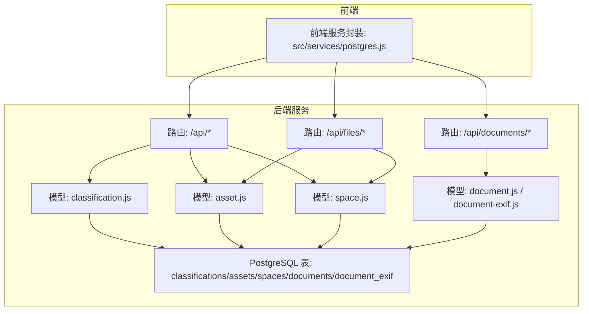
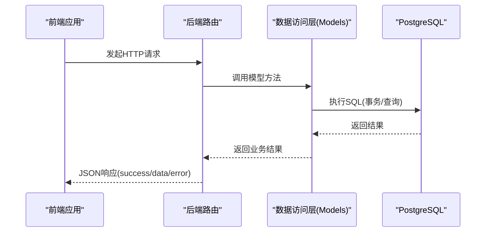
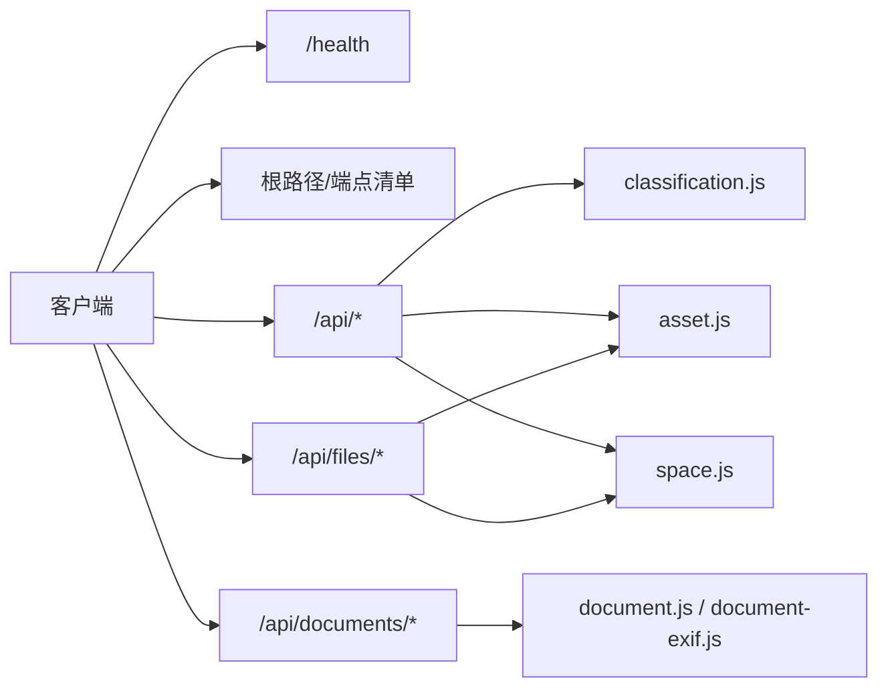

# API参考文档

<cite>
**本文引用的文件**
- [server/README.md](file://server/README.md)
- [server/index.js](file://server/index.js)
- [server/routes/api.js](file://server/routes/api.js)
- [server/routes/documents.js](file://server/routes/documents.js)
- [server/routes/files.js](file://server/routes/files.js)
- [server/models/classification.js](file://server/models/classification.js)
- [server/models/asset.js](file://server/models/asset.js)
- [server/models/space.js](file://server/models/space.js)
- [server/models/document.js](file://server/models/document.js)
- [server/models/document-exif.js](file://server/models/document-exif.js)
- [server/db/schema.sql](file://server/db/schema.sql)
- [src/services/postgres.js](file://src/services/postgres.js)
</cite>

## 目录
1. [简介](#简介)
2. [项目结构](#项目结构)
3. [核心组件](#核心组件)
4. [架构总览](#架构总览)
5. [详细组件分析](#详细组件分析)
6. [依赖分析](#依赖分析)
7. [性能考虑](#性能考虑)
8. [故障排查指南](#故障排查指南)
9. [结论](#结论)
10. [附录](#附录)

## 简介
本文件为后端服务的RESTful API参考文档，覆盖server/README.md中列出的接口，包括分类编码、资产规格、资产、空间的查询与批量导入，以及文档管理与模型数据综合导入能力。文档提供每个端点的HTTP方法、URL路径、请求参数、请求体JSON Schema、响应格式、状态码与错误信息，并说明身份验证、速率限制与版本控制策略。面向前端开发者与第三方集成者，帮助快速准确地调用API。

## 项目结构
后端采用Express + PostgreSQL架构，路由按功能模块划分：
- 路由模块：/api/classifications、/api/asset-specs、/api/assets、/api/spaces、/api/import/model-data、/api/documents、/api/files、/api/views、/api/v1/timeseries
- 数据访问层：models/* 对应表操作
- 数据库：server/db/schema.sql 定义表结构与索引
- 前端服务封装：src/services/postgres.js 提供统一的API调用封装

图表来源
- [server/index.js](file://server/index.js#L43-L49)
- [server/routes/api.js](file://server/routes/api.js#L1-L517)
- [server/routes/documents.js](file://server/routes/documents.js#L1-L386)
- [server/routes/files.js](file://server/routes/files.js#L1-L436)
- [server/models/classification.js](file://server/models/classification.js#L1-L119)
- [server/models/asset.js](file://server/models/asset.js#L1-L253)
- [server/models/space.js](file://server/models/space.js#L1-L220)
- [server/models/document.js](file://server/models/document.js#L1-L163)
- [server/models/document-exif.js](file://server/models/document-exif.js#L1-L169)
- [server/db/schema.sql](file://server/db/schema.sql#L1-L160)

章节来源
- [server/index.js](file://server/index.js#L43-L49)

## 核心组件
- 分类编码API：查询全部分类编码、按类型过滤；批量导入分类编码
- 资产规格API：查询全部规格、按编码查询；批量导入规格
- 资产API：查询全部资产、按编码查询、按楼层/房间查询；批量导入与部分字段更新
- 空间API：查询全部空间、按编码查询、按楼层查询；批量导入与部分字段更新
- 综合导入API：从模型数据批量导入分类、规格、资产、空间，并支持按fileId关联
- 文档管理API：上传文档（含EXIF提取）、查询文档列表（含EXIF）、获取文档详情、获取EXIF分组、更新标题、删除文档、下载文档
- 文件管理API：上传SVF ZIP、断点续传、解压、激活、查询文件、按文件查询资产/空间等

章节来源
- [server/routes/api.js](file://server/routes/api.js#L1-L517)
- [server/routes/documents.js](file://server/routes/documents.js#L1-L386)
- [server/routes/files.js](file://server/routes/files.js#L1-L436)
- [server/README.md](file://server/README.md#L94-L158)

## 架构总览
后端通过Express中间件处理CORS、静态资源、日志与路由挂载，路由层调用模型层进行数据库操作，模型层使用PostgreSQL连接池与事务控制，前端通过src/services/postgres.js统一发起请求。

图表来源
- [server/index.js](file://server/index.js#L22-L49)
- [server/routes/api.js](file://server/routes/api.js#L1-L517)
- [server/models/asset.js](file://server/models/asset.js#L1-L253)
- [server/models/space.js](file://server/models/space.js#L1-L220)
- [server/models/classification.js](file://server/models/classification.js#L1-L119)
- [server/models/document.js](file://server/models/document.js#L1-L163)
- [server/models/document-exif.js](file://server/models/document-exif.js#L1-L169)

## 详细组件分析

### 分类编码 API
- 查询全部分类编码
  - 方法与路径：GET /api/classifications
  - 查询参数：type=asset|space（可选）
  - 响应：success、data（数组）
  - 状态码：200、500
  - 错误：服务器内部错误
- 批量导入分类编码
  - 方法与路径：POST /api/classifications/batch
  - 请求体JSON Schema：
    - classifications: array
      - items: object
        - classificationCode: string
        - classificationDesc: string
        - classificationType: enum("asset","space")
  - 响应：success、message
  - 状态码：200、400、500
  - 错误：请提供 classifications 数组

章节来源
- [server/routes/api.js](file://server/routes/api.js#L18-L47)
- [server/models/classification.js](file://server/models/classification.js#L1-L119)
- [server/db/schema.sql](file://server/db/schema.sql#L6-L16)

### 资产规格 API
- 查询全部资产规格
  - 方法与路径：GET /api/asset-specs
  - 响应：success、data（数组）
  - 状态码：200、500
  - 错误：服务器内部错误
- 根据规格编码查询
  - 方法与路径：GET /api/asset-specs/:code
  - 路径参数：code
  - 响应：success、data
  - 状态码：200、404、500
  - 错误：规格不存在
- 批量导入资产规格
  - 方法与路径：POST /api/asset-specs/batch
  - 请求体JSON Schema：
    - specs: array
      - items: object
        - specCode: string
        - specName: string
        - classificationCode: string
        - classificationDesc: string
        - category: string
        - family: string
        - type: string
        - manufacturer: string
        - address: string
        - phone: string
  - 响应：success、message
  - 状态码：200、400、500
  - 错误：请提供 specs 数组

章节来源
- [server/routes/api.js](file://server/routes/api.js#L53-L97)
- [server/models/asset.js](file://server/models/asset.js#L1-L253)
- [server/db/schema.sql](file://server/db/schema.sql#L18-L36)

### 资产 API
- 查询全部资产
  - 方法与路径：GET /api/assets
  - 响应：success、data（数组，包含资产与规格字段）
  - 状态码：200、500
  - 错误：服务器内部错误
- 根据资产编码查询
  - 方法与路径：GET /api/assets/:code
  - 路径参数：code
  - 响应：success、data
  - 状态码：200、404、500
  - 错误：资产不存在
- 根据楼层查询资产
  - 方法与路径：GET /api/assets/floor/:floor
  - 路径参数：floor
  - 响应：success、data（数组）
  - 状态码：200、500
  - 错误：服务器内部错误
- 根据房间查询资产
  - 方法与路径：GET /api/assets/room/:room
  - 路径参数：room
  - 响应：success、data（数组）
  - 状态码：200、500
  - 错误：服务器内部错误
- 批量导入资产
  - 方法与路径：POST /api/assets/batch
  - 请求体JSON Schema：
    - assets: array
      - items: object
        - assetCode: string
        - specCode: string
        - name: string
        - floor: string
        - room: string
        - dbId: integer
  - 响应：success、message
  - 状态码：200、400、500
  - 错误：请提供 assets 数组
- 更新资产属性
  - 方法与路径：PATCH /api/assets/:code
  - 路径参数：code
  - 允许更新字段：spec_code、spec_name、name、floor、room、classification_code、classification_desc、category、family、type、manufacturer、address、phone
  - 响应：success、message
  - 状态码：200、400、500
  - 错误：没有有效的更新字段

章节来源
- [server/routes/api.js](file://server/routes/api.js#L103-L201)
- [server/models/asset.js](file://server/models/asset.js#L1-L253)
- [server/db/schema.sql](file://server/db/schema.sql#L38-L52)

### 空间 API
- 查询全部空间
  - 方法与路径：GET /api/spaces
  - 响应：success、data（数组）
  - 状态码：200、500
  - 错误：服务器内部错误
- 根据空间编码查询
  - 方法与路径：GET /api/spaces/:code
  - 路径参数：code
  - 响应：success、data
  - 状态码：200、404、500
  - 错误：空间不存在
- 根据楼层查询空间
  - 方法与路径：GET /api/spaces/floor/:floor
  - 路径参数：floor
  - 响应：success、data（数组）
  - 状态码：200、500
  - 错误：服务器内部错误
- 批量导入空间
  - 方法与路径：POST /api/spaces/batch
  - 请求体JSON Schema：
    - spaces: array
      - items: object
        - spaceCode: string
        - name: string
        - classificationCode: string
        - classificationDesc: string
        - floor: string
        - area: number
        - perimeter: number
        - dbId: integer
  - 响应：success、message
  - 状态码：200、400、500
  - 错误：请提供 spaces 数组
- 更新空间属性
  - 方法与路径：PATCH /api/spaces/:code
  - 路径参数：code
  - 允许更新字段：name、classification_code、classification_desc、floor、area、perimeter
  - 响应：success、message
  - 状态码：200、400、500
  - 错误：没有有效的更新字段

章节来源
- [server/routes/api.js](file://server/routes/api.js#L207-L291)
- [server/models/space.js](file://server/models/space.js#L1-L220)
- [server/db/schema.sql](file://server/db/schema.sql#L54-L70)

### 综合导入 API（从模型导入所有数据）
- 方法与路径：POST /api/import/model-data
- 请求体JSON Schema：
  - fileId: integer（可选，用于按文件关联）
  - assets: array
    - items: object
      - dbId: integer
      - mcCode: string
      - name: string
      - floor: string
      - room: string
      - omniClass21Number: string
      - omniClass21Description: string
      - category: string
      - family: string
      - type: string
      - typeComments: string
      - manufacturer: string
      - address: string
      - phone: string
  - spaces: array
    - items: object
      - dbId: integer
      - spaceCode: string
      - name: string
      - classificationCode: string
      - classificationDesc: string
      - floor: string
      - area: number
      - perimeter: number
  - clearExisting: boolean（可选，true时按fileId清理旧数据）
- 响应：success、message、summary（包含各类数量）
- 状态码：200、500
- 错误：服务器内部错误
- 说明：当提供fileId时，导入过程会按文件维度关联资产、空间、规格与分类；若clearExisting=true且提供fileId，将先清理该fileId对应的旧数据。

章节来源
- [server/routes/api.js](file://server/routes/api.js#L297-L464)
- [server/README.md](file://server/README.md#L120-L158)

### 文档管理 API
- 上传文档
  - 方法与路径：POST /api/documents/upload
  - 表单字段：
    - file: file（PDF、JPG、JPEG、PNG、SVG、MP4）
    - assetCode/spaceCode/specCode: string（三选一）
    - title: string（可选）
  - 响应：success、data（文档记录）、exif（可选）
  - 状态码：200、400、500
  - 错误：必须指定 assetCode/spaceCode/specCode；不支持的文件类型；服务器内部错误
- 获取文档列表（含EXIF）
  - 方法与路径：GET /api/documents
  - 查询参数：assetCode、spaceCode、specCode（三选一）
  - 响应：success、data（数组，包含EXIF字段）
  - 状态码：200、500
  - 错误：服务器内部错误
- 获取文档详情
  - 方法与路径：GET /api/documents/:id
  - 路径参数：id
  - 响应：success、data
  - 状态码：200、404、500
  - 错误：服务器内部错误
- 获取文档EXIF信息
  - 方法与路径：GET /api/documents/:id/exif
  - 路径参数：id
  - 响应：success、data（原始EXIF）、groups（分组结构）
  - 状态码：200、404、500
  - 错误：服务器内部错误
- 更新文档标题
  - 方法与路径：PUT /api/documents/:id
  - 路径参数：id
  - 请求体JSON Schema：
    - title: string（必填）
  - 响应：success、data
  - 状态码：200、400、404、500
  - 错误：标题不能为空；服务器内部错误
- 删除文档
  - 方法与路径：DELETE /api/documents/:id
  - 路径参数：id
  - 响应：success、data
  - 状态码：200、404、500
  - 错误：服务器内部错误
- 下载文档
  - 方法与路径：GET /api/documents/:id/download
  - 路径参数：id
  - 响应：文件流
  - 状态码：200、404、500
  - 错误：服务器内部错误

章节来源
- [server/routes/documents.js](file://server/routes/documents.js#L1-L386)
- [server/models/document.js](file://server/models/document.js#L1-L163)
- [server/models/document-exif.js](file://server/models/document-exif.js#L1-L169)

### 文件管理 API（模型文件）
- 上传模型文件（SVF ZIP）
  - 方法与路径：POST /api/files/upload
  - 表单字段：file（zip）、title（必填）
  - 响应：success、data（模型文件记录）
  - 状态码：200、400、500
  - 错误：请提供文件标题；只允许上传SVF ZIP文件；服务器内部错误
- 断点续传检查
  - 方法与路径：GET /api/files/upload/check/:identifier
  - 路径参数：identifier
  - 响应：success、uploadedChunks（数组）
  - 状态码：200、500
- 断点续传上传分片
  - 方法与路径：POST /api/files/upload/chunk
  - 表单字段：chunk（必填）、identifier、chunkIndex、totalChunks、fileName、title
  - 响应：success、completed、uploadedChunks、totalChunks、data（模型文件记录，完成后返回）
  - 状态码：200、400、500
  - 错误：缺少必要参数；服务器内部错误
- 获取所有模型文件
  - 方法与路径：GET /api/files
  - 响应：success、data（数组）
  - 状态码：200、500
- 获取当前激活的文件
  - 方法与路径：GET /api/files/active
  - 响应：success、data
  - 状态码：200、500
- 获取单个文件信息
  - 方法与路径：GET /api/files/:id
  - 路径参数：id
  - 响应：success、data
  - 状态码：200、404、500
- 更新文件标题
  - 方法与路径：PUT /api/files/:id
  - 路径参数：id
  - 请求体JSON Schema：
    - title: string（必填）
  - 响应：success、data
  - 状态码：200、400、404、500
- 删除文件
  - 方法与路径：DELETE /api/files/:id
  - 路径参数：id
  - 响应：success、message
  - 状态码：200、404、500
- 解压文件
  - 方法与路径：POST /api/files/:id/extract
  - 路径参数：id
  - 响应：success、message、extractedPath
  - 状态码：200、404、500
- 激活文件
  - 方法与路径：POST /api/files/:id/activate
  - 路径参数：id
  - 响应：success、data
  - 状态码：200、400、404、500
- 获取文件关联的资产
  - 方法与路径：GET /api/files/:id/assets
  - 路径参数：id
  - 响应：success、data（数组）
  - 状态码：200、500
- 获取文件关联的空间
  - 方法与路径：GET /api/files/:id/spaces
  - 路径参数：id
  - 响应：success、data（数组）
  - 状态码：200、500

章节来源
- [server/routes/files.js](file://server/routes/files.js#L1-L436)

### 健康检查与根路径
- 健康检查
  - 方法与路径：GET /health
  - 响应：status、timestamp
  - 状态码：200
- 根路径
  - 方法与路径：GET /
  - 响应：name、version、endpoints（列举主要端点）

章节来源
- [server/index.js](file://server/index.js#L50-L71)

## 依赖分析
- 身份验证：未发现全局鉴权中间件，建议在生产环境增加鉴权与授权策略
- 速率限制：未发现内置限流策略，建议结合网关或中间件实现
- 版本控制：未发现明确的API版本前缀，建议使用 /api/v1 或 /api/v2
- CORS：已启用，允许本地开发源
- 日志：请求日志中间件
- 错误处理：统一500错误响应

图表来源
- [server/index.js](file://server/index.js#L22-L49)
- [server/routes/api.js](file://server/routes/api.js#L1-L517)
- [server/routes/documents.js](file://server/routes/documents.js#L1-L386)
- [server/routes/files.js](file://server/routes/files.js#L1-L436)

章节来源
- [server/index.js](file://server/index.js#L22-L49)

## 性能考虑
- 数据库索引：已为关键列建立索引，有助于查询性能
- 批量导入：路由层对分类、资产、空间提供批量接口，模型层使用事务包裹，提升导入稳定性
- 文件上传：文档上传支持多类型文件，模型文件上传支持断点续传，适合大文件场景
- 建议：对高频查询添加缓存层；对批量导入设置并发上限；对文件下载使用CDN

章节来源
- [server/db/schema.sql](file://server/db/schema.sql#L72-L96)
- [server/routes/files.js](file://server/routes/files.js#L120-L218)

## 故障排查指南
- 通用错误
  - 400：请求参数缺失或格式错误（如批量导入未提供数组、文档上传未提供关联对象）
  - 404：资源不存在（如文档、文件、资产、空间）
  - 500：服务器内部错误
- 常见问题
  - CORS跨域：确认前端VITE_API_URL与后端CORS白名单一致
  - 文件类型：文档上传仅支持PDF、JPG、PNG、SVG、MP4；模型文件仅支持ZIP/SVFZIP
  - 文件大小：文档上传限制200MB；模型文件上传限制500MB
  - EXIF：仅对JPG/JPEG提取EXIF，其他格式无EXIF
- 建议
  - 使用健康检查端点确认服务可用
  - 对批量导入先校验数据结构，避免单条插入失败导致整体失败

章节来源
- [server/routes/documents.js](file://server/routes/documents.js#L146-L215)
- [server/routes/files.js](file://server/routes/files.js#L46-L62)
- [server/index.js](file://server/index.js#L22-L31)

## 结论
本API参考文档覆盖了分类、资产、空间、文档与文件管理的核心接口，明确了请求参数、请求体Schema、响应格式与状态码。建议在生产环境中补充鉴权、限流与版本控制策略，并根据业务需求优化批量导入与文件处理流程。

## 附录

### 响应通用结构
- 成功响应：{ success: true, data: any, message?: string }
- 失败响应：{ success: false, error: string }

章节来源
- [server/routes/api.js](file://server/routes/api.js#L18-L47)
- [server/routes/documents.js](file://server/routes/documents.js#L146-L215)
- [server/routes/files.js](file://server/routes/files.js#L72-L116)

### 前端调用封装（参考）
- 基础URL：优先读取VITE_API_URL，否则默认http://localhost:3001
- 健康检查：GET /health
- 分类编码：GET /api/classifications
- 资产规格：GET /api/asset-specs
- 资产：GET /api/assets、GET /api/assets/floor/:floor、GET /api/assets/room/:room
- 空间：GET /api/spaces、GET /api/spaces/floor/:floor
- 综合导入：POST /api/import/model-data
- 批量导入：POST /api/classifications/batch、POST /api/asset-specs/batch、POST /api/assets/batch、POST /api/spaces/batch

章节来源
- [src/services/postgres.js](file://src/services/postgres.js#L1-L245)