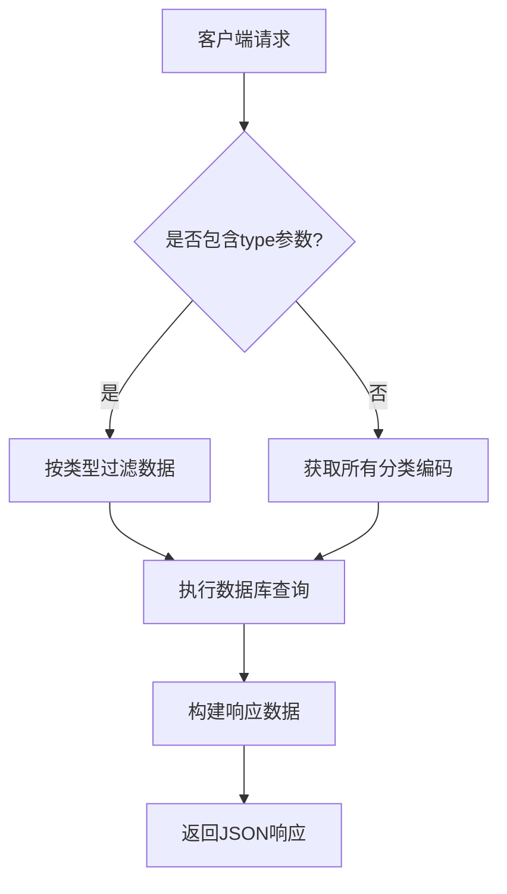
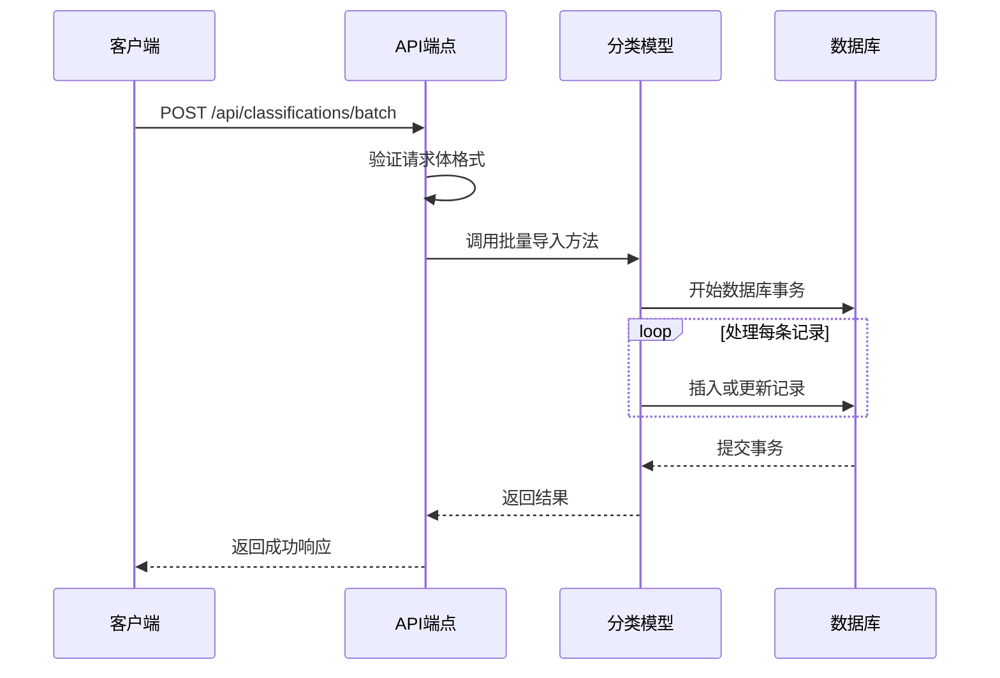
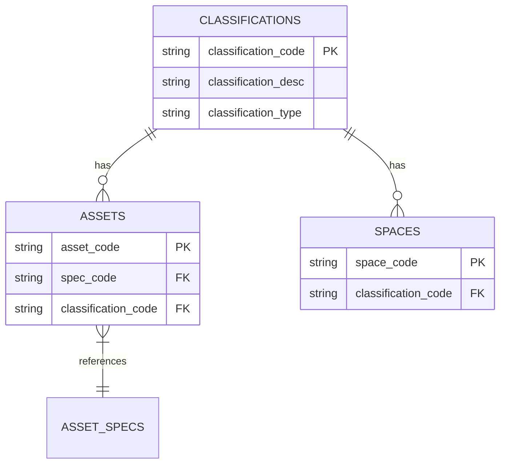
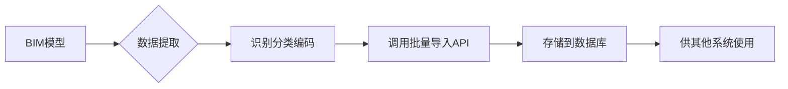

# 分类编码API

<cite>
**本文档引用的文件**   
- [api.js](file://server/routes/api.js)
- [classification.js](file://server/models/classification.js)
- [schema.sql](file://server/db/schema.sql)
- [postgres.js](file://src/services/postgres.js)
- [README.md](file://server/README.md)
</cite>

## 目录
1. [简介](#简介)
2. [API端点](#api端点)
3. [GET /api/classifications](#get-apiclassifications)
4. [POST /api/classifications/batch](#post-apiclassificationsbatch)
5. [数据结构与关联](#数据结构与关联)
6. [使用场景](#使用场景)
7. [错误处理](#错误处理)
8. [示例](#示例)

## 简介
分类编码API是Tandem系统的核心数据管理接口之一，用于管理和获取资产与空间的分类编码信息。该API支持通过OmniClass标准对建筑资产和空间进行分类，为后续的数据分析、报表生成和系统集成提供基础支持。API设计遵循RESTful原则，提供获取和批量导入分类编码的功能，确保系统数据的完整性和一致性。

**Section sources**
- [README.md](file://server/README.md#L1-L187)

## API端点
分类编码API提供两个主要端点：
- `GET /api/classifications`：获取所有分类编码，支持按类型过滤
- `POST /api/classifications/batch`：批量导入分类编码数据

这些端点与其他数据管理API（如资产、空间和资产规格API）协同工作，构成完整的数据初始化和同步体系。

**Section sources**
- [api.js](file://server/routes/api.js#L18-L47)

## GET /api/classifications
### 功能说明
该端点用于获取系统中存储的所有分类编码信息。通过可选的查询参数`type`，可以过滤特定类型的分类编码。

### 查询参数
- `type`（可选）：分类类型，支持以下值：
  - `asset`：仅返回资产相关的分类编码
  - `space`：仅返回空间相关的分类编码
  - 不提供此参数时返回所有分类编码

### 响应格式
成功响应返回JSON格式数据，包含`success`标志和`data`数组，数组中每个对象代表一个分类编码记录。



**Diagram sources**
- [api.js](file://server/routes/api.js#L22-L30)
- [classification.js](file://server/models/classification.js#L87-L99)

**Section sources**
- [api.js](file://server/routes/api.js#L18-L30)
- [classification.js](file://server/models/classification.js#L87-L99)

## POST /api/classifications/batch
### 功能说明
该端点用于批量导入分类编码数据，支持一次性导入多条记录，提高数据初始化效率。

### 请求体格式
请求体必须是JSON格式，包含`classifications`数组，数组中每个对象包含以下字段：
- `classificationCode`：分类编码（必填）
- `classificationDesc`：分类描述（可选）
- `classificationType`：分类类型，值为`asset`或`space`（必填）

### 处理逻辑
系统会对每条记录进行验证和去重处理，确保数据的完整性和一致性。如果记录已存在，则进行更新操作；如果不存在，则插入新记录。



**Diagram sources**
- [api.js](file://server/routes/api.js#L36-L47)
- [classification.js](file://server/models/classification.js#L35-L81)

**Section sources**
- [api.js](file://server/routes/api.js#L32-L47)
- [classification.js](file://server/models/classification.js#L35-L81)

## 数据结构与关联
### 数据库表结构
分类编码数据存储在`classifications`表中，主要字段包括：
- `classification_code`：分类编码
- `classification_desc`：分类描述
- `classification_type`：分类类型（asset|space）

### 系统关联
分类编码与以下系统组件紧密关联：
- **资产数据**：资产记录通过`classification_code`字段关联到相应的分类编码
- **空间数据**：空间记录通过`classification_code`字段关联到相应的分类编码
- **资产规格**：资产规格记录也包含分类编码信息，用于统一管理



**Diagram sources**
- [schema.sql](file://server/db/schema.sql#L8-L16)
- [README.md](file://server/README.md#L7-L15)

**Section sources**
- [schema.sql](file://server/db/schema.sql#L8-L16)
- [README.md](file://server/README.md#L7-L15)

## 使用场景
### 数据初始化
在系统初次部署或新项目启动时，通过批量导入接口快速初始化分类编码数据，为后续的资产和空间管理奠定基础。

### 数据同步
当上游系统（如BIM模型）的分类标准更新时，通过此API同步最新的分类编码，确保系统间数据的一致性。

### 模型数据提取
在从3D模型提取数据的过程中，自动识别并导入资产和空间的分类编码，实现模型数据与管理系统的信息联动。



**Diagram sources**
- [api.js](file://server/routes/api.js#L302-L464)
- [postgres.js](file://src/services/postgres.js#L149-L165)

**Section sources**
- [api.js](file://server/routes/api.js#L302-L464)
- [postgres.js](file://src/services/postgres.js#L149-L165)

## 错误处理
### 错误响应格式
所有错误响应均返回JSON格式，包含`success: false`和`error`消息字段。

### 常见错误码
- `400 Bad Request`：请求格式错误，如`classifications`不是数组
- `500 Internal Server Error`：服务器内部错误，如数据库连接失败

### 错误处理策略
系统采用分层错误处理机制：
1. API层进行基本的输入验证
2. 业务逻辑层处理数据一致性问题
3. 数据访问层处理数据库操作异常

**Section sources**
- [api.js](file://server/routes/api.js#L27-L29)
- [api.js](file://server/routes/api.js#L44-L46)

## 示例
### GET请求示例
获取所有资产分类编码：
```
GET /api/classifications?type=asset
```

响应：
```json
{
  "success": true,
  "data": [
    {
      "id": 1,
      "classification_code": "21-01 10 10",
      "classification_desc": "HVAC Equipment",
      "classification_type": "asset",
      "created_at": "2024-01-01T00:00:00Z",
      "updated_at": "2024-01-01T00:00:00Z"
    }
  ]
}
```

### POST请求示例
批量导入分类编码：
```json
{
  "classifications": [
    {
      "classificationCode": "21-01 10 10",
      "classificationDesc": "HVAC Equipment",
      "classificationType": "asset"
    },
    {
      "classificationCode": "13-11 00 00",
      "classificationDesc": "Office Space",
      "classificationType": "space"
    }
  ]
}
```

成功响应：
```json
{
  "success": true,
  "message": "成功导入 2 条分类编码"
}
```

错误响应（400）：
```json
{
  "success": false,
  "error": "请提供 classifications 数组"
}
```

错误响应（500）：
```json
{
  "success": false,
  "error": "数据库连接失败"
}
```

**Section sources**
- [api.js](file://server/routes/api.js#L22-L47)
- [classification.js](file://server/models/classification.js#L35-L81)