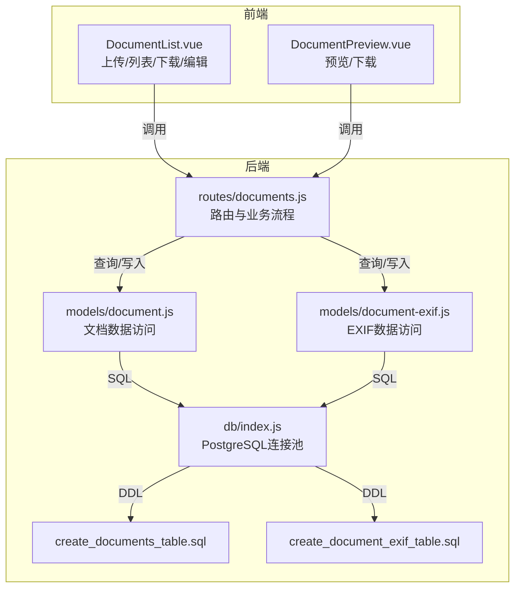
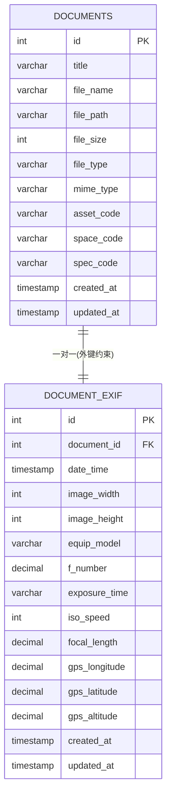
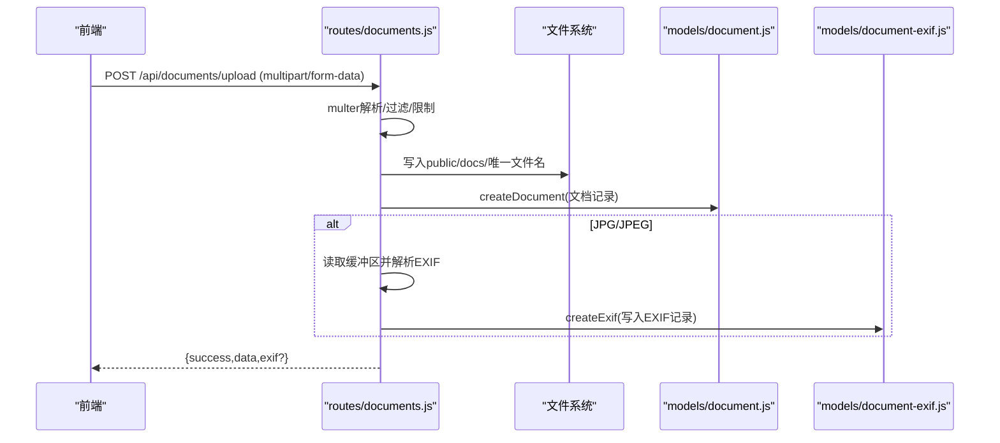
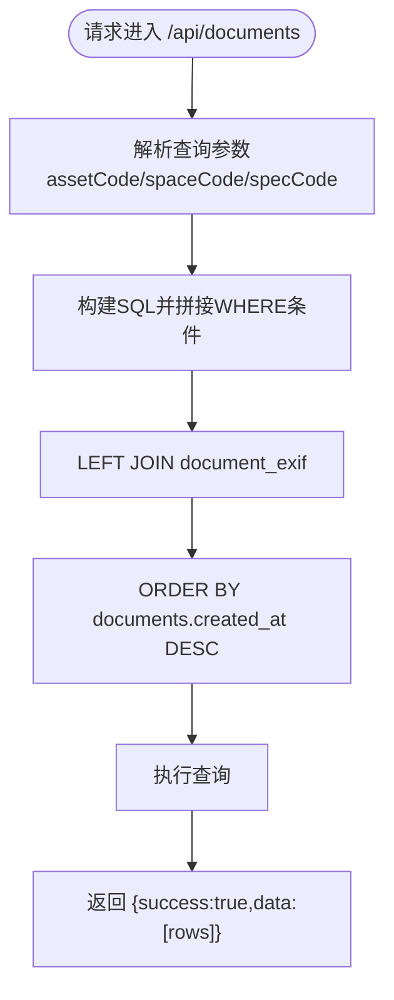
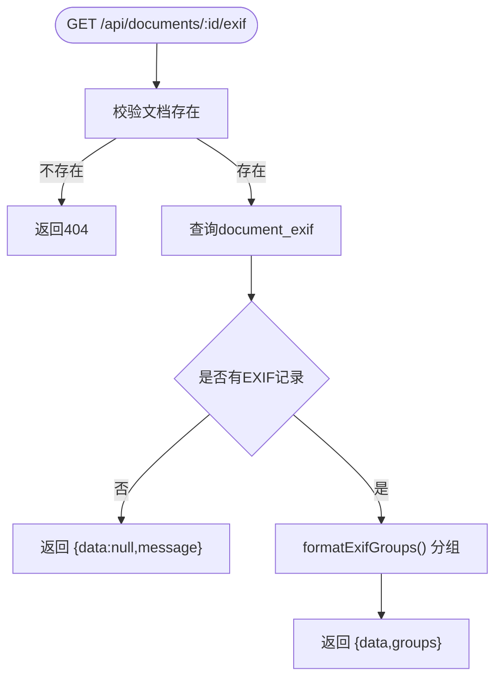
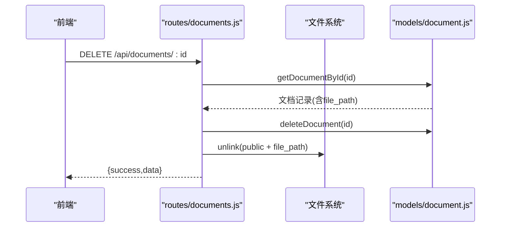
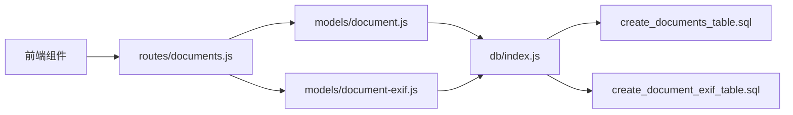

# 文档管理API

<cite>
**本文引用的文件**
- [server/routes/documents.js](file://server/routes/documents.js)
- [server/models/document.js](file://server/models/document.js)
- [server/models/document-exif.js](file://server/models/document-exif.js)
- [server/db/create_documents_table.sql](file://server/db/create_documents_table.sql)
- [server/db/create_document_exif_table.sql](file://server/db/create_document_exif_table.sql)
- [server/db/index.js](file://server/db/index.js)
- [src/components/DocumentList.vue](file://src/components/DocumentList.vue)
- [src/components/DocumentPreview.vue](file://src/components/DocumentPreview.vue)
</cite>

## 目录
1. [简介](#简介)
2. [项目结构](#项目结构)
3. [核心组件](#核心组件)
4. [架构总览](#架构总览)
5. [详细组件分析](#详细组件分析)
6. [依赖分析](#依赖分析)
7. [性能考虑](#性能考虑)
8. [故障排查指南](#故障排查指南)
9. [结论](#结论)
10. [附录](#附录)

## 简介
本文件面向后端与前端开发者，系统性梳理“文档管理API”的全生命周期能力，包括：
- 文件上传：POST /api/documents/upload 的 multer 配置、文件名安全策略、EXIF 自动提取流程
- 列表查询：GET /api/documents 的关联查询参数（assetCode/spaceCode/specCode）
- 详情获取：GET /api/documents/:id
- 更新标题：PUT /api/documents/:id
- 删除文档：DELETE /api/documents/:id（级联逻辑：先删数据库记录，再删物理文件）
- 下载文档：GET /api/documents/:id/download（流式处理）
- EXIF 查询与分组：GET /api/documents/:id/exif 的分组结构

本文件还结合前端组件展示如何在UI中调用上述接口，帮助快速集成与调试。

## 项目结构
后端采用 Express + PostgreSQL，文档管理API位于 server/routes/documents.js，数据访问层位于 server/models/document.js 与 server/models/document-exif.js；数据库表结构定义于 server/db 目录下的建表脚本；前端通过 Vue 组件调用 API。

图表来源
- [server/routes/documents.js](file://server/routes/documents.js#L1-L386)
- [server/models/document.js](file://server/models/document.js#L1-L163)
- [server/models/document-exif.js](file://server/models/document-exif.js#L1-L169)
- [server/db/index.js](file://server/db/index.js#L1-L70)
- [server/db/create_documents_table.sql](file://server/db/create_documents_table.sql#L1-L49)
- [server/db/create_document_exif_table.sql](file://server/db/create_document_exif_table.sql#L1-L48)

章节来源
- [server/routes/documents.js](file://server/routes/documents.js#L1-L386)
- [server/models/document.js](file://server/models/document.js#L1-L163)
- [server/models/document-exif.js](file://server/models/document-exif.js#L1-L169)
- [server/db/create_documents_table.sql](file://server/db/create_documents_table.sql#L1-L49)
- [server/db/create_document_exif_table.sql](file://server/db/create_document_exif_table.sql#L1-L48)
- [server/db/index.js](file://server/db/index.js#L1-L70)

## 核心组件
- 路由层（Express）：负责接收请求、校验参数、调用模型层、返回JSON响应
- 模型层（数据访问）：封装SQL，提供创建、查询、更新、删除等方法
- 数据库层（PostgreSQL）：提供连接池、查询执行、事务支持
- 前端组件：负责调用API、展示列表、上传队列、预览与下载

章节来源
- [server/routes/documents.js](file://server/routes/documents.js#L1-L386)
- [server/models/document.js](file://server/models/document.js#L1-L163)
- [server/models/document-exif.js](file://server/models/document-exif.js#L1-L169)
- [server/db/index.js](file://server/db/index.js#L1-L70)
- [src/components/DocumentList.vue](file://src/components/DocumentList.vue#L1-L555)
- [src/components/DocumentPreview.vue](file://src/components/DocumentPreview.vue#L1-L370)

## 架构总览
文档管理API围绕“文档记录 + EXIF元数据”两条主线展开：
- 文档记录表 documents：存储文件元信息与关联对象（资产/空间/规格）三选一
- EXIF 表 document_exif：一对一关联 documents，存储图像EXIF字段（文件组/相机组/GPS组）

图表来源
- [server/db/create_documents_table.sql](file://server/db/create_documents_table.sql#L1-L49)
- [server/db/create_document_exif_table.sql](file://server/db/create_document_exif_table.sql#L1-L48)

章节来源
- [server/db/create_documents_table.sql](file://server/db/create_documents_table.sql#L1-L49)
- [server/db/create_document_exif_table.sql](file://server/db/create_document_exif_table.sql#L1-L48)

## 详细组件分析

### POST /api/documents/upload：multer文件处理、安全策略与EXIF提取
- multer配置
  - 目录：public/docs，自动创建
  - 文件名：时间戳+随机串，避免冲突与注入风险
  - 过滤器：仅允许 PDF/JPG/JPEG/PNG/SVG/MP4
  - 限制：单文件最大200MB
- 文件名安全策略
  - 修复中文文件名编码问题：multer以latin1存储UTF-8文件名，服务端尝试转回UTF-8
  - 生成唯一文件名，避免路径遍历与同名覆盖
- EXIF自动提取（仅JPG/JPEG）
  - 读取二进制缓冲区，解析标签与图像尺寸
  - 日期时间：优先原拍摄时间，其次创建时间
  - GPS坐标：经度/纬度/海拔
  - 曝光时间：小于1s时格式化为分数形式
  - 成功后写入 document_exif，若已存在则ON CONFLICT更新
- 错误处理
  - 无文件/无关联对象：删除临时文件并返回400
  - 上传失败：删除已上传文件并返回500

图表来源
- [server/routes/documents.js](file://server/routes/documents.js#L146-L215)
- [server/models/document.js](file://server/models/document.js#L55-L78)
- [server/models/document-exif.js](file://server/models/document-exif.js#L12-L69)

章节来源
- [server/routes/documents.js](file://server/routes/documents.js#L16-L65)
- [server/routes/documents.js](file://server/routes/documents.js#L146-L215)
- [server/models/document-exif.js](file://server/models/document-exif.js#L70-L169)

### GET /api/documents：关联查询参数与EXIF关联
- 查询参数
  - assetCode：按资产编码过滤
  - spaceCode：按空间编码过滤
  - specCode：按规格编码过滤
- 返回结构
  - documents表字段 + document_exif表字段（LEFT JOIN），便于前端直接渲染
- 前端调用示例
  - DocumentList.vue 在 watch 中根据 props 的 assetCode/spaceCode/specCode 拼接查询参数并发起请求

图表来源
- [server/routes/documents.js](file://server/routes/documents.js#L217-L237)
- [server/models/document-exif.js](file://server/models/document-exif.js#L95-L128)

章节来源
- [server/routes/documents.js](file://server/routes/documents.js#L217-L237)
- [server/models/document-exif.js](file://server/models/document-exif.js#L95-L128)
- [src/components/DocumentList.vue](file://src/components/DocumentList.vue#L261-L283)

### GET /api/documents/:id：详情获取
- 依据ID查询 documents 表
- 若不存在返回404
- 成功返回文档详情

章节来源
- [server/routes/documents.js](file://server/routes/documents.js#L240-L257)
- [server/models/document.js](file://server/models/document.js#L37-L48)

### GET /api/documents/:id/exif：EXIF分组结构
- 先验证文档存在，再查询 document_exif
- 若无EXIF返回null并提示“该文档没有EXIF信息”
- 格式化为三组结构：文件(File)、照相机(Camera)、GPS
  - 文件组：拍摄时间、图像宽高
  - 照相机组：设备型号、光圈、曝光时间、ISO、焦距
  - GPS组：经度、纬度、海拔

图表来源
- [server/routes/documents.js](file://server/routes/documents.js#L259-L292)
- [server/models/document-exif.js](file://server/models/document-exif.js#L130-L166)

章节来源
- [server/routes/documents.js](file://server/routes/documents.js#L259-L292)
- [server/models/document-exif.js](file://server/models/document-exif.js#L130-L166)

### PUT /api/documents/:id：更新标题
- 校验标题非空
- 更新 documents.title 并返回最新记录

章节来源
- [server/routes/documents.js](file://server/routes/documents.js#L294-L319)
- [server/models/document.js](file://server/models/document.js#L80-L96)

### DELETE /api/documents/:id：删除与级联逻辑
- 先查询文档以定位物理文件路径
- 删除数据库记录（documents）
- 删除物理文件（public + file_path）
- 即使删除文件失败也不影响数据库记录删除（日志记录错误）

图表来源
- [server/routes/documents.js](file://server/routes/documents.js#L321-L353)
- [server/models/document.js](file://server/models/document.js#L98-L110)

章节来源
- [server/routes/documents.js](file://server/routes/documents.js#L321-L353)
- [server/models/document.js](file://server/models/document.js#L98-L110)

### GET /api/documents/:id/download：下载与流式处理
- 校验文档存在
- 检查物理文件是否存在
- 使用 res.download(file_path, originalName) 流式传输

章节来源
- [server/routes/documents.js](file://server/routes/documents.js#L355-L383)

## 依赖分析
- 路由依赖模型层：上传/查询/更新/删除/下载均委托至 models/document.js 与 models/document-exif.js
- 模型层依赖数据库连接池：db/index.js 提供 query 与 getClient
- 数据库层依赖建表脚本：documents 与 document_exif 的结构与约束
- 前端依赖路由：DocumentList.vue 与 DocumentPreview.vue 通过 fetch/XMLHttpRequest 调用后端API

图表来源
- [server/routes/documents.js](file://server/routes/documents.js#L1-L386)
- [server/models/document.js](file://server/models/document.js#L1-L163)
- [server/models/document-exif.js](file://server/models/document-exif.js#L1-L169)
- [server/db/index.js](file://server/db/index.js#L1-L70)
- [server/db/create_documents_table.sql](file://server/db/create_documents_table.sql#L1-L49)
- [server/db/create_document_exif_table.sql](file://server/db/create_document_exif_table.sql#L1-L48)

章节来源
- [server/routes/documents.js](file://server/routes/documents.js#L1-L386)
- [server/models/document.js](file://server/models/document.js#L1-L163)
- [server/models/document-exif.js](file://server/models/document-exif.js#L1-L169)
- [server/db/index.js](file://server/db/index.js#L1-L70)
- [server/db/create_documents_table.sql](file://server/db/create_documents_table.sql#L1-L49)
- [server/db/create_document_exif_table.sql](file://server/db/create_document_exif_table.sql#L1-L48)

## 性能考虑
- 列表查询
  - documents 表对 asset_code/space_code/spec_code/created_at 建有索引，建议前端按需传参，避免全表扫描
- EXIF查询
  - getDocumentsWithExif 使用 LEFT JOIN，注意数据量较大时的排序与分页需求（当前实现未分页）
- 文件上传
  - 200MB限制，建议前端在上传前进行本地校验与提示
- 下载
  - res.download 为流式传输，适合大文件；建议配合缓存与CDN优化

章节来源
- [server/db/create_documents_table.sql](file://server/db/create_documents_table.sql#L32-L37)
- [server/models/document-exif.js](file://server/models/document-exif.js#L95-L128)
- [server/routes/documents.js](file://server/routes/documents.js#L16-L65)

## 故障排查指南
- 上传失败
  - 检查文件类型与大小限制
  - 确认 public/docs 目录可写
  - 查看服务端日志中的错误堆栈
- 无关联对象
  - 必须提供 assetCode/spaceCode/specCode 三选一，否则返回400并删除已上传文件
- EXIF为空
  - 仅JPG/JPEG支持EXIF提取；其他格式不会写入EXIF记录
- 删除后仍可见
  - 确认物理文件已被删除；若删除失败，数据库记录已删除但仍残留文件
- 下载404
  - 检查文档记录的 file_path 是否正确；确认文件确实存在于 public 目录

章节来源
- [server/routes/documents.js](file://server/routes/documents.js#L146-L215)
- [server/routes/documents.js](file://server/routes/documents.js#L321-L353)
- [server/routes/documents.js](file://server/routes/documents.js#L355-L383)

## 结论
文档管理API以清晰的职责划分实现了从上传、存储、查询、更新、删除到下载的完整闭环。通过EXIF自动提取与分组展示，提升了图像类文档的元数据利用价值。建议后续增强：
- 列表分页与筛选
- 删除失败的补偿机制（如重试删除物理文件）
- 前端上传进度与断点续传（当前为单文件上传）

## 附录

### API清单与参数说明
- POST /api/documents/upload
  - 表单字段：file（必填）、assetCode/spaceCode/specCode（三选一）、title（可选）
  - 返回：success、data（文档记录）、exif（可选）
- GET /api/documents
  - 查询参数：assetCode 或 spaceCode 或 specCode
  - 返回：success、data（文档列表，包含EXIF字段）
- GET /api/documents/:id
  - 返回：success、data（文档详情）
- GET /api/documents/:id/exif
  - 返回：success、data（原始EXIF）、groups（分组结构）
- PUT /api/documents/:id
  - 请求体：{ title }（必填）
  - 返回：success、data（更新后的文档）
- DELETE /api/documents/:id
  - 返回：success、data（删除结果）
- GET /api/documents/:id/download
  - 返回：文件流（res.download）

章节来源
- [server/routes/documents.js](file://server/routes/documents.js#L146-L383)
- [server/models/document-exif.js](file://server/models/document-exif.js#L95-L166)