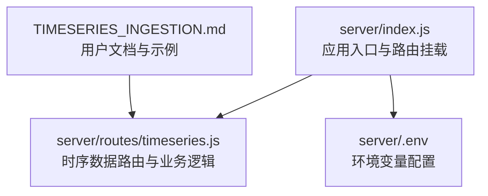
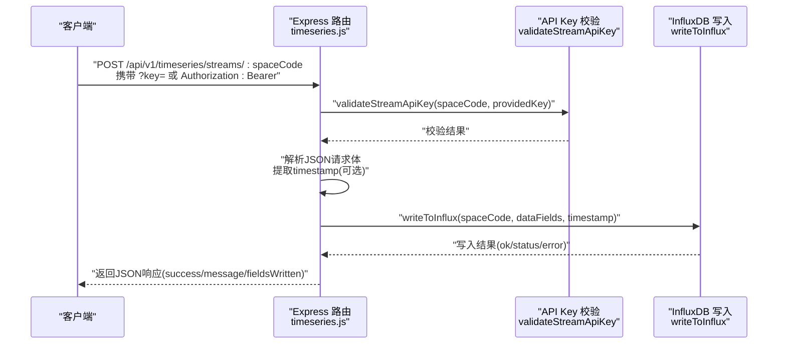
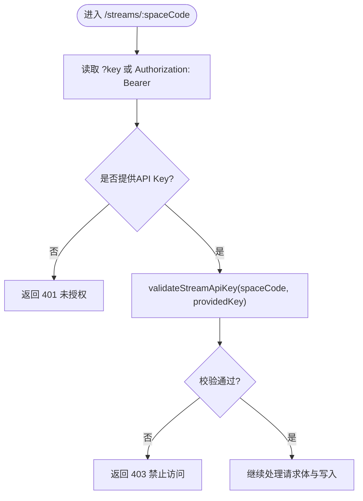
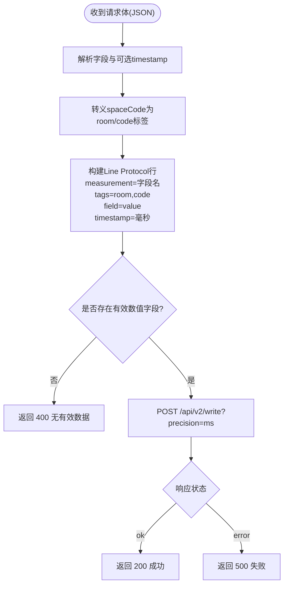
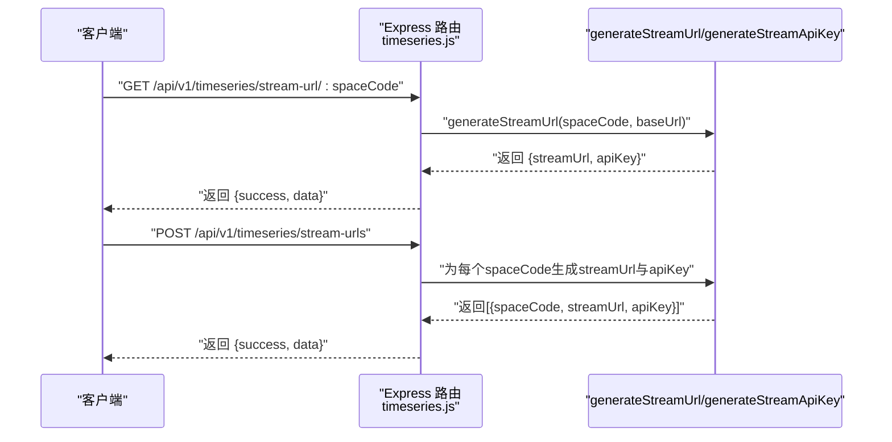
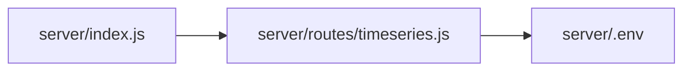

# 时序数据API

<cite>
**本文引用的文件**
- [server/index.js](file://server/index.js)
- [server/routes/timeseries.js](file://server/routes/timeseries.js)
- [server/.env](file://server/.env)
- [TIMESERIES_INGESTION.md](file://TIMESERIES_INGESTION.md)
</cite>

## 目录
1. [简介](#简介)
2. [项目结构](#项目结构)
3. [核心组件](#核心组件)
4. [架构总览](#架构总览)
5. [详细组件分析](#详细组件分析)
6. [依赖分析](#依赖分析)
7. [性能考虑](#性能考虑)
8. [故障排查指南](#故障排查指南)
9. [结论](#结论)
10. [附录](#附录)

## 简介
本文件为“时序数据接入API”的权威文档，聚焦以下关键能力：
- POST /api/v1/timeseries/streams/:spaceCode：接收外部系统推送的JSON格式时序数据，支持基于HMAC的API Key认证（查询参数?key=xxx或请求头Authorization: Bearer xxx），并将数据转换为InfluxDB Line Protocol写入时序数据库。
- GET /api/v1/timeseries/stream-url/:spaceCode：返回单个空间的安全推送URL及对应API Key。
- POST /api/v1/timeseries/stream-urls：批量生成多个空间的安全推送URL与API Key。
- 数据写入InfluxDB的Line Protocol转换逻辑与timestamp字段处理策略。

本文件面向开发者与运维人员，既提供高层概览，也给出代码级的实现细节与可视化图表，帮助快速理解与正确使用。

## 项目结构
时序数据API位于后端Express服务中，通过路由模块集中管理。主入口负责挂载路由与中间件；时序路由模块实现具体业务逻辑；环境变量提供InfluxDB与API Key密钥种子等配置。

**图表来源**
- [server/index.js](file://server/index.js#L43-L49)
- [server/routes/timeseries.js](file://server/routes/timeseries.js#L1-L263)
- [server/.env](file://server/.env#L1-L19)
- [TIMESERIES_INGESTION.md](file://TIMESERIES_INGESTION.md#L1-L144)

**章节来源**
- [server/index.js](file://server/index.js#L43-L49)
- [server/routes/timeseries.js](file://server/routes/timeseries.js#L1-L263)
- [server/.env](file://server/.env#L1-L19)
- [TIMESERIES_INGESTION.md](file://TIMESERIES_INGESTION.md#L1-L144)

## 核心组件
- 认证与URL生成
  - generateStreamApiKey：基于空间编码与服务器密钥生成固定长度的URL安全Base64字符串作为API Key。
  - validateStreamApiKey：对提供的API Key进行恒时比较，确保认证过程抗时序攻击。
  - generateStreamUrl：拼装完整Stream URL，包含spaceCode与API Key查询参数。
- 数据写入
  - writeToInflux：将JSON数据转换为Line Protocol，写入InfluxDB。
- 路由与接口
  - POST /api/v1/timeseries/streams/:spaceCode：接收数据并执行认证与写入。
  - GET /api/v1/timeseries/stream-url/:spaceCode：返回单个空间的Stream URL与API Key。
  - POST /api/v1/timeseries/stream-urls：批量返回多个空间的Stream URL与API Key。

**章节来源**
- [server/routes/timeseries.js](file://server/routes/timeseries.js#L23-L49)
- [server/routes/timeseries.js](file://server/routes/timeseries.js#L54-L104)
- [server/routes/timeseries.js](file://server/routes/timeseries.js#L125-L206)
- [server/routes/timeseries.js](file://server/routes/timeseries.js#L208-L260)

## 架构总览
下图展示从客户端到后端路由、认证校验、数据转换与InfluxDB写入的整体流程。

**图表来源**
- [server/routes/timeseries.js](file://server/routes/timeseries.js#L125-L206)
- [server/routes/timeseries.js](file://server/routes/timeseries.js#L54-L104)

## 详细组件分析

### 认证与API Key机制
- 密钥生成
  - generateStreamApiKey：使用HMAC-SHA256对spaceCode进行签名，输出URL安全的Base64编码（截取22字符），作为API Key。
  - API_KEY_SECRET来自环境变量，建议在生产环境替换默认值。
- 请求头与查询参数
  - 支持两种传递方式：
    - 查询参数：?key=xxx
    - 请求头：Authorization: Bearer xxx
  - 若两者均未提供，返回401；若格式不合法或校验失败，返回403。
- 安全性
  - validateStreamApiKey采用恒时比较，避免时序攻击。
  - API Key与spaceCode绑定，不同空间的Key不同，降低横向越权风险。

**图表来源**
- [server/routes/timeseries.js](file://server/routes/timeseries.js#L125-L159)

**章节来源**
- [server/routes/timeseries.js](file://server/routes/timeseries.js#L16-L28)
- [server/routes/timeseries.js](file://server/routes/timeseries.js#L23-L49)
- [server/routes/timeseries.js](file://server/routes/timeseries.js#L125-L159)
- [server/.env](file://server/.env#L17-L19)

### 数据写入与Line Protocol转换
- 输入数据
  - 请求体为JSON对象，键名为字段名，值为数值；可包含可选的timestamp（毫秒）。
- 时间戳处理
  - 若请求体包含timestamp字段，使用其值；否则回退到当前时间戳。
  - 写入时统一以毫秒精度precision=ms提交。
- Line Protocol转换
  - measurement固定为字段名（便于查询）。
  - tag包含room与code，值均为spaceCode（并对逗号、等号、空格进行转义为下划线）。
  - field为value=数值。
  - timestamp为毫秒时间戳。
- 写入行为
  - 当INFLUX_TOKEN未配置时，返回503提示未配置。
  - 当无有效数值字段时，返回400提示无效数据。
  - 写入成功返回200，失败返回500并附带错误信息。

**图表来源**
- [server/routes/timeseries.js](file://server/routes/timeseries.js#L54-L104)

**章节来源**
- [server/routes/timeseries.js](file://server/routes/timeseries.js#L160-L174)
- [server/routes/timeseries.js](file://server/routes/timeseries.js#L54-L104)

### 辅助接口：生成安全推送URL
- GET /api/v1/timeseries/stream-url/:spaceCode
  - 返回当前主机地址下的完整Stream URL与对应的API Key。
- POST /api/v1/timeseries/stream-urls
  - 请求体：{ spaceCodes: ["SPACE_001", "SPACE_002"] }
  - 返回每个空间的streamUrl与apiKey组成的数组。

**图表来源**
- [server/routes/timeseries.js](file://server/routes/timeseries.js#L208-L260)
- [server/routes/timeseries.js](file://server/routes/timeseries.js#L41-L49)

**章节来源**
- [server/routes/timeseries.js](file://server/routes/timeseries.js#L208-L260)
- [server/routes/timeseries.js](file://server/routes/timeseries.js#L41-L49)

## 依赖分析
- 应用入口与路由挂载
  - server/index.js将/api/v1/timeseries挂载至timeseries路由模块。
- 认证与URL生成
  - timeseries路由模块内定义generateStreamApiKey、validateStreamApiKey、generateStreamUrl。
- 数据写入
  - writeToInflux依赖INFLUX_URL、INFLUX_ORG、INFLUX_BUCKET、INFLUX_TOKEN等环境变量。
- 配置
  - server/.env提供INFLUX_*与API_KEY_SECRET。

**图表来源**
- [server/index.js](file://server/index.js#L43-L49)
- [server/routes/timeseries.js](file://server/routes/timeseries.js#L1-L20)
- [server/.env](file://server/.env#L11-L19)

**章节来源**
- [server/index.js](file://server/index.js#L43-L49)
- [server/routes/timeseries.js](file://server/routes/timeseries.js#L1-L20)
- [server/.env](file://server/.env#L11-L19)

## 性能考虑
- 单次写入多字段
  - 请求体中的每个数值字段都会生成一条Line Protocol行，建议按需发送，避免冗余字段。
- 时间戳一致性
  - 若设备端时间戳不稳定，建议后端回退到服务端时间戳，保持时序一致性。
- 并发与限流
  - 可在网关或反向代理层对/api/v1/timeseries/streams/:spaceCode增加速率限制，防止突发流量冲击InfluxDB。
- InfluxDB写入
  - 确保INFLUX_TOKEN配置正确，避免因网络或鉴权问题导致写入失败重试。

[本节为通用指导，无需特定文件引用]

## 故障排查指南
- 401 未授权
  - 确认请求是否携带?key=xxx或Authorization: Bearer xxx。
  - 检查spaceCode是否与API Key匹配。
- 403 禁止访问
  - API Key格式或内容不合法，或与spaceCode不匹配。
  - 检查API_KEY_SECRET是否一致。
- 400 请求体无效
  - 请求体必须为非空JSON对象，且至少包含一个数值字段；timestamp需为整数毫秒。
- 500 写入失败
  - 查看InfluxDB响应状态与错误文本，确认网络连通性与令牌权限。
- 503 未配置
  - INFLUX_TOKEN未配置，无法写入。

**章节来源**
- [server/routes/timeseries.js](file://server/routes/timeseries.js#L138-L200)
- [server/routes/timeseries.js](file://server/routes/timeseries.js#L92-L104)

## 结论
本API通过HMAC生成的短期API Key与严格的认证流程，结合Line Protocol的高效写入，为外部系统提供了安全、稳定的时序数据接入能力。配合辅助接口，可快速生成与批量管理安全推送URL，满足多空间场景下的数据采集需求。

[本节为总结，无需特定文件引用]

## 附录

### API定义与使用要点
- POST /api/v1/timeseries/streams/:spaceCode
  - 认证方式：查询参数?key=xxx或Authorization: Bearer xxx
  - 请求体：JSON对象，键为字段名，值为数值；可包含可选timestamp（毫秒）
  - 响应：success、message、spaceCode、fieldsWritten
- GET /api/v1/timeseries/stream-url/:spaceCode
  - 响应：包含streamUrl与apiKey
- POST /api/v1/timeseries/stream-urls
  - 请求体：{ spaceCodes: [...] }
  - 响应：每个spaceCode对应的streamUrl与apiKey

**章节来源**
- [server/routes/timeseries.js](file://server/routes/timeseries.js#L125-L206)
- [server/routes/timeseries.js](file://server/routes/timeseries.js#L208-L260)
- [TIMESERIES_INGESTION.md](file://TIMESERIES_INGESTION.md#L16-L67)

### 配置清单
- INFLUX_URL、INFLUX_ORG、INFLUX_BUCKET、INFLUX_TOKEN：InfluxDB写入所需
- API_KEY_SECRET：生成API Key的密钥种子

**章节来源**
- [server/.env](file://server/.env#L11-L19)