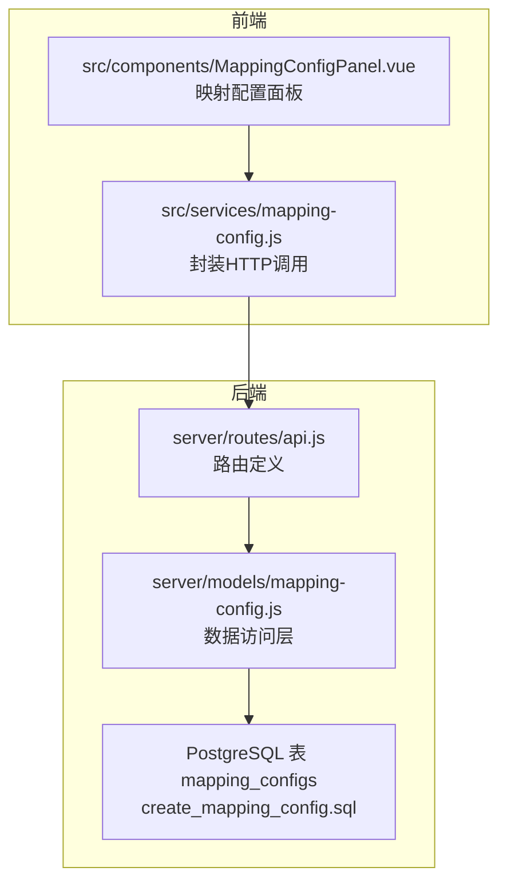
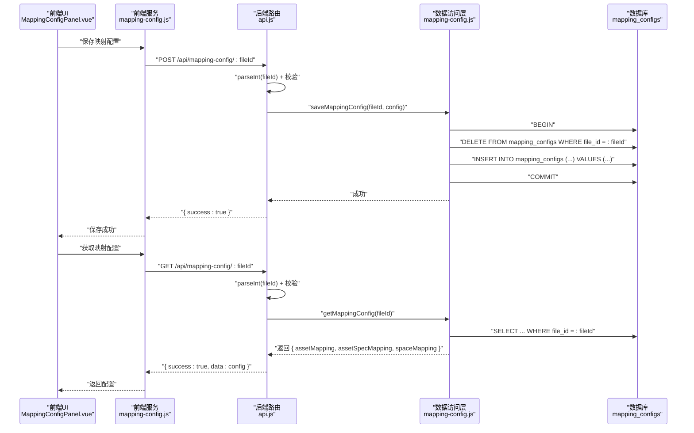
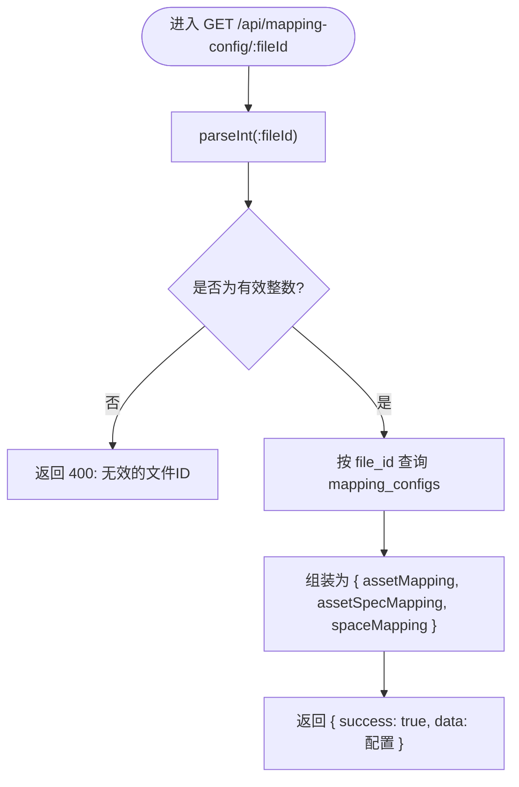
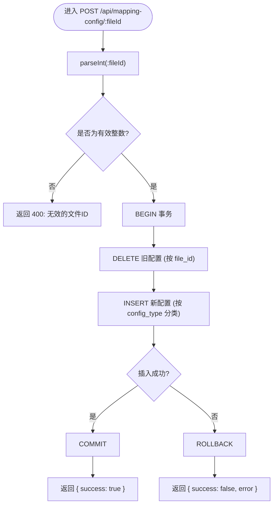
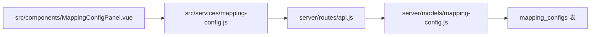

# 映射配置API

<cite>
**本文引用的文件**
- [server/routes/api.js](file://server/routes/api.js)
- [server/models/mapping-config.js](file://server/models/mapping-config.js)
- [src/services/mapping-config.js](file://src/services/mapping-config.js)
- [server/db/migrations/create_mapping_config.sql](file://server/db/migrations/create_mapping_config.sql)
- [MAPPING_CONFIG_IMPLEMENTATION.md](file://MAPPING_CONFIG_IMPLEMENTATION.md)
- [src/components/MappingConfigPanel.vue](file://src/components/MappingConfigPanel.vue)
</cite>

## 目录
1. [简介](#简介)
2. [项目结构](#项目结构)
3. [核心组件](#核心组件)
4. [架构总览](#架构总览)
5. [详细组件分析](#详细组件分析)
6. [依赖分析](#依赖分析)
7. [性能考虑](#性能考虑)
8. [故障排查指南](#故障排查指南)
9. [结论](#结论)
10. [附录](#附录)

## 简介
本文件为“映射配置API”的参考文档，聚焦于以下两个端点：
- GET /api/mapping-config/:fileId：获取指定文件的字段映射配置
- POST /api/mapping-config/:fileId：保存指定文件的字段映射配置

文档将详细说明配置对象结构（包含 assetMapping、assetSpecMapping、spaceMapping 三个映射字典），解释每个字典如何将模型字段映射到系统属性；说明 fileId 参数的类型转换与验证逻辑；阐述保存操作的覆盖语义；并提供前端如何通过该API实现用户自定义字段映射的调用示例与最佳实践。

## 项目结构
该API位于后端路由模块中，对应的服务层负责读写数据库中的映射配置表；前端通过服务封装调用后端接口，并在UI中展示与编辑映射配置。

图表来源
- [server/routes/api.js](file://server/routes/api.js#L466-L517)
- [server/models/mapping-config.js](file://server/models/mapping-config.js#L1-L115)
- [src/services/mapping-config.js](file://src/services/mapping-config.js#L1-L102)
- [server/db/migrations/create_mapping_config.sql](file://server/db/migrations/create_mapping_config.sql#L1-L29)

章节来源
- [server/routes/api.js](file://server/routes/api.js#L466-L517)
- [server/models/mapping-config.js](file://server/models/mapping-config.js#L1-L115)
- [src/services/mapping-config.js](file://src/services/mapping-config.js#L1-L102)
- [server/db/migrations/create_mapping_config.sql](file://server/db/migrations/create_mapping_config.sql#L1-L29)

## 核心组件
- 路由层（server/routes/api.js）
  - 定义 GET /api/mapping-config/:fileId 与 POST /api/mapping-config/:fileId 两个端点
  - 对 fileId 进行 parseInt 并进行有效性校验（NaN则返回400）
  - GET 端点调用 getMappingConfig，POST 端点调用 saveMappingConfig
- 数据访问层（server/models/mapping-config.js）
  - getMappingConfig：按 file_id 查询 mapping_configs，组装为 { assetMapping, assetSpecMapping, spaceMapping }
  - saveMappingConfig：事务内先删除旧配置，再批量插入新配置
- 前端服务（src/services/mapping-config.js）
  - getMappingConfig：发起HTTP请求，解析响应，失败时返回空配置
  - saveMappingConfig：发起HTTP请求，解析响应，失败抛出异常
  - getDefaultMapping：提供默认映射配置，便于首次使用或回退
- 前端UI（src/components/MappingConfigPanel.vue）
  - 提供映射配置面板，支持资产、资产规格、空间三类映射的编辑与重置
  - 通过事件向上游传递保存结果，交由调用方决定是否调用后端保存

章节来源
- [server/routes/api.js](file://server/routes/api.js#L466-L517)
- [server/models/mapping-config.js](file://server/models/mapping-config.js#L1-L115)
- [src/services/mapping-config.js](file://src/services/mapping-config.js#L1-L102)
- [src/components/MappingConfigPanel.vue](file://src/components/MappingConfigPanel.vue#L1-L230)

## 架构总览
下图展示了从前端到后端再到数据库的整体调用链路与数据流向。

图表来源
- [server/routes/api.js](file://server/routes/api.js#L466-L517)
- [server/models/mapping-config.js](file://server/models/mapping-config.js#L1-L115)
- [src/services/mapping-config.js](file://src/services/mapping-config.js#L1-L102)

## 详细组件分析

### 配置对象结构与字段含义
- 配置对象包含三个映射字典：
  - assetMapping：将资产模型字段映射到系统属性
  - assetSpecMapping：将资产规格模型字段映射到系统属性
  - spaceMapping：将空间模型字段映射到系统属性
- 每个映射字典的条目为：
  - 键：模型字段名（例如 assetCode、specCode、name、floor、room 等）
  - 值：包含两个属性的对象
    - category：模型属性分类（字符串）
    - property：模型属性名称（字符串）

说明
- 上述字段名与分类、属性名来源于数据库表 mapping_configs 的字段定义与默认映射配置。
- 默认映射配置可参考前端服务中的默认值，用于首次使用或后端无配置时的回退。

章节来源
- [server/models/mapping-config.js](file://server/models/mapping-config.js#L17-L48)
- [src/services/mapping-config.js](file://src/services/mapping-config.js#L66-L102)

### GET /api/mapping-config/:fileId（获取配置）
- 功能：根据 file_id 获取该文件的映射配置
- 参数：
  - :fileId：路径参数，类型为字符串，后端会尝试转换为整数
- 类型转换与验证：
  - 后端使用 parseInt 对 :fileId 进行转换
  - 若转换结果为 NaN，则返回 400 并提示“无效的文件ID”
- 数据库查询：
  - 按 file_id 查询 mapping_configs 表
  - 将记录按 config_type（asset、asset_spec、space）归类，组装为 { assetMapping, assetSpecMapping, spaceMapping }
- 响应：
  - 成功时返回 { success: true, data: 配置对象 }
  - 失败时返回 { success: false, error: 错误信息 }

图表来源
- [server/routes/api.js](file://server/routes/api.js#L474-L487)
- [server/models/mapping-config.js](file://server/models/mapping-config.js#L17-L48)

章节来源
- [server/routes/api.js](file://server/routes/api.js#L474-L487)
- [server/models/mapping-config.js](file://server/models/mapping-config.js#L17-L48)

### POST /api/mapping-config/:fileId（保存配置）
- 功能：保存指定文件的映射配置
- 参数：
  - :fileId：路径参数，类型为字符串，后端会尝试转换为整数
  - 请求体：包含 assetMapping、assetSpecMapping、spaceMapping 三个映射字典
- 类型转换与验证：
  - 后端使用 parseInt 对 :fileId 进行转换
  - 若转换结果为 NaN，则返回 400 并提示“无效的文件ID”
- 保存逻辑（覆盖语义）：
  - 在同一事务中执行
  - 先删除该 file_id 下的所有旧映射记录
  - 再批量插入新的映射记录（按 config_type 分别处理）
- 响应：
  - 成功时返回 { success: true, message: "映射配置保存成功" }
  - 失败时返回 { success: false, error: 错误信息 }

图表来源
- [server/routes/api.js](file://server/routes/api.js#L494-L514)
- [server/models/mapping-config.js](file://server/models/mapping-config.js#L56-L114)

章节来源
- [server/routes/api.js](file://server/routes/api.js#L494-L514)
- [server/models/mapping-config.js](file://server/models/mapping-config.js#L56-L114)

### 前端调用示例与最佳实践
- 获取配置
  - 调用方式：调用前端服务的 getMappingConfig(fileId)
  - 行为：若后端返回失败或网络异常，前端会返回空配置（包含三个空字典），以便 UI 使用默认值
- 保存配置
  - 调用方式：调用前端服务的 saveMappingConfig(fileId, config)
  - 行为：将本地编辑后的映射配置对象传给后端；若后端返回失败，前端抛出异常，调用方可捕获并提示用户
- 默认映射
  - 前端提供 getDefaultMapping，包含资产、资产规格、空间三类的默认映射，便于首次使用或回退
- UI 集成
  - MappingConfigPanel.vue 提供映射配置面板，支持三类映射的编辑、重置与保存事件
  - 保存事件会向上游发出包含三个映射字典的对象，调用方可据此调用后端保存接口

章节来源
- [src/services/mapping-config.js](file://src/services/mapping-config.js#L1-L102)
- [src/components/MappingConfigPanel.vue](file://src/components/MappingConfigPanel.vue#L1-L230)
- [MAPPING_CONFIG_IMPLEMENTATION.md](file://MAPPING_CONFIG_IMPLEMENTATION.md#L1-L295)

## 依赖分析
- 路由依赖
  - server/routes/api.js 依赖 server/models/mapping-config.js 提供的 getMappingConfig/saveMappingConfig
- 数据访问层依赖
  - server/models/mapping-config.js 依赖 PostgreSQL 连接池与 mapping_configs 表
- 前端服务依赖
  - src/services/mapping-config.js 依赖后端 API（默认基地址为 http://localhost:3001/api）
- 前端UI依赖
  - src/components/MappingConfigPanel.vue 依赖前端服务提供的 getMappingConfig/saveMappingConfig 与默认映射

图表来源
- [server/routes/api.js](file://server/routes/api.js#L466-L517)
- [server/models/mapping-config.js](file://server/models/mapping-config.js#L1-L115)
- [src/services/mapping-config.js](file://src/services/mapping-config.js#L1-L102)
- [server/db/migrations/create_mapping_config.sql](file://server/db/migrations/create_mapping_config.sql#L1-L29)

章节来源
- [server/routes/api.js](file://server/routes/api.js#L466-L517)
- [server/models/mapping-config.js](file://server/models/mapping-config.js#L1-L115)
- [src/services/mapping-config.js](file://src/services/mapping-config.js#L1-L102)
- [server/db/migrations/create_mapping_config.sql](file://server/db/migrations/create_mapping_config.sql#L1-L29)

## 性能考虑
- 事务与批量插入
  - 保存配置采用事务包裹，先删除旧记录再批量插入，减少并发冲突与不一致风险
- 查询与索引
  - mapping_configs 表针对 file_id 与 config_type 建有索引，有利于按文件与类型快速检索
- 前端缓存策略
  - 前端服务在获取失败时返回空配置，避免重复请求；实际业务中可根据需要增加本地缓存策略

章节来源
- [server/models/mapping-config.js](file://server/models/mapping-config.js#L56-L114)
- [server/db/migrations/create_mapping_config.sql](file://server/db/migrations/create_mapping_config.sql#L1-L29)

## 故障排查指南
- 常见错误与处理
  - 无效的文件ID：当 :fileId 无法被 parseInt 转换为有效整数时，后端返回 400
  - 数据库连接或事务异常：保存配置时若发生错误，后端会回滚事务并返回 500
  - 前端网络异常：getMappingConfig 在网络失败时返回空配置，避免阻塞 UI
- 建议排查步骤
  - 确认 :fileId 是否为有效整数
  - 检查数据库连接与 mapping_configs 表是否存在
  - 查看后端日志中的错误堆栈
  - 在前端控制台确认 fetch 请求与响应

章节来源
- [server/routes/api.js](file://server/routes/api.js#L474-L514)
- [server/models/mapping-config.js](file://server/models/mapping-config.js#L56-L114)
- [src/services/mapping-config.js](file://src/services/mapping-config.js#L1-L102)

## 结论
- 该映射配置API通过简洁的请求体结构与明确的覆盖语义，实现了对资产、资产规格与空间三类模型字段的灵活映射管理
- 前后端职责清晰：前端负责交互与默认值回退，后端负责数据持久化与一致性保障
- 建议在生产环境中结合前端缓存与更完善的错误提示，提升用户体验与稳定性

## 附录

### API 定义摘要
- GET /api/mapping-config/:fileId
  - 路径参数：fileId（字符串，后端转换为整数）
  - 成功响应：{ success: true, data: { assetMapping, assetSpecMapping, spaceMapping } }
  - 失败响应：{ success: false, error: string }
- POST /api/mapping-config/:fileId
  - 路径参数：fileId（字符串，后端转换为整数）
  - 请求体：{ assetMapping, assetSpecMapping, spaceMapping }
  - 成功响应：{ success: true, message: string }
  - 失败响应：{ success: false, error: string }

章节来源
- [server/routes/api.js](file://server/routes/api.js#L474-L514)

### 数据库表结构要点
- mapping_configs 表
  - 字段：file_id、config_type、field_name、category、property
  - 约束：UNIQUE(file_id, config_type, field_name)
  - 索引：idx_mapping_configs_file_id、idx_mapping_configs_type

章节来源
- [server/db/migrations/create_mapping_config.sql](file://server/db/migrations/create_mapping_config.sql#L1-L29)