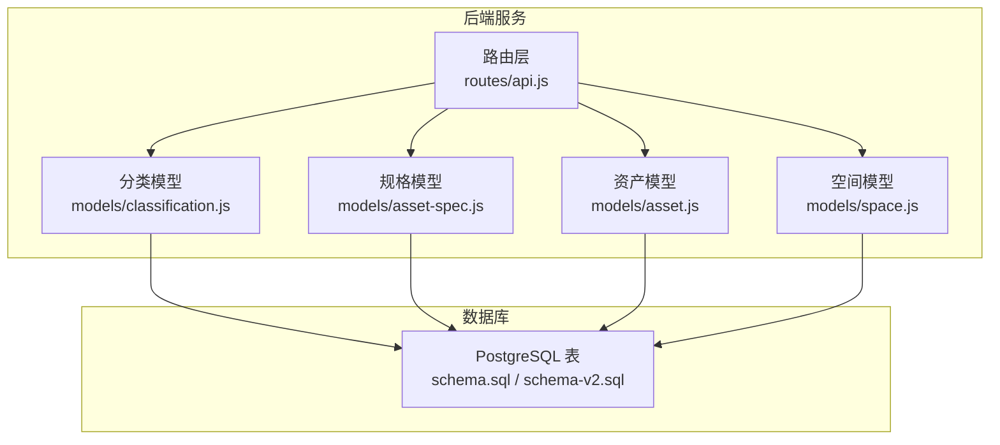
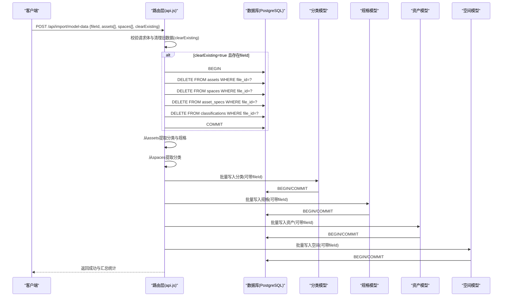
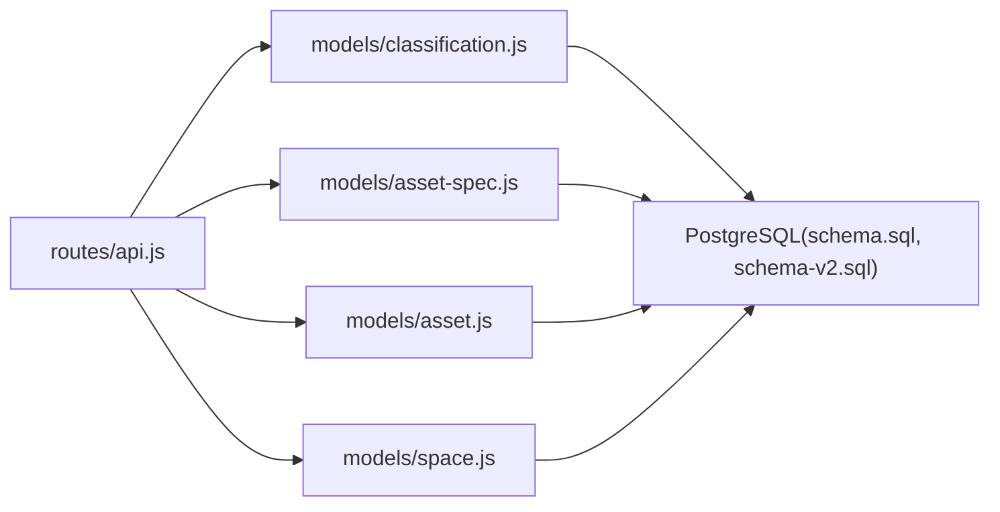

# 模型数据导入API

<cite>
**本文引用的文件**
- [server/README.md](file://server/README.md)
- [server/routes/api.js](file://server/routes/api.js)
- [server/models/classification.js](file://server/models/classification.js)
- [server/models/asset-spec.js](file://server/models/asset-spec.js)
- [server/models/asset.js](file://server/models/asset.js)
- [server/models/space.js](file://server/models/space.js)
- [server/db/schema.sql](file://server/db/schema.sql)
- [server/db/schema-v2.sql](file://server/db/schema-v2.sql)
</cite>

## 目录
1. [简介](#简介)
2. [项目结构](#项目结构)
3. [核心组件](#核心组件)
4. [架构总览](#架构总览)
5. [详细组件分析](#详细组件分析)
6. [依赖分析](#依赖分析)
7. [性能考虑](#性能考虑)
8. [故障排查指南](#故障排查指南)
9. [结论](#结论)
10. [附录](#附录)

## 简介
本文件面向“综合数据导入API（POST /api/import/model-data）”的深度技术文档，目标是帮助开发者与运维人员全面理解：
- 请求体结构与字段语义（fileId、assets、spaces数组、clearExisting）
- 导入流程的事务逻辑与执行顺序
- 如何从资产与空间数据中提取分类编码与规格信息并批量入库
- 当clearExisting=true时的旧数据清理机制与外键约束处理
- 日志输出与错误回滚策略
- server/README.md中示例的完整版与字段说明

## 项目结构
该API位于后端路由层，通过Express Router提供REST接口；数据持久化由PostgreSQL承担，表结构定义在数据库脚本中；业务逻辑封装在各模型层（DAO），负责事务控制与SQL执行。

图表来源
- [server/routes/api.js](file://server/routes/api.js#L293-L464)
- [server/models/classification.js](file://server/models/classification.js#L31-L81)
- [server/models/asset-spec.js](file://server/models/asset-spec.js#L104-L156)
- [server/models/asset.js](file://server/models/asset.js#L160-L200)
- [server/models/space.js](file://server/models/space.js#L126-L168)
- [server/db/schema.sql](file://server/db/schema.sql#L6-L70)
- [server/db/schema-v2.sql](file://server/db/schema-v2.sql#L41-L70)

章节来源
- [server/routes/api.js](file://server/routes/api.js#L293-L464)
- [server/db/schema.sql](file://server/db/schema.sql#L6-L70)
- [server/db/schema-v2.sql](file://server/db/schema-v2.sql#L41-L70)

## 核心组件
- 路由层（/api/import/model-data）：接收请求体，组织导入流程，协调事务与清理逻辑
- 分类模型：批量写入分类编码，支持fileId关联
- 资产规格模型：批量写入规格，支持fileId关联（规格为全局共享，按file_id+spec_code唯一）
- 资产模型：批量写入资产，支持fileId关联（资产编码按file_id+asset_code唯一）
- 空间模型：批量写入空间，支持fileId关联（空间编码按file_id+space_code唯一）

章节来源
- [server/routes/api.js](file://server/routes/api.js#L293-L464)
- [server/models/classification.js](file://server/models/classification.js#L31-L81)
- [server/models/asset-spec.js](file://server/models/asset-spec.js#L104-L156)
- [server/models/asset.js](file://server/models/asset.js#L160-L200)
- [server/models/space.js](file://server/models/space.js#L126-L168)

## 架构总览
POST /api/import/model-data的调用序列如下：

图表来源
- [server/routes/api.js](file://server/routes/api.js#L302-L464)
- [server/models/classification.js](file://server/models/classification.js#L31-L81)
- [server/models/asset-spec.js](file://server/models/asset-spec.js#L104-L156)
- [server/models/asset.js](file://server/models/asset.js#L160-L200)
- [server/models/space.js](file://server/models/space.js#L126-L168)

## 详细组件分析

### 请求体结构与字段语义
- fileId: number（可选）。用于将本次导入的数据与某个模型文件关联，形成“文件维度”的数据隔离。若提供，后续所有写入（分类、规格、资产、空间）均会带上file_id。
- assets: 数组。每项包含资产相关信息，如dbId、mcCode、name、floor、room、omniClass21Number、omniClass21Description、category、family、type、typeComments、manufacturer、address、phone等。
- spaces: 数组。每项包含空间相关信息，如dbId、spaceCode、name、classificationCode、classificationDesc、floor、area、perimeter等。
- clearExisting: boolean（默认false）。当为true且提供了fileId时，导入前会清理该fileId对应的历史数据（按file_id删除资产、空间、规格、分类）。

章节来源
- [server/README.md](file://server/README.md#L120-L158)
- [server/routes/api.js](file://server/routes/api.js#L302-L351)

### 导入流程与事务逻辑
- 清理旧数据（仅当clearExisting=true且fileId存在）
  - 采用显式事务，按顺序删除：assets → spaces → asset_specs → classifications
  - 顺序遵循外键依赖关系：资产依赖规格（弱外键）、空间独立；删除顺序避免违反约束
- 提取分类与规格
  - 从assets中提取分类编码（OmniClass 21）与规格（按typeComments去重）
  - 从spaces中提取空间分类编码
- 写入分类
  - 若提供fileId，使用带file_id的ON CONFLICT更新；否则直接插入（兼容旧逻辑）
- 写入规格
  - 若提供fileId，使用带(file_id, spec_code)的ON CONFLICT更新；规格本身为全局共享，不按文件区分
- 写入资产
  - 若提供fileId，使用带(file_id, asset_code)的ON CONFLICT更新；资产编码按文件唯一
- 写入空间
  - 若提供fileId，先删除该文件的所有旧空间，再批量插入新空间；空间编码按文件唯一

章节来源
- [server/routes/api.js](file://server/routes/api.js#L302-L464)
- [server/models/classification.js](file://server/models/classification.js#L31-L81)
- [server/models/asset-spec.js](file://server/models/asset-spec.js#L104-L156)
- [server/models/asset.js](file://server/models/asset.js#L160-L200)
- [server/models/space.js](file://server/models/space.js#L126-L168)

### 外键约束与数据一致性
- schema.sql定义了资产、空间、规格表的file_id外键，指向model_files(id)，并设置CASCADE删除
- schema-v2.sql将资产、空间、规格表新增file_id列，并将唯一约束改为(file_id, 编码)，从而实现“同文件内编码唯一”
- 导入流程中：
  - clearExisting按file_id删除历史数据，确保新导入数据满足唯一性
  - 写入规格时按(file_id, spec_code)唯一，避免跨文件冲突
  - 写入资产与空间时按(file_id, 编码)唯一，避免跨文件冲突

章节来源
- [server/db/schema.sql](file://server/db/schema.sql#L6-L70)
- [server/db/schema-v2.sql](file://server/db/schema-v2.sql#L41-L70)

### 日志输出与错误回滚策略
- 路由层日志
  - 收到导入请求时打印fileId、资产数量、空间数量、clearExisting标志
  - 清理旧数据时打印开始与完成信息；失败时打印错误并回滚
  - 各批量写入完成后打印成功日志
- 模型层日志
  - 分类、规格、资产、空间的批量写入方法在BEGIN/COMMIT前后打印日志
- 错误回滚
  - 路由层：清理旧数据与各批量写入均在事务中执行，异常时ROLLBACK并抛出错误
  - 模型层：批量写入方法在BEGIN/ROLLBACK/COMMIT之间捕获异常并抛出

章节来源
- [server/routes/api.js](file://server/routes/api.js#L302-L464)
- [server/models/classification.js](file://server/models/classification.js#L31-L81)
- [server/models/asset-spec.js](file://server/models/asset-spec.js#L104-L156)
- [server/models/asset.js](file://server/models/asset.js#L160-L200)
- [server/models/space.js](file://server/models/space.js#L126-L168)

### 完整示例（来自server/README.md）
以下为POST /api/import/model-data的请求体示例与字段说明（摘自README）：
- assets[]：包含资产对象数组，字段如dbId、mcCode、name、floor、room、omniClass21Number、omniClass21Description、category、family、type、typeComments、manufacturer、address、phone
- spaces[]：包含空间对象数组，字段如dbId、spaceCode、name、classificationCode、classificationDesc、floor、area、perimeter
- clearExisting：布尔值，控制是否清理旧数据

章节来源
- [server/README.md](file://server/README.md#L120-L158)

## 依赖分析
- 路由层依赖各模型层的批量写入方法
- 模型层依赖数据库连接池与事务控制
- 数据库层依赖schema.sql与schema-v2.sql定义的表结构与外键约束

图表来源
- [server/routes/api.js](file://server/routes/api.js#L293-L464)
- [server/models/classification.js](file://server/models/classification.js#L31-L81)
- [server/models/asset-spec.js](file://server/models/asset-spec.js#L104-L156)
- [server/models/asset.js](file://server/models/asset.js#L160-L200)
- [server/models/space.js](file://server/models/space.js#L126-L168)
- [server/db/schema.sql](file://server/db/schema.sql#L6-L70)
- [server/db/schema-v2.sql](file://server/db/schema-v2.sql#L41-L70)

## 性能考虑
- 批量写入采用事务包裹，减少往返开销
- 规格与资产/空间的唯一性约束按(file_id, 编码)设计，避免跨文件冲突导致的重复写入
- 清理旧数据时按file_id精确删除，避免全表扫描
- 建议在导入前对assets与spaces进行去重与校验，减少无效写入

## 故障排查指南
- 清理旧数据失败
  - 现象：日志出现“清理旧数据失败”并回滚
  - 排查：确认fileId有效、数据库连接正常、表存在且具备file_id列
- 分类写入异常
  - 现象：分类批量写入失败
  - 排查：确认是否提供fileId；若未提供，检查兼容逻辑是否生效
- 规格写入异常
  - 现象：规格批量写入失败
  - 排查：确认(file_id, spec_code)唯一性；检查typeComments是否为空
- 资产/空间写入异常
  - 现象：资产或空间批量写入失败
  - 排查：确认(asset_code或space_code)非空；检查fileId是否一致；确认area/perimeter转换为数值

章节来源
- [server/routes/api.js](file://server/routes/api.js#L302-L464)
- [server/models/classification.js](file://server/models/classification.js#L31-L81)
- [server/models/asset-spec.js](file://server/models/asset-spec.js#L104-L156)
- [server/models/asset.js](file://server/models/asset.js#L160-L200)
- [server/models/space.js](file://server/models/space.js#L126-L168)

## 结论
POST /api/import/model-data通过清晰的流程与严格的事务控制，实现了从模型数据到数据库的可靠导入。其关键特性包括：
- 支持fileId关联，实现“文件维度”的数据隔离
- 自动提取分类与规格，按去重规则批量入库
- clearExisting=true时按外键顺序清理旧数据，保障一致性
- 模块化的模型层与完善的日志/回滚机制，便于维护与排障

## 附录

### 请求体字段对照（来自server/README.md）
- assets[].dbId：Viewer中的dbId
- assets[].mcCode：资产编码
- assets[].name：资产名称
- assets[].floor：楼层
- assets[].room：房间
- assets[].omniClass21Number：OmniClass 21编号
- assets[].omniClass21Description：OmniClass 21描述
- assets[].category：类别
- assets[].family：族
- assets[].type：类型
- assets[].typeComments：规格编码
- assets[].manufacturer：制造商
- assets[].address：地址
- assets[].phone：电话
- spaces[].dbId：Viewer中的dbId
- spaces[].spaceCode：空间编码
- spaces[].name：空间名称
- spaces[].classificationCode：空间分类编号
- spaces[].classificationDesc：空间分类描述
- spaces[].floor：楼层
- spaces[].area：面积
- spaces[].perimeter：周长

章节来源
- [server/README.md](file://server/README.md#L120-L158)