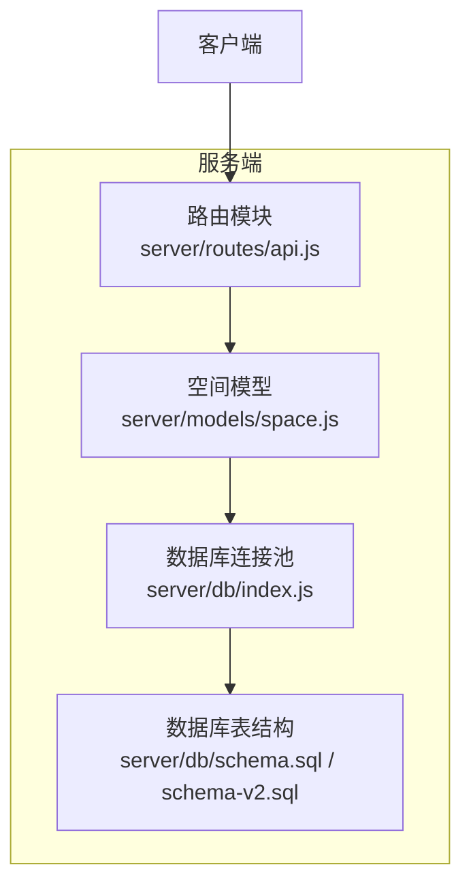
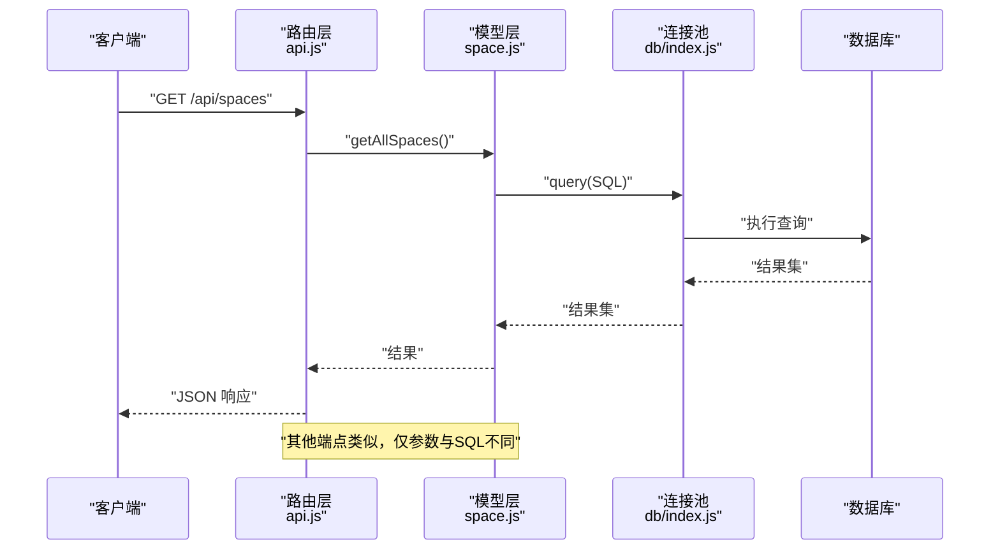
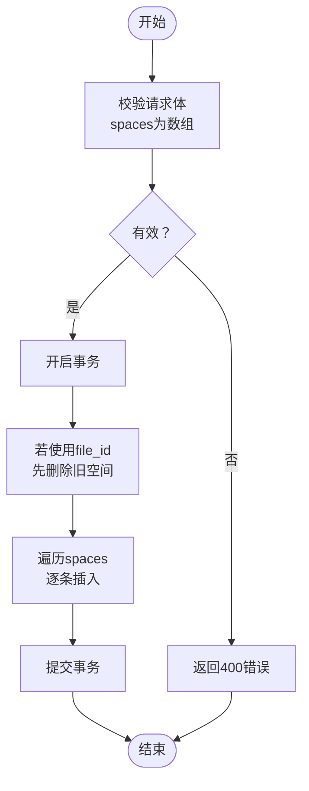
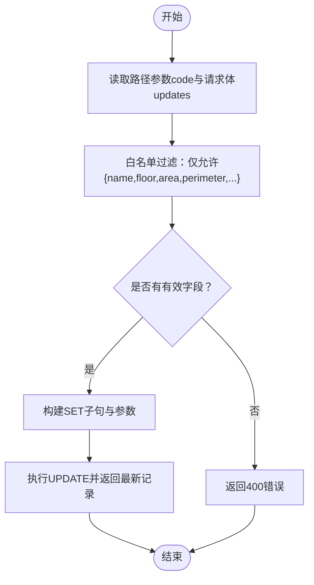
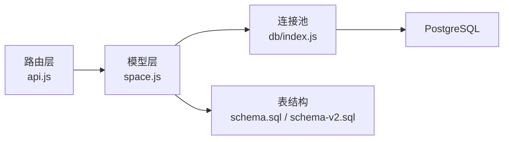

# 空间API

<cite>
**本文引用的文件**
- [server/routes/api.js](file://server/routes/api.js)
- [server/models/space.js](file://server/models/space.js)
- [server/db/index.js](file://server/db/index.js)
- [server/db/schema.sql](file://server/db/schema.sql)
- [server/db/schema-v2.sql](file://server/db/schema-v2.sql)
- [server/models/asset.js](file://server/models/asset.js)
- [add_missing_space_fields.sql](file://add_missing_space_fields.sql)
</cite>

## 目录
1. [简介](#简介)
2. [项目结构](#项目结构)
3. [核心组件](#核心组件)
4. [架构总览](#架构总览)
5. [详细组件分析](#详细组件分析)
6. [依赖分析](#依赖分析)
7. [性能考虑](#性能考虑)
8. [故障排查指南](#故障排查指南)
9. [结论](#结论)
10. [附录](#附录)

## 简介
本文件面向空间API的技术文档，覆盖以下端点：
- GET /api/spaces：获取所有空间
- GET /api/spaces/:code：按编码查询空间
- GET /api/spaces/floor/:floor：按楼层查询空间
- POST /api/spaces/batch：批量导入空间
- PATCH /api/spaces/:code：更新空间属性

同时，文档明确空间数据模型（spaceCode、name、floor、area、perimeter、classificationCode、classificationDesc、dbId）与其与3D模型的关联方式（dbId），并说明批量导入的幂等性处理策略与更新接口的验证逻辑，最后给出错误处理最佳实践。

## 项目结构
空间API位于服务端路由模块中，通过Express Router提供REST接口；数据访问由空间模型层负责，底层使用PostgreSQL连接池进行查询与事务控制；数据库表结构在schema.sql中定义，支持与模型文件（model_files）关联，便于多模型场景下的空间数据隔离与幂等导入。

图表来源
- [server/routes/api.js](file://server/routes/api.js#L203-L291)
- [server/models/space.js](file://server/models/space.js#L1-L220)
- [server/db/index.js](file://server/db/index.js#L1-L70)
- [server/db/schema.sql](file://server/db/schema.sql#L54-L70)
- [server/db/schema-v2.sql](file://server/db/schema-v2.sql#L44-L70)

章节来源
- [server/routes/api.js](file://server/routes/api.js#L203-L291)
- [server/models/space.js](file://server/models/space.js#L1-L220)
- [server/db/schema.sql](file://server/db/schema.sql#L54-L70)
- [server/db/schema-v2.sql](file://server/db/schema-v2.sql#L44-L70)

## 核心组件
- 路由层（server/routes/api.js）
  - 定义空间相关REST端点，执行基础校验（如请求体类型、路径参数有效性），并将业务逻辑委托给模型层。
- 模型层（server/models/space.js）
  - 提供空间的增删改查、批量导入、按文件ID过滤、按楼层过滤、按分类过滤、按编码过滤等方法；支持事务与幂等导入。
- 数据库层（server/db/index.js、schema.sql、schema-v2.sql）
  - 提供PostgreSQL连接池、SQL执行封装、事务客户端获取；表结构定义了空间表字段及索引，支持file_id关联模型文件，实现多模型隔离与幂等导入。

章节来源
- [server/routes/api.js](file://server/routes/api.js#L203-L291)
- [server/models/space.js](file://server/models/space.js#L1-L220)
- [server/db/index.js](file://server/db/index.js#L1-L70)
- [server/db/schema.sql](file://server/db/schema.sql#L54-L70)
- [server/db/schema-v2.sql](file://server/db/schema-v2.sql#L44-L70)

## 架构总览
空间API的调用链路如下：客户端发起HTTP请求，路由层解析参数与请求体，调用空间模型层执行数据库操作，模型层通过数据库连接池执行SQL，最终返回JSON响应。

图表来源
- [server/routes/api.js](file://server/routes/api.js#L203-L291)
- [server/models/space.js](file://server/models/space.js#L72-L97)
- [server/db/index.js](file://server/db/index.js#L34-L51)

## 详细组件分析

### 数据模型与字段定义
空间实体包含以下关键字段：
- spaceCode：空间编码（唯一标识）
- name：空间名称
- classificationCode：分类编码（来自空间分类）
- classificationDesc：分类描述
- floor：楼层（标高）
- area：面积（数值）
- perimeter：周长（数值）
- dbId：Viewer中的dbId，用于与3D模型关联
- file_id：可选，用于多模型场景下的数据隔离（与模型文件关联）

字段来源与约束
- 字段定义与索引、触发器在数据库表结构中定义，支持按分类编码、楼层、dbId等维度高效查询。
- schema-v2新增file_id列并调整唯一约束，使同一空间编码可在不同文件中重复，便于多模型导入与幂等处理。

章节来源
- [server/db/schema.sql](file://server/db/schema.sql#L54-L70)
- [server/db/schema.sql](file://server/db/schema.sql#L92-L96)
- [server/db/schema-v2.sql](file://server/db/schema-v2.sql#L44-L70)

### GET /api/spaces
- 功能：返回所有空间记录，按space_code排序。
- 实现要点：
  - 路由层调用空间模型的getAllSpaces()。
  - 模型层执行SELECT查询并返回结果。
- 响应格式：包含success标志与data数组。
- 错误处理：内部异常统一返回500与错误信息。

章节来源
- [server/routes/api.js](file://server/routes/api.js#L207-L218)
- [server/models/space.js](file://server/models/space.js#L72-L97)

### GET /api/spaces/:code
- 功能：根据spaceCode精确查询空间。
- 实现要点：
  - 路由层从路径参数读取code并校验存在性。
  - 模型层执行按space_code查询。
  - 若未找到，返回404与错误信息。
- 响应格式：包含success标志与data对象。
- 错误处理：内部异常统一返回500与错误信息。

章节来源
- [server/routes/api.js](file://server/routes/api.js#L220-L234)
- [server/models/space.js](file://server/models/space.js#L81-L90)

### GET /api/spaces/floor/:floor
- 功能：根据floor筛选空间列表。
- 实现要点：
  - 路由层从路径参数读取floor。
  - 模型层执行按floor查询并按space_code排序。
- 响应格式：包含success标志与data数组。
- 错误处理：内部异常统一返回500与错误信息。

章节来源
- [server/routes/api.js](file://server/routes/api.js#L236-L247)
- [server/models/space.js](file://server/models/space.js#L90-L97)

### POST /api/spaces/batch
- 功能：批量导入空间记录。
- 请求体：
  - spaces：数组，元素为空间对象，至少包含spaceCode；可包含name、classificationCode、classificationDesc、floor、area、perimeter、dbId等。
- 幂等性与事务：
  - 模型层在批量导入时开启事务，逐条插入空间记录。
  - 当启用file_id关联时，空间模型提供带file_id的批量导入方法，其内部会先删除该文件对应的所有旧空间，再批量插入新空间，从而实现“以文件为单位”的幂等导入。
- 响应格式：包含success标志与消息，消息中包含导入数量。
- 错误处理：内部异常统一返回500与错误信息。

图表来源
- [server/routes/api.js](file://server/routes/api.js#L249-L264)
- [server/models/space.js](file://server/models/space.js#L129-L168)

章节来源
- [server/routes/api.js](file://server/routes/api.js#L249-L264)
- [server/models/space.js](file://server/models/space.js#L129-L168)

### PATCH /api/spaces/:code
- 功能：更新指定spaceCode的空间属性。
- 请求体：
  - 允许字段：name、classificationCode、classificationDesc、floor、area、perimeter。
  - 路由层对请求体进行白名单过滤，仅保留允许字段。
  - 若无有效字段，返回400。
- 实现要点：
  - 模型层动态构建UPDATE语句，设置updated_at为当前时间，确保审计字段更新。
- 响应格式：包含success标志与消息。
- 错误处理：内部异常统一返回500与错误信息。

图表来源
- [server/routes/api.js](file://server/routes/api.js#L266-L291)
- [server/models/space.js](file://server/models/space.js#L170-L206)

章节来源
- [server/routes/api.js](file://server/routes/api.js#L266-L291)
- [server/models/space.js](file://server/models/space.js#L170-L206)

### 与3D模型的关联
- dbId：空间记录中的dbId字段用于与Viewer中的dbId关联，实现空间与3D模型构件的绑定。
- 多模型隔离：通过file_id字段与model_files表关联，支持同一空间编码在不同模型文件中重复，便于多模型导入与幂等处理。
- 一致性保障：当启用file_id关联时，批量导入会先删除该文件对应的所有旧空间，再插入新空间，从而保证“以文件为单位”的幂等性。

章节来源
- [server/db/schema.sql](file://server/db/schema.sql#L54-L70)
- [server/db/schema-v2.sql](file://server/db/schema-v2.sql#L44-L70)
- [server/models/space.js](file://server/models/space.js#L129-L168)

### 批量导入的幂等性处理
- 单文件幂等：当使用带file_id的批量导入方法时，模型层会先删除该文件对应的所有旧空间，再批量插入新空间，从而确保同一文件内的空间编码不会重复，实现幂等。
- 多文件场景：由于唯一约束已改为(file_id, space_code)，不同文件可以拥有相同的space_code，避免跨文件冲突。
- 事务保障：批量导入在事务中执行，任一步骤失败会回滚，保证数据一致性。

章节来源
- [server/models/space.js](file://server/models/space.js#L129-L168)
- [server/db/schema-v2.sql](file://server/db/schema-v2.sql#L64-L70)

### 更新接口的验证逻辑
- 白名单字段：PATCH接口仅接受预定义的允许字段集合，未在白名单中的字段会被忽略。
- 必要性校验：若请求体中没有任何允许字段，接口返回400错误。
- 完整性校验：模型层在执行UPDATE时会设置updated_at，便于审计与追踪。

章节来源
- [server/routes/api.js](file://server/routes/api.js#L266-L291)
- [server/models/space.js](file://server/models/space.js#L170-L206)

## 依赖分析
- 路由层依赖空间模型层；空间模型层依赖数据库连接池；数据库连接池依赖PostgreSQL驱动与环境变量配置。
- 数据库层提供统一的query与getClient方法，前者用于普通查询，后者用于事务客户端。
- 空间表与资产表、资产规格表、分类表共享file_id关联能力，便于多模型场景下的数据隔离与幂等导入。

图表来源
- [server/routes/api.js](file://server/routes/api.js#L203-L291)
- [server/models/space.js](file://server/models/space.js#L1-L220)
- [server/db/index.js](file://server/db/index.js#L1-L70)
- [server/db/schema.sql](file://server/db/schema.sql#L54-L70)
- [server/db/schema-v2.sql](file://server/db/schema-v2.sql#L44-L70)

章节来源
- [server/routes/api.js](file://server/routes/api.js#L203-L291)
- [server/models/space.js](file://server/models/space.js#L1-L220)
- [server/db/index.js](file://server/db/index.js#L1-L70)
- [server/db/schema.sql](file://server/db/schema.sql#L54-L70)
- [server/db/schema-v2.sql](file://server/db/schema-v2.sql#L44-L70)

## 性能考虑
- 索引优化：空间表针对classification_code、floor、db_id建立了索引，有助于按分类、楼层与3D关联查询的性能。
- 事务批处理：批量导入采用事务包裹，减少多次往返开销，提升吞吐量。
- 唯一约束：file_id参与唯一约束，避免跨文件重复，同时允许同文件内重复，便于幂等导入。
- 查询排序：空间查询默认按space_code排序，有利于前端展示与分页。

章节来源
- [server/db/schema.sql](file://server/db/schema.sql#L92-L96)
- [server/models/space.js](file://server/models/space.js#L129-L168)
- [server/db/schema-v2.sql](file://server/db/schema-v2.sql#L64-L70)

## 故障排查指南
- 400错误（请求体不合法）
  - 现象：批量导入时未提供数组或PATCH时未提供允许字段。
  - 处理：检查请求体结构与字段白名单。
- 404错误（资源不存在）
  - 现象：按编码查询空间时未找到。
  - 处理：确认spaceCode是否正确，或检查是否存在file_id隔离导致的可见性问题。
- 500错误（服务器内部错误）
  - 现象：数据库查询或事务执行异常。
  - 处理：查看日志输出，检查数据库连接池配置与SQL执行情况；必要时回滚事务并重试。
- 幂等性问题
  - 现象：重复导入导致数据不一致。
  - 处理：确认是否使用带file_id的批量导入方法；确保导入前清理策略正确执行。

章节来源
- [server/routes/api.js](file://server/routes/api.js#L207-L291)
- [server/models/space.js](file://server/models/space.js#L129-L168)
- [server/db/index.js](file://server/db/index.js#L34-L51)

## 结论
空间API提供了完整的CRUD能力与批量导入支持，结合file_id实现了多模型场景下的数据隔离与幂等导入；PATCH接口通过白名单字段与事务更新保障了数据一致性与安全性。建议在生产环境中配合索引与事务批处理，确保查询与导入性能；同时遵循错误处理最佳实践，提升系统的可观测性与稳定性。

## 附录
- 字段映射配置补充
  - 若映射配置中缺少area、perimeter、floor等字段，可通过脚本自动补齐，确保空间属性的完整性。

章节来源
- [add_missing_space_fields.sql](file://add_missing_space_fields.sql#L1-L94)