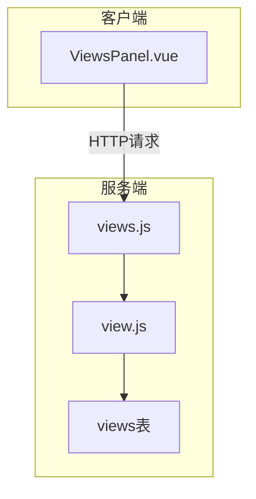
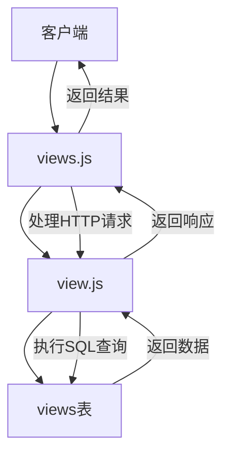
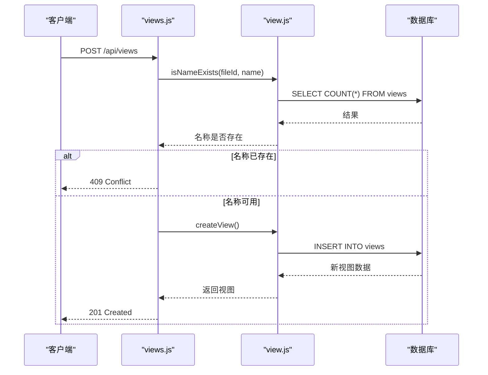
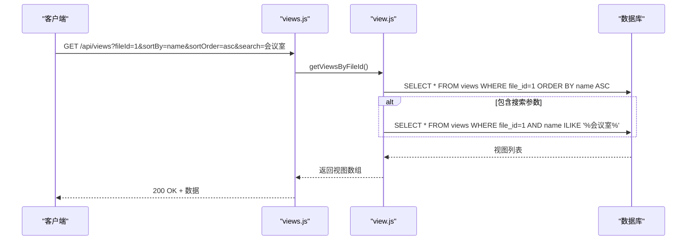
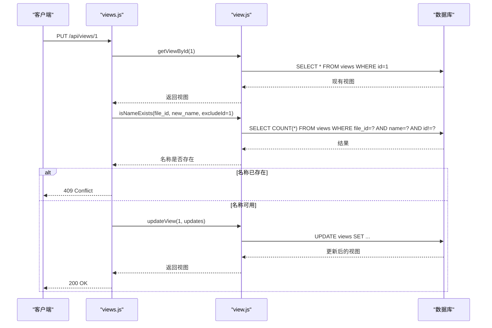
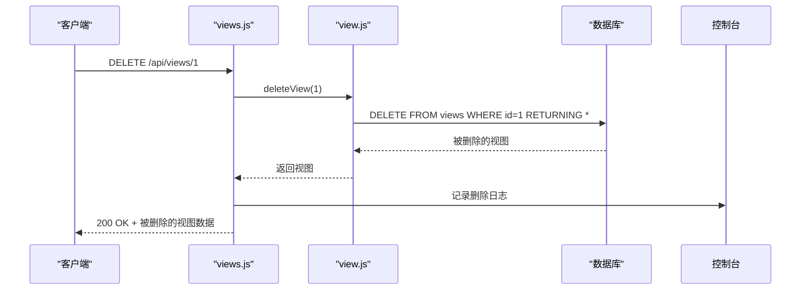
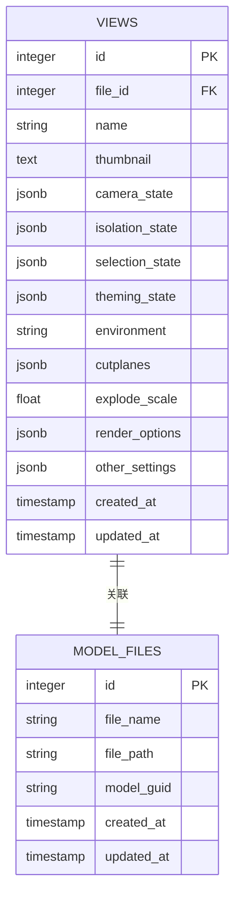
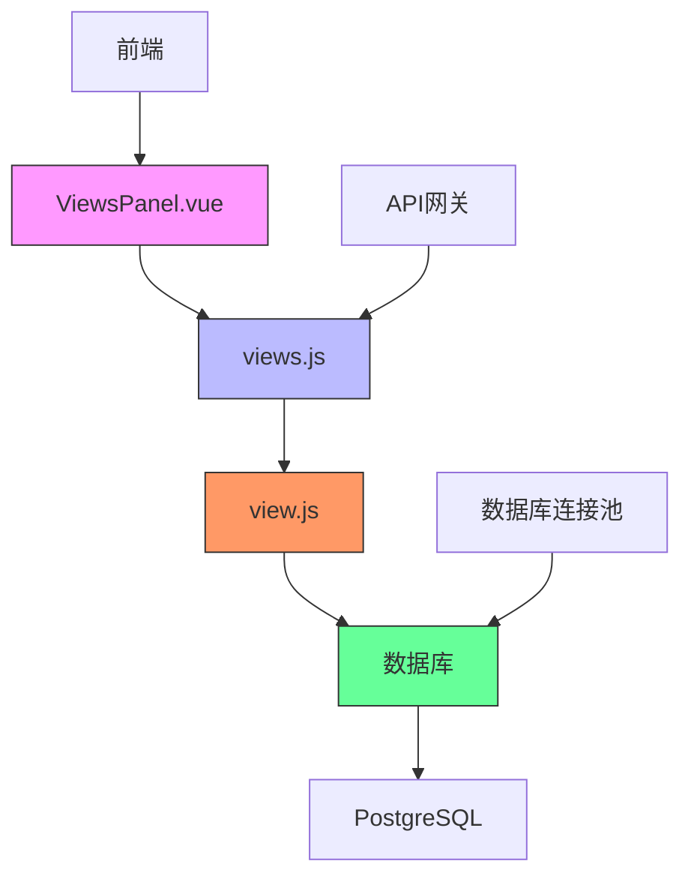

# 视图管理API

<cite>
**本文档中引用的文件**
- [views.js](file://server/routes/views.js)
- [view.js](file://server/models/view.js)
- [create_views_table.sql](file://server/db/create_views_table.sql)
- [add-viewer-state-column.js](file://server/add-viewer-state-column.js)
- [ViewsPanel.vue](file://src/components/ViewsPanel.vue)
</cite>

## 目录
1. [简介](#简介)
2. [项目结构](#项目结构)
3. [核心组件](#核心组件)
4. [架构概述](#架构概述)
5. [详细组件分析](#详细组件分析)
6. [依赖分析](#依赖分析)
7. [性能考虑](#性能考虑)
8. [故障排除指南](#故障排除指南)
9. [结论](#结论)
10. [附录](#附录)（如有必要）

## 简介
本文档提供了视图管理API的完整指南，涵盖了视图的增删改查操作。详细说明了创建、获取、更新和删除视图的API端点，以及视图如何与3D模型文件关联并保存用户浏览状态。

## 项目结构
视图管理功能分布在服务器端和客户端两个主要部分。服务器端负责数据持久化和业务逻辑，客户端负责用户界面交互。



**图示来源**
- [views.js](file://server/routes/views.js#L1-L181)
- [view.js](file://server/models/view.js#L1-L199)
- [ViewsPanel.vue](file://src/components/ViewsPanel.vue#L1-L800)

**章节来源**
- [views.js](file://server/routes/views.js#L1-L181)
- [view.js](file://server/models/view.js#L1-L199)

## 核心组件
视图管理API的核心组件包括路由处理、数据模型和数据库表结构。这些组件协同工作，实现视图的完整生命周期管理。

**章节来源**
- [views.js](file://server/routes/views.js#L1-L181)
- [view.js](file://server/models/view.js#L1-L199)

## 架构概述
视图管理API采用典型的三层架构：表示层（路由）、业务逻辑层（模型）和数据访问层（数据库）。



**图示来源**
- [views.js](file://server/routes/views.js#L1-L181)
- [view.js](file://server/models/view.js#L1-L199)
- [create_views_table.sql](file://server/db/create_views_table.sql#L1-L46)

## 详细组件分析

### 创建视图分析
创建视图操作通过POST /api/views端点实现，包含名称唯一性检查和viewer_state状态数据存储。

#### 创建视图序列图


**图示来源**
- [views.js](file://server/routes/views.js#L66-L110)
- [view.js](file://server/models/view.js#L66-L96)

**章节来源**
- [views.js](file://server/routes/views.js#L66-L110)
- [view.js](file://server/models/view.js#L66-L96)

### 获取视图分析
获取视图操作支持分页、排序和搜索功能，通过GET /api/views端点实现。

#### 获取视图序列图


**图示来源**
- [views.js](file://server/routes/views.js#L14-L41)
- [view.js](file://server/models/view.js#L14-L48)

**章节来源**
- [views.js](file://server/routes/views.js#L14-L41)
- [view.js](file://server/models/view.js#L14-L48)

### 更新视图分析
更新视图操作通过PUT /api/views/:id端点实现，包含名称冲突检测逻辑。

#### 更新视图序列图


**图示来源**
- [views.js](file://server/routes/views.js#L116-L154)
- [view.js](file://server/models/view.js#L104-L147)

**章节来源**
- [views.js](file://server/routes/views.js#L116-L154)
- [view.js](file://server/models/view.js#L104-L147)

### 删除视图分析
删除视图操作通过DELETE /api/views/:id端点实现，包含返回值和日志记录。

#### 删除视图序列图


**图示来源**
- [views.js](file://server/routes/views.js#L160-L178)
- [view.js](file://server/models/view.js#L154-L158)

**章节来源**
- [views.js](file://server/routes/views.js#L160-L178)
- [view.js](file://server/models/view.js#L154-L158)

### 视图与3D模型关联分析
视图通过file_id字段与3D模型文件关联，保存用户浏览状态。

#### 视图数据模型图


**图示来源**
- [create_views_table.sql](file://server/db/create_views_table.sql#L4-L26)
- [schema.sql](file://server/db/schema.sql#L6-L160)

**章节来源**
- [create_views_table.sql](file://server/db/create_views_table.sql#L4-L26)

## 依赖分析
视图管理功能依赖于多个组件和服务，形成完整的依赖链。



**图示来源**
- [ViewsPanel.vue](file://src/components/ViewsPanel.vue#L1-L800)
- [views.js](file://server/routes/views.js#L1-L181)
- [view.js](file://server/models/view.js#L1-L199)
- [index.js](file://server/db/index.js#L1-L70)

**章节来源**
- [views.js](file://server/routes/views.js#L1-L181)
- [view.js](file://server/models/view.js#L1-L199)
- [index.js](file://server/db/index.js#L1-L70)

## 性能考虑
视图管理API在设计时考虑了性能优化，包括数据库索引和查询优化。

### 数据库索引
视图表创建了多个索引以提高查询性能：
- `idx_views_file_id`：基于file_id的索引，优化按文件ID查询
- `idx_views_name`：基于name的索引，优化按名称搜索
- `idx_views_created`：基于created_at的索引，优化按创建时间排序

### 查询优化
- 使用参数化查询防止SQL注入
- 限制返回字段，只返回必要数据
- 在搜索时使用ILIKE进行不区分大小写的模式匹配
- 使用RETURNING子句在单个查询中完成插入/更新并返回结果

**章节来源**
- [create_views_table.sql](file://server/db/create_views_table.sql#L28-L31)
- [view.js](file://server/models/view.js#L21-L26)

## 故障排除指南
本节提供视图管理API常见问题的解决方案。

### 常见错误及解决方案
| 错误代码 | 错误信息 | 可能原因 | 解决方案 |
|---------|--------|--------|--------|
| 400 | 缺少fileId参数 | 请求缺少必要参数 | 确保请求包含fileId参数 |
| 400 | 缺少必要参数: fileId, name | 创建视图时缺少必要字段 | 确保请求体包含fileId和name字段 |
| 404 | 视图不存在 | 指定ID的视图不存在 | 检查视图ID是否正确 |
| 409 | 视图名称已存在 | 同一文件下视图名称重复 | 使用唯一名称或更新现有视图 |
| 500 | 服务器内部错误 | 服务器端异常 | 检查服务器日志获取详细信息 |

### 日志记录
系统在关键操作时记录日志：
- 创建视图：`✅ 创建视图: {name} (文件ID: {fileId})`
- 更新视图：`✅ 更新视图: {name}`
- 删除视图：`🗑️ 删除视图: {name}`
- 查询执行：`📊 执行查询: {text: text.substring(0, 50), duration, rows: result.rowCount}`

**章节来源**
- [views.js](file://server/routes/views.js#L104-L105)
- [views.js](file://server/routes/views.js#L148-L149)
- [views.js](file://server/routes/views.js#L172-L173)
- [index.js](file://server/db/index.js#L45-L46)

## 结论
视图管理API提供了一套完整的视图生命周期管理功能，支持创建、读取、更新和删除操作。API设计考虑了数据完整性、性能优化和用户体验，通过名称唯一性检查、状态数据存储和丰富的查询参数，满足了3D模型浏览状态保存的需求。

## 附录

### API端点汇总
| 方法 | 路径 | 描述 | 请求体/参数 | 响应 |
|------|------|------|------------|------|
| GET | /api/views | 获取文件的所有视图 | fileId, sortBy, sortOrder, search | 视图列表 |
| GET | /api/views/:id | 获取单个视图 | 无 | 单个视图数据 |
| POST | /api/views | 创建新视图 | fileId, name, thumbnail, viewer_state等 | 新创建的视图 |
| PUT | /api/views/:id | 更新视图 | 更新字段 | 更新后的视图 |
| DELETE | /api/views/:id | 删除视图 | 无 | 被删除的视图 |

### 视图状态数据结构
```json
{
  "camera_state": {
    "position": [x, y, z],
    "target": [x, y, z],
    "up": [x, y, z]
  },
  "isolation_state": {
    "hiddenNodes": [dbId1, dbId2],
    "isolatedNodes": [dbId3, dbId4]
  },
  "selection_state": {
    "selectedDbIds": [dbId1, dbId2]
  },
  "theming_state": {
    "dbId1": "#ff0000",
    "dbId2": "#00ff00"
  },
  "environment": "daylight",
  "cutplanes": [
    {
      "normal": [0, 0, 1],
      "origin": [0, 0, 0]
    }
  ],
  "explode_scale": 1.5,
  "render_options": {
    "ambientOcclusion": true,
    "shadows": true
  },
  "other_settings": {}
}
```

**章节来源**
- [create_views_table.sql](file://server/db/create_views_table.sql#L10-L19)
- [add-viewer-state-column.js](file://server/add-viewer-state-column.js#L1-L24)