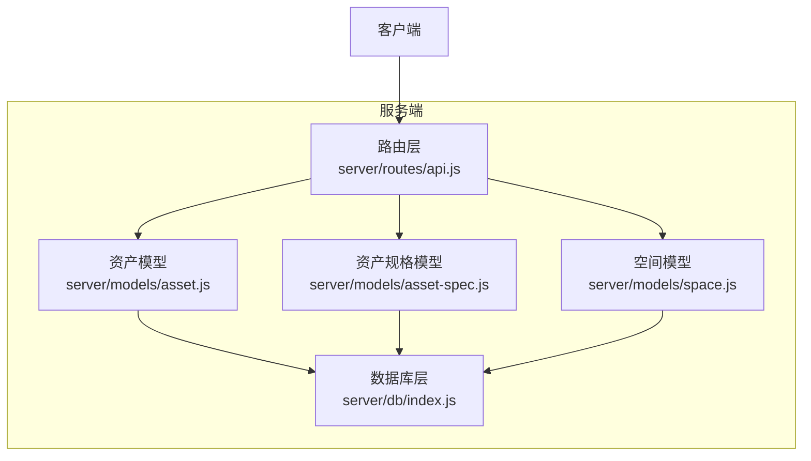
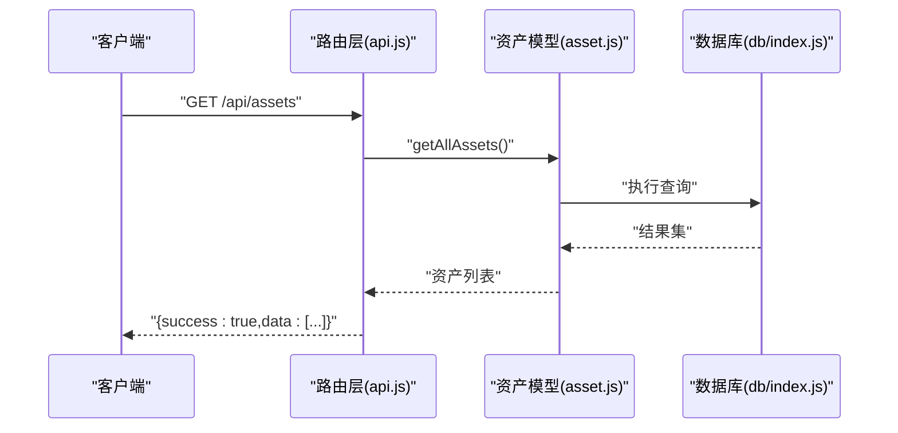
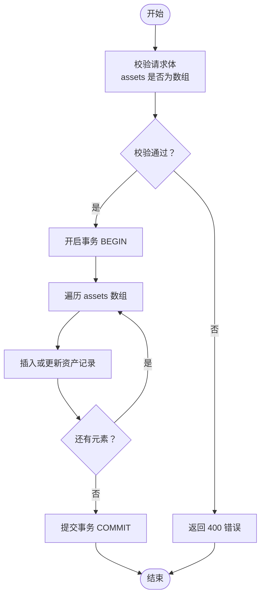
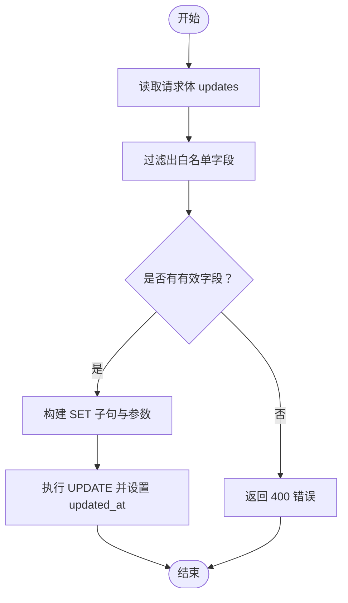
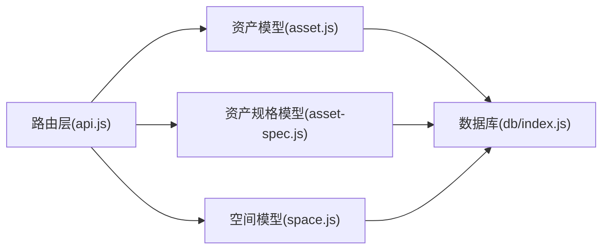
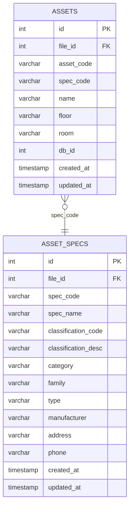

# 资产API

<cite>
**本文引用的文件**
- [server/index.js](file://server/index.js)
- [server/routes/api.js](file://server/routes/api.js)
- [server/models/asset.js](file://server/models/asset.js)
- [server/models/asset-spec.js](file://server/models/asset-spec.js)
- [server/models/space.js](file://server/models/space.js)
- [server/db/schema.sql](file://server/db/schema.sql)
- [server/db/index.js](file://server/db/index.js)
</cite>

## 目录
1. [简介](#简介)
2. [项目结构](#项目结构)
3. [核心组件](#核心组件)
4. [架构总览](#架构总览)
5. [详细组件分析](#详细组件分析)
6. [依赖分析](#依赖分析)
7. [性能考虑](#性能考虑)
8. [故障排查指南](#故障排查指南)
9. [结论](#结论)
10. [附录](#附录)

## 简介
本文件为资产API的全面技术文档，覆盖以下资产相关端点：
- GET /api/assets：获取全部资产
- GET /api/assets/:code：按资产编码查询
- GET /api/assets/floor/:floor：按楼层查询
- GET /api/assets/room/:room：按房间查询
- POST /api/assets/batch：批量导入资产
- PATCH /api/assets/:code：更新资产属性

文档详细说明每个端点的URL参数、查询条件与响应数据结构；重点解释批量导入的事务性与原子性保障、更新接口的字段白名单机制（allowedFields），并提供各状态码的处理指南与最佳实践。

## 项目结构
资产API位于后端服务的路由与模型层之间，采用Express框架与PostgreSQL数据库：
- 路由层：集中定义REST端点与HTTP状态码处理
- 模型层：封装数据库访问与事务控制
- 数据库层：连接池、SQL执行与索引优化

图表来源
- [server/routes/api.js](file://server/routes/api.js#L100-L201)
- [server/models/asset.js](file://server/models/asset.js#L1-L253)
- [server/models/asset-spec.js](file://server/models/asset-spec.js#L1-L166)
- [server/models/space.js](file://server/models/space.js#L1-L220)
- [server/db/index.js](file://server/db/index.js#L1-L70)

章节来源
- [server/index.js](file://server/index.js#L22-L49)
- [server/routes/api.js](file://server/routes/api.js#L100-L201)

## 核心组件
- 路由控制器：在路由层集中定义资产相关端点，负责参数校验、调用模型层方法并返回标准化JSON响应。
- 数据访问对象（DAO）：在模型层封装数据库操作，提供查询、批量导入、更新等方法，并通过事务保障批量导入的原子性。
- 数据库层：提供连接池与SQL执行能力，支持BEGIN/COMMIT/ROLLBACK事务控制。

章节来源
- [server/routes/api.js](file://server/routes/api.js#L100-L201)
- [server/models/asset.js](file://server/models/asset.js#L1-L253)
- [server/db/index.js](file://server/db/index.js#L1-L70)

## 架构总览
资产API的请求-响应流程如下：
- 客户端发起HTTP请求至路由层
- 路由层解析参数与请求体，进行基础校验
- 调用对应模型层方法执行数据库操作
- 返回统一格式的JSON响应（success/data/error/message）

图表来源
- [server/routes/api.js](file://server/routes/api.js#L100-L143)
- [server/models/asset.js](file://server/models/asset.js#L62-L88)
- [server/db/index.js](file://server/db/index.js#L40-L51)

## 详细组件分析

### GET /api/assets（获取全部）
- 功能：返回所有资产记录，包含资产基本信息与关联的资产规格字段。
- URL参数：无
- 查询条件：无
- 响应数据结构：
  - success: 布尔值，请求是否成功
  - data: 数组，每项为资产对象，包含资产字段与规格字段
- 状态码：
  - 200：成功
  - 500：服务器内部错误
- 性能：使用LEFT JOIN关联资产规格表，查询结果按资产编码排序；数据库具备相关索引以提升查询效率。

章节来源
- [server/routes/api.js](file://server/routes/api.js#L103-L114)
- [server/models/asset.js](file://server/models/asset.js#L62-L88)
- [server/db/schema.sql](file://server/db/schema.sql#L86-L95)

### GET /api/assets/:code（按资产编码查询）
- 功能：根据资产编码精确查询资产及其规格信息。
- URL参数：code（资产编码）
- 查询条件：资产编码匹配
- 响应数据结构：
  - success: 布尔值
  - data: 资产对象（若存在），否则返回错误
- 状态码：
  - 200：成功
  - 404：资产不存在
  - 500：服务器内部错误

章节来源
- [server/routes/api.js](file://server/routes/api.js#L116-L130)
- [server/models/asset.js](file://server/models/asset.js#L76-L88)

### GET /api/assets/floor/:floor（按楼层查询）
- 功能：返回指定楼层的所有资产。
- URL参数：floor（楼层）
- 查询条件：floor字段匹配
- 响应数据结构：
  - success: 布尔值
  - data: 资产对象数组
- 状态码：
  - 200：成功
  - 500：服务器内部错误

章节来源
- [server/routes/api.js](file://server/routes/api.js#L132-L143)
- [server/models/asset.js](file://server/models/asset.js#L105-L118)
- [server/db/schema.sql](file://server/db/schema.sql#L86-L95)

### GET /api/assets/room/:room（按房间查询）
- 功能：返回指定房间的所有资产。
- URL参数：room（房间）
- 查询条件：room字段匹配
- 响应数据结构：
  - success: 布尔值
  - data: 资产对象数组
- 状态码：
  - 200：成功
  - 500：服务器内部错误

章节来源
- [server/routes/api.js](file://server/routes/api.js#L145-L156)
- [server/models/asset.js](file://server/models/asset.js#L120-L133)
- [server/db/schema.sql](file://server/db/schema.sql#L86-L95)

### POST /api/assets/batch（批量导入）
- 功能：批量导入资产记录，支持事务性写入，保证原子性。
- 请求体字段：
  - assets: 数组，元素为资产对象
- 请求体校验：
  - 若assets不是数组，返回400
- 批量导入行为：
  - 使用BEGIN/COMMIT/ROLLBACK事务包裹循环插入
  - 任一元素失败将回滚整批操作
- 响应数据结构：
  - success: 布尔值
  - message: 字符串，包含导入数量提示
- 状态码：
  - 200：成功
  - 400：请求体格式错误
  - 500：服务器内部错误

图表来源
- [server/routes/api.js](file://server/routes/api.js#L158-L173)
- [server/models/asset.js](file://server/models/asset.js#L31-L60)

章节来源
- [server/routes/api.js](file://server/routes/api.js#L158-L173)
- [server/models/asset.js](file://server/models/asset.js#L31-L60)

### PATCH /api/assets/:code（更新资产属性）
- 功能：按资产编码更新允许的字段。
- URL参数：code（资产编码）
- 请求体字段：仅允许白名单内的字段（见“字段白名单”）
- 字段白名单（allowedFields）：
  - spec_code、name、floor、room
- 更新行为：
  - 仅接受白名单中的字段，构建动态SET子句
  - 自动设置updated_at为当前时间
  - 若无有效字段，返回400
- 响应数据结构：
  - success: 布尔值
  - message: 字符串，更新成功提示
- 状态码：
  - 200：成功
  - 400：无有效更新字段
  - 500：服务器内部错误

图表来源
- [server/routes/api.js](file://server/routes/api.js#L175-L201)
- [server/models/asset.js](file://server/models/asset.js#L202-L238)

章节来源
- [server/routes/api.js](file://server/routes/api.js#L175-L201)
- [server/models/asset.js](file://server/models/asset.js#L202-L238)

## 依赖分析
- 路由层依赖模型层：每个端点调用对应的模型方法（如getAllAssets、getAssetByCode、batchUpsertAssets、updateAsset等）。
- 模型层依赖数据库层：通过db/index.js提供的query与getClient方法执行SQL与事务。
- 数据库层依赖PostgreSQL：使用连接池与索引优化查询性能。

图表来源
- [server/routes/api.js](file://server/routes/api.js#L1-L201)
- [server/models/asset.js](file://server/models/asset.js#L1-L253)
- [server/models/asset-spec.js](file://server/models/asset-spec.js#L1-L166)
- [server/models/space.js](file://server/models/space.js#L1-L220)
- [server/db/index.js](file://server/db/index.js#L1-L70)

章节来源
- [server/routes/api.js](file://server/routes/api.js#L100-L201)
- [server/models/asset.js](file://server/models/asset.js#L1-L253)
- [server/db/index.js](file://server/db/index.js#L1-L70)

## 性能考虑
- 索引优化：数据库表对常用查询字段建立了索引（如资产表的floor、room、db_id等），有助于提升查询性能。
- 连接池：使用PostgreSQL连接池管理数据库连接，限制最大连接数并设置超时，避免资源耗尽。
- 事务批量写入：批量导入使用事务包裹，减少多次往返开销并保证一致性。
- 建议：
  - 对高频查询字段保持索引策略
  - 控制批量导入批次大小，避免单次事务过大导致锁竞争
  - 在前端分页或筛选后再请求后端，降低单次响应体量

章节来源
- [server/db/schema.sql](file://server/db/schema.sql#L72-L96)
- [server/db/index.js](file://server/db/index.js#L14-L23)
- [server/models/asset.js](file://server/models/asset.js#L31-L60)

## 故障排查指南
- 400 错误
  - POST /api/assets/batch：请求体assets不是数组
  - PATCH /api/assets/:code：请求体未包含任何白名单字段
- 404 错误
  - GET /api/assets/:code：资产不存在
- 500 错误
  - 服务器内部错误：数据库异常、事务回滚、SQL执行失败
- 常见排查步骤
  - 检查请求体格式与必填字段
  - 确认URL参数正确（如资产编码、楼层、房间）
  - 查看服务器日志定位具体SQL错误
  - 对批量导入问题，确认事务是否被回滚

章节来源
- [server/routes/api.js](file://server/routes/api.js#L116-L173)
- [server/models/asset.js](file://server/models/asset.js#L202-L238)

## 结论
资产API提供了完整的资产数据查询与维护能力，涵盖全量查询、按编码/楼层/房间检索、批量导入与字段级更新。批量导入通过事务保障原子性，更新接口采用白名单机制确保字段安全可控。配合数据库索引与连接池，整体具备良好的性能与稳定性。

## 附录

### 数据模型概览（资产相关）

图表来源
- [server/db/schema.sql](file://server/db/schema.sql#L18-L70)