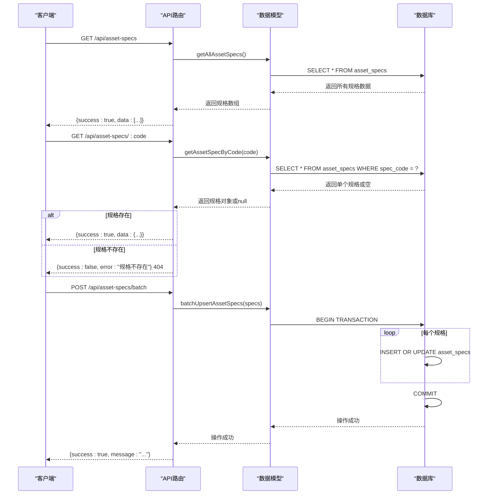
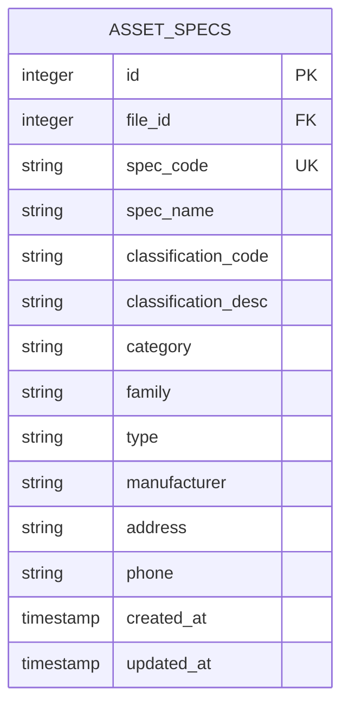

# 资产规格API

<cite>
**本文档引用文件**   
- [asset-spec.js](file://server/models/asset-spec.js)
- [api.js](file://server/routes/api.js)
- [schema.sql](file://server/db/schema.sql)
- [README.md](file://server/README.md)
- [MAPPING_CONFIG_IMPLEMENTATION.md](file://MAPPING_CONFIG_IMPLEMENTATION.md)
</cite>

## 目录
1. [简介](#简介)
2. [API端点说明](#api端点说明)
3. [资产规格字段定义](#资产规格字段定义)
4. [批量导入请求示例](#批量导入请求示例)
5. [404状态码处理逻辑](#404状态码处理逻辑)
6. [API在资产类型管理和数据标准化中的作用](#api在资产类型管理和数据标准化中的作用)

## 简介
资产规格API是Tandem系统中用于管理资产构件类型规格信息的核心接口。该API提供了获取和批量导入资产规格的功能，支持基于类型注释的资产分类和标准化管理。通过此API，系统能够从BIM模型中提取资产的规格信息，并将其存储在PostgreSQL数据库中，为后续的数据分析和资产管理提供基础。

**Section sources**
- [README.md](file://server/README.md#L1-L187)

## API端点说明
资产规格API提供了三个主要端点：

- `GET /api/asset-specs`：获取所有资产规格
- `GET /api/asset-specs/:code`：根据规格编码查询单个资产规格
- `POST /api/asset-specs/batch`：批量导入资产规格

这些端点通过Express路由在`server/routes/api.js`中定义，并与数据库模型进行交互以实现数据的读取和写入操作。



**Diagram sources**
- [api.js](file://server/routes/api.js#L57-L97)
- [asset-spec.js](file://server/models/asset-spec.js#L79-L92)

**Section sources**
- [api.js](file://server/routes/api.js#L57-L97)

## 资产规格字段定义
资产规格包含以下字段，这些字段定义了资产的技术参数和分类信息：

| 字段名 | 类型 | 说明 | 数据来源 |
|--------|------|------|----------|
| specCode | VARCHAR(100) | 规格编码（主键） | 类型注释 |
| specName | VARCHAR(200) | 规格名称 | 类型名称 |
| classificationCode | VARCHAR(100) | 分类编码 | OmniClass 21 编号 |
| classificationDesc | VARCHAR(500) | 分类描述 | OmniClass 21 描述 |
| category | VARCHAR(200) | 类别 | 类别 |
| family | VARCHAR(200) | 族 | 族 |
| type | VARCHAR(200) | 类型 | 类型 |
| manufacturer | VARCHAR(200) | 制造商 | 制造商 |
| address | VARCHAR(500) | 地址 | 地址 |
| phone | VARCHAR(50) | 电话 | 电话 |

这些字段在数据库表`asset_specs`中定义，并通过`server/db/schema.sql`文件中的SQL语句创建。每个字段都有明确的数据来源，确保了从BIM模型到数据库的数据映射一致性。



**Diagram sources**
- [schema.sql](file://server/db/schema.sql#L20-L36)

**Section sources**
- [schema.sql](file://server/db/schema.sql#L20-L36)
- [README.md](file://server/README.md#L16-L30)

## 批量导入请求示例
批量导入资产规格的请求体需要包含一个`specs`数组，数组中的每个对象代表一个资产规格。以下是正确的JSON结构示例：

```json
{
  "specs": [
    {
      "specCode": "HVAC-UNIT-01",
      "specName": "空调机组",
      "classificationCode": "21-01 10 10",
      "classificationDesc": "暖通空调设备",
      "category": "HVAC",
      "family": "空气处理单元",
      "type": "AHU",
      "manufacturer": "某空调制造商",
      "address": "上海市浦东新区",
      "phone": "021-12345678"
    },
    {
      "specCode": "PUMP-01",
      "specName": "水泵",
      "classificationCode": "21-01 15 10",
      "classificationDesc": "泵类设备",
      "category": "HVAC",
      "family": "循环泵",
      "type": "离心泵",
      "manufacturer": "某水泵制造商",
      "address": "江苏省苏州市",
      "phone": "0512-87654321"
    }
  ]
}
```

当发送POST请求到`/api/asset-specs/batch`时，服务器会验证请求体中是否包含`specs`数组，然后调用`batchUpsertAssetSpecs`方法逐个插入或更新资产规格。整个操作在数据库事务中执行，确保数据的一致性。

**Section sources**
- [api.js](file://server/routes/api.js#L86-L97)
- [asset-spec.js](file://server/models/asset-spec.js#L38-L74)

## 404状态码处理逻辑
当通过`GET /api/asset-specs/:code`端点查询不存在的资产规格时，系统会返回404状态码。具体的处理逻辑如下：

1. 客户端发送GET请求，URL中包含要查询的规格编码
2. 服务器路由接收到请求，调用`getAssetSpecByCode`方法
3. 数据模型执行SQL查询：`SELECT * FROM asset_specs WHERE spec_code = $1`
4. 如果查询结果为空（即没有找到匹配的规格），则返回`null`
5. 服务器检查返回结果，如果为`null`，则返回404状态码和错误信息
6. 响应体格式为：`{success: false, error: "规格不存在"}`

这种处理方式遵循RESTful API的最佳实践，使用标准的HTTP状态码来表示资源未找到的情况，使客户端能够正确处理错误情况。

```mermaid
flowchart TD
A[客户端请求 GET /api/asset-specs/:code] --> B{服务器接收请求}
B --> C[调用 getAssetSpecByCode(code)]
C --> D[执行数据库查询]
D --> E{查询结果存在?}
E --> |是| F[返回200和规格数据]
E --> |否| G[返回404和错误信息]
F --> H[客户端获取规格信息]
G --> I[客户端处理404错误]
```

**Diagram sources**
- [api.js](file://server/routes/api.js#L70-L80)

**Section sources**
- [api.js](file://server/routes/api.js#L70-L80)

## API在资产类型管理和数据标准化中的作用
资产规格API在资产类型管理和数据标准化中扮演着关键角色：

1. **统一规格管理**：通过`specCode`作为唯一标识，确保相同类型的资产在系统中具有统一的规格定义，避免了数据冗余和不一致。

2. **分类标准化**：利用OmniClass分类体系，将资产按照国际标准进行分类，便于跨项目、跨组织的数据比较和分析。

3. **数据集成**：作为从BIM模型到数据库的数据管道，该API实现了设计数据与运维数据的无缝集成，支持全生命周期的资产管理。

4. **批量处理能力**：`POST /api/asset-specs/batch`端点支持一次性导入大量资产规格，提高了数据初始化和更新的效率。

5. **数据完整性**：通过数据库事务和外键约束，确保了数据的完整性和一致性。例如，在`asset_specs`表中，`file_id`字段引用`model_files`表，建立了模型文件与资产规格之间的关联。

6. **灵活查询**：提供多种查询方式（获取所有规格、按编码查询），满足不同场景下的数据访问需求。

7. **扩展性**：API设计考虑了未来的扩展需求，可以通过添加新的字段或端点来支持更多的资产属性和功能。

通过这些功能，资产规格API不仅实现了基本的数据存储和检索，还为建筑信息模型的数字化管理提供了坚实的基础，促进了BIM数据在设施管理、维护计划、能耗分析等领域的应用。

**Section sources**
- [MAPPING_CONFIG_IMPLEMENTATION.md](file://MAPPING_CONFIG_IMPLEMENTATION.md#L1-L295)
- [README.md](file://server/README.md#L1-L187)