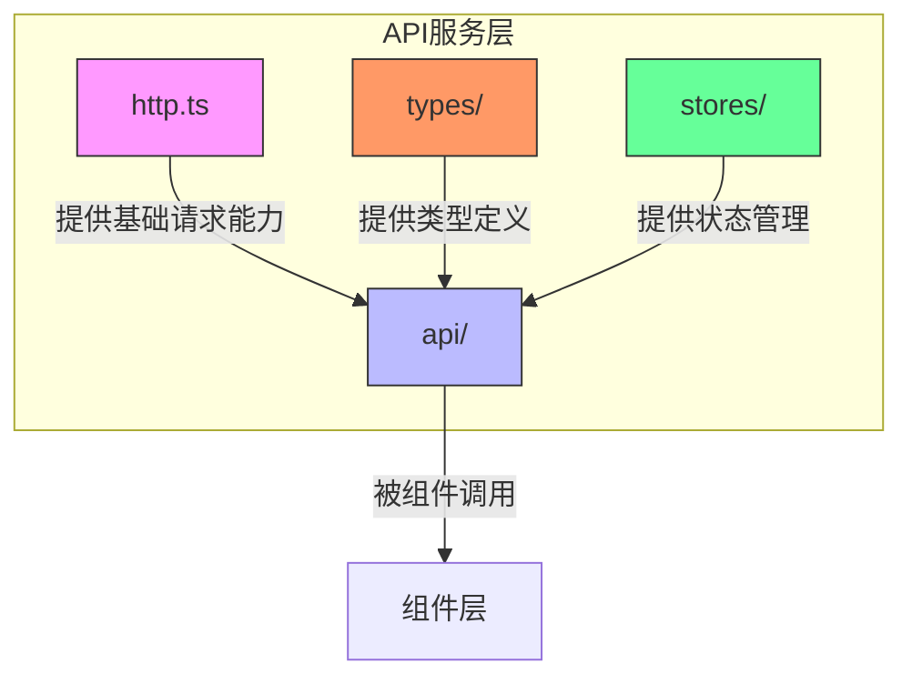
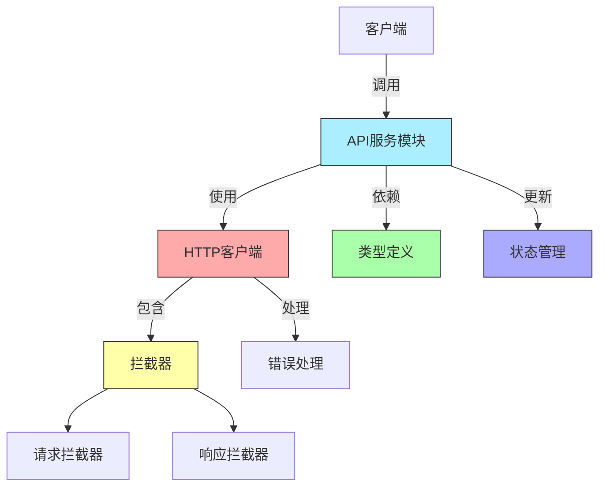
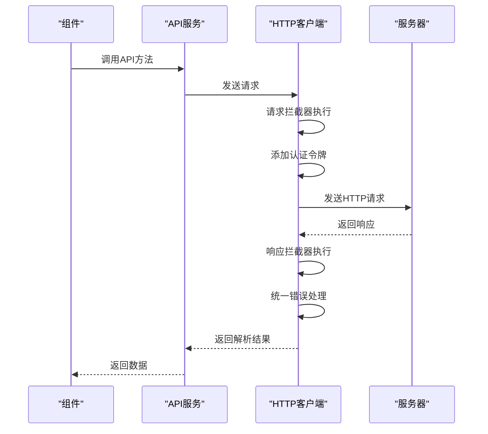
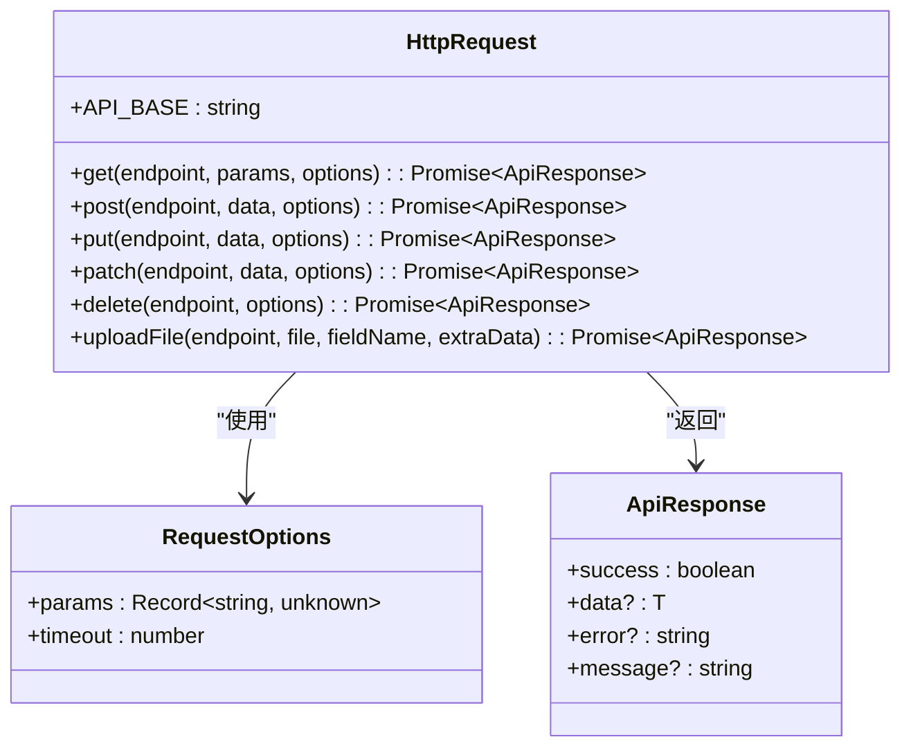
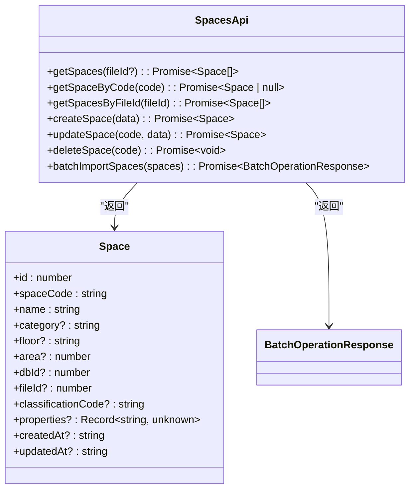
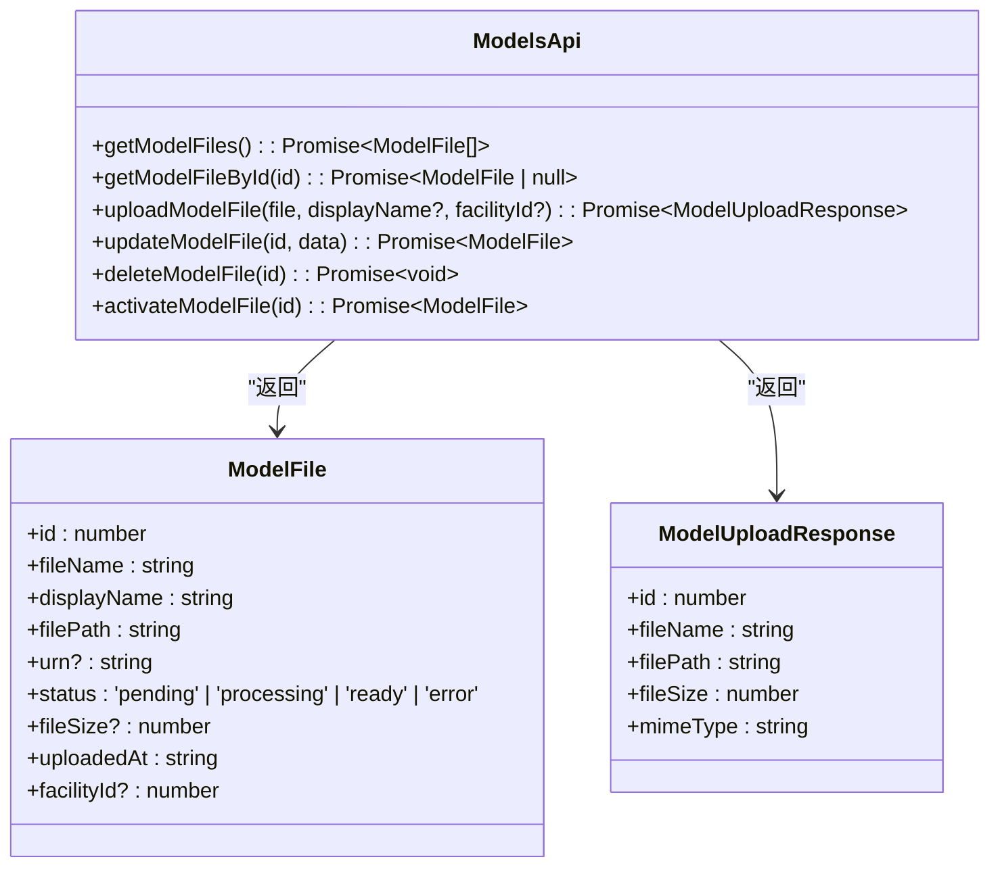
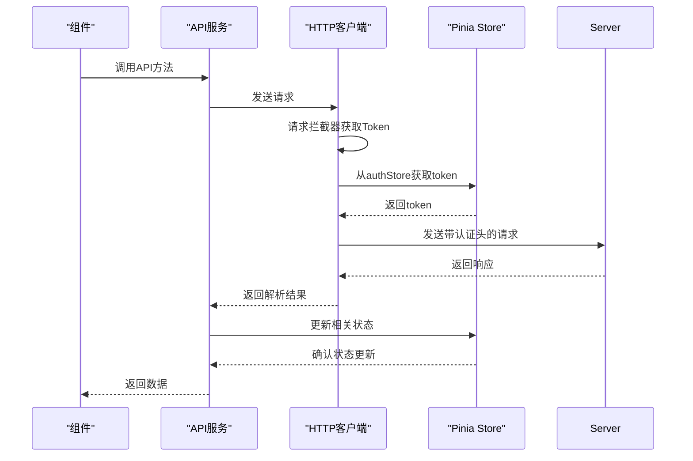
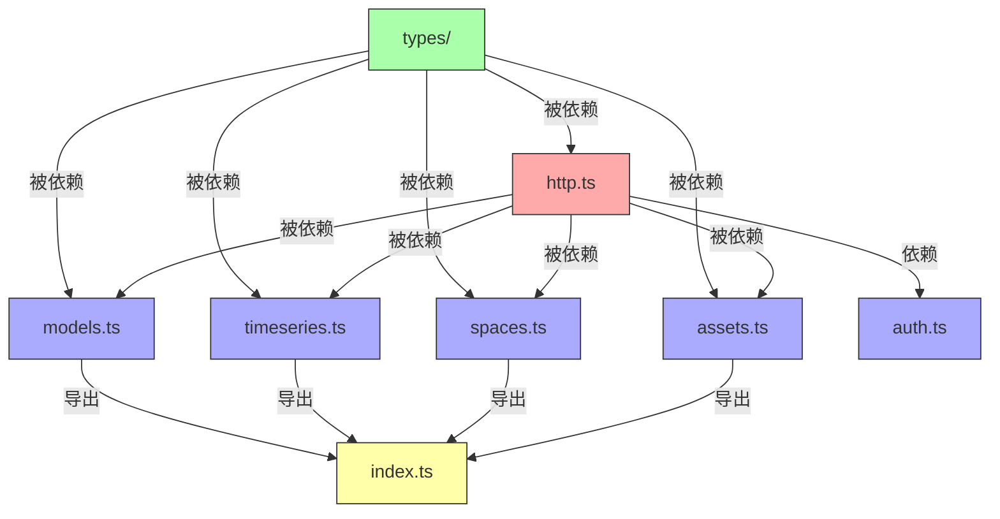

# API服务封装

<cite>
**本文档引用的文件**   
- [http.ts](file://src/services/http.ts)
- [assets.ts](file://src/services/api/assets.ts)
- [spaces.ts](file://src/services/api/spaces.ts)
- [timeseries.ts](file://src/services/api/timeseries.ts)
- [models.ts](file://src/services/api/models.ts)
- [api.ts](file://src/types/api.ts)
- [asset.ts](file://src/types/asset.ts)
- [space.ts](file://src/types/space.ts)
- [model.ts](file://src/types/model.ts)
- [auth.ts](file://src/stores/auth.ts)
</cite>

## 目录
1. [简介](#简介)
2. [项目结构](#项目结构)
3. [核心组件](#核心组件)
4. [架构概述](#架构概述)
5. [详细组件分析](#详细组件分析)
6. [依赖分析](#依赖分析)
7. [性能考虑](#性能考虑)
8. [故障排除指南](#故障排除指南)
9. [结论](#结论)

## 简介
本文档详细解析前端API服务层的设计与实现，重点说明`services/api/`目录下各模块如何封装RESTful接口调用，以及`http.ts`中axios实例的统一配置。阐述请求/响应拦截器在认证令牌注入、错误统一处理中的作用，并结合具体代码示例展示GET/POST请求的封装模式、参数序列化及类型安全保证。同时分析服务层与Pinia store的协作关系，讨论API调用的重试机制、缓存策略与并发控制。

## 项目结构



**图示来源**
- [http.ts](file://src/services/http.ts#L1-L220)
- [assets.ts](file://src/services/api/assets.ts#L1-L108)

**本节来源**
- [http.ts](file://src/services/http.ts#L1-L220)
- [api](file://src/services/api/)

## 核心组件

API服务层由多个核心组件构成，包括统一的HTTP请求封装、各业务模块的API服务、类型定义和状态管理。这些组件共同实现了前端与后端服务的高效、安全通信。

**本节来源**
- [http.ts](file://src/services/http.ts#L1-L220)
- [assets.ts](file://src/services/api/assets.ts#L1-L108)
- [spaces.ts](file://src/services/api/spaces.ts#L1-L88)

## 架构概述



**图示来源**
- [http.ts](file://src/services/http.ts#L1-L220)
- [auth.ts](file://src/stores/auth.ts#L1-L115)

## 详细组件分析

### HTTP请求封装分析

#### 请求/响应拦截器实现


**图示来源**
- [http.ts](file://src/services/http.ts#L1-L220)
- [auth.ts](file://src/stores/auth.ts#L21-L29)

#### 请求方法封装模式


**图示来源**
- [http.ts](file://src/services/http.ts#L1-L220)
- [api.ts](file://src/types/api.ts#L8-L13)

### 业务模块API服务分析

#### 资产模块API服务
```mermaid
classDiagram
class AssetsApi {
+getAssets(fileId?) : Promise~Asset[]~
+getAssetByCode(code) : Promise~Asset | null~
+getAssetsByFileId(fileId) : Promise~Asset[]~
+createAsset(data) : Promise~Asset~
+updateAsset(code, data) : Promise~Asset~
+deleteAsset(code) : Promise~void~
+batchImportAssets(assets) : Promise~BatchOperationResponse~
+getAssetSpecs(fileId?) : Promise~AssetSpec[]~
+getAssetSpecByCode(code) : Promise~AssetSpec | null~
}
AssetsApi --> Asset : "返回"
AssetsApi --> AssetSpec : "返回"
AssetsApi --> BatchOperationResponse : "返回"
class Asset {
+id : number
+assetCode : string
+specCode? : string
+name : string
+floor? : string
+room? : string
+dbId? : number
+fileId? : number
+properties? : Record~string, unknown~
+createdAt? : string
+updatedAt? : string
}
class AssetSpec {
+id : number
+specCode : string
+specName : string
+classificationCode? : string
+classificationName? : string
+manufacturer? : string
+address? : string
+phone? : string
+properties? : Record~string, unknown~
+propertyTemplateId? : number
}
class BatchOperationResponse {
+success : boolean
+total : number
+succeeded : number
+failed : number
+errors? : { index : number; error : string }[]
}
```

**图示来源**
- [assets.ts](file://src/services/api/assets.ts#L1-L108)
- [asset.ts](file://src/types/asset.ts#L5-L65)

#### 空间模块API服务


**图示来源**
- [spaces.ts](file://src/services/api/spaces.ts#L1-L88)
- [space.ts](file://src/types/space.ts#L5-L43)

#### 时序数据模块API服务
```mermaid
classDiagram
class TimeseriesApi {
+queryTimeSeries(query) : Promise~TimeSeriesPoint[]~
+queryMultipleTimeSeries(roomCodes, startTime, endTime, aggregateWindow?) : Promise~Record~string, TimeSeriesPoint[]~~
+getLatestValues(roomCodes) : Promise~LatestValue[]~
+getLatestValue(roomCode) : Promise~LatestValue | null~
+getStatistics(roomCode, startTime, endTime) : Promise~{ min : number; max : number; avg : number; count : number }~
}
TimeseriesApi --> TimeSeriesPoint : "返回"
TimeseriesApi --> LatestValue : "返回"
class TimeSeriesPoint {
+timestamp : number
+value : number
}
class TimeSeriesQuery {
+roomCode : string
+startTime : number
+endTime : number
+aggregateWindow? : string
}
class LatestValue {
+roomCode : string
+value : number
+timestamp : number
}
```

**图示来源**
- [timeseries.ts](file://src/services/api/timeseries.ts#L1-L95)
- [timeseries.ts](file://src/services/api/timeseries.ts#L8-L24)

#### 模型文件模块API服务


**图示来源**
- [models.ts](file://src/services/api/models.ts#L1-L88)
- [model.ts](file://src/types/model.ts)

### 服务层与状态管理协作分析



**图示来源**
- [http.ts](file://src/services/http.ts#L21-L28)
- [auth.ts](file://src/stores/auth.ts#L22-L27)

**本节来源**
- [http.ts](file://src/services/http.ts#L1-L220)
- [assets.ts](file://src/services/api/assets.ts#L1-L108)
- [spaces.ts](file://src/services/api/spaces.ts#L1-L88)
- [timeseries.ts](file://src/services/api/timeseries.ts#L1-L95)
- [models.ts](file://src/services/api/models.ts#L1-L88)
- [auth.ts](file://src/stores/auth.ts#L1-L115)

## 依赖分析



**图示来源**
- [http.ts](file://src/services/http.ts#L4)
- [assets.ts](file://src/services/api/assets.ts#L4)
- [spaces.ts](file://src/services/api/spaces.ts#L4)
- [timeseries.ts](file://src/services/api/timeseries.ts#L4)
- [models.ts](file://src/services/api/models.ts#L4)
- [index.ts](file://src/services/api/index.ts#L6-L9)

## 性能考虑

API服务层在设计时考虑了多项性能优化策略：

1. **请求超时控制**：所有请求都设置了30秒的默认超时时间，避免长时间等待
2. **错误统一处理**：通过统一的错误处理机制，减少重复代码，提高错误处理效率
3. **类型安全**：使用TypeScript接口确保数据类型安全，减少运行时错误
4. **参数序列化**：自动处理查询参数的序列化，提高请求构建效率
5. **并发控制**：通过AbortController实现请求取消，有效控制并发请求

**本节来源**
- [http.ts](file://src/services/http.ts#L68-L85)

## 故障排除指南

### 常见问题及解决方案

| 问题现象 | 可能原因 | 解决方案 |
|--------|--------|--------|
| 请求超时 | 网络延迟或服务器响应慢 | 检查网络连接，确认服务器状态 |
| 认证失败 | Token失效或未正确传递 | 检查authStore中的token状态，确认请求头是否正确添加 |
| 数据获取为空 | 查询参数错误或数据不存在 | 验证查询参数的正确性，确认后端数据是否存在 |
| 文件上传失败 | 文件格式或大小不符合要求 | 检查文件类型和大小限制，确认上传接口要求 |

### 调试技巧

1. **启用浏览器开发者工具**：监控网络请求，查看请求/响应详情
2. **检查请求头**：确认Authorization头是否正确包含Bearer Token
3. **验证查询参数**：确保GET请求的查询参数正确序列化
4. **查看控制台日志**：检查是否有JavaScript错误或警告信息

### Mock数据集成方案

为便于开发和测试，可以实现Mock数据集成：

1. **创建Mock服务层**：实现与真实API相同接口的Mock版本
2. **条件性导入**：根据环境变量决定使用真实API还是Mock服务
3. **数据模拟**：使用faker.js等工具生成符合类型定义的测试数据
4. **延迟模拟**：为Mock接口添加随机延迟，模拟真实网络环境

**本节来源**
- [http.ts](file://src/services/http.ts#L51-L58)
- [auth.ts](file://src/stores/auth.ts#L50-L78)

## 结论

本文档详细解析了前端API服务层的设计与实现。API服务层采用分层架构，通过`http.ts`提供统一的HTTP请求封装，各业务模块（assets、spaces、timeseries等）在`services/api/`目录下封装具体的RESTful接口调用。`http.ts`中的请求封装实现了基础URL、超时设置和请求/响应拦截器的统一配置，其中请求拦截器负责注入认证令牌，响应拦截器负责统一错误处理。

服务层通过TypeScript接口保证了类型安全，所有API调用都返回符合`ApiResponse<T>`格式的响应，确保了数据的一致性和可预测性。API服务与Pinia store紧密协作，authStore提供认证状态和Token，其他store接收API返回的数据并更新应用状态。

该设计模式具有良好的可维护性和扩展性，新业务模块可以轻松添加到API服务层，而无需重复实现基础请求逻辑。同时，统一的错误处理和认证机制确保了应用的安全性和用户体验。