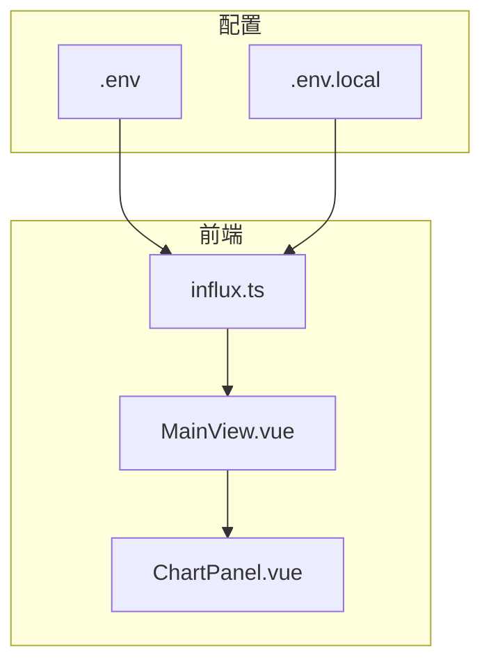
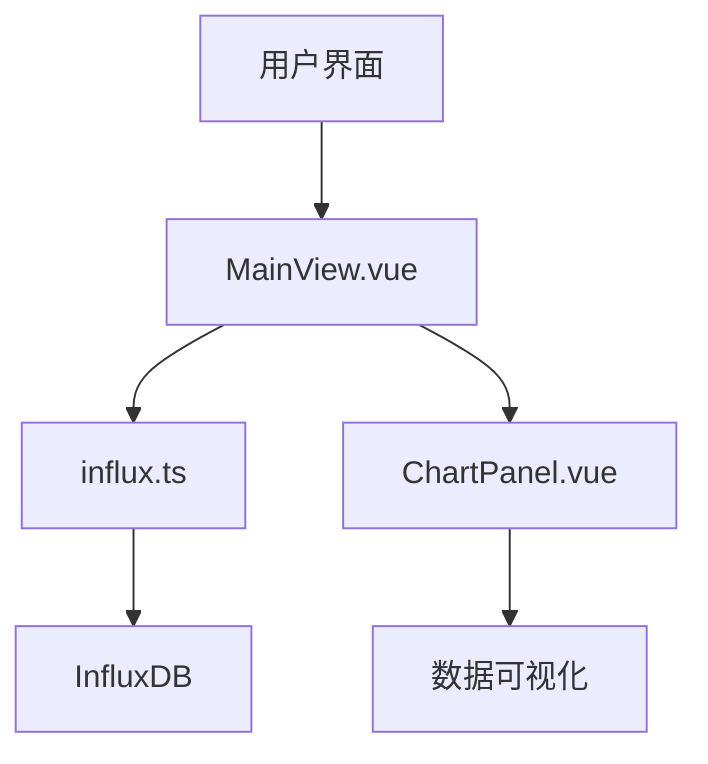
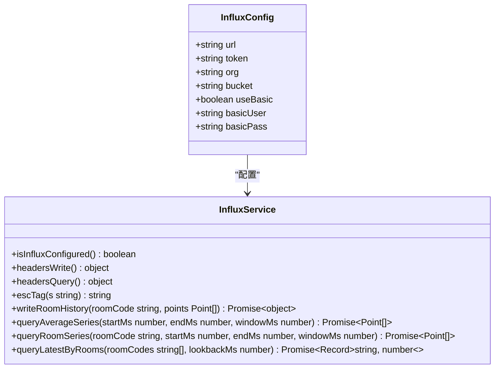
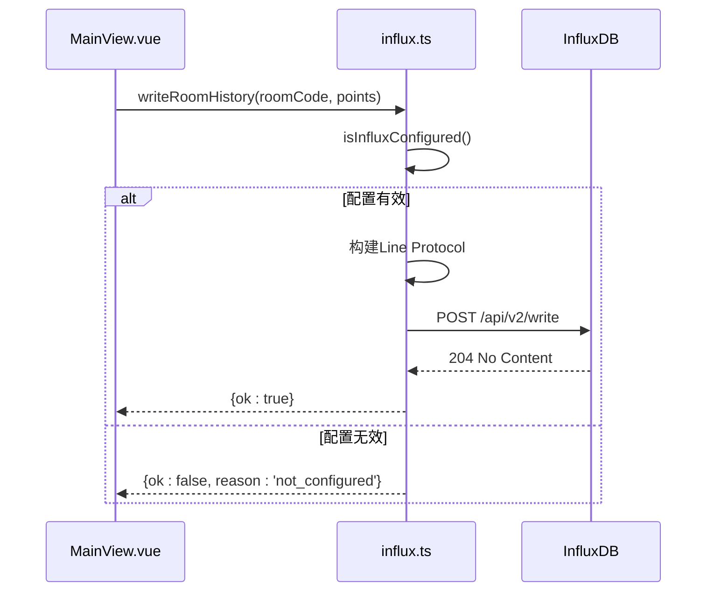
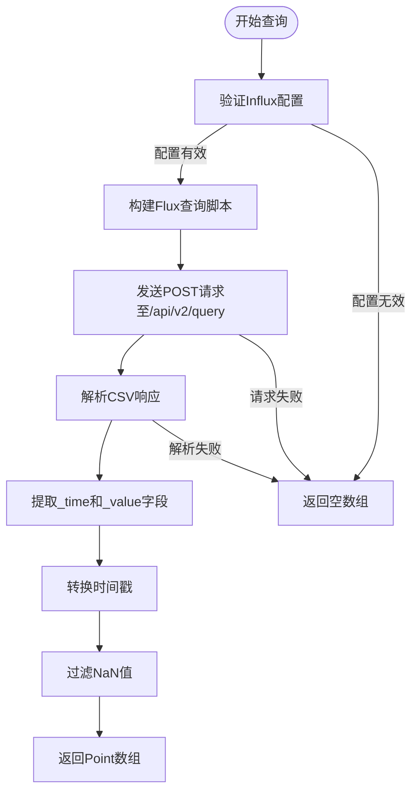
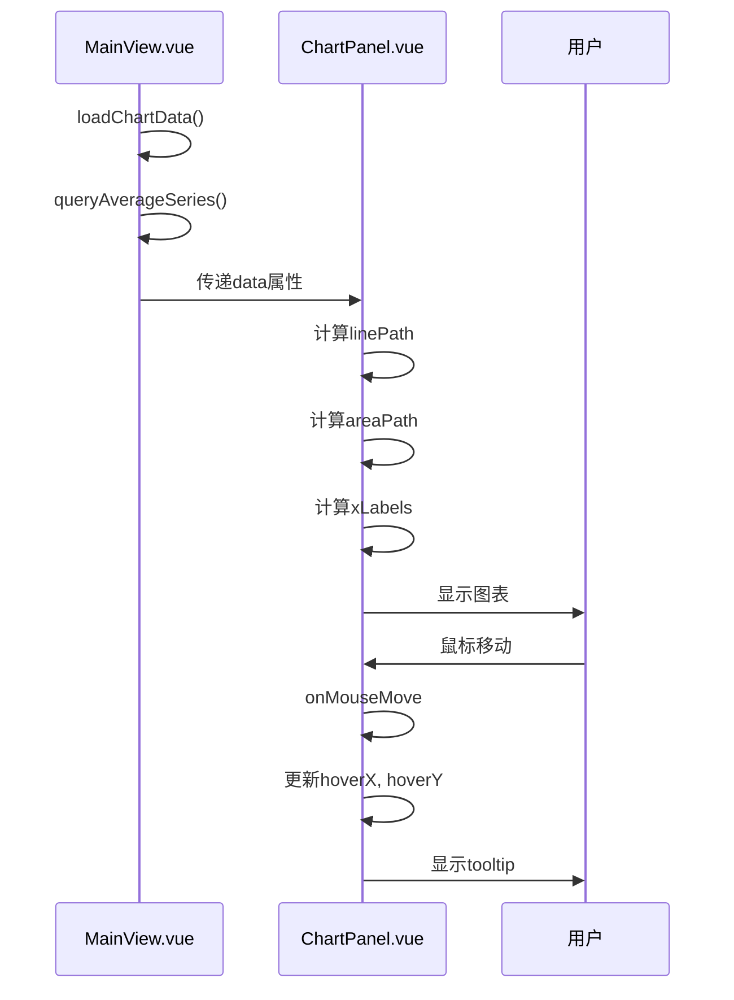
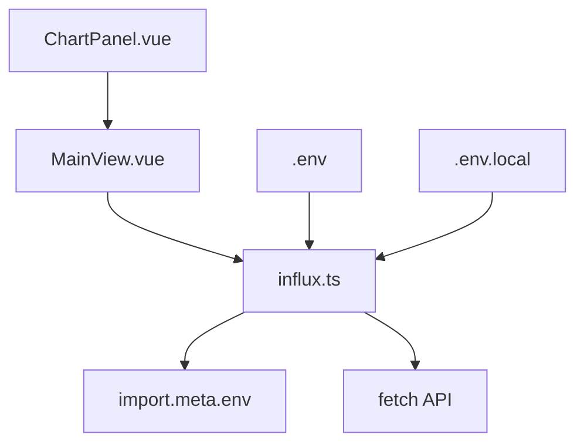

# InfluxDB时序服务模块

<cite>
**本文档引用文件**   
- [influx.ts](file://src/services/influx.ts)
- [.env](file://.env)
- [.env.local](file://.env.local)
- [MainView.vue](file://src/components/MainView.vue)
- [ChartPanel.vue](file://src/components/ChartPanel.vue)
</cite>

## 目录
1. [项目结构](#项目结构)
2. [核心组件](#核心组件)
3. [架构概述](#架构概述)
4. [详细组件分析](#详细组件分析)
5. [依赖分析](#依赖分析)
6. [性能考虑](#性能考虑)
7. [故障排除指南](#故障排除指南)

## 项目结构

项目结构显示了前端Vue.js应用与后端服务的分离。`src/services/influx.ts`是前端与InfluxDB交互的核心模块，位于`src/services/`目录下。环境变量配置文件`.env`和`.env.local`位于项目根目录，用于存储InfluxDB连接参数。前端组件`ChartPanel.vue`和`MainView.vue`位于`src/components/`目录，负责数据可视化和业务逻辑处理。

**图示来源**
- [influx.ts](file://src/services/influx.ts)
- [.env](file://.env)
- [.env.local](file://.env.local)
- [MainView.vue](file://src/components/MainView.vue)
- [ChartPanel.vue](file://src/components/ChartPanel.vue)

**本节来源**
- [influx.ts](file://src/services/influx.ts)
- [.env](file://.env)
- [.env.local](file://.env.local)

## 核心组件

`influx.ts`模块是前端与InfluxDB 2.0+数据库交互的核心服务，提供了环境配置校验、数据写入和多种查询功能。该模块通过Flux查询语言与InfluxDB进行通信，支持基本认证和令牌认证两种安全模式。`MainView.vue`组件作为主要业务逻辑控制器，负责调用influx服务获取数据并驱动UI更新。`ChartPanel.vue`组件则专注于时序数据的可视化呈现。

**本节来源**
- [influx.ts](file://src/services/influx.ts)
- [MainView.vue](file://src/components/MainView.vue)
- [ChartPanel.vue](file://src/components/ChartPanel.vue)

## 架构概述

系统架构采用前后端分离模式，前端Vue.js应用通过HTTP API直接与InfluxDB时序数据库通信。`influx.ts`服务模块封装了所有与InfluxDB的交互逻辑，包括认证、数据写入和查询操作。`MainView.vue`作为核心业务组件，定期调用influx服务获取最新数据并更新UI状态。`ChartPanel.vue`组件接收来自父组件的数据并渲染为可视化图表。

**图示来源**
- [influx.ts](file://src/services/influx.ts)
- [MainView.vue](file://src/components/MainView.vue)
- [ChartPanel.vue](file://src/components/ChartPanel.vue)

## 详细组件分析

### InfluxDB服务模块分析

#### 服务配置与认证机制

**图示来源**
- [influx.ts](file://src/services/influx.ts)

#### 数据写入流程

**图示来源**
- [influx.ts](file://src/services/influx.ts)

#### 查询流程

**图示来源**
- [influx.ts](file://src/services/influx.ts)

**本节来源**
- [influx.ts](file://src/services/influx.ts)

### 图表组件分析

#### 图表渲染流程

**图示来源**
- [MainView.vue](file://src/components/MainView.vue)
- [ChartPanel.vue](file://src/components/ChartPanel.vue)

**本节来源**
- [MainView.vue](file://src/components/MainView.vue)
- [ChartPanel.vue](file://src/components/ChartPanel.vue)

## 依赖分析

**图示来源**
- [influx.ts](file://src/services/influx.ts)
- [MainView.vue](file://src/components/MainView.vue)
- [ChartPanel.vue](file://src/components/ChartPanel.vue)
- [.env](file://.env)
- [.env.local](file://.env.local)

**本节来源**
- [influx.ts](file://src/services/influx.ts)
- [MainView.vue](file://src/components/MainView.vue)
- [ChartPanel.vue](file://src/components/ChartPanel.vue)
- [.env](file://.env)
- [.env.local](file://.env.local)

## 性能考虑

当前实现中，`queryAverageSeries`和`queryRoomSeries`等查询方法会根据时间范围自动计算聚合窗口大小，这有助于控制返回的数据点数量。`MainView.vue`中的自动刷新机制每分钟执行一次，避免了过于频繁的数据库查询。`ChartPanel.vue`组件使用SVG进行图表渲染，相比Canvas具有更好的性能表现。建议在生产环境中进一步优化，如实现前端数据缓存机制，避免重复查询相同时间范围的数据。

## 故障排除指南

当InfluxDB数据无法正常显示时，首先检查`.env`或`.env.local`文件中的配置是否正确。确保`VITE_INFLUX_URL`、`VITE_INFLUX_ORG`、`VITE_INFLUX_BUCKET`和`VITE_INFLUX_TOKEN`等环境变量已正确设置。如果使用基本认证，需确保`VITE_INFLUX_BASIC`设置为`true`，并提供正确的用户名和密码。在浏览器开发者工具中检查网络请求，确认查询请求是否成功发送，以及返回的CSV数据是否符合预期格式。如果查询返回空数据，检查InfluxDB中是否存在对应的时间范围和标签数据。

**本节来源**
- [influx.ts](file://src/services/influx.ts)
- [.env](file://.env)
- [.env.local](file://.env.local)
- [MainView.vue](file://src/components/MainView.vue)