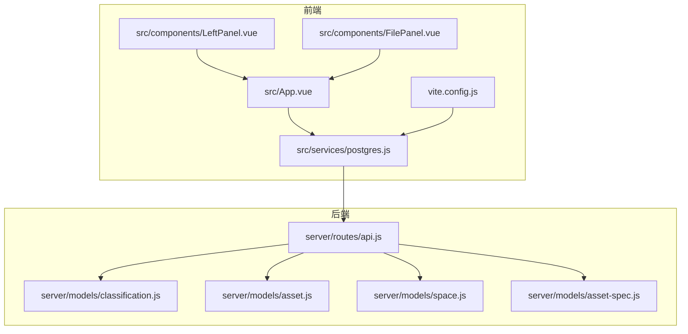
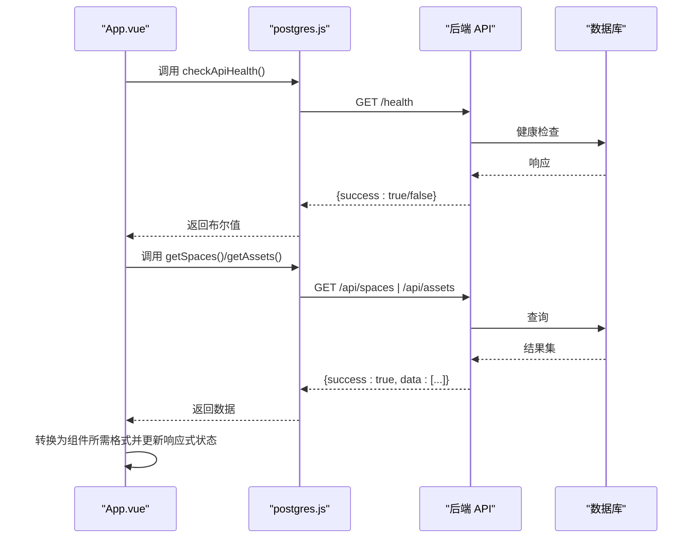
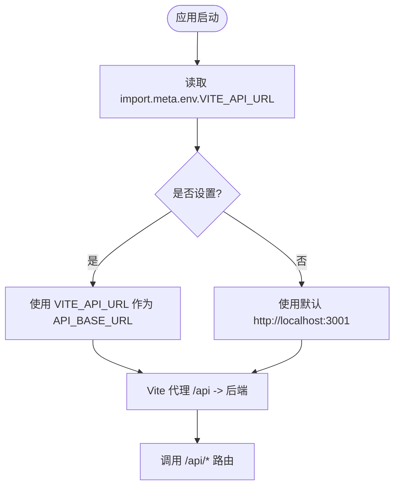
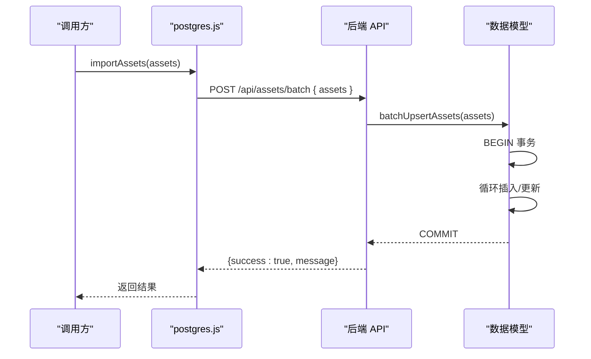
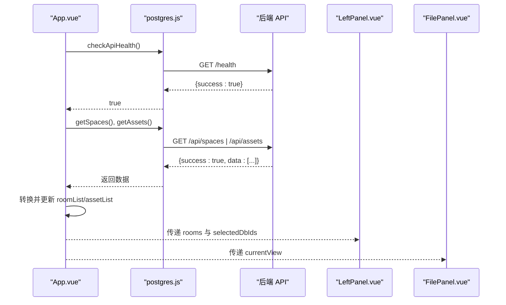
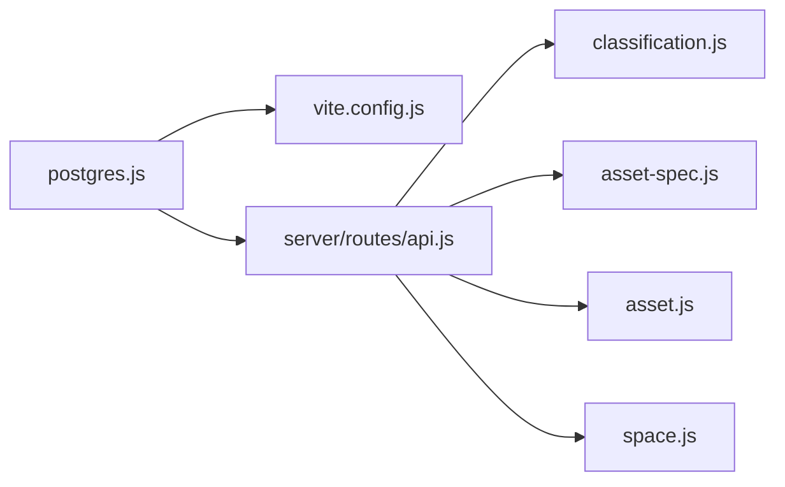

# PostgreSQL服务模块

<cite>
**本文引用的文件**
- [postgres.js](file://src/services/postgres.js)
- [App.vue](file://src/App.vue)
- [LeftPanel.vue](file://src/components/LeftPanel.vue)
- [FilePanel.vue](file://src/components/FilePanel.vue)
- [vite.config.js](file://vite.config.js)
- [api.js](file://server/routes/api.js)
- [classification.js](file://server/models/classification.js)
- [asset.js](file://server/models/asset.js)
- [space.js](file://server/models/space.js)
- [asset-spec.js](file://server/models/asset-spec.js)
- [.env](file://.env)
- [.env.local](file://.env.local)
</cite>

## 目录
1. [简介](#简介)
2. [项目结构](#项目结构)
3. [核心组件](#核心组件)
4. [架构总览](#架构总览)
5. [详细组件分析](#详细组件分析)
6. [依赖分析](#依赖分析)
7. [性能考虑](#性能考虑)
8. [故障排查指南](#故障排查指南)
9. [结论](#结论)
10. [附录](#附录)

## 简介
本文件对前端服务模块 src/services/postgres.js 进行深入分析，阐明其作为前端与 PostgreSQL 后端通信桥梁的设计与实现。重点涵盖：
- API_BASE_URL 的配置机制与环境变量 VITE_API_URL 的优先级处理
- 导出函数的功能与实现细节：健康检查、分类编码、资产与空间数据获取、资产规格获取
- 批量导入功能（分类编码、资产规格、资产、空间）的 HTTP POST 请求构造、JSON 序列化与错误处理
- 在 App.vue 中的应用初始化与 UI 驱动流程
- 异常捕获模式、加载状态管理与网络重试策略最佳实践

## 项目结构
该模块位于前端 src/services 目录，负责封装与后端 API 的交互；后端路由位于 server/routes/api.js，对应的数据访问层位于 server/models 下的各模型文件。

**图表来源**
- [postgres.js](file://src/services/postgres.js#L1-L245)
- [App.vue](file://src/App.vue#L146-L353)
- [LeftPanel.vue](file://src/components/LeftPanel.vue#L81-L178)
- [FilePanel.vue](file://src/components/FilePanel.vue#L231-L311)
- [vite.config.js](file://vite.config.js#L1-L21)
- [api.js](file://server/routes/api.js#L1-L517)
- [classification.js](file://server/models/classification.js#L1-L119)
- [asset.js](file://server/models/asset.js#L1-L253)
- [space.js](file://server/models/space.js#L1-L220)
- [asset-spec.js](file://server/models/asset-spec.js#L1-L166)

**章节来源**
- [postgres.js](file://src/services/postgres.js#L1-L245)
- [vite.config.js](file://vite.config.js#L1-L21)

## 核心组件
- API 基础地址与环境变量
  - 前端通过 import.meta.env.VITE_API_URL 获取后端基础地址，若未设置则回退到 http://localhost:3001。
  - Vite 开发服务器通过代理将 /api 前缀转发至本地后端服务，便于跨域与开发调试。
- 健康检查
  - checkApiHealth 发送 /health 请求，返回布尔值指示后端可用性。
- 数据获取
  - getClassifications：支持按类型过滤（资产/空间）
  - getAssetSpecs：获取资产规格
  - getAssets / getAssetsByFloor / getAssetsByRoom：获取资产数据
  - getSpaces / getSpacesByFloor：获取空间数据
- 批量导入
  - importClassifications / importAssetSpecs / importAssets / importSpaces：POST JSON，返回统一结构
  - importModelData：从模型数据批量导入资产、空间、分类与规格

上述函数均遵循统一的响应结构：success 字段标识成功与否，data 或 error 字段承载业务数据或错误信息。失败时抛出错误，便于上层捕获与处理。

**章节来源**
- [postgres.js](file://src/services/postgres.js#L6-L19)
- [postgres.js](file://src/services/postgres.js#L21-L38)
- [postgres.js](file://src/services/postgres.js#L40-L52)
- [postgres.js](file://src/services/postgres.js#L54-L66)
- [postgres.js](file://src/services/postgres.js#L71-L94)
- [postgres.js](file://src/services/postgres.js#L100-L122)
- [postgres.js](file://src/services/postgres.js#L128-L144)
- [postgres.js](file://src/services/postgres.js#L149-L165)
- [postgres.js](file://src/services/postgres.js#L170-L186)
- [postgres.js](file://src/services/postgres.js#L191-L207)
- [postgres.js](file://src/services/postgres.js#L212-L228)

## 架构总览
前端通过 postgres.js 与后端 API 交互，App.vue 在应用初始化时异步加载数据库数据并驱动 UI；LeftPanel 与 FilePanel 等组件消费这些数据进行渲染与交互。

**图表来源**
- [App.vue](file://src/App.vue#L293-L353)
- [postgres.js](file://src/services/postgres.js#L12-L19)
- [postgres.js](file://src/services/postgres.js#L99-L122)
- [postgres.js](file://src/services/postgres.js#L54-L66)
- [api.js](file://server/routes/api.js#L206-L247)
- [api.js](file://server/routes/api.js#L100-L157)

## 详细组件分析

### API_BASE_URL 与环境变量优先级
- 前端读取 import.meta.env.VITE_API_URL，若未设置则回退到 http://localhost:3001。
- Vite 配置将 /api 前缀代理到后端服务，开发环境下无需手动拼接完整主机地址。
- 服务器端路由以 /api 开头，统一由后端处理。

**图表来源**
- [postgres.js](file://src/services/postgres.js#L6-L19)
- [vite.config.js](file://vite.config.js#L7-L18)

**章节来源**
- [postgres.js](file://src/services/postgres.js#L6-L19)
- [vite.config.js](file://vite.config.js#L7-L18)
- [.env](file://.env#L1-L6)
- [.env.local](file://.env.local#L1-L15)

### 健康检查：checkApiHealth
- 行为：向 /health 发送请求，返回 response.ok 的布尔值。
- 错误处理：捕获异常并返回 false，避免阻断应用初始化流程。

**章节来源**
- [postgres.js](file://src/services/postgres.js#L12-L19)

### 分类编码：getClassifications
- 参数：type 可选，支持 'asset' 或 'space'
- 实现：根据 type 生成查询参数，GET /api/classifications?type=...
- 错误处理：当 data.success 为 false 时抛出错误，包含 error 或默认提示

**章节来源**
- [postgres.js](file://src/services/postgres.js#L21-L38)
- [api.js](file://server/routes/api.js#L18-L31)
- [classification.js](file://server/models/classification.js#L83-L99)

### 资产规格：getAssetSpecs
- 实现：GET /api/asset-specs
- 错误处理：当 data.success 为 false 时抛出错误

**章节来源**
- [postgres.js](file://src/services/postgres.js#L40-L52)
- [api.js](file://server/routes/api.js#L53-L81)
- [asset-spec.js](file://server/models/asset-spec.js#L76-L83)

### 资产数据：getAssets / getAssetsByFloor / getAssetsByRoom
- 实现：
  - getAssets：GET /api/assets
  - getAssetsByFloor：GET /api/assets/floor/:floor
  - getAssetsByRoom：GET /api/assets/room/:room
- 错误处理：当 data.success 为 false 时抛出错误
- 后端模型：通过 LEFT JOIN 资产规格表返回完整字段

**章节来源**
- [postgres.js](file://src/services/postgres.js#L54-L94)
- [api.js](file://server/routes/api.js#L103-L157)
- [asset.js](file://server/models/asset.js#L63-L133)

### 空间数据：getSpaces / getSpacesByFloor
- 实现：
  - getSpaces：GET /api/spaces
  - getSpacesByFloor：GET /api/spaces/floor/:floor
- 错误处理：当 data.success 为 false 时抛出错误

**章节来源**
- [postgres.js](file://src/services/postgres.js#L96-L122)
- [api.js](file://server/routes/api.js#L208-L248)
- [space.js](file://server/models/space.js#L72-L97)

### 批量导入：importClassifications / importAssetSpecs / importAssets / importSpaces
- 请求构造：
  - POST /api/classifications/batch、/api/asset-specs/batch、/api/assets/batch、/api/spaces/batch
  - Content-Type: application/json
  - body：JSON.stringify({ classifications/specs/assets/spaces })
- 错误处理：当 data.success 为 false 时抛出错误
- 后端模型：批量 upsert，使用事务包裹，确保一致性

**图表来源**
- [postgres.js](file://src/services/postgres.js#L191-L207)
- [api.js](file://server/routes/api.js#L158-L174)
- [asset.js](file://server/models/asset.js#L31-L60)

**章节来源**
- [postgres.js](file://src/services/postgres.js#L149-L165)
- [postgres.js](file://src/services/postgres.js#L170-L186)
- [postgres.js](file://src/services/postgres.js#L191-L207)
- [postgres.js](file://src/services/postgres.js#L212-L228)
- [api.js](file://server/routes/api.js#L32-L47)
- [api.js](file://server/routes/api.js#L82-L97)
- [api.js](file://server/routes/api.js#L158-L174)
- [api.js](file://server/routes/api.js#L249-L264)
- [classification.js](file://server/models/classification.js#L35-L81)
- [asset-spec.js](file://server/models/asset-spec.js#L34-L74)
- [asset.js](file://server/models/asset.js#L31-L60)
- [space.js](file://server/models/space.js#L32-L70)

### 综合导入：importModelData
- 请求构造：POST /api/import/model-data，body 包含 { fileId, assets, spaces, clearExisting }
- 后端流程：提取并保存分类编码、资产规格、资产与空间，支持按文件清理旧数据
- 错误处理：当 data.success 为 false 时抛出错误

**章节来源**
- [postgres.js](file://src/services/postgres.js#L128-L144)
- [api.js](file://server/routes/api.js#L297-L464)
- [classification.js](file://server/models/classification.js#L35-L81)
- [asset-spec.js](file://server/models/asset-spec.js#L107-L156)
- [asset.js](file://server/models/asset.js#L160-L200)
- [space.js](file://server/models/space.js#L126-L168)

### 在 App.vue 中的应用初始化与 UI 驱动
- 初始化流程：
  - onMounted 时调用 checkApiHealth，若健康则拉取 getSpaces 与 getAssets，转换为组件所需格式并更新响应式状态
  - 若 API 不可用，使用模型数据作为后备
- 视图切换与选择：
  - LeftPanel 通过 props 接收房间列表，支持多选与属性展示
  - FilePanel 加载文件列表，激活文件后拉取该文件的资产与空间数据并驱动 UI

**图表来源**
- [App.vue](file://src/App.vue#L293-L353)
- [LeftPanel.vue](file://src/components/LeftPanel.vue#L81-L178)
- [FilePanel.vue](file://src/components/FilePanel.vue#L231-L311)
- [postgres.js](file://src/services/postgres.js#L99-L122)
- [postgres.js](file://src/services/postgres.js#L54-L66)

**章节来源**
- [App.vue](file://src/App.vue#L293-L353)
- [LeftPanel.vue](file://src/components/LeftPanel.vue#L81-L178)
- [FilePanel.vue](file://src/components/FilePanel.vue#L231-L311)

## 依赖分析
- 前端依赖
  - Vite 代理：/api -> http://localhost:3001，简化跨域与开发调试
  - 环境变量：VITE_API_URL 优先于硬编码默认值
- 后端依赖
  - 路由：统一以 /api 开头，按资源划分（分类、资产规格、资产、空间、导入）
  - 模型：提供批量 upsert、事务封装与字段校验

**图表来源**
- [postgres.js](file://src/services/postgres.js#L1-L245)
- [vite.config.js](file://vite.config.js#L7-L18)
- [api.js](file://server/routes/api.js#L1-L517)
- [classification.js](file://server/models/classification.js#L1-L119)
- [asset-spec.js](file://server/models/asset-spec.js#L1-L166)
- [asset.js](file://server/models/asset.js#L1-L253)
- [space.js](file://server/models/space.js#L1-L220)

**章节来源**
- [vite.config.js](file://vite.config.js#L7-L18)
- [api.js](file://server/routes/api.js#L1-L517)

## 性能考虑
- 批量导入采用数据库事务，减少多次往返与锁竞争，提升吞吐量
- 前端按需加载：在 App.vue 中仅在 API 可用时才拉取数据库数据，避免不必要的网络请求
- 过滤查询：按楼层/房间过滤可减少传输与前端处理负担
- 建议
  - 对高频接口增加缓存策略（如内存缓存或浏览器缓存）
  - 对大数据集分页或懒加载，避免一次性渲染过多节点
  - 对批量导入增加进度反馈与取消机制

[本节为通用指导，无需特定文件来源]

## 故障排查指南
- 健康检查失败
  - 确认后端服务运行与 /health 可达
  - 检查 Vite 代理配置与网络连通性
- API 返回错误
  - 统一响应结构包含 error 字段，可在上层捕获并提示用户
  - 对批量导入，确认请求体格式与必填字段
- 环境变量问题
  - 确认 VITE_API_URL 是否正确设置
  - .env 与 .env.local 中的变量不会影响 import.meta.env（Vite 环境变量注入）

**章节来源**
- [postgres.js](file://src/services/postgres.js#L12-L19)
- [postgres.js](file://src/services/postgres.js#L21-L38)
- [postgres.js](file://src/services/postgres.js#L40-L52)
- [postgres.js](file://src/services/postgres.js#L54-L66)
- [postgres.js](file://src/services/postgres.js#L71-L94)
- [postgres.js](file://src/services/postgres.js#L100-L122)
- [postgres.js](file://src/services/postgres.js#L149-L165)
- [postgres.js](file://src/services/postgres.js#L170-L186)
- [postgres.js](file://src/services/postgres.js#L191-L207)
- [postgres.js](file://src/services/postgres.js#L212-L228)
- [vite.config.js](file://vite.config.js#L7-L18)

## 结论
postgres.js 以简洁一致的 API 设计，将前端与 PostgreSQL 后端紧密耦合。通过统一的响应结构与错误处理，配合 App.vue 的初始化流程与 LeftPanel/FilePanel 的 UI 驱动，实现了从数据库加载到界面渲染的闭环。批量导入功能借助后端事务与模型层 upsert，保障了数据一致性与性能。建议在生产环境中引入缓存、分页与重试策略，进一步提升用户体验与系统稳定性。

[本节为总结性内容，无需特定文件来源]

## 附录

### API 调用异常捕获与加载状态管理建议
- 异常捕获
  - 在调用处使用 try/catch 包裹，读取 data.error 并提示用户
  - 对批量导入，记录导入条数与错误详情，便于回溯
- 加载状态
  - 在 App.vue 中使用 isLoadingFromDb 控制加载提示
  - 对文件面板使用 isLoading 控制空状态与加载动画
- 网络重试策略
  - 对非幂等请求谨慎重试
  - 对幂等请求（如 GET）可采用指数退避重试
  - 对批量导入建议提供“重试上次失败批次”的能力

[本节为通用指导，无需特定文件来源]