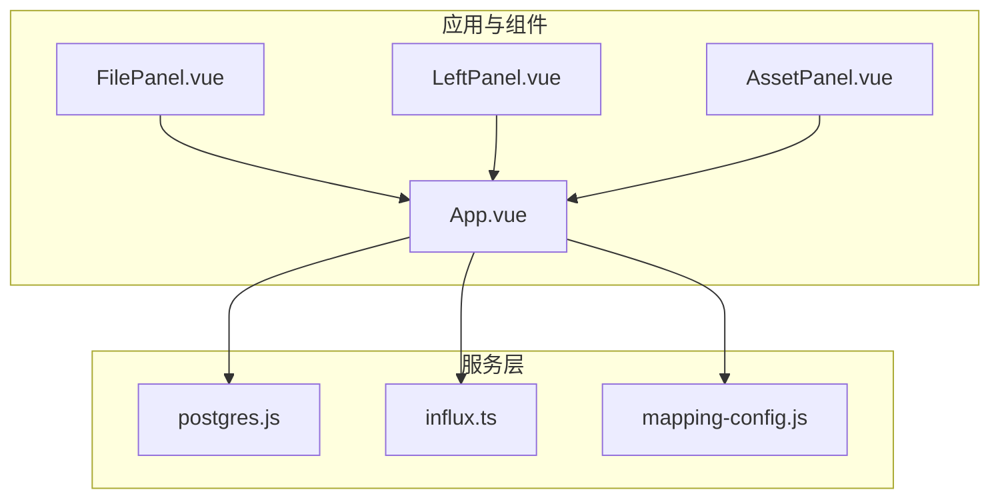
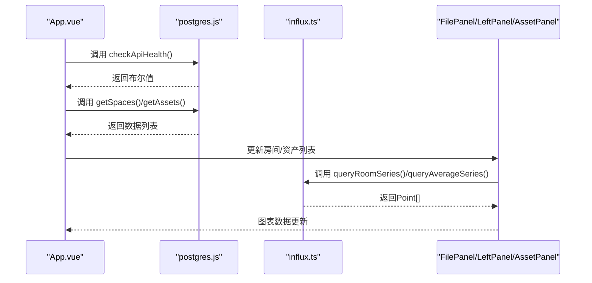
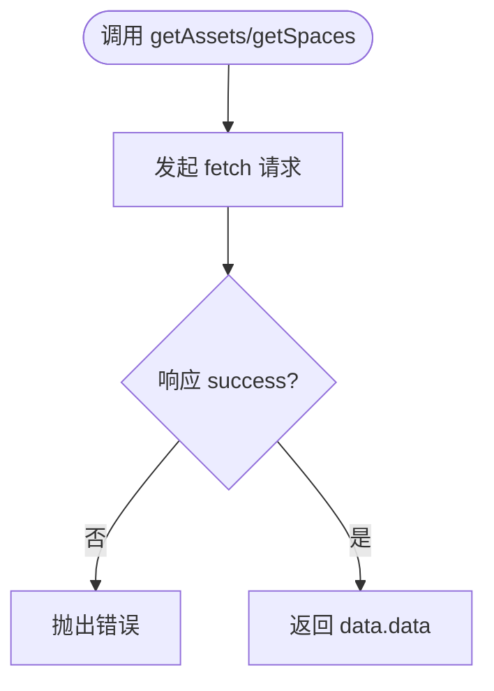
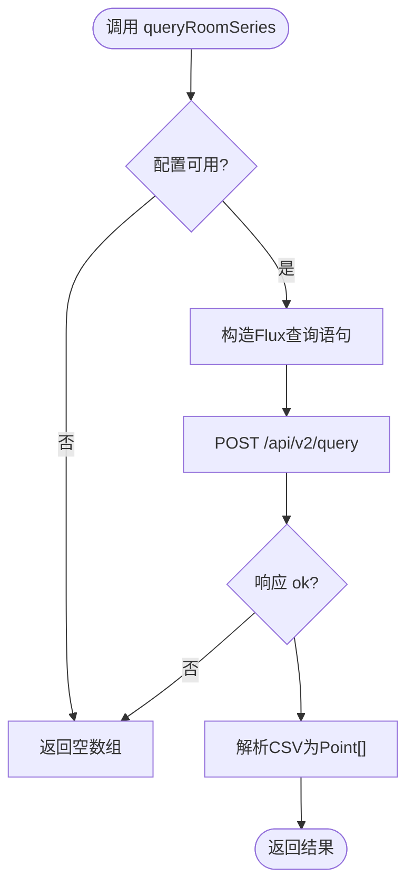
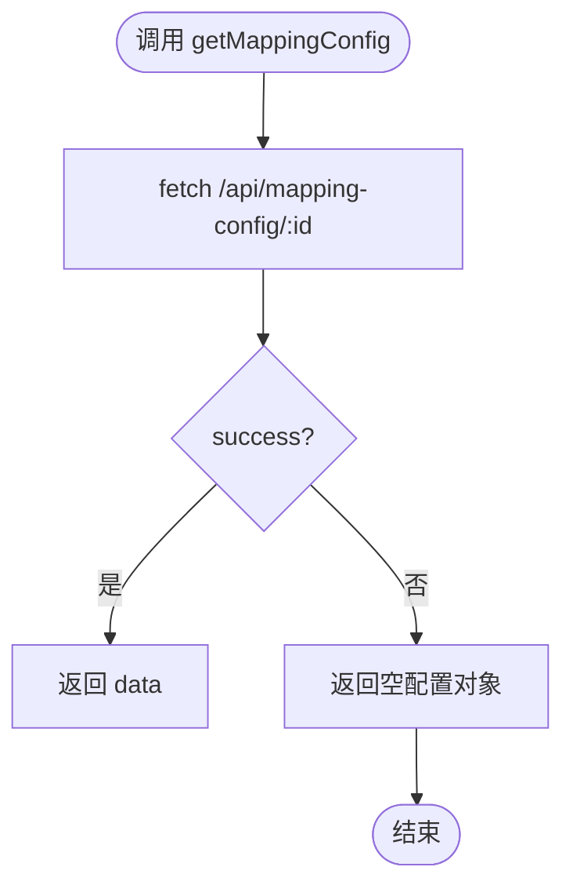
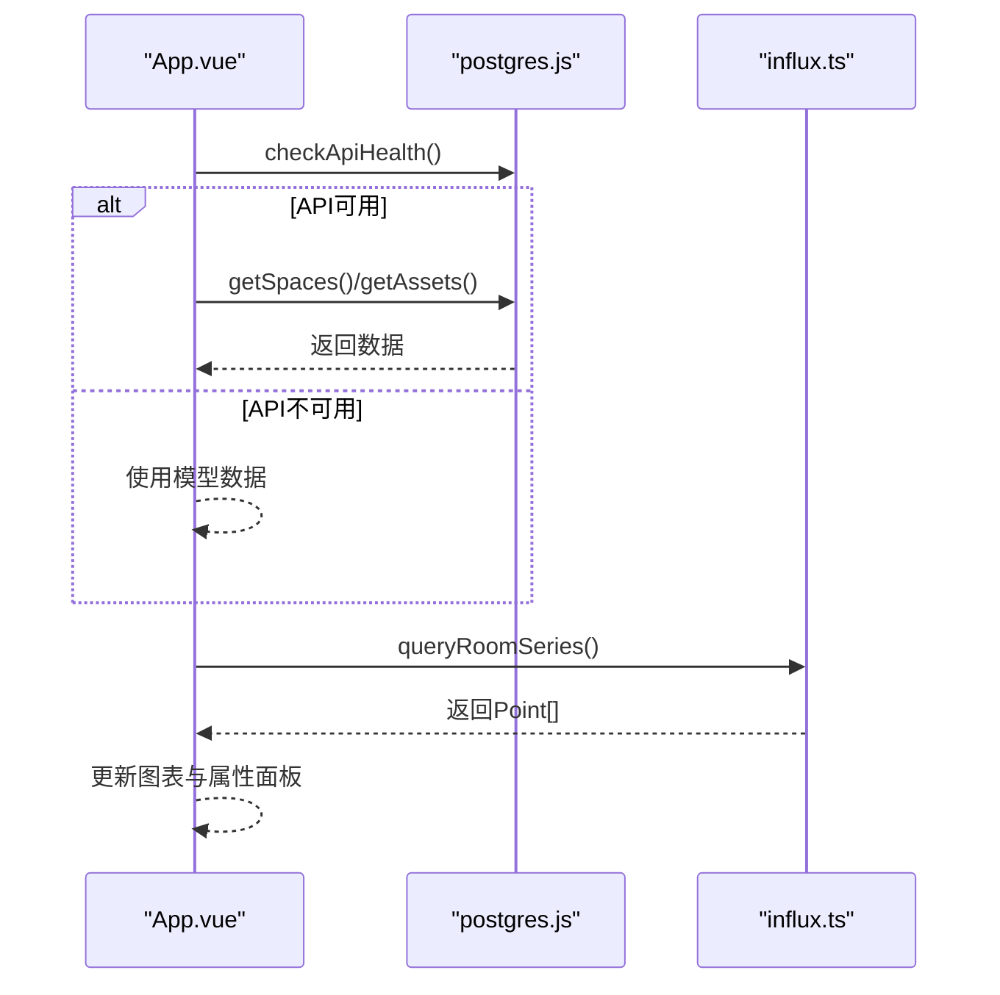
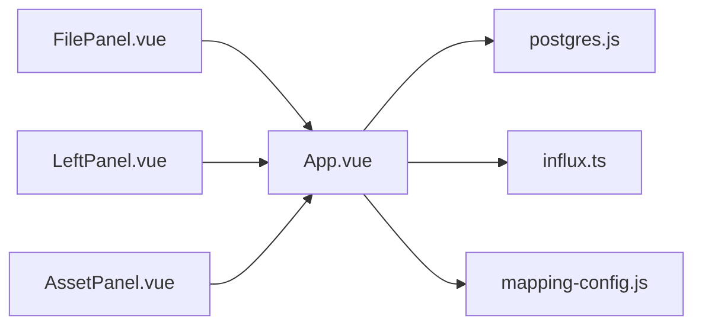

# 前端API客户端

<cite>
**本文引用的文件**
- [postgres.js](file://src/services/postgres.js)
- [influx.ts](file://src/services/influx.ts)
- [mapping-config.js](file://src/services/mapping-config.js)
- [App.vue](file://src/App.vue)
- [FilePanel.vue](file://src/components/FilePanel.vue)
- [LeftPanel.vue](file://src/components/LeftPanel.vue)
- [AssetPanel.vue](file://src/components/AssetPanel.vue)
</cite>

## 目录
1. [简介](#简介)
2. [项目结构](#项目结构)
3. [核心组件](#核心组件)
4. [架构总览](#架构总览)
5. [详细组件分析](#详细组件分析)
6. [依赖关系分析](#依赖关系分析)
7. [性能考量](#性能考量)
8. [故障排查指南](#故障排查指南)
9. [结论](#结论)
10. [附录](#附录)

## 简介
本文件系统性梳理前端API客户端设计，围绕基于原生fetch封装的服务层，重点分析以下模块：
- postgres.js：封装PostgreSQL后端REST接口，提供健康检查、资产与空间数据获取、分类与规格导入等能力。
- influx.ts：封装InfluxDB时序查询，提供平均温度序列与按房间查询温度序列的能力，并处理认证、请求头与CSV响应解析。
- mapping-config.js：提供字段映射配置的获取、保存与默认配置生成接口。
- App.vue：在onMounted生命周期中调用API加载数据，并在FilePanel、LeftPanel等组件中按需加载与联动。
- 结合代码实例说明API调用的异步处理、错误捕获与加载状态管理，给出最佳实践、性能优化建议与常见网络问题排查方法。

## 项目结构
前端采用模块化的服务层设计，将API调用抽象为独立的模块，便于复用与测试；UI组件通过事件与状态驱动数据加载与展示。

图表来源
- [postgres.js](file://src/services/postgres.js#L1-L245)
- [influx.ts](file://src/services/influx.ts#L1-L136)
- [mapping-config.js](file://src/services/mapping-config.js#L1-L102)
- [App.vue](file://src/App.vue#L146-L1365)
- [FilePanel.vue](file://src/components/FilePanel.vue#L231-L546)
- [LeftPanel.vue](file://src/components/LeftPanel.vue#L81-L179)
- [AssetPanel.vue](file://src/components/AssetPanel.vue#L91-L320)

章节来源
- [App.vue](file://src/App.vue#L146-L1365)
- [postgres.js](file://src/services/postgres.js#L1-L245)
- [influx.ts](file://src/services/influx.ts#L1-L136)
- [mapping-config.js](file://src/services/mapping-config.js#L1-L102)
- [FilePanel.vue](file://src/components/FilePanel.vue#L231-L546)
- [LeftPanel.vue](file://src/components/LeftPanel.vue#L81-L179)
- [AssetPanel.vue](file://src/components/AssetPanel.vue#L91-L320)

## 核心组件
- postgres.js
  - 健康检查：checkApiHealth
  - 分类与规格：getClassifications、getAssetSpecs
  - 资产与空间：getAssets、getAssetsByFloor、getAssetsByRoom、getSpaces、getSpacesByFloor
  - 导入：importModelData、importClassifications、importAssetSpecs、importAssets、importSpaces
  - 统一返回结构：所有方法均返回data.data或抛出错误，错误包含明确的错误信息
- influx.ts
  - 配置校验：isInfluxConfigured
  - 认证：支持Token与Basic两种鉴权方式，自动拼装Authorization头
  - 查询：queryAverageSeries、queryRoomSeries、queryLatestByRooms
  - 写入：writeRoomHistory（按点写入）
  - 响应解析：将CSV响应解析为Point[]或记录映射
- mapping-config.js
  - 获取：getMappingConfig
  - 保存：saveMappingConfig
  - 默认：getDefaultMapping

章节来源
- [postgres.js](file://src/services/postgres.js#L12-L244)
- [influx.ts](file://src/services/influx.ts#L1-L136)
- [mapping-config.js](file://src/services/mapping-config.js#L1-L102)

## 架构总览
前端通过服务层模块化封装HTTP请求，App.vue在生命周期中统一调度加载流程，组件通过事件与状态驱动数据刷新与联动。

图表来源
- [App.vue](file://src/App.vue#L293-L353)
- [App.vue](file://src/App.vue#L509-L534)
- [App.vue](file://src/App.vue#L754-L769)
- [App.vue](file://src/App.vue#L1269-L1279)
- [postgres.js](file://src/services/postgres.js#L12-L122)
- [influx.ts](file://src/services/influx.ts#L39-L103)

## 详细组件分析

### postgres.js：PostgreSQL服务封装
- 基础URL：从环境变量读取API基础地址，若未配置则回退到本地默认地址。
- 健康检查：checkApiHealth通过GET /health进行连通性检测，异常时返回false。
- 数据获取：
  - getClassifications：可按类型筛选，返回分类列表。
  - getAssetSpecs：返回资产规格列表。
  - getAssets / getSpaces：返回资产/空间列表；按楼层/房间提供过滤版本。
- 导入能力：
  - importModelData：一次性导入模型数据。
  - importClassifications / importAssetSpecs / importAssets / importSpaces：批量导入对应实体。
- 错误处理：所有方法在响应success为false时抛出错误，错误信息来自后端data.error或默认提示。

图表来源
- [postgres.js](file://src/services/postgres.js#L57-L94)
- [postgres.js](file://src/services/postgres.js#L99-L122)

章节来源
- [postgres.js](file://src/services/postgres.js#L7-L244)

### influx.ts：InfluxDB时序查询服务
- 配置与认证：
  - 从环境变量读取URL、组织、桶、Token或Basic鉴权参数。
  - isInfluxConfigured用于判定配置完整性。
  - headersWrite/headersQuery根据useBasic或token动态生成请求头。
- 写入：
  - writeRoomHistory：将Point数组转换为Line Protocol写入指定组织与桶，支持毫秒精度。
- 查询：
  - queryAverageSeries：按时间窗口聚合计算平均值，返回Point[]。
  - queryRoomSeries：按房间过滤并聚合，返回Point[]。
  - queryLatestByRooms：按房间集合查询最新值，返回房间码到数值的映射。
- CSV解析：
  - 读取响应文本，过滤注释行，定位包含目标列的表头，按列索引解析时间与数值，构建Point[]或映射。

图表来源
- [influx.ts](file://src/services/influx.ts#L72-L103)
- [influx.ts](file://src/services/influx.ts#L105-L134)

章节来源
- [influx.ts](file://src/services/influx.ts#L1-L136)

### mapping-config.js：字段映射配置服务
- getMappingConfig：根据文件ID获取映射配置；若后端失败，返回空配置对象，保证调用方可用默认值。
- saveMappingConfig：保存映射配置；失败时抛出错误，便于上层捕获与提示。
- getDefaultMapping：提供默认映射模板，涵盖资产、资产规格与空间字段映射。

图表来源
- [mapping-config.js](file://src/services/mapping-config.js#L13-L31)

章节来源
- [mapping-config.js](file://src/services/mapping-config.js#L1-L102)

### App.vue：生命周期与组件联动
- 生命周期onMounted：
  - 通过checkApiHealth判断后端可用性；不可用时使用模型数据。
  - 成功时调用getSpaces/getAssets加载数据库数据，转换为组件所需格式并设置列表状态。
- 文件激活与切换：
  - onFileActivated：根据激活文件ID拉取该文件的资产与空间数据，标记dbDataLoaded，防止被模型数据覆盖。
  - onViewerReady：在Viewer初始化完成后加载默认模型或激活文件对应的模型。
- 图表数据刷新：
  - onChartDataUpdate与onTimeRangeChanged：当时间范围或选中房间变化时，调用influx.queryRoomSeries批量刷新图表数据。
- 房间/资产选择联动：
  - onRoomsSelected/onAssetsSelected：根据选择更新右侧属性面板与底部图表系列。
- 加载状态管理：
  - isLoadingFromDb/dbDataLoaded：控制加载状态与数据来源优先级（数据库优先于模型）。

图表来源
- [App.vue](file://src/App.vue#L293-L353)
- [App.vue](file://src/App.vue#L509-L534)
- [App.vue](file://src/App.vue#L754-L769)
- [App.vue](file://src/App.vue#L1269-L1279)
- [postgres.js](file://src/services/postgres.js#L12-L122)
- [influx.ts](file://src/services/influx.ts#L72-L103)

章节来源
- [App.vue](file://src/App.vue#L146-L1365)

### 组件按需加载与数据联动
- FilePanel.vue
  - onMounted时加载文件列表；支持上传、激活、提取、编辑与删除等操作。
  - 激活文件后通过emit('file-activated', data)通知App.vue进行数据加载。
- LeftPanel.vue / AssetPanel.vue
  - 作为左侧列表组件，接收房间/资产列表与选中状态，负责多选与属性面板联动。
  - 通过App.vue的事件与状态同步，实现选中房间/资产的属性展示与图表联动。

章节来源
- [FilePanel.vue](file://src/components/FilePanel.vue#L231-L546)
- [LeftPanel.vue](file://src/components/LeftPanel.vue#L81-L179)
- [AssetPanel.vue](file://src/components/AssetPanel.vue#L91-L320)

## 依赖关系分析
- 低耦合高内聚：服务层模块独立，UI组件仅通过事件与状态交互，避免直接耦合具体API实现。
- 依赖方向：
  - App.vue依赖postgres.js与influx.ts进行数据加载与图表刷新。
  - FilePanel.vue依赖App.vue的事件与状态，间接依赖postgres.js进行文件列表与激活操作。
  - LeftPanel.vue/AssetPanel.vue依赖App.vue的状态与事件，间接依赖postgres.js与influx.ts。

图表来源
- [App.vue](file://src/App.vue#L146-L1365)
- [postgres.js](file://src/services/postgres.js#L1-L245)
- [influx.ts](file://src/services/influx.ts#L1-L136)
- [mapping-config.js](file://src/services/mapping-config.js#L1-L102)
- [FilePanel.vue](file://src/components/FilePanel.vue#L231-L546)
- [LeftPanel.vue](file://src/components/LeftPanel.vue#L81-L179)
- [AssetPanel.vue](file://src/components/AssetPanel.vue#L91-L320)

## 性能考量
- 缓存策略
  - 数据缓存：App.vue维护roomList与assetList，首次加载后在当前会话内复用，减少重复请求。
  - 模型数据与数据库数据优先级：dbDataLoaded为true时优先使用数据库数据，避免重复拉取。
  - 图表数据缓存：onTimeRangeChanged与onChartDataUpdate中使用Promise.all并发查询多个房间，减少等待时间。
- 并发与批处理
  - 使用Promise.all批量查询房间序列，提升图表渲染效率。
  - 批量导入接口（importAssets/importSpaces/importClassifications/importAssetSpecs）减少多次往返。
- 超时与重试
  - 当前服务层未内置超时与重试逻辑；可在fetch包装器中增加超时与指数退避重试，以增强网络不稳定场景下的鲁棒性。
- 响应解析优化
  - influx.ts的CSV解析按列索引定位，避免正则匹配带来的额外开销；建议在大规模数据时考虑分页或窗口化查询。

[本节为通用指导，无需特定文件来源]

## 故障排查指南
- API健康检查失败
  - 现象：checkApiHealth返回false，App.vue回退到模型数据。
  - 排查：确认VITE_API_URL配置、后端服务状态与跨域设置。
  - 参考路径：[App.vue](file://src/App.vue#L293-L301)，[postgres.js](file://src/services/postgres.js#L12-L19)
- 数据获取失败
  - 现象：getSpaces/getAssets抛出错误或返回空列表。
  - 排查：检查后端返回的success字段与error消息；确认数据库连接与schema。
  - 参考路径：[postgres.js](file://src/services/postgres.js#L57-L94)，[postgres.js](file://src/services/postgres.js#L99-L122)
- InfluxDB配置缺失
  - 现象：queryRoomSeries返回空数组。
  - 排查：确认VITE_INFLUX_URL/VITE_INFLUX_ORG/VITE_INFLUX_BUCKET/VITE_INFLUX_TOKEN或Basic鉴权配置。
  - 参考路径：[influx.ts](file://src/services/influx.ts#L1-L10)，[influx.ts](file://src/services/influx.ts#L72-L103)
- 图表数据未刷新
  - 现象：切换时间范围或房间后图表无更新。
  - 排查：确认onTimeRangeChanged/onChartDataUpdate事件触发与Promise.all执行；检查时间范围参数与房间码。
  - 参考路径：[App.vue](file://src/App.vue#L509-L534)，[App.vue](file://src/App.vue#L1269-L1279)
- 文件激活与模型加载异常
  - 现象：激活文件后未加载资产/空间数据或重复加载。
  - 排查：检查onFileActivated流程、dbDataLoaded标志与currentLoadedModelPath去重逻辑。
  - 参考路径：[App.vue](file://src/App.vue#L549-L635)，[App.vue](file://src/App.vue#L356-L458)

章节来源
- [App.vue](file://src/App.vue#L293-L635)
- [postgres.js](file://src/services/postgres.js#L12-L122)
- [influx.ts](file://src/services/influx.ts#L1-L103)

## 结论
本项目通过模块化的服务层封装，实现了对PostgreSQL与InfluxDB的清晰抽象，配合App.vue的生命周期与组件联动，形成了稳定的数据加载与可视化流程。建议后续引入超时与重试机制、完善缓存策略与错误日志上报，以进一步提升用户体验与系统稳定性。

[本节为总结性内容，无需特定文件来源]

## 附录
- 最佳实践
  - 统一错误处理：在服务层抛出明确错误，在UI层进行友好提示与重试引导。
  - 状态管理：使用isLoadingFromDb/dbDataLoaded等标志位控制加载与回退逻辑。
  - 并发优化：对多房间/多资产查询使用Promise.all，减少串行等待。
  - 配置安全：敏感配置通过环境变量注入，避免硬编码。
- 性能优化建议
  - 引入超时与指数退避重试，增强网络不稳定场景下的可靠性。
  - 对大列表进行分页或虚拟滚动，降低渲染压力。
  - 对高频查询结果进行短期缓存，避免重复请求。
- 常见网络问题
  - CORS：确保后端允许前端域名访问。
  - Token失效：在鉴权失败时提示重新登录或刷新Token。
  - 网络抖动：在UI层增加加载骨架屏与错误重试按钮。

[本节为通用指导，无需特定文件来源]