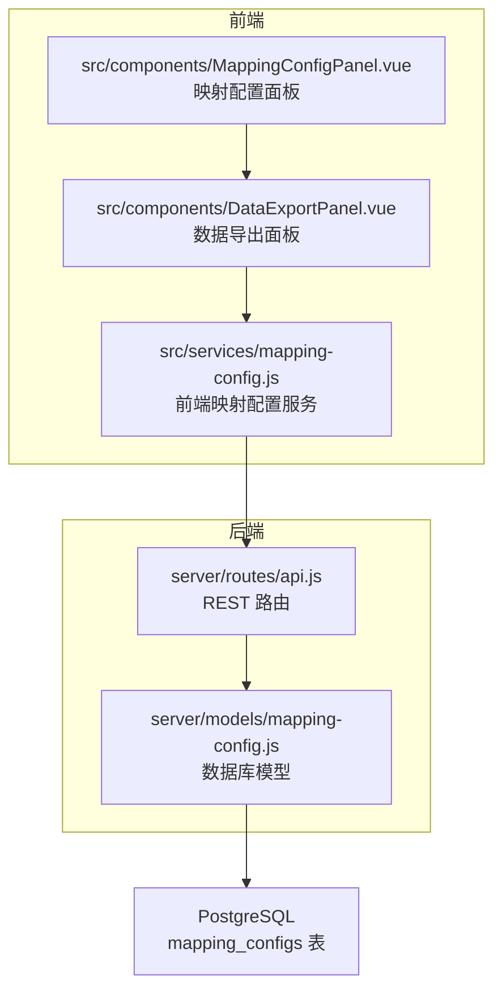
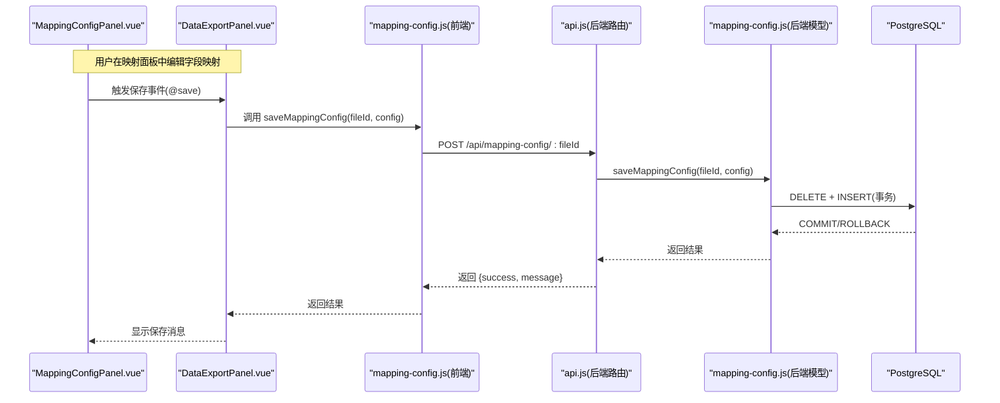
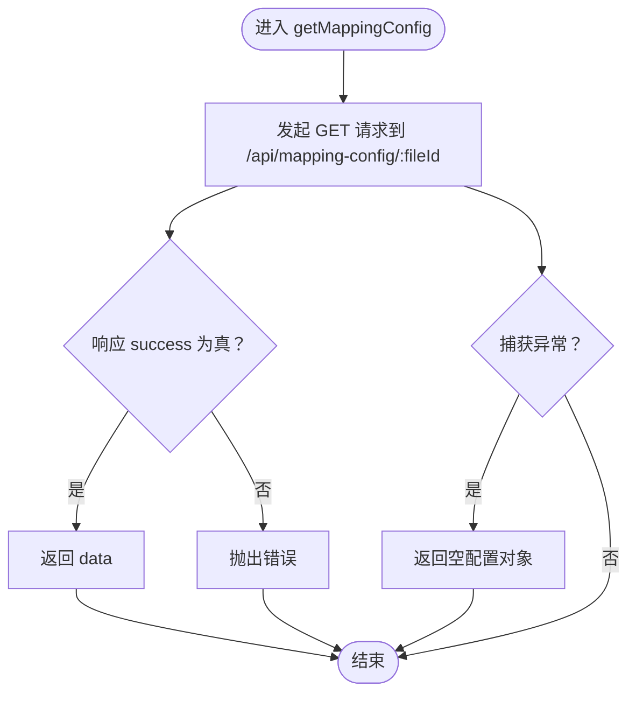
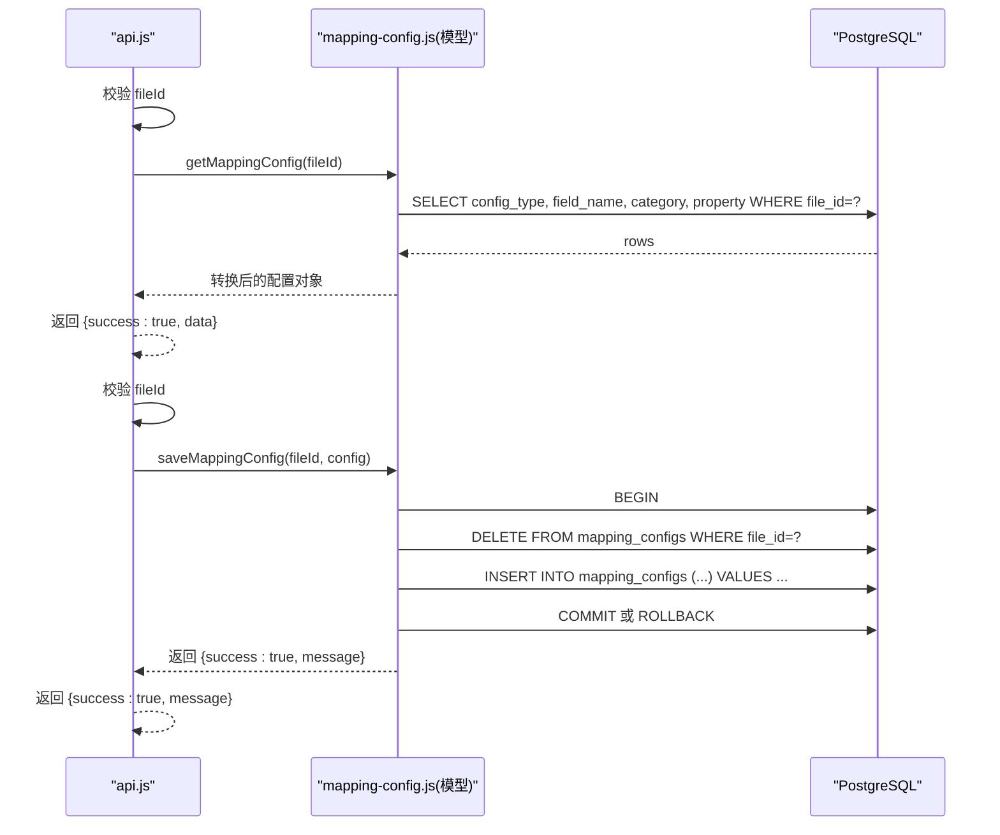
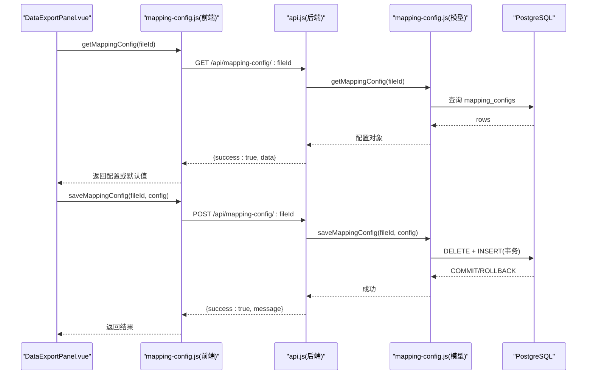
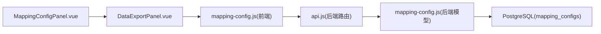

# 映射配置服务模块

<cite>
**本文引用的文件**
- [src/services/mapping-config.js](file://src/services/mapping-config.js)
- [server/models/mapping-config.js](file://server/models/mapping-config.js)
- [server/routes/api.js](file://server/routes/api.js)
- [src/components/MappingConfigPanel.vue](file://src/components/MappingConfigPanel.vue)
- [src/components/DataExportPanel.vue](file://src/components/DataExportPanel.vue)
- [server/db/migrations/create_mapping_config.sql](file://server/db/migrations/create_mapping_config.sql)
</cite>

## 目录
1. [简介](#简介)
2. [项目结构](#项目结构)
3. [核心组件](#核心组件)
4. [架构总览](#架构总览)
5. [详细组件分析](#详细组件分析)
6. [依赖分析](#依赖分析)
7. [性能考虑](#性能考虑)
8. [故障排查指南](#故障排查指南)
9. [结论](#结论)

## 简介
本文件聚焦于 mapping-config.js 模块在文件字段映射配置管理中的核心作用，系统性解析以下要点：
- API_BASE 常量的定义及其与后端 /api/mapping-config 接口的路由关系
- getMappingConfig 如何根据 fileId 从后端获取资产、资产规格和空间的字段映射配置，并在请求失败时返回空配置对象以保证调用链健壮性
- saveMappingConfig 如何将前端配置通过 POST 请求持久化到数据库，包括请求头 Content-Type 的设置、JSON 序列化及错误抛出机制
- getDefaultMapping 提供的默认映射规则，涵盖 assetMapping、assetSpecMapping 和 spaceMapping 中各字段与 Revit 属性的对应关系（如 MC 编码、类型注释、标高等），并说明其在初始化配置和容错恢复中的应用
- MappingConfigPanel 组件的实际使用，描述配置的加载、编辑与保存流程

## 项目结构
mapping-config 相关代码分布在前端服务层、后端路由与模型层、数据库迁移脚本以及 UI 组件中，形成“前端服务 -> 后端 API -> 数据库”的完整闭环。

**图表来源**
- [src/services/mapping-config.js](file://src/services/mapping-config.js#L1-L102)
- [server/routes/api.js](file://server/routes/api.js#L466-L516)
- [server/models/mapping-config.js](file://server/models/mapping-config.js#L1-L115)
- [server/db/migrations/create_mapping_config.sql](file://server/db/migrations/create_mapping_config.sql#L1-L29)

**章节来源**
- [src/services/mapping-config.js](file://src/services/mapping-config.js#L1-L102)
- [server/routes/api.js](file://server/routes/api.js#L466-L516)
- [server/models/mapping-config.js](file://server/models/mapping-config.js#L1-L115)
- [server/db/migrations/create_mapping_config.sql](file://server/db/migrations/create_mapping_config.sql#L1-L29)

## 核心组件
- 前端映射配置服务：提供 getMappingConfig、saveMappingConfig、getDefaultMapping 三个关键函数，负责与后端交互、错误兜底与默认规则注入。
- 后端路由：定义 /api/mapping-config/:fileId 的 GET/POST 接口，校验参数并调用模型层。
- 数据库模型：实现按 file_id 查询与全量替换写入映射配置，支持事务回滚。
- UI 面板：MappingConfigPanel 负责可视化编辑；DataExportPanel 负责加载、保存与应用映射配置。

**章节来源**
- [src/services/mapping-config.js](file://src/services/mapping-config.js#L1-L102)
- [server/routes/api.js](file://server/routes/api.js#L466-L516)
- [server/models/mapping-config.js](file://server/models/mapping-config.js#L1-L115)
- [src/components/MappingConfigPanel.vue](file://src/components/MappingConfigPanel.vue#L1-L230)
- [src/components/DataExportPanel.vue](file://src/components/DataExportPanel.vue#L94-L351)

## 架构总览
从前端服务到后端 API 再到数据库的调用链如下：

**图表来源**
- [src/components/MappingConfigPanel.vue](file://src/components/MappingConfigPanel.vue#L208-L229)
- [src/components/DataExportPanel.vue](file://src/components/DataExportPanel.vue#L161-L191)
- [src/services/mapping-config.js](file://src/services/mapping-config.js#L42-L64)
- [server/routes/api.js](file://server/routes/api.js#L490-L514)
- [server/models/mapping-config.js](file://server/models/mapping-config.js#L56-L114)

## 详细组件分析

### 前端映射配置服务（src/services/mapping-config.js）
- API_BASE 常量：定义后端基础地址，用于拼接 /api/mapping-config 路由。
- getMappingConfig(fileId)：
  - 通过 fetch 调用后端 GET /api/mapping-config/:fileId
  - 若响应 success 为真，返回 data；否则抛出错误
  - 捕获异常时返回空配置对象，确保调用方不会因网络或后端异常而崩溃
- saveMappingConfig(fileId, config)：
  - 通过 fetch 调用后端 POST /api/mapping-config/:fileId
  - 设置 Content-Type: application/json，body 为 JSON 序列化后的配置
  - 若响应 success 为假，抛出错误；异常时同样抛出，便于上层处理
- getDefaultMapping()：
  - 返回默认映射规则，覆盖 assetMapping、assetSpecMapping、spaceMapping
  - 字段与 Revit 属性的典型对应关系示例：assetCode 对应 MC 编码、specCode 对应类型注释、floor 对应标高、area 对应面积等

**图表来源**
- [src/services/mapping-config.js](file://src/services/mapping-config.js#L13-L32)

**章节来源**
- [src/services/mapping-config.js](file://src/services/mapping-config.js#L6-L101)

### 后端路由与模型（server/routes/api.js, server/models/mapping-config.js）
- 路由层：
  - GET /api/mapping-config/:fileId：校验 fileId，调用模型层读取配置并返回
  - POST /api/mapping-config/:fileId：校验 fileId，接收请求体中的 assetMapping、assetSpecMapping、spaceMapping，调用模型层保存
- 模型层：
  - getMappingConfig(fileId)：按 file_id 查询 mapping_configs，将记录转换为前端期望的三段式映射结构
  - saveMappingConfig(fileId, config)：开启事务，先删除旧配置，再批量插入新配置，最后提交；异常时回滚

**图表来源**
- [server/routes/api.js](file://server/routes/api.js#L470-L514)
- [server/models/mapping-config.js](file://server/models/mapping-config.js#L17-L114)

**章节来源**
- [server/routes/api.js](file://server/routes/api.js#L470-L514)
- [server/models/mapping-config.js](file://server/models/mapping-config.js#L17-L114)

### 数据库表结构（server/db/migrations/create_mapping_config.sql）
- 表名：mapping_configs
- 字段：file_id、config_type（枚举 'asset'/'asset_spec'/'space'）、field_name、category、property
- 约束：UNIQUE(file_id, config_type, field_name)，并创建索引提升查询效率
- 注释：明确表用途与字段含义，便于维护与扩展

**章节来源**
- [server/db/migrations/create_mapping_config.sql](file://server/db/migrations/create_mapping_config.sql#L1-L29)

### UI 面板与工作流（src/components/MappingConfigPanel.vue, src/components/DataExportPanel.vue）
- MappingConfigPanel：
  - 提供资产、资产规格、空间三类映射的可视化编辑界面
  - 使用 SearchableSelect 选择分类与属性，支持重置单字段映射
  - 通过 emit('save', ...) 将本地编辑后的配置传递给父组件
- DataExportPanel：
  - 在 mounted 时根据 fileId 从后端加载映射配置；若无则使用 getDefaultMapping
  - 保存时调用 saveMappingConfig 并展示成功/失败消息
  - 导出时将映射应用于提取的数据，再通过导入接口写入数据库

**图表来源**
- [src/components/DataExportPanel.vue](file://src/components/DataExportPanel.vue#L300-L344)
- [src/components/MappingConfigPanel.vue](file://src/components/MappingConfigPanel.vue#L208-L229)
- [src/services/mapping-config.js](file://src/services/mapping-config.js#L13-L64)
- [server/routes/api.js](file://server/routes/api.js#L470-L514)
- [server/models/mapping-config.js](file://server/models/mapping-config.js#L17-L114)

**章节来源**
- [src/components/MappingConfigPanel.vue](file://src/components/MappingConfigPanel.vue#L1-L230)
- [src/components/DataExportPanel.vue](file://src/components/DataExportPanel.vue#L94-L351)

## 依赖分析
- 前端服务依赖后端路由，后端路由依赖模型层，模型层依赖数据库
- MappingConfigPanel 作为 UI 组件，通过 DataExportPanel 与前端服务交互
- 数据库表 mapping_configs 通过唯一约束与索引保障一致性与性能

**图表来源**
- [src/components/MappingConfigPanel.vue](file://src/components/MappingConfigPanel.vue#L1-L230)
- [src/components/DataExportPanel.vue](file://src/components/DataExportPanel.vue#L94-L351)
- [src/services/mapping-config.js](file://src/services/mapping-config.js#L1-L102)
- [server/routes/api.js](file://server/routes/api.js#L466-L516)
- [server/models/mapping-config.js](file://server/models/mapping-config.js#L1-L115)
- [server/db/migrations/create_mapping_config.sql](file://server/db/migrations/create_mapping_config.sql#L1-L29)

**章节来源**
- [src/services/mapping-config.js](file://src/services/mapping-config.js#L1-L102)
- [server/routes/api.js](file://server/routes/api.js#L466-L516)
- [server/models/mapping-config.js](file://server/models/mapping-config.js#L1-L115)
- [server/db/migrations/create_mapping_config.sql](file://server/db/migrations/create_mapping_config.sql#L1-L29)

## 性能考虑
- 数据库层面：mapping_configs 表对 file_id 与 config_type 建立索引，有助于按文件与类型快速检索
- 模型层：保存时采用事务，先删除旧配置再批量插入，避免并发写入冲突；Promise.all 并行插入提升吞吐
- 前端层面：getMappingConfig 在异常时返回空配置，避免阻塞 UI；saveMappingConfig 抛出错误便于上层统一处理

[本节为通用建议，无需特定文件来源]

## 故障排查指南
- 网络或后端异常
  - 现象：getMappingConfig 抛错或返回空配置
  - 处理：DataExportPanel 已降级使用默认映射；检查后端健康状态与路由可用性
- 保存失败
  - 现象：saveMappingConfig 抛错
  - 处理：确认 Content-Type 为 application/json，检查请求体结构与后端校验逻辑；查看数据库事务日志
- 数据库约束问题
  - 现象：唯一约束冲突或外键缺失
  - 处理：核对 mapping_configs 的唯一约束与索引；如需外键，按迁移脚本提示补充

**章节来源**
- [src/services/mapping-config.js](file://src/services/mapping-config.js#L13-L64)
- [server/routes/api.js](file://server/routes/api.js#L470-L514)
- [server/models/mapping-config.js](file://server/models/mapping-config.js#L56-L114)
- [server/db/migrations/create_mapping_config.sql](file://server/db/migrations/create_mapping_config.sql#L1-L29)

## 结论
mapping-config.js 模块在本项目中承担“配置加载、保存与默认规则”的核心职责。通过清晰的前后端分层与事务化的数据库写入，实现了稳定可靠的字段映射配置管理。MappingConfigPanel 与 DataExportPanel 的配合，使得用户可以在 UI 中直观地编辑、保存并应用映射规则，从而支撑后续数据导出与导入流程的准确性与一致性。