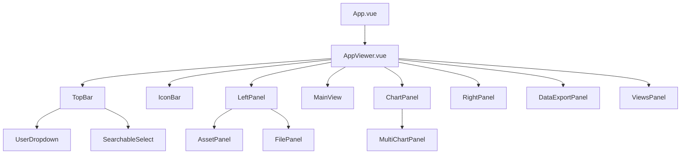
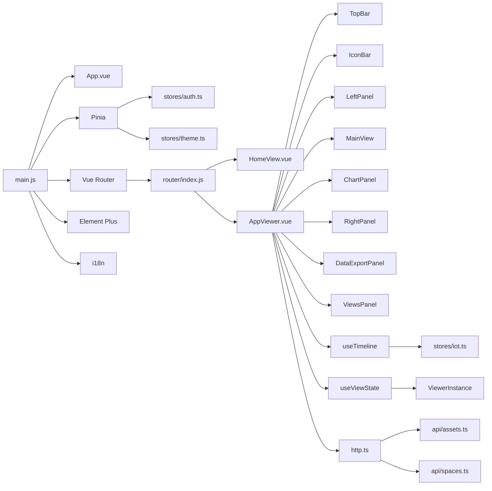

# 前端架构

<cite>
**本文档引用的文件**  
- [main.js](file://src/main.js)
- [App.vue](file://src/App.vue)
- [AppViewer.vue](file://src/AppViewer.vue)
- [vite.config.js](file://vite.config.js)
- [package.json](file://package.json)
- [router/index.js](file://src/router/index.js)
- [stores/index.ts](file://src/stores/index.ts)
- [composables/index.ts](file://src/composables/index.ts)
- [composables/useTimeline.ts](file://src/composables/useTimeline.ts)
- [composables/useViewState.ts](file://src/composables/useViewState.ts)
- [services/api/index.ts](file://src/services/api/index.ts)
- [services/http.ts](file://src/services/http.ts)
- [stores/auth.ts](file://src/stores/auth.ts)
- [stores/theme.ts](file://src/stores/theme.ts)
</cite>

## 目录
1. [技术选型与构建工具](#技术选型与构建工具)
2. [应用初始化流程](#应用初始化流程)
3. [路由配置与视图管理](#路由配置与视图管理)
4. [全局状态管理（Pinia）](#全局状态管理pinia)
5. [组件化设计与UI组织](#组件化设计与ui组织)
6. [API服务与后端解耦](#api服务与后端解耦)
7. [自定义组合函数（Composables）](#自定义组合函数composables)
8. [前端模块依赖关系](#前端模块依赖关系)
9. [性能优化策略](#性能优化策略)

## 技术选型与构建工具

本项目采用 Vue 3 的组合式 API（Composition API）作为核心框架，结合 Vite 构建工具，实现了现代化的前端开发体验。Vue 3 提供了更灵活的逻辑组织方式，通过 `setup` 函数和响应式 API（如 `ref`、`reactive`）提升了代码的可读性和可维护性。组合式 API 允许开发者将相关逻辑聚合在 `composables` 中，实现跨组件的逻辑复用。

Vite 作为构建工具，利用浏览器原生 ES 模块导入和 ESBuild 预构建，显著提升了开发服务器的启动速度和热更新效率。`vite.config.js` 文件中配置了路径别名 `@` 指向 `src` 目录，简化了模块导入路径。同时，配置了开发服务器代理，将 `/api` 和 `/influx` 请求转发至后端服务，解决了开发环境下的跨域问题。

**Section sources**
- [vite.config.js](file://vite.config.js#L1-L27)
- [package.json](file://package.json#L1-L34)

## 应用初始化流程

应用的入口文件 `main.js` 负责初始化 Vue 应用实例、Pinia 状态管理器和路由系统。初始化流程采用异步立即执行函数（IIFE）模式，确保在挂载应用前完成关键的初始化操作。

首先，创建 Vue 应用实例并注册 Pinia、Vue Router、Element Plus 和 i18n 等插件。随后，调用 `useAuthStore().checkAuth()` 方法检查用户认证状态，该方法会尝试从 `localStorage` 中恢复登录会话。接着，初始化主题状态管理器 `useThemeStore()`，根据用户偏好或系统设置应用深色或浅色主题。所有初始化完成后，才调用 `app.mount('#app')` 挂载应用，确保了用户体验的连贯性。

**Section sources**
- [main.js](file://src/main.js#L1-L40)

## 路由配置与视图管理

路由系统由 `vue-router` 实现，配置文件位于 `src/router/index.js`。当前定义了三个主要路由：根路径 `/` 导向 `HomeView.vue`，`/viewer` 和 `/assets` 路径则导向 `AppViewer.vue`。路由采用懒加载语法 `import()`，实现了代码分割，优化了首屏加载性能。

`AppViewer.vue` 是应用的核心视图容器，采用 `App.vue` 中的 `<router-view />` 进行渲染。该组件通过条件渲染和动态组件，管理着全景比对模式和正常模式的切换。它集成了顶部工具栏、左侧功能面板、3D 主视图、底部图表面板和右侧属性面板，通过响应式数据和事件总线协调各组件间的交互。

**Section sources**
- [router/index.js](file://src/router/index.js#L1-L27)
- [App.vue](file://src/App.vue#L1-L12)
- [AppViewer.vue](file://src/AppViewer.vue#L1-L800)

## 全局状态管理（Pinia）

项目采用 Pinia 作为全局状态管理解决方案，替代了传统的 Vuex。所有状态存储（Stores）位于 `src/stores/` 目录下，并通过 `index.ts` 文件统一导出，便于集中管理和按需导入。

关键的状态存储包括：
- `auth.ts`：管理用户认证状态，包括用户信息、Token 和权限。`checkAuth` 动作负责从 `localStorage` 恢复会话，`setAuth` 和 `clearAuth` 动作用于登录和登出。
- `theme.ts`：管理应用主题模式（深色、浅色、跟随系统），通过监听 `prefers-color-scheme` 媒体查询实现系统级主题同步，并将用户选择持久化到 `localStorage`。

这些状态存储被 `main.js` 在应用初始化时注入，使得任何组件都能通过 `useStore()` 钩子访问和修改全局状态，实现了跨组件的状态共享和响应式更新。

**Section sources**
- [stores/index.ts](file://src/stores/index.ts#L1-L17)
- [stores/auth.ts](file://src/stores/auth.ts#L1-L115)
- [stores/theme.ts](file://src/stores/theme.ts#L1-L93)

## 组件化设计与UI组织

项目遵循组件化设计原则，将 UI 拆分为高内聚、低耦合的可复用组件。组件按功能组织在 `src/components/` 目录下，例如 `layout/`、`modals/`、`viewer/` 等子目录，结构清晰，易于维护。

核心 UI 组件如 `TopBar`、`IconBar`、`LeftPanel`、`RightPanel` 和 `ChartPanel` 等，均在 `AppViewer.vue` 中被引用和组合。这些组件通过 `props` 接收数据，通过 `$emit` 或事件总线触发事件，实现了父子组件间的通信。例如，`IconBar` 组件通过 `@switch-view` 事件通知 `AppViewer.vue` 切换当前视图。

**Diagram sources**
- [App.vue](file://src/App.vue#L1-L12)
- [AppViewer.vue](file://src/AppViewer.vue#L1-L800)

**Section sources**
- [AppViewer.vue](file://src/AppViewer.vue#L1-L800)

## API服务与后端解耦

为了实现与后端 REST API 的解耦，项目在 `src/services/api/` 目录下封装了 API 调用。`http.ts` 文件提供了统一的 HTTP 请求服务，封装了请求拦截、错误处理、认证头自动添加和超时控制等通用逻辑。

具体的 API 模块（如 `assets.ts`、`spaces.ts`）导入 `http.ts` 中的 `get`、`post` 等方法，定义具体的端点和参数。`api/index.ts` 作为入口文件，统一导出所有 API 模块。这种分层设计使得业务组件无需关心底层网络细节，只需调用相应的服务方法即可，极大地提高了代码的可测试性和可维护性。

**Section sources**
- [services/api/index.ts](file://src/services/api/index.ts#L1-L15)
- [services/http.ts](file://src/services/http.ts#L1-L220)

## 自定义组合函数（Composables）

组合函数（Composables）是 Vue 3 组合式 API 的核心优势，用于封装和复用有状态的逻辑。项目在 `src/composables/` 目录下定义了多个自定义组合函数。

- `useTimeline.ts`：封装了时间轴控件的完整逻辑，包括播放/暂停、循环、速度控制、时间范围选择、拖拽和缩放等。它管理着 `currentTimeMs`、`rangeStartMs` 等响应式状态，并通过 `getTimeRange` 方法计算聚合窗口，为时序数据查询提供参数。
- `useViewState.ts`：管理 3D Viewer 的视图状态，提供 `getViewerState`、`captureScreenshot` 和 `restoreViewState` 方法。它处理了复杂的视图恢复逻辑，包括重置 WorldUpVector 以确保坐标系一致，并能同步热力图和标签的显示状态。

这些组合函数被 `AppViewer.vue` 等组件导入和使用，将复杂的业务逻辑从组件中剥离，使组件代码更加简洁和专注。

**Section sources**
- [composables/index.ts](file://src/composables/index.ts#L1-L14)
- [composables/useTimeline.ts](file://src/composables/useTimeline.ts#L1-L360)
- [composables/useViewState.ts](file://src/composables/useViewState.ts#L1-L256)

## 前端模块依赖关系

**Diagram sources**
- [main.js](file://src/main.js#L1-L40)
- [stores/index.ts](file://src/stores/index.ts#L1-L17)
- [router/index.js](file://src/router/index.js#L1-L27)
- [AppViewer.vue](file://src/AppViewer.vue#L1-L800)
- [composables/useTimeline.ts](file://src/composables/useTimeline.ts#L1-L360)
- [composables/useViewState.ts](file://src/composables/useViewState.ts#L1-L256)
- [services/http.ts](file://src/services/http.ts#L1-L220)

## 性能优化策略

项目实施了多项性能优化策略以提升用户体验：
- **懒加载**：路由配置中使用 `import()` 语法，实现路由级别的代码分割，减少初始包体积。
- **状态持久化**：用户认证 Token 和主题偏好通过 `localStorage` 持久化，避免每次访问都重新初始化。
- **API 请求优化**：`http.ts` 中的统一服务层实现了请求超时和错误处理，防止页面卡死。`useTimeline` 根据时间范围动态计算聚合窗口，减少不必要的大数据量查询。
- **条件渲染**：`AppViewer.vue` 使用 `v-if` 和 `v-else` 对全景比对模式和正常模式进行条件渲染，避免不必要的 DOM 渲染。
- **事件监听管理**：在 `useTimeline` 等组合函数中，使用 `onUnmounted` 钩子清理定时器和事件监听器，防止内存泄漏。

**Section sources**
- [router/index.js](file://src/router/index.js#L1-L27)
- [stores/auth.ts](file://src/stores/auth.ts#L1-L115)
- [stores/theme.ts](file://src/stores/theme.ts#L1-L93)
- [composables/useTimeline.ts](file://src/composables/useTimeline.ts#L1-L360)
- [AppViewer.vue](file://src/AppViewer.vue#L1-L800)