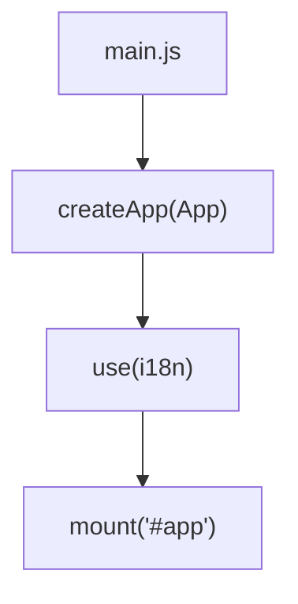
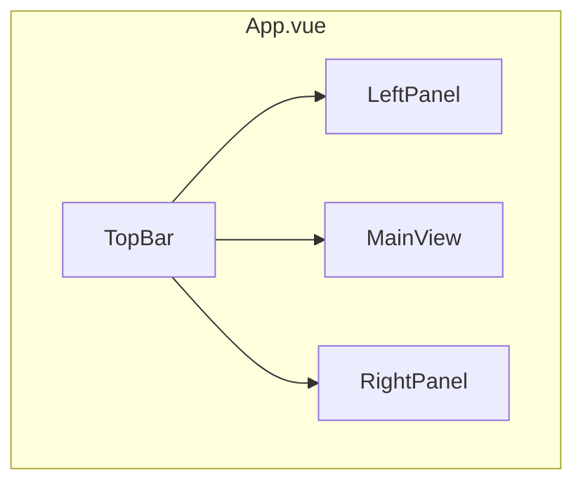
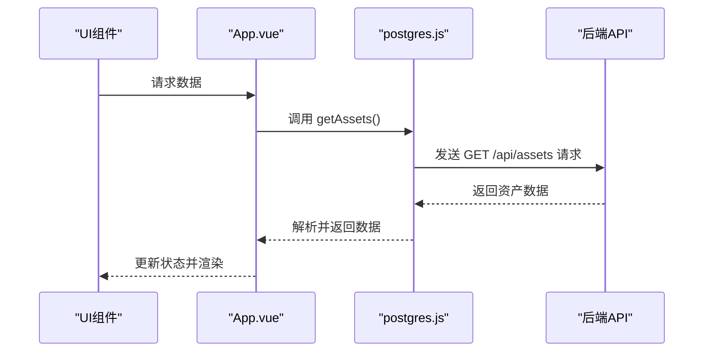
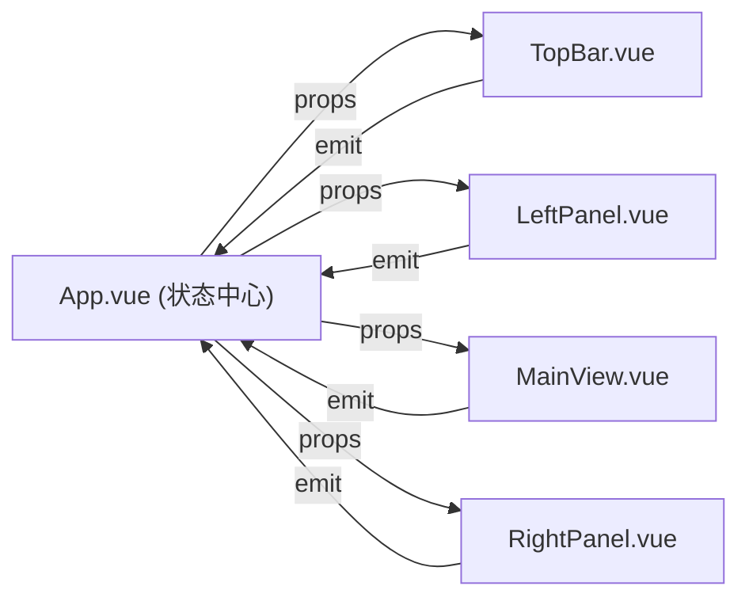
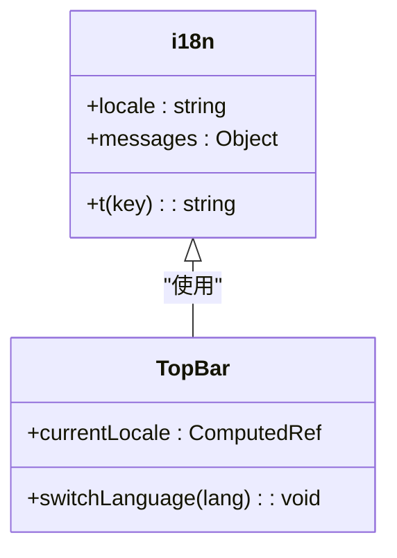

# 前端架构

<cite>
**本文档引用文件**   
- [App.vue](file://src/App.vue)
- [main.js](file://src/main.js)
- [influx.ts](file://src/services/influx.ts)
- [postgres.js](file://src/services/postgres.js)
- [TopBar.vue](file://src/components/TopBar.vue)
- [LeftPanel.vue](file://src/components/LeftPanel.vue)
- [AssetPanel.vue](file://src/components/AssetPanel.vue)
- [FilePanel.vue](file://src/components/FilePanel.vue)
- [MainView.vue](file://src/components/MainView.vue)
- [RightPanel.vue](file://src/components/RightPanel.vue)
- [i18n/index.js](file://src/i18n/index.js)
- [vite.config.js](file://vite.config.js)
</cite>

## 目录
1. [项目结构](#项目结构)
2. [应用初始化流程](#应用初始化流程)
3. [根组件与整体布局](#根组件与整体布局)
4. [API客户端与后端通信](#api客户端与后端通信)
5. [组件间通信与状态管理](#组件间通信与状态管理)
6. [国际化与多语言支持](#国际化与多语言支持)
7. [开发环境配置](#开发环境配置)

## 项目结构

本项目采用基于Vue 3和Vite的现代前端架构，遵循清晰的模块化设计。项目核心位于`src`目录下，主要包含`components`、`services`、`i18n`等关键文件夹。

`components`目录存放所有Vue组件，其中`App.vue`作为根组件，通过组合`TopBar`、`LeftPanel`、`MainView`、`RightPanel`等子组件构建应用的整体布局。`services`目录封装了与后端通信的逻辑，包括`postgres.js`用于与PostgreSQL数据库交互，`influx.ts`用于处理时序数据。`i18n`目录负责多语言支持。

**Section sources**
- [App.vue](file://src/App.vue)
- [components](file://src/components)

## 应用初始化流程

应用的初始化入口是`main.js`文件。该文件使用Vue 3的`createApp`函数创建应用实例，并挂载`App.vue`根组件。同时，它引入了`i18n`实例，为整个应用提供国际化支持。

**Diagram sources**
- [main.js](file://src/main.js)

**Section sources**
- [main.js](file://src/main.js)

## 根组件与整体布局

`App.vue`作为应用的根组件，负责协调和组合所有子组件，构建完整的用户界面。其布局采用经典的四面板设计：顶部的`TopBar`、左侧的`LeftPanel`（或`AssetPanel`、`FilePanel`）、中间的`MainView`和右侧的`RightPanel`。

**Diagram sources**
- [App.vue](file://src/App.vue)

### 顶部工具栏 (TopBar)
`TopBar.vue`组件位于界面顶部，提供应用Logo、视图切换、语言选择和用户信息等全局功能。它通过`emit`事件与`App.vue`进行通信，例如`toggle-views`用于打开/关闭视图面板。

**Section sources**
- [TopBar.vue](file://src/components/TopBar.vue)

### 左侧面板 (LeftPanel)
左侧面板根据当前视图动态切换。当`currentView`为`connect`时，显示`LeftPanel`，用于管理房间连接；为`assets`时，显示`AssetPanel`，用于管理资产；为`files`时，显示`FilePanel`，用于管理文件上传和激活。

**Section sources**
- [LeftPanel.vue](file://src/components/LeftPanel.vue)
- [AssetPanel.vue](file://src/components/AssetPanel.vue)
- [FilePanel.vue](file://src/components/FilePanel.vue)

### 中间主视图 (MainView)
`MainView.vue`是应用的核心，集成了3D模型查看器（Autodesk Forge Viewer）。它负责加载和渲染3D模型，处理用户交互（如选择、缩放），并显示时间轴、图表和IoT数据标签。

**Section sources**
- [MainView.vue](file://src/components/MainView.vue)

### 右侧面板 (RightPanel)
`RightPanel.vue`用于显示所选对象（房间或资产）的详细属性。它根据`viewMode`和`roomProperties`等`props`动态渲染属性表单，并通过`property-changed`事件将用户修改的属性值反馈给父组件。

**Section sources**
- [RightPanel.vue](file://src/components/RightPanel.vue)

## API客户端与后端通信

`services`目录下的文件封装了与后端API的通信逻辑，实现了前后端的解耦。

### PostgreSQL服务 (postgres.js)
`postgres.js`文件导出一系列异步函数，用于与后端的PostgreSQL数据库进行交互。这些函数如`getAssets`、`getSpaces`、`checkApiHealth`等，通过`fetch` API调用后端的RESTful接口，获取资产、空间等数据。

**Diagram sources**
- [postgres.js](file://src/services/postgres.js)

**Section sources**
- [postgres.js](file://src/services/postgres.js)

### InfluxDB服务 (influx.ts)
`influx.ts`文件专门处理与InfluxDB时序数据库的通信。它提供了`queryRoomSeries`、`queryAverageSeries`等函数，用于查询房间温度历史数据，并将数据用于图表展示。

**Section sources**
- [influx.ts](file://src/services/influx.ts)

## 组件间通信与状态管理

本应用主要采用Vue 3的`props`和`emit`机制进行组件间通信，结合`ref`和`reactive`进行状态管理，避免了引入复杂的状态管理库。

### 状态流分析
`App.vue`作为状态的“单一数据源”，管理着如`currentView`、`roomList`、`assetList`等核心状态。这些状态通过`props`向下传递给子组件。子组件通过`emit`事件将用户的操作（如视图切换、对象选择）通知给`App.vue`，由其统一更新状态。

**Diagram sources**
- [App.vue](file://src/App.vue)

**Section sources**
- [App.vue](file://src/App.vue)

### 关键通信场景
- **视图切换**: `LeftPanel`中的导航项通过`$emit('switch-view', 'assets')`通知`App.vue`，`App.vue`更新`currentView`状态，从而触发左侧面板的重新渲染。
- **对象选择**: `LeftPanel`在用户选择房间后，通过`$emit('rooms-selected', dbIds)`将选中的`dbId`列表传递给`App.vue`，`App.vue`据此更新`savedRoomSelections`并通知`MainView`进行高亮显示。
- **属性修改**: `RightPanel`在用户修改属性后，通过`$emit('property-changed', { fieldName, newValue })`通知`App.vue`，`App.vue`再调用`postgres.js`中的API函数将更改持久化到数据库。

## 国际化与多语言支持

应用通过`vue-i18n`库实现多语言支持。`i18n/index.js`文件定义了中文和英文两套语言包，并通过`localStorage`持久化用户的语言选择。

**Diagram sources**
- [i18n/index.js](file://src/i18n/index.js)
- [TopBar.vue](file://src/components/TopBar.vue)

**Section sources**
- [i18n/index.js](file://src/i18n/index.js)

## 开发环境配置

`vite.config.js`文件配置了Vite开发服务器的代理规则，解决了开发环境下的跨域问题。它将`/api`前缀的请求代理到后端服务器`http://localhost:3001`，将`/influx`前缀的请求代理到InfluxDB服务器`http://localhost:8086`。

**Section sources**
- [vite.config.js](file://vite.config.js)