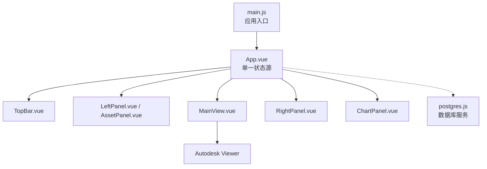
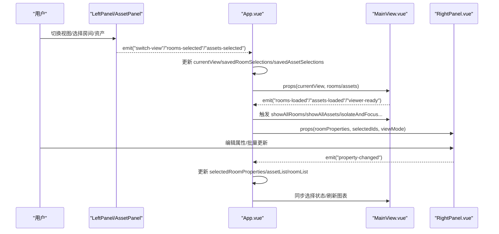
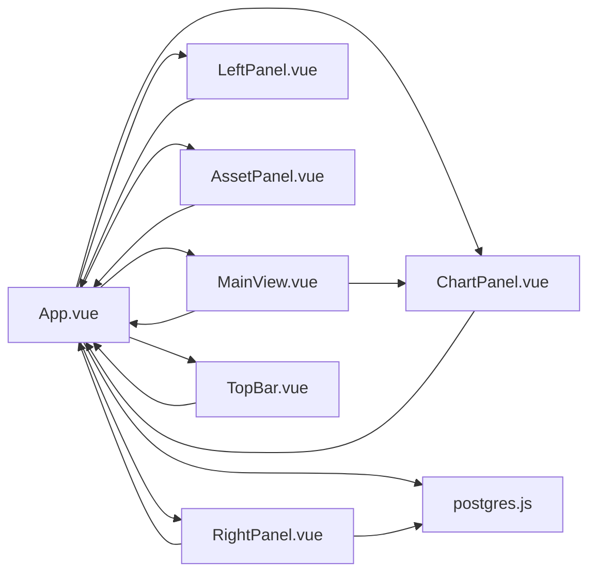

# 前端状态管理

<cite>
**本文引用的文件**
- [App.vue](file://src/App.vue)
- [main.js](file://src/main.js)
- [LeftPanel.vue](file://src/components/LeftPanel.vue)
- [AssetPanel.vue](file://src/components/AssetPanel.vue)
- [RightPanel.vue](file://src/components/RightPanel.vue)
- [MainView.vue](file://src/components/MainView.vue)
- [ChartPanel.vue](file://src/components/ChartPanel.vue)
- [TopBar.vue](file://src/components/TopBar.vue)
- [postgres.js](file://src/services/postgres.js)
</cite>

## 目录
1. [简介](#简介)
2. [项目结构](#项目结构)
3. [核心组件与状态](#核心组件与状态)
4. [架构总览](#架构总览)
5. [详细组件分析](#详细组件分析)
6. [依赖关系分析](#依赖关系分析)
7. [性能考量](#性能考量)
8. [故障排查指南](#故障排查指南)
9. [结论](#结论)

## 简介
本文件围绕 Vue 3 响应式系统与组件状态提升模式，深入解析 App.vue 如何作为“单一状态源”集中管理布局尺寸、视图模式、数据列表、选择状态与模型加载状态等核心状态，并通过 props 向子组件传递，通过事件回调实现父子组件间的状态同步。重点涵盖：
- 多选属性合并（VARIES 值处理）
- 模型加载状态追踪（pendingActiveFile、viewerReady）
- 数据库数据优先级控制（dbDataLoaded）
- 状态持久化策略（savedRoomSelections、savedAssetSelections）
- 状态流转图与常见问题调试建议

## 项目结构
- 应用入口：main.js 创建应用并挂载 App.vue
- 核心容器：App.vue 作为根组件，集中管理所有顶层状态
- 主视图：MainView.vue 与 Autodesk Viewer 交互，负责模型加载、选择、时间轴与图表数据
- 左侧面板：LeftPanel.vue（连接视图）与 AssetPanel.vue（资产视图）负责列表与多选
- 右侧面板：RightPanel.vue 负责属性编辑与批量更新
- 图表面板：ChartPanel.vue 展示时序数据
- 顶部工具栏：TopBar.vue 提供视图面板开关与语言切换
- 数据服务：postgres.js 提供数据库访问能力

图表来源
- [main.js](file://src/main.js#L1-L7)
- [App.vue](file://src/App.vue#L1-L140)
- [TopBar.vue](file://src/components/TopBar.vue#L1-L120)
- [LeftPanel.vue](file://src/components/LeftPanel.vue#L1-L120)
- [AssetPanel.vue](file://src/components/AssetPanel.vue#L1-L120)
- [MainView.vue](file://src/components/MainView.vue#L1-L120)
- [RightPanel.vue](file://src/components/RightPanel.vue#L1-L120)
- [ChartPanel.vue](file://src/components/ChartPanel.vue#L1-L120)
- [postgres.js](file://src/services/postgres.js#L1-L40)

章节来源
- [main.js](file://src/main.js#L1-L7)
- [App.vue](file://src/App.vue#L1-L140)

## 核心组件与状态
App.vue 作为单一状态源，集中管理以下关键状态：
- 布局与面板尺寸：leftWidth、rightWidth、chartPanelHeight、isRightPanelOpen、isChartPanelOpen
- 视图与模型：currentView、viewerReady、pendingActiveFile、currentLoadedModelPath、activeFileId、activeFileName、currentViewName
- 数据源与优先级：roomList、assetList、dbDataLoaded、isLoadingFromDb
- 选择与属性：savedRoomSelections、savedAssetSelections、selectedObjectIds、selectedRoomProperties、selectedRoomSeries、currentRange
- 导出与视图面板：isDataExportOpen、isViewsPanelOpen
- 事件与回调：openRightPanel、closeRightPanel、toggleChartPanel、closeChartPanel、switchView、onRoomsSelected、onAssetsSelected、onPropertyChanged、onModelSelectionChanged、onFileActivated、onChartDataUpdate、onTimeRangeChanged、onHoverSync

这些状态通过 ref 声明，使用 v-if/v-show 控制面板显隐，通过 props 向子组件传递，通过 emit 事件向上反馈。

章节来源
- [App.vue](file://src/App.vue#L160-L220)
- [App.vue](file://src/App.vue#L355-L458)
- [App.vue](file://src/App.vue#L460-L534)
- [App.vue](file://src/App.vue#L536-L635)
- [App.vue](file://src/App.vue#L637-L769)
- [App.vue](file://src/App.vue#L771-L923)
- [App.vue](file://src/App.vue#L925-L990)
- [App.vue](file://src/App.vue#L993-L1132)
- [App.vue](file://src/App.vue#L1134-L1188)
- [App.vue](file://src/App.vue#L1189-L1261)
- [App.vue](file://src/App.vue#L1263-L1280)
- [App.vue](file://src/App.vue#L1281-L1317)
- [App.vue](file://src/App.vue#L1318-L1360)

## 架构总览
App.vue 采用“状态提升 + 单向数据流”的设计：
- 父组件集中管理状态，子组件只消费 props，必要时通过 emit 回调通知父组件
- 通过事件桥接：子组件触发事件（如 rooms-selected、assets-selected、property-changed、model-selection-changed），父组件更新对应状态
- 通过 props 下发：房间/资产列表、当前视图、选择集合、模型加载状态等
- 通过 watch/nextTick 确保 DOM 更新后联动外部组件（如 MainView 的 resize）

图表来源
- [App.vue](file://src/App.vue#L1327-L1360)
- [LeftPanel.vue](file://src/components/LeftPanel.vue#L87-L104)
- [AssetPanel.vue](file://src/components/AssetPanel.vue#L97-L104)
- [MainView.vue](file://src/components/MainView.vue#L193-L209)
- [RightPanel.vue](file://src/components/RightPanel.vue#L117-L133)

章节来源
- [App.vue](file://src/App.vue#L1327-L1360)
- [LeftPanel.vue](file://src/components/LeftPanel.vue#L87-L104)
- [AssetPanel.vue](file://src/components/AssetPanel.vue#L97-L104)
- [MainView.vue](file://src/components/MainView.vue#L193-L209)
- [RightPanel.vue](file://src/components/RightPanel.vue#L117-L133)

## 详细组件分析

### App.vue：单一状态源与事件桥接
- 状态声明与初始化：集中声明布局、视图、数据、选择、导出、视图面板等状态
- 数据加载与优先级：优先从数据库加载房间/资产数据，dbDataLoaded 控制是否覆盖模型数据
- 模型加载与延迟：viewerReady 与 pendingActiveFile 配合，确保在 Viewer 就绪后加载模型
- 选择与属性：onRoomsSelected/onAssetsSelected 合并多选属性（VARIES 值），并更新右侧属性面板
- 属性编辑：onPropertyChanged 同步更新 selectedRoomProperties 与列表数据
- 反向定位：onModelSelectionChanged 基于 currentView 更新 savedRoomSelections/savedAssetSelections 并仅加载属性
- 图表联动：onChartDataUpdate/onTimeRangeChanged 刷新图表数据与选中房间系列
- 面板与布局：openRightPanel/closeRightPanel/toggleChartPanel/closeChartPanel 与 triggerResize 保证 Viewer 适配

章节来源
- [App.vue](file://src/App.vue#L160-L220)
- [App.vue](file://src/App.vue#L293-L353)
- [App.vue](file://src/App.vue#L355-L458)
- [App.vue](file://src/App.vue#L460-L534)
- [App.vue](file://src/App.vue#L536-L635)
- [App.vue](file://src/App.vue#L637-L769)
- [App.vue](file://src/App.vue#L771-L923)
- [App.vue](file://src/App.vue#L925-L990)
- [App.vue](file://src/App.vue#L993-L1132)
- [App.vue](file://src/App.vue#L1134-L1188)
- [App.vue](file://src/App.vue#L1189-L1261)
- [App.vue](file://src/App.vue#L1263-L1280)
- [App.vue](file://src/App.vue#L1281-L1317)
- [App.vue](file://src/App.vue#L1318-L1360)

### LeftPanel.vue：连接视图的房间列表与多选
- 接收 props：rooms、currentView、selectedDbIds
- 本地维护 selectedDbIdsLocal，watch 同步父级选择并在列表变化时过滤无效选择
- emit 事件：rooms-selected、open-properties、toggle-streams、switch-view
- 通过 props.selectedDbIds 实现视图切换时的选择状态保留

章节来源
- [LeftPanel.vue](file://src/components/LeftPanel.vue#L87-L104)
- [LeftPanel.vue](file://src/components/LeftPanel.vue#L120-L133)
- [LeftPanel.vue](file://src/components/LeftPanel.vue#L134-L153)

### AssetPanel.vue：资产视图的树形列表与多选
- 接收 props：assets、currentView、selectedDbIds
- 本地维护 selectedDbIdsLocal，watch 同步父级选择并在列表变化时过滤无效选择
- 支持分组展开/折叠、搜索过滤、全选/半选状态
- emit 事件：assets-selected、open-properties、toggle-streams、switch-view
- 暴露 expandAndScrollToAsset 方法，供父组件进行反向定位

章节来源
- [AssetPanel.vue](file://src/components/AssetPanel.vue#L97-L104)
- [AssetPanel.vue](file://src/components/AssetPanel.vue#L188-L200)
- [AssetPanel.vue](file://src/components/AssetPanel.vue#L255-L315)

### RightPanel.vue：属性编辑与批量更新
- 接收 props：roomProperties、selectedIds、viewMode
- 本地维护 localProperties，watch 深拷贝同步父级属性
- 处理 VARIES 值显示与字段类型映射
- emit 事件：property-changed、close-properties
- 支持资产/空间两种模式下的字段编辑与批量更新

章节来源
- [RightPanel.vue](file://src/components/RightPanel.vue#L117-L133)
- [RightPanel.vue](file://src/components/RightPanel.vue#L140-L148)
- [RightPanel.vue](file://src/components/RightPanel.vue#L194-L364)
- [RightPanel.vue](file://src/components/RightPanel.vue#L366-L389)

### MainView.vue：模型加载、选择与图表联动
- 接收 props：currentView、assets、rooms
- emit 事件：rooms-loaded、assets-loaded、viewer-ready、chart-data-update、time-range-changed、model-selection-changed
- 模型加载：loadNewModel、onModelLoaded、onSelectionChanged
- 房间/资产提取：processRooms、extractAssets
- 图表联动：refreshRoomSeriesCache、setTagTempsAtCurrentTime

章节来源
- [MainView.vue](file://src/components/MainView.vue#L193-L209)
- [MainView.vue](file://src/components/MainView.vue#L599-L704)
- [MainView.vue](file://src/components/MainView.vue#L800-L987)
- [MainView.vue](file://src/components/MainView.vue#L989-L1056)
- [MainView.vue](file://src/components/MainView.vue#L1058-L1114)
- [MainView.vue](file://src/components/MainView.vue#L1115-L1145)
- [MainView.vue](file://src/components/MainView.vue#L1147-L1165)
- [MainView.vue](file://src/components/MainView.vue#L1166-L1200)

### ChartPanel.vue：时序数据展示与悬停同步
- 接收 props：data、range、labelText
- emit 事件：close、hover-sync
- 通过 hover-sync 将时间与百分比同步到 MainView，实现跨面板联动

章节来源
- [ChartPanel.vue](file://src/components/ChartPanel.vue#L107-L114)
- [ChartPanel.vue](file://src/components/ChartPanel.vue#L190-L218)

### TopBar.vue：视图面板开关与语言切换
- 接收 props：isViewsPanelOpen、currentViewName
- emit 事件：open-data-export、toggle-views
- 语言切换通过 i18n 管理

章节来源
- [TopBar.vue](file://src/components/TopBar.vue#L96-L104)

### 数据服务：postgres.js
- 提供 checkApiHealth、getAssets、getSpaces 等接口
- App.vue 在 onFileActivated 与 onMounted 时调用，实现数据库数据优先级控制

章节来源
- [postgres.js](file://src/services/postgres.js#L1-L40)
- [postgres.js](file://src/services/postgres.js#L57-L66)
- [postgres.js](file://src/services/postgres.js#L99-L108)

## 依赖关系分析
- App.vue 依赖：
  - MainView.vue（模型加载、选择、图表）
  - LeftPanel.vue/AssetPanel.vue（列表与多选）
  - RightPanel.vue（属性编辑）
  - ChartPanel.vue（图表）
  - TopBar.vue（视图面板开关）
  - postgres.js（数据库访问）
- MainView.vue 依赖：
  - Autodesk Viewer（模型加载与选择）
  - ChartPanel.vue（图表展示）
  - postgres.js（时序数据查询）
- RightPanel.vue 依赖：
  - EditableField、DocumentList、QRCodeDisplay（UI 组成）
  - postgres.js（批量更新）

图表来源
- [App.vue](file://src/App.vue#L1-L140)
- [MainView.vue](file://src/components/MainView.vue#L1-L120)
- [LeftPanel.vue](file://src/components/LeftPanel.vue#L1-L120)
- [AssetPanel.vue](file://src/components/AssetPanel.vue#L1-L120)
- [RightPanel.vue](file://src/components/RightPanel.vue#L1-L120)
- [ChartPanel.vue](file://src/components/ChartPanel.vue#L1-L120)
- [TopBar.vue](file://src/components/TopBar.vue#L1-L120)
- [postgres.js](file://src/services/postgres.js#L1-L40)

章节来源
- [App.vue](file://src/App.vue#L1-L140)
- [MainView.vue](file://src/components/MainView.vue#L1-L120)
- [LeftPanel.vue](file://src/components/LeftPanel.vue#L1-L120)
- [AssetPanel.vue](file://src/components/AssetPanel.vue#L1-L120)
- [RightPanel.vue](file://src/components/RightPanel.vue#L1-L120)
- [ChartPanel.vue](file://src/components/ChartPanel.vue#L1-L120)
- [TopBar.vue](file://src/components/TopBar.vue#L1-L120)
- [postgres.js](file://src/services/postgres.js#L1-L40)

## 性能考量
- 响应式粒度：使用 ref 粒度控制状态更新，避免不必要的重渲染
- 批量更新：右侧面板在批量编辑时逐条请求后端，建议在业务允许范围内合并请求或增加节流
- DOM 同步：使用 nextTick 与 window.resize 事件触发 Viewer 重绘，减少闪烁
- 图表缓存：MainView.vue 使用 roomSeriesCache 与 overlaySeries，避免重复请求
- 模型加载防抖：pendingActiveFile 与 viewerReady 避免重复加载与竞态

章节来源
- [App.vue](file://src/App.vue#L1134-L1188)
- [App.vue](file://src/App.vue#L1189-L1261)
- [MainView.vue](file://src/components/MainView.vue#L367-L387)
- [MainView.vue](file://src/components/MainView.vue#L599-L704)

## 故障排查指南

### 常见问题与定位
- 响应式失效（属性未更新）
  - 症状：编辑属性后 UI 未刷新
  - 排查：确认 RightPanel.vue 是否通过 emit('property-changed') 通知父组件，App.vue 是否更新 selectedRoomProperties 与列表数据
  - 参考路径
    - [RightPanel.vue](file://src/components/RightPanel.vue#L194-L364)
    - [App.vue](file://src/App.vue#L925-L990)
- 状态竞争条件（模型加载与数据加载冲突）
  - 症状：切换文件后模型与数据不一致
  - 排查：检查 dbDataLoaded 与 pendingActiveFile 的使用，确保 onFileActivated 后设置 dbDataLoaded 并在 viewerReady 后加载模型
  - 参考路径
    - [App.vue](file://src/App.vue#L549-L635)
    - [App.vue](file://src/App.vue#L355-L458)
- 多选属性合并异常（VARIES 值未正确显示）
  - 症状：多选房间/资产时未显示 VARIES
  - 排查：确认 onRoomsSelected/onAssetsSelected 中 VARIES 值处理逻辑，normalize 空值策略
  - 参考路径
    - [App.vue](file://src/App.vue#L637-L769)
    - [App.vue](file://src/App.vue#L771-L923)
    - [RightPanel.vue](file://src/components/RightPanel.vue#L366-L389)
- 图表数据不同步
  - 症状：切换时间范围或房间选择后图表未更新
  - 排查：确认 onTimeRangeChanged 与 onChartDataUpdate 是否触发，MainView.vue 是否更新 overlaySeries
  - 参考路径
    - [App.vue](file://src/App.vue#L1263-L1280)
    - [MainView.vue](file://src/components/MainView.vue#L367-L387)
- 反向定位不同步
  - 症状：在模型中选择构件后左侧列表未同步
  - 排查：确认 MainView.vue 的 onSelectionChanged 是否 emit('model-selection-changed')，App.vue 是否更新 savedRoomSelections/savedAssetSelections
  - 参考路径
    - [MainView.vue](file://src/components/MainView.vue#L1115-L1145)
    - [App.vue](file://src/App.vue#L1281-L1317)

### 调试建议
- 使用浏览器开发者工具断点观察 App.vue 中 onRoomsSelected/onAssetsSelected/onPropertyChanged 的执行路径
- 在 MainView.vue 中打印 onModelLoaded、onSelectionChanged、loadNewModel 的日志，确认事件顺序
- 在 RightPanel.vue 中打印 handleFieldChange 的请求与响应，定位批量更新失败原因
- 使用浏览器网络面板检查数据库与后端 API 请求，确认 dbDataLoaded 生效

章节来源
- [App.vue](file://src/App.vue#L637-L769)
- [App.vue](file://src/App.vue#L771-L923)
- [App.vue](file://src/App.vue#L925-L990)
- [App.vue](file://src/App.vue#L1281-L1317)
- [MainView.vue](file://src/components/MainView.vue#L599-L704)
- [MainView.vue](file://src/components/MainView.vue#L1115-L1145)
- [RightPanel.vue](file://src/components/RightPanel.vue#L194-L364)

## 结论
本项目通过 App.vue 实现“单一状态源”，结合 props 与 emit 的单向数据流，将布局、视图、数据、选择与模型加载等复杂状态统一管理。多选属性合并（VARIES 值处理）、数据库数据优先级（dbDataLoaded）、模型加载状态追踪（pendingActiveFile、viewerReady）与状态持久化（savedRoomSelections/savedAssetSelections）共同构成了稳定的状态体系。配合事件桥接与 nextTick/DOM 同步，实现了跨组件的高效联动与良好的用户体验。建议在批量更新与图表缓存方面进一步优化以提升性能。