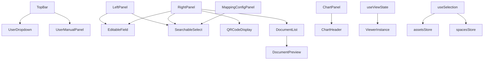

# 前端组件体系

<cite>
**本文档引用文件**  
- [TopBar.vue](file://src/components/TopBar.vue)
- [LeftPanel.vue](file://src/components/LeftPanel.vue)
- [RightPanel.vue](file://src/components/RightPanel.vue)
- [ChartPanel.vue](file://src/components/ChartPanel.vue)
- [ViewerControls.vue](file://src/components/viewer/ViewerControls.vue)
- [DocumentList.vue](file://src/components/DocumentList.vue)
- [MappingConfigPanel.vue](file://src/components/MappingConfigPanel.vue)
- [EditableField.vue](file://src/components/EditableField.vue)
- [SearchableSelect.vue](file://src/components/SearchableSelect.vue)
- [index.ts](file://src/components/layout/index.ts)
- [index.ts](file://src/components/charts/index.ts)
- [index.ts](file://src/components/viewer/index.ts)
- [useViewState.ts](file://src/composables/useViewState.ts)
- [useSelection.ts](file://src/composables/useSelection.ts)
</cite>

## 目录
1. [组件职责划分与复用策略](#组件职责划分与复用策略)
2. [组件间通信机制](#组件间通信机制)
3. [模块化组织方式](#模块化组织方式)
4. [组件依赖关系图](#组件依赖关系图)
5. [高阶组件封装与逻辑复用](#高阶组件封装与逻辑复用)
6. [组件集成用法示例](#组件集成用法示例)
7. [常见使用误区与性能优化](#常见使用误区与性能优化)

## 组件职责划分与复用策略

前端组件体系采用模块化设计，将UI组件按功能划分为布局组件、可视化组件、功能面板三大类，通过`index.ts`导出机制实现模块化组织，便于复用和维护。

### 布局组件

布局组件定义了应用的整体结构，包括顶部栏、左侧栏和右侧栏，为其他功能组件提供容器和布局支持。

**TopBar.vue** 作为顶部导航栏，集成应用Logo、搜索框、视图切换、语言切换和用户信息等功能。它通过`props`接收当前视图名称和激活文件名，通过`emits`触发视图切换事件，实现与主应用的交互。

**LeftPanel.vue** 作为左侧功能面板，主要展示连接列表和房间信息，支持多选和复制流地址功能。它通过`props`接收房间列表和选中状态，通过`emits`通知父组件选择状态变化。

**RightPanel.vue** 作为右侧属性面板，用于展示和编辑资产或空间的属性信息。它支持元素和类型两种模式，通过`props`接收属性数据和视图模式，通过`emits`通知属性变更。

**Section sources**
- [TopBar.vue](file://src/components/TopBar.vue#L1-L387)
- [LeftPanel.vue](file://src/components/LeftPanel.vue#L1-L236)
- [RightPanel.vue](file://src/components/RightPanel.vue#L1-L461)

### 可视化组件

可视化组件负责数据的图形化展示，提升用户体验。

**ChartPanel.vue** 用于展示时间序列数据图表，支持温度曲线、阈值线、警告标记和交互式提示。它通过`props`接收数据和时间范围，通过`emits`支持关闭和悬停同步事件。

**ViewerControls.vue** 作为3D视图的控制组件，提供时间轴控制、标签覆盖层和AI分析功能，增强3D场景的交互性。

**Section sources**
- [ChartPanel.vue](file://src/components/ChartPanel.vue#L1-L469)
- [ViewerControls.vue](file://src/components/viewer/ViewerControls.vue)

### 功能面板

功能面板提供特定业务功能，如文档管理和配置设置。

**DocumentList.vue** 用于展示和管理与资产、空间或规格相关的文档。它支持文档上传、预览、下载和删除，通过`props`接收关联代码，实现上下文感知的文档管理。

**MappingConfigPanel.vue** 作为数据导出的映射配置面板，允许用户将系统字段映射到外部系统属性。它支持资产、规格和空间三种映射类型，通过`props`接收映射配置和属性选项。

**Section sources**
- [DocumentList.vue](file://src/components/DocumentList.vue#L1-L928)
- [MappingConfigPanel.vue](file://src/components/MappingConfigPanel.vue#L1-L500)

## 组件间通信机制

组件间通信主要通过`props`和`emits`实现，辅以组合式函数和状态管理，确保数据流清晰可控。

### Props/Emits 通信

`props`用于父组件向子组件传递数据和配置，`emits`用于子组件向父组件发送事件和状态变更。

例如，**RightPanel.vue** 通过`props`接收`roomProperties`和`viewMode`，决定显示资产还是空间属性；通过`emits`发送`property-changed`事件，通知父组件属性已更新。

**DocumentList.vue** 通过`props`接收`assetCode`、`spaceCode`或`specCode`，确定文档的关联对象；通过`emits`发送`close`事件，通知父组件关闭预览。

**Section sources**
- [RightPanel.vue](file://src/components/RightPanel.vue#L119-L134)
- [DocumentList.vue](file://src/components/DocumentList.vue#L173-L177)

### 插槽使用规范

插槽（Slots）用于实现内容分发，增强组件的灵活性和可定制性。

**TopBar.vue** 在`ChartHeader`中使用默认插槽，允许父组件插入自定义操作按钮，如关闭按钮。

```vue
<ChartHeader :label-text="...">
  <button class="close" @click="$emit('close')">×</button>
</ChartHeader>
```

**Section sources**
- [ChartPanel.vue](file://src/components/ChartPanel.vue#L4-L6)

### 事件总线模式

虽然本项目主要使用`props/emits`，但在复杂场景下，可通过组合式函数或状态管理实现跨组件通信。

例如，**useSelection.ts** 封装了资产和空间的选择逻辑，多个组件可以导入并使用同一套选择API，实现选择状态的同步。

**Section sources**
- [useSelection.ts](file://src/composables/useSelection.ts#L1-L142)

## 模块化组织方式

组件通过`index.ts`文件进行模块化导出，形成清晰的目录结构和导入路径。

### 导出机制

每个组件目录下都有一个`index.ts`文件，集中导出该目录下的所有组件。

**layout/index.ts** 导出所有布局组件：
```ts
export { default as TopBar } from '../TopBar.vue';
export { default as LeftPanel } from '../LeftPanel.vue';
export { default as RightPanel } from '../RightPanel.vue';
```

**charts/index.ts** 导出所有图表相关组件：
```ts
export { default as ChartPanel } from '../ChartPanel.vue';
export { default as ChartHeader } from '../ChartHeader.vue';
```

**viewer/index.ts** 导出3D视图相关组件：
```ts
export { default as ViewerControls } from './ViewerControls.vue';
export { default as TimelineControl } from './TimelineControl.vue';
```

这种组织方式使得父组件可以方便地从`layout`、`charts`等目录导入所需组件，而无需关心具体文件路径。

**Section sources**
- [index.ts](file://src/components/layout/index.ts#L1-L8)
- [index.ts](file://src/components/charts/index.ts#L1-L7)
- [index.ts](file://src/components/viewer/index.ts#L1-L20)

## 组件依赖关系图



**Diagram sources**
- [TopBar.vue](file://src/components/TopBar.vue#L100-L101)
- [LeftPanel.vue](file://src/components/LeftPanel.vue#L110-L111)
- [RightPanel.vue](file://src/components/RightPanel.vue#L110-L112)
- [ChartPanel.vue](file://src/components/ChartPanel.vue#L108)
- [MappingConfigPanel.vue](file://src/components/MappingConfigPanel.vue#L121)
- [DocumentList.vue](file://src/components/DocumentList.vue#L165)
- [useViewState.ts](file://src/composables/useViewState.ts#L13)
- [useSelection.ts](file://src/composables/useSelection.ts#L6-L7)

## 高阶组件封装与逻辑复用

通过组合式函数（Composables）实现逻辑复用，避免代码重复。

### useViewState

**useViewState.ts** 封装了3D视图状态的管理逻辑，包括获取状态、截取快照和恢复状态。

它接收`getViewer`函数和状态引用，返回`getViewerState`、`captureScreenshot`和`restoreViewState`方法。`restoreViewState`方法特别处理了WorldUpVector的重置，确保视图恢复的准确性。

**Section sources**
- [useViewState.ts](file://src/composables/useViewState.ts#L1-L256)

### useSelection

**useSelection.ts** 封装了资产和空间的选择逻辑，提供统一的选择、取消选择、切换和清除API。

它依赖`assetsStore`和`spacesStore`，通过计算属性暴露选中状态，实现选择逻辑的集中管理。

**Section sources**
- [useSelection.ts](file://src/composables/useSelection.ts#L1-L142)

## 组件集成用法示例

以下示例展示如何集成使用这些组件。

### 集成布局组件

```vue
<template>
  <div class="app-layout">
    <TopBar :current-view-name="currentView" @toggle-views="toggleViews" />
    <div class="main-content">
      <LeftPanel :rooms="roomList" :selected-db-ids="selectedRoomIds" @rooms-selected="onRoomsSelected" />
      <RightPanel :room-properties="selectedRoom" @property-changed="onPropertyChanged" />
    </div>
  </div>
</template>
```

### 集成可视化组件

```vue
<template>
  <ChartPanel :data="temperatureData" :range="timeRange" @close="removeChart" />
</template>
```

### 集成功能面板

```vue
<template>
  <DocumentList :asset-code="currentAssetCode" />
  <MappingConfigPanel :asset-mapping="mapping" @save="saveMapping" />
</template>
```

**Section sources**
- [TopBar.vue](file://src/components/TopBar.vue)
- [LeftPanel.vue](file://src/components/LeftPanel.vue)
- [RightPanel.vue](file://src/components/RightPanel.vue)
- [ChartPanel.vue](file://src/components/ChartPanel.vue)
- [DocumentList.vue](file://src/components/DocumentList.vue)
- [MappingConfigPanel.vue](file://src/components/MappingConfigPanel.vue)

## 常见使用误区与性能优化

### 常见使用误区

1. **过度使用Teleport**：`SearchableSelect.vue`使用`Teleport`将下拉列表渲染到body，避免被父容器截断。但过度使用会导致DOM结构混乱，应仅在必要时使用。
2. **忽略状态同步**：`RightPanel.vue`通过`watch`同步`props`变化，但未处理异步更新，可能导致状态不一致。
3. **硬编码样式**：部分组件使用硬编码颜色和尺寸，不利于主题切换和响应式设计。

### 性能优化建议

1. **虚拟滚动**：`DocumentList.vue`在文档数量多时可能性能下降，建议实现虚拟滚动。
2. **防抖输入**：`SearchableSelect.vue`的搜索输入未防抖，高频输入可能导致性能问题，建议添加防抖。
3. **缓存计算属性**：`MappingConfigPanel.vue`的`mergedAssetCategories`等计算属性涉及集合操作，建议缓存结果或使用更高效算法。
4. **减少重渲染**：`ChartPanel.vue`的`onMouseMove`事件频繁触发，建议使用节流或`requestAnimationFrame`优化。

**Section sources**
- [SearchableSelect.vue](file://src/components/SearchableSelect.vue#L11-L12)
- [RightPanel.vue](file://src/components/RightPanel.vue#L163-L169)
- [DocumentList.vue](file://src/components/DocumentList.vue)
- [MappingConfigPanel.vue](file://src/components/MappingConfigPanel.vue#L173-L190)
- [ChartPanel.vue](file://src/components/ChartPanel.vue#L209-L233)