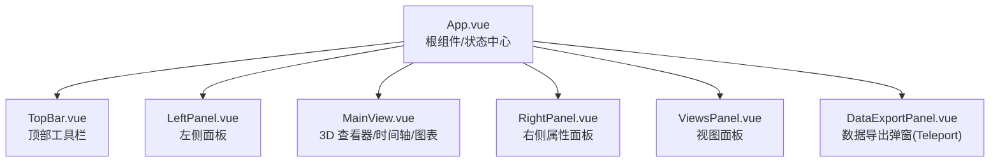
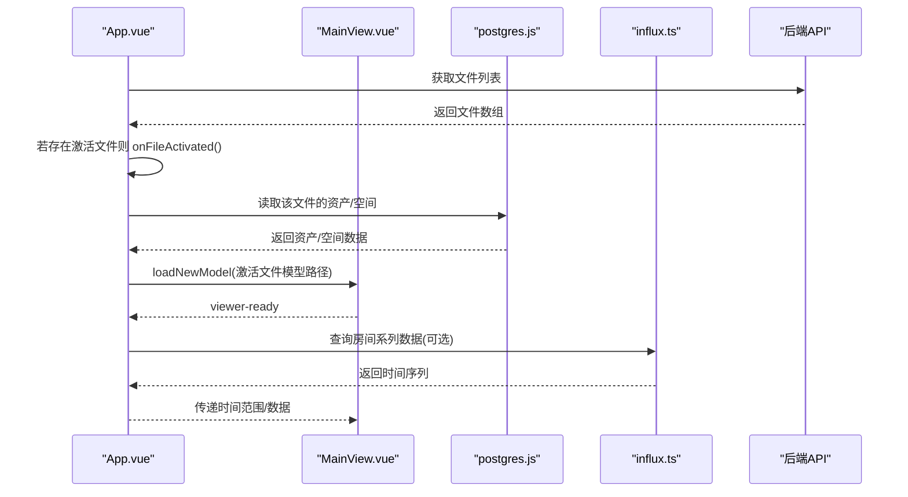
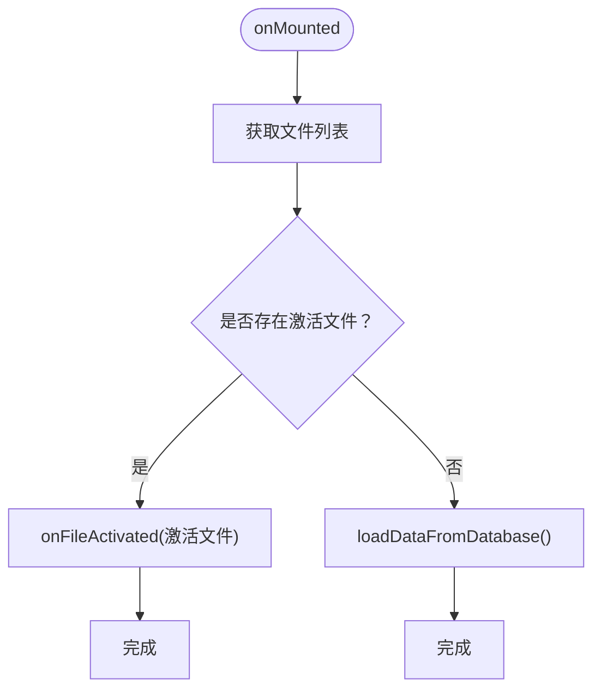
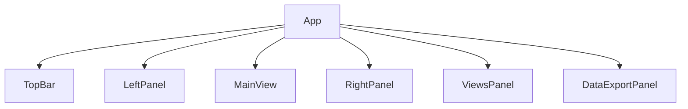
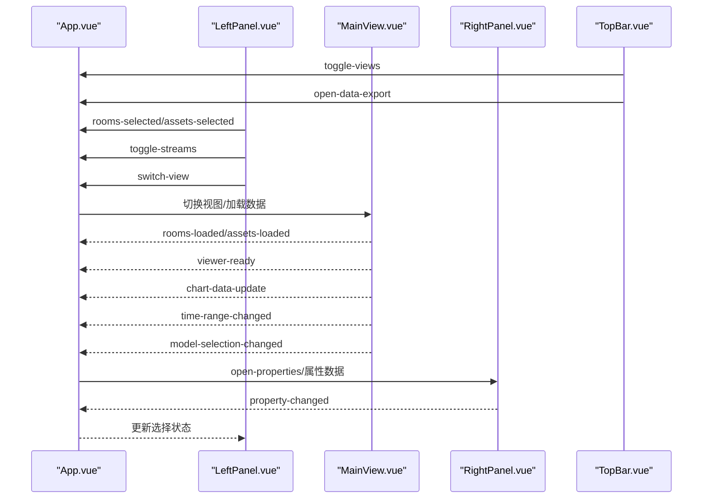
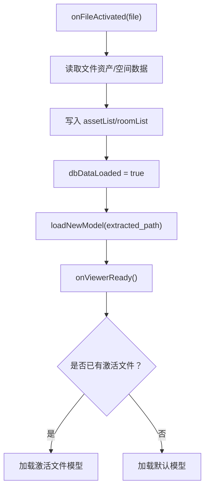
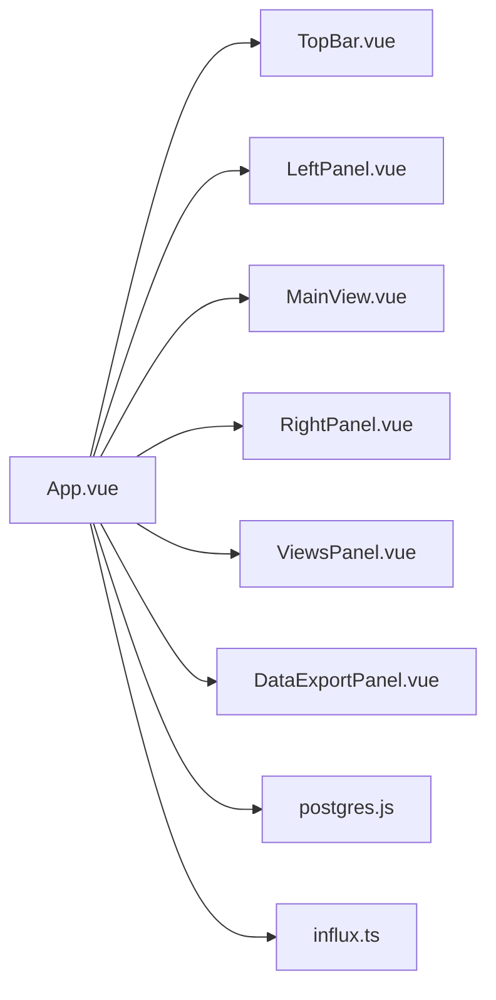

# App.vue 根组件

<cite>
**本文引用的文件**
- [App.vue](file://src/App.vue)
- [main.js](file://src/main.js)
- [TopBar.vue](file://src/components/TopBar.vue)
- [LeftPanel.vue](file://src/components/LeftPanel.vue)
- [MainView.vue](file://src/components/MainView.vue)
- [RightPanel.vue](file://src/components/RightPanel.vue)
- [postgres.js](file://src/services/postgres.js)
- [influx.ts](file://src/services/influx.ts)
</cite>

## 目录
1. [简介](#简介)
2. [项目结构](#项目结构)
3. [核心组件](#核心组件)
4. [架构总览](#架构总览)
5. [详细组件分析](#详细组件分析)
6. [依赖关系分析](#依赖关系分析)
7. [性能考虑](#性能考虑)
8. [故障排查指南](#故障排查指南)
9. [结论](#结论)

## 简介
App.vue 是本前端应用的根组件，承担着全局状态管理、布局编排、事件总线与子组件交互、初始化数据加载与环境配置、以及错误边界兜底等职责。它通过组合式 API（setup）集中管理当前选中的空间/资产、视图模式、面板显示状态、图表面板与右侧属性面板的联动、以及与 3D 查看器（MainView）的双向通信。同时，它负责与后端 API 服务进行数据交换，实现数据库与模型数据的双轨加载策略，并在 Viewer 初始化完成后按需加载激活文件的模型与数据。

## 项目结构
App.vue 位于 src 目录根部，作为应用入口，通过 main.js 挂载到 DOM。其直接管理的子组件包括：
- 顶部工具栏 TopBar
- 左侧面板 LeftPanel（资产/空间/文件视图）
- 主视图 MainView（3D Viewer 与时间轴/图表）
- 右侧面板 RightPanel（属性编辑与文档）
- 视图面板 ViewsPanel（视图列表与状态恢复）
- 数据导出弹窗 DataExportPanel（基于 Teleport）

**图表来源**
- [App.vue](file://src/App.vue#L1-L140)
- [TopBar.vue](file://src/components/TopBar.vue#L1-L120)
- [LeftPanel.vue](file://src/components/LeftPanel.vue#L1-L120)
- [MainView.vue](file://src/components/MainView.vue#L1-L120)
- [RightPanel.vue](file://src/components/RightPanel.vue#L1-L120)

**章节来源**
- [App.vue](file://src/App.vue#L1-L140)
- [main.js](file://src/main.js#L1-L7)

## 核心组件
- 全局状态与布局
  - 面板宽度与开合状态：左侧面板宽度、右侧面板宽度、图表面板高度与开合、拖拽尺寸调整
  - 视图模式：currentView（'assets'/'connect'/'files'）
  - 选择状态：savedRoomSelections/savedAssetSelections、selectedObjectIds、selectedRoomProperties
  - 图表数据：chartData、selectedRoomSeries、currentRange
  - 导出面板：isDataExportOpen、currentExportFileId
  - 视图面板：isViewsPanelOpen、activeFileId、activeFileName、currentViewName
  - 加载与缓存：dbDataLoaded、viewerReady、currentLoadedModelPath、modelRoomDbIds/modelAssetDbIds
- 事件与回调
  - 与 MainView 的事件桥接：rooms-loaded、assets-loaded、viewer-ready、chart-data-update、time-range-changed、model-selection-changed
  - 与 TopBar 的事件桥接：toggle-views、open-data-export
  - 与 LeftPanel 的事件桥接：rooms-selected、assets-selected、toggle-streams、switch-view
  - 与 RightPanel 的事件桥接：close-properties、property-changed
- 初始化与数据加载
  - onMounted 生命周期内加载激活文件或默认数据
  - loadDataFromDatabase：健康检查后从数据库加载资产与空间
  - onFileActivated：按文件维度加载资产/空间数据并加载对应模型
  - onViewerReady：Viewer 初始化完成后加载激活文件或默认模型

**章节来源**
- [App.vue](file://src/App.vue#L146-L353)
- [App.vue](file://src/App.vue#L355-L458)
- [App.vue](file://src/App.vue#L459-L635)
- [App.vue](file://src/App.vue#L636-L790)
- [App.vue](file://src/App.vue#L790-L990)
- [App.vue](file://src/App.vue#L990-L1132)
- [App.vue](file://src/App.vue#L1133-L1261)
- [App.vue](file://src/App.vue#L1262-L1316)
- [App.vue](file://src/App.vue#L1327-L1360)

## 架构总览
App.vue 作为状态中心，采用“事件驱动 + props 下发”的模式组织组件协作。其核心流程如下：
- 初始化阶段：onMounted 读取后端文件列表，定位激活文件；若无激活文件则回退到数据库加载默认数据
- Viewer 初始化：MainView.onViewerReady 触发后，按需加载激活文件或默认模型
- 数据加载策略：优先使用数据库数据（dbDataLoaded 标记），否则回退到模型数据；避免重复加载
- 选择与联动：LeftPanel/RightPanel 与 MainView 之间通过事件与 props 实现双向同步
- 图表联动：MainView 发出时间范围与数据更新事件，App.vue 负责聚合与刷新

**图表来源**
- [App.vue](file://src/App.vue#L1327-L1360)
- [App.vue](file://src/App.vue#L355-L458)
- [App.vue](file://src/App.vue#L459-L635)
- [App.vue](file://src/App.vue#L509-L534)
- [postgres.js](file://src/services/postgres.js#L57-L108)
- [influx.ts](file://src/services/influx.ts#L39-L103)

**章节来源**
- [App.vue](file://src/App.vue#L1327-L1360)
- [MainView.vue](file://src/components/MainView.vue#L543-L596)
- [postgres.js](file://src/services/postgres.js#L57-L108)
- [influx.ts](file://src/services/influx.ts#L39-L103)

## 详细组件分析

### 状态管理与生命周期
- 全局响应式状态
  - 面板尺寸与开合：leftWidth/rightWidth/isRightPanelOpen/isChartPanelOpen/chartPanelHeight
  - 选择与属性：savedRoomSelections/savedAssetSelections/selectedObjectIds/selectedRoomProperties
  - 图表与时间：chartData/selectedRoomSeries/currentRange
  - 视图与文件：currentView/isViewsPanelOpen/activeFileId/activeFileName/currentViewName
  - 加载与缓存：dbDataLoaded/viewerReady/currentLoadedModelPath/modelRoomDbIds/modelAssetDbIds
- 生命周期钩子
  - onMounted：读取文件列表，定位激活文件并加载；若失败则回退到数据库加载
  - onUnmounted：清理拖拽事件
- 初始化数据加载
  - loadDataFromDatabase：健康检查后从数据库加载资产/空间
  - onFileActivated：按文件维度加载资产/空间数据并加载模型
  - onViewerReady：Viewer 初始化完成后加载激活文件或默认模型

**图表来源**
- [App.vue](file://src/App.vue#L1327-L1360)
- [App.vue](file://src/App.vue#L293-L353)
- [App.vue](file://src/App.vue#L459-L635)

**章节来源**
- [App.vue](file://src/App.vue#L146-L353)
- [App.vue](file://src/App.vue#L1327-L1360)

### 布局与条件渲染
- 顶部工具栏 TopBar：接收 isViewsPanelOpen/currentViewName 并发出 toggle-views/open-data-export 事件
- 左侧面板 LeftPanel：根据 currentView 渲染 AssetPanel/LeftPanel/FilePanel，并下发 rooms/assets/selectedDbIds 等 props
- 主视图 MainView：根据 currentView 渲染 3D Viewer，支持时间轴与图表面板
- 右侧面板 RightPanel：根据 selectedRoomProperties/selectedIds/viewMode 渲染属性编辑
- 视图面板 ViewsPanel：根据 isViewsPanelOpen/activeFileId/activeFileName 控制可见性
- 数据导出弹窗：通过 Teleport 渲染在 body 下，接收 getFullAssetData/getFullSpaceData 等方法

**图表来源**
- [App.vue](file://src/App.vue#L1-L140)
- [TopBar.vue](file://src/components/TopBar.vue#L1-L120)
- [LeftPanel.vue](file://src/components/LeftPanel.vue#L1-L120)
- [MainView.vue](file://src/components/MainView.vue#L1-L120)
- [RightPanel.vue](file://src/components/RightPanel.vue#L1-L120)

**章节来源**
- [App.vue](file://src/App.vue#L1-L140)

### 事件总线与父子通信
- TopBar
  - 接收 props：isViewsPanelOpen/currentViewName
  - 发出事件：toggle-views/open-data-export
- LeftPanel
  - 接收 props：rooms/currentView/selectedDbIds
  - 发出事件：rooms-selected/assets-selected/toggle-streams/switch-view
- MainView
  - 接收 props：currentView/assets/rooms
  - 发出事件：rooms-loaded/assets-loaded/viewer-ready/chart-data-update/time-range-changed/model-selection-changed
- RightPanel
  - 接收 props：roomProperties/selectedIds/viewMode
  - 发出事件：close-properties/property-changed

**图表来源**
- [App.vue](file://src/App.vue#L146-L353)
- [App.vue](file://src/App.vue#L355-L458)
- [App.vue](file://src/App.vue#L459-L635)
- [App.vue](file://src/App.vue#L636-L790)
- [App.vue](file://src/App.vue#L790-L990)
- [App.vue](file://src/App.vue#L990-L1132)
- [App.vue](file://src/App.vue#L1133-L1261)
- [App.vue](file://src/App.vue#L1262-L1316)
- [TopBar.vue](file://src/components/TopBar.vue#L96-L104)
- [LeftPanel.vue](file://src/components/LeftPanel.vue#L87-L93)
- [MainView.vue](file://src/components/MainView.vue#L200-L209)
- [RightPanel.vue](file://src/components/RightPanel.vue#L117-L133)

**章节来源**
- [TopBar.vue](file://src/components/TopBar.vue#L96-L104)
- [LeftPanel.vue](file://src/components/LeftPanel.vue#L87-L93)
- [MainView.vue](file://src/components/MainView.vue#L200-L209)
- [RightPanel.vue](file://src/components/RightPanel.vue#L117-L133)

### 数据加载与模型加载策略
- 数据源优先级
  - 数据库数据：dbDataLoaded=true 时优先使用数据库资产/空间列表
  - 模型数据：dbDataLoaded=false 时使用 MainView 提供的模型数据
- 激活文件加载
  - onFileActivated：按文件维度加载资产/空间数据，标记 dbDataLoaded=true，防止被模型数据覆盖
  - onViewerReady：Viewer 初始化完成后加载激活文件或默认模型，避免重复加载
- 图表数据
  - onChartDataUpdate：聚合 chartData 与 currentRange，并按选中房间刷新 selectedRoomSeries
  - onTimeRangeChanged：根据时间范围重新查询房间系列数据

**图表来源**
- [App.vue](file://src/App.vue#L459-L635)
- [App.vue](file://src/App.vue#L509-L534)
- [App.vue](file://src/App.vue#L536-L546)

**章节来源**
- [App.vue](file://src/App.vue#L459-L635)
- [App.vue](file://src/App.vue#L509-L534)

### 错误边界与回退机制
- API 健康检查：checkApiHealth 用于判断后端服务可用性
- 数据加载失败：loadDataFromDatabase 捕获异常并回退到模型数据
- Viewer 加载失败：onViewerReady 中对网络错误与路径预检失败进行容错
- 导出面板：openDataExportPanel 在打开时自动加载对应文件模型，保证“所见即所得”

**章节来源**
- [App.vue](file://src/App.vue#L293-L353)
- [App.vue](file://src/App.vue#L355-L458)
- [App.vue](file://src/App.vue#L229-L244)
- [postgres.js](file://src/services/postgres.js#L12-L19)

## 依赖关系分析
- 组件依赖
  - App.vue 依赖 TopBar、LeftPanel、AssetPanel、FilePanel、MainView、RightPanel、ViewsPanel、DataExportPanel
  - MainView 内部依赖 influx.ts 与 postgres.js（通过 App.vue 的方法间接使用）
- 服务依赖
  - postgres.js：提供 checkApiHealth、getAssets、getSpaces 等 API 调用
  - influx.ts：提供 isInfluxConfigured、queryAverageSeries、queryRoomSeries 等时序数据查询
- 环境变量
  - VITE_API_URL、VITE_INFLUX_URL/VITE_INFLUX_TOKEN/VITE_INFLUX_ORG/VITE_INFLUX_BUCKET/VITE_INFLUX_BASIC/VITE_INFLUX_USER/VITE_INFLUX_PASSWORD

**图表来源**
- [App.vue](file://src/App.vue#L146-L158)
- [postgres.js](file://src/services/postgres.js#L1-L20)
- [influx.ts](file://src/services/influx.ts#L1-L10)

**章节来源**
- [App.vue](file://src/App.vue#L146-L158)
- [postgres.js](file://src/services/postgres.js#L1-L20)
- [influx.ts](file://src/services/influx.ts#L1-L10)

## 性能考虑
- 懒加载与按需渲染
  - 左右面板宽度与图表面板高度通过响应式 ref 控制，避免不必要的重绘
  - 图表面板仅在需要时渲染，减少 DOM 与计算压力
- 事件节流与防抖
  - onTimeRangeChanged 与 onChartDataUpdate 中对异步查询进行聚合，避免频繁请求
- 重复加载防护
  - currentLoadedModelPath 与 isLoadingModel 防止重复加载同一模型
  - dbDataLoaded 标记避免数据库数据被模型数据覆盖
- 布局重绘优化
  - triggerResize 使用 nextTick 与 window.resize 间接通知 Autodesk Viewer 重绘，减少强制同步布局
- 状态持久化建议
  - 将 currentView、leftWidth、rightWidth、isRightPanelOpen、isChartPanelOpen、currentRange 等关键状态持久化到 localStorage，页面刷新后恢复
  - 将 selectedObjectIds/savedRoomSelections/savedAssetSelections 等选择状态持久化，提升用户体验
- 图表与时序数据
  - 使用 isInfluxConfigured 判定启用/禁用图表功能，避免无效请求
  - 合理设置 windowMs 与时间范围，减少数据点数量

[本节为通用建议，无需特定文件引用]

## 故障排查指南
- Viewer 无法加载模型
  - 检查 VITE_API_URL 与模型路径是否正确
  - 确认 onViewerReady 中的模型加载逻辑与路径预检
- 图表数据为空
  - 检查 isInfluxConfigured 配置是否完整
  - 确认时间范围与窗口参数合理
- 选择状态不同步
  - 检查 onRoomsSelected/onAssetsSelected 与 onModelSelectionChanged 的事件链路
  - 确认 selectedObjectIds 与 selectedRoomProperties 的映射关系
- 数据加载失败
  - 使用 checkApiHealth 判断后端服务状态
  - 回退到数据库加载策略，确认 getAssets/getSpaces 返回格式一致

**章节来源**
- [App.vue](file://src/App.vue#L355-L458)
- [App.vue](file://src/App.vue#L509-L534)
- [App.vue](file://src/App.vue#L1182-L1218)
- [influx.ts](file://src/services/influx.ts#L9-L10)
- [postgres.js](file://src/services/postgres.js#L12-L19)

## 结论
App.vue 作为根组件，通过组合式 API 将全局状态、布局编排、事件通信与数据加载策略有机整合，形成稳定可靠的应用骨架。其“数据库优先 + 模型回退”的数据加载策略、完善的事件桥接与错误回退机制，使得应用在复杂场景下仍能保持良好的一致性与用户体验。建议在生产环境中进一步完善状态持久化与性能监控，持续优化图表与模型加载体验。