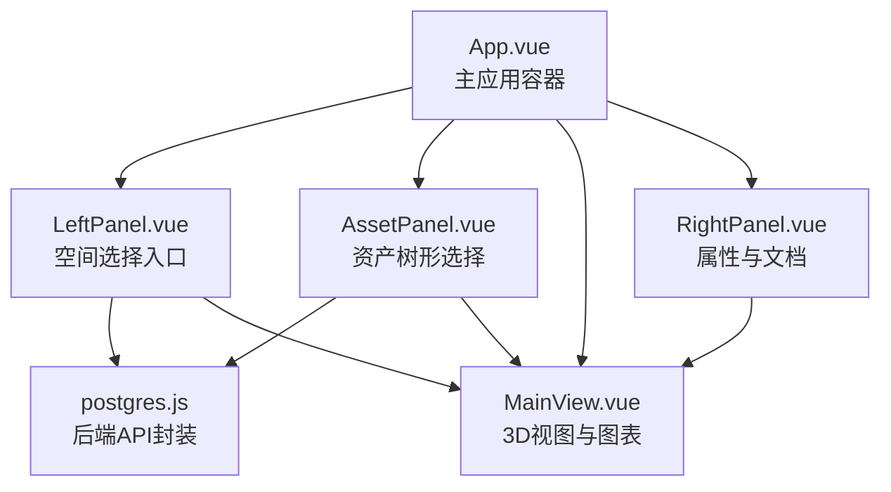
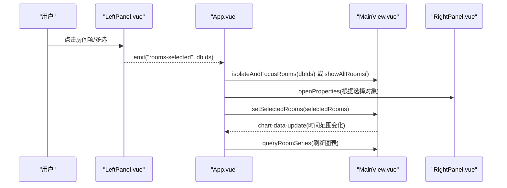
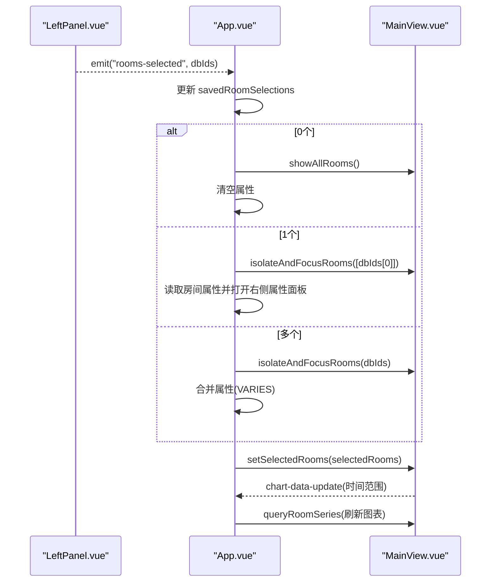
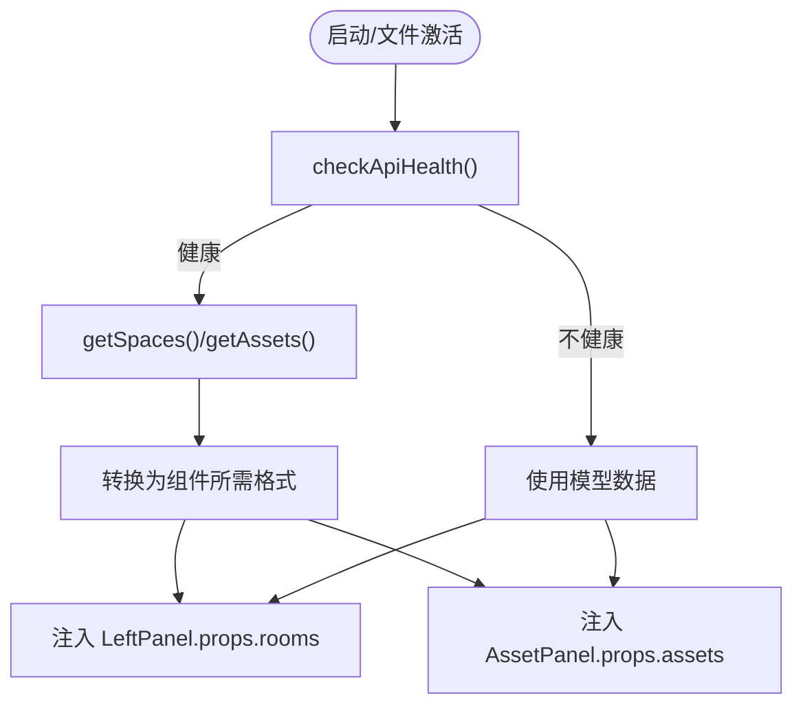
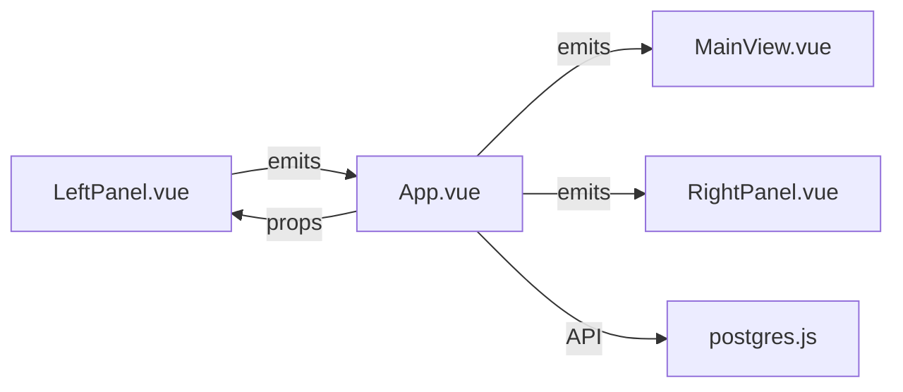

# LeftPanel.vue 左侧面板

<cite>
**本文引用的文件**
- [LeftPanel.vue](file://src/components/LeftPanel.vue)
- [App.vue](file://src/App.vue)
- [AssetPanel.vue](file://src/components/AssetPanel.vue)
- [MainView.vue](file://src/components/MainView.vue)
- [SearchableSelect.vue](file://src/components/SearchableSelect.vue)
- [postgres.js](file://src/services/postgres.js)
- [RightPanel.vue](file://src/components/RightPanel.vue)
</cite>

## 目录
1. [简介](#简介)
2. [项目结构](#项目结构)
3. [核心组件](#核心组件)
4. [架构总览](#架构总览)
5. [详细组件分析](#详细组件分析)
6. [依赖关系分析](#依赖关系分析)
7. [性能考量](#性能考量)
8. [故障排查指南](#故障排查指南)
9. [结论](#结论)
10. [附录](#附录)

## 简介
本文件全面记录 LeftPanel.vue 组件的功能与实现，重点说明其作为“空间、资产和文档选择入口”的职责。LeftPanel 是左侧面板的核心，负责：
- 作为“连接”视图下的空间选择入口，提供房间列表的多选交互与属性联动
- 与 App.vue 通过事件向上游传递选择结果，驱动主视图 MainView 的聚焦与图表更新
- 与后端 API 通过 postgres.js 进行数据绑定，支持从数据库加载空间与资产数据
- 与右侧属性面板 RightPanel 协作，展示所选对象的属性与文档

此外，文档还解释了组件内部结构（图标栏、列表面板、搜索与过滤）、事件处理流程（onRoomsSelected、onAssetsSelected）、与后端 API 的数据绑定机制，以及树形结构渲染优化策略，并给出自定义数据过滤逻辑与扩展新选择模式的实践建议。

## 项目结构
LeftPanel.vue 位于前端组件目录，与 App.vue、AssetPanel.vue、MainView.vue、RightPanel.vue 等共同构成主界面布局。组件通过 App.vue 的 prop 与事件桥接，实现跨组件协作。

图表来源
- [App.vue](file://src/App.vue#L1-L120)
- [LeftPanel.vue](file://src/components/LeftPanel.vue#L1-L120)
- [AssetPanel.vue](file://src/components/AssetPanel.vue#L1-L120)
- [MainView.vue](file://src/components/MainView.vue#L1-L120)
- [RightPanel.vue](file://src/components/RightPanel.vue#L1-L120)
- [postgres.js](file://src/services/postgres.js#L1-L120)

章节来源
- [App.vue](file://src/App.vue#L1-L120)
- [LeftPanel.vue](file://src/components/LeftPanel.vue#L1-L120)

## 核心组件
- LeftPanel.vue：连接视图下的空间列表选择器，支持多选、复制流地址、属性联动与事件冒泡
- AssetPanel.vue：资产视图下的树形选择器，支持按分类分组、搜索过滤、分组全选/半选、反向定位
- App.vue：应用主容器，负责加载数据库数据、维护选择状态、处理选择事件、驱动主视图
- MainView.vue：3D视图与时间轴，接收选择事件并执行隔离聚焦、显示标签、刷新图表
- RightPanel.vue：右侧属性面板，展示所选对象属性，支持批量编辑与文档列表
- postgres.js：后端 API 封装，提供健康检查、空间/资产查询等接口

章节来源
- [LeftPanel.vue](file://src/components/LeftPanel.vue#L1-L120)
- [AssetPanel.vue](file://src/components/AssetPanel.vue#L1-L120)
- [App.vue](file://src/App.vue#L1-L200)
- [MainView.vue](file://src/components/MainView.vue#L1-L120)
- [RightPanel.vue](file://src/components/RightPanel.vue#L1-L120)
- [postgres.js](file://src/services/postgres.js#L1-L120)

## 架构总览
LeftPanel 与 App 的交互采用“事件驱动”的方式：
- LeftPanel 通过 emit 向上抛出 rooms-selected、assets-selected、open-properties、toggle-streams、switch-view 等事件
- App.vue 监听这些事件，更新选择状态、调用 MainView 方法、打开右侧属性面板、切换视图
- MainView 根据选择结果执行隔离聚焦、显示标签、刷新图表数据

图表来源
- [LeftPanel.vue](file://src/components/LeftPanel.vue#L120-L180)
- [App.vue](file://src/App.vue#L637-L769)
- [MainView.vue](file://src/components/MainView.vue#L367-L400)

章节来源
- [LeftPanel.vue](file://src/components/LeftPanel.vue#L120-L180)
- [App.vue](file://src/App.vue#L637-L769)
- [MainView.vue](file://src/components/MainView.vue#L367-L400)

## 详细组件分析

### LeftPanel.vue 结构与职责
- 图标栏（Icon Bar）：提供视图切换按钮（资产、文件、系统、连接），以及数据流开关按钮
- 列表面板（List Panel）：包含搜索行、房间列表、复制流地址提示
- 事件发射：
  - rooms-selected：传递选中的 dbId 数组
  - open-properties：触发右侧属性面板打开
  - toggle-streams：切换数据流面板
  - switch-view：切换视图（如 assets、files）
- 选择逻辑：
  - 多选：维护本地 selectedDbIdsLocal，watch 同步父级选择
  - 过滤：当房间列表变化时，过滤掉不存在的 dbId
  - 选中态：通过 isSelected(index) 判断并高亮
  - 复制流地址：调用后端接口获取完整流地址，复制到剪贴板并显示提示

章节来源
- [LeftPanel.vue](file://src/components/LeftPanel.vue#L1-L120)
- [LeftPanel.vue](file://src/components/LeftPanel.vue#L120-L180)

### 事件处理流程：onRoomsSelected
- App.vue 监听 LeftPanel 的 rooms-selected 事件，更新 savedRoomSelections
- 根据选择数量决定行为：
  - 0 个：显示所有房间，清空属性
  - 1 个：获取房间属性并打开右侧属性面板
  - 多个：合并属性（相同显示实际值，不同显示 VARIES）
- 调用 MainView 的方法：
  - isolateAndFocusRooms 或 showAllRooms
  - setSelectedRooms(selectedRooms)
  - 根据当前时间范围查询房间系列数据并刷新图表

图表来源
- [App.vue](file://src/App.vue#L637-L769)
- [MainView.vue](file://src/components/MainView.vue#L367-L400)

章节来源
- [App.vue](file://src/App.vue#L637-L769)
- [MainView.vue](file://src/components/MainView.vue#L367-L400)

### 与后端 API 的数据绑定机制（postgres.js）
- App.vue 在 onViewerReady 与文件激活时，通过 postgres.js 的 getSpaces/getAssets 从后端拉取数据
- 数据转换为组件所需的格式（dbId、name、code 等），并注入到 LeftPanel 与 AssetPanel 的 props
- API 健康检查 checkApiHealth 用于决定是否使用数据库数据或回退到模型数据

图表来源
- [App.vue](file://src/App.vue#L293-L353)
- [App.vue](file://src/App.vue#L549-L635)
- [postgres.js](file://src/services/postgres.js#L1-L120)

章节来源
- [App.vue](file://src/App.vue#L293-L353)
- [App.vue](file://src/App.vue#L549-L635)
- [postgres.js](file://src/services/postgres.js#L1-L120)

### 树形结构渲染优化策略（对比 AssetPanel）
- LeftPanel 当前为平面列表，不包含树形结构
- AssetPanel 展示树形结构，包含：
  - 分类分组（按 classification_code）
  - 展开/折叠状态
  - 分组全选/半选状态
  - 搜索过滤时自动展开所有分组
  - 反向定位：expandAndScrollToAsset 定位到目标资产并滚动居中
- 优化建议（若需在 LeftPanel 引入树形）：
  - 使用 computed 构建树结构，按分类码分组
  - 保持 expandedGroups 状态，支持分组全选/半选
  - 搜索时仅展开命中分组，避免全量展开导致的性能问题
  - 使用虚拟滚动或分页加载超大数据集

章节来源
- [AssetPanel.vue](file://src/components/AssetPanel.vue#L126-L217)
- [AssetPanel.vue](file://src/components/AssetPanel.vue#L255-L319)

### 与 SearchableSelect 的集成
- LeftPanel.vue 本身未直接使用 SearchableSelect
- SearchableSelect.vue 提供可搜索下拉选择组件，具备：
  - 下拉门户（Teleport）渲染，避免被父容器裁剪
  - 输入框搜索与选项过滤
  - 点击外部关闭、窗口滚动/尺寸变化时位置更新
- 若需要在 LeftPanel 中引入搜索，可参考以下思路：
  - 将搜索输入绑定到本地 searchText
  - 过滤 items 或 rooms 列表
  - 使用 Teleport 将下拉列表渲染到 body，避免溢出
  - 注意焦点管理与键盘交互

章节来源
- [SearchableSelect.vue](file://src/components/SearchableSelect.vue#L1-L146)
- [SearchableSelect.vue](file://src/components/SearchableSelect.vue#L146-L265)

### 自定义数据过滤逻辑与扩展新选择模式
- 数据过滤：
  - 在 App.vue 中对从数据库获取的数据进行二次加工（如按楼层、分类、规格等过滤）
  - 在组件内使用 computed 过滤（如 AssetPanel 的 filteredTree）
- 扩展新选择模式：
  - 在 LeftPanel.vue 新增 emit('assets-selected') 事件，与 App.vue onAssetsSelected 对接
  - 在 App.vue 中新增对应处理逻辑，调用 MainView 的资产聚焦方法
  - 在 RightPanel.vue 中扩展属性面板，支持资产属性编辑与文档列表
- 注意事项：
  - 保持 selectedDbIdsLocal 与父级同步，避免选择状态不一致
  - 事件命名与参数约定统一，便于跨组件协作
  - 性能优化：避免在渲染过程中进行昂贵计算，使用 computed 与缓存

章节来源
- [LeftPanel.vue](file://src/components/LeftPanel.vue#L120-L180)
- [App.vue](file://src/App.vue#L771-L869)
- [RightPanel.vue](file://src/components/RightPanel.vue#L1-L120)

## 依赖关系分析
- 组件耦合：
  - LeftPanel 与 App：通过事件与 props 耦合，低耦合高内聚
  - App 与 MainView：通过方法调用耦合，集中控制主视图行为
  - App 与 RightPanel：通过属性与事件耦合，展示属性与文档
- 外部依赖：
  - postgres.js：后端 API 封装，提供健康检查与数据查询
  - MainView：3D 视图与时间轴，负责渲染与交互
- 潜在风险：
  - 事件命名一致性（如 rooms-selected、assets-selected）
  - 选择状态同步（watch props.selectedDbIds 与 items 变化）
  - 复制流地址的错误处理与提示

图表来源
- [LeftPanel.vue](file://src/components/LeftPanel.vue#L120-L180)
- [App.vue](file://src/App.vue#L1-L120)
- [MainView.vue](file://src/components/MainView.vue#L1-L120)
- [RightPanel.vue](file://src/components/RightPanel.vue#L1-L120)
- [postgres.js](file://src/services/postgres.js#L1-L120)

章节来源
- [LeftPanel.vue](file://src/components/LeftPanel.vue#L120-L180)
- [App.vue](file://src/App.vue#L1-L120)
- [MainView.vue](file://src/components/MainView.vue#L1-L120)
- [RightPanel.vue](file://src/components/RightPanel.vue#L1-L120)
- [postgres.js](file://src/services/postgres.js#L1-L120)

## 性能考量
- 列表渲染：
  - 使用 v-for 渲染列表项，避免在渲染函数中进行复杂计算
  - 对于超大列表，考虑虚拟滚动或分页加载
- 事件处理：
  - 复制流地址使用异步请求与防抖提示，避免频繁 DOM 更新
- 数据绑定：
  - 使用 computed 进行派生数据，减少不必要的重渲染
  - watch 中只做必要更新，避免深度监听大型对象
- 3D 视图：
  - MainView 的时间轴与图表刷新应与选择状态解耦，避免频繁重绘

[本节为通用指导，无需具体文件来源]

## 故障排查指南
- 无法连接后端 API：
  - 检查 checkApiHealth 返回值，确认 API 健康状态
  - 查看网络请求与 CORS 配置
- 选择状态异常：
  - 确认 props.selectedDbIds 与 items 变化时的同步逻辑
  - 检查 dbId 是否存在于当前列表
- 复制流地址失败：
  - 检查后端接口 /api/v1/timeseries/stream-url/{spaceCode} 的响应
  - 确认 navigator.clipboard 权限与浏览器支持
- 图表无数据：
  - 确认 MainView 的时间范围与 queryRoomSeries 参数
  - 检查 InfluxDB 配置与数据可用性

章节来源
- [App.vue](file://src/App.vue#L293-L353)
- [LeftPanel.vue](file://src/components/LeftPanel.vue#L154-L177)
- [MainView.vue](file://src/components/MainView.vue#L367-L400)

## 结论
LeftPanel.vue 作为连接视图下的空间选择入口，承担了多选交互、属性联动与事件冒泡的关键职责。通过与 App.vue 的事件协作、与 postgres.js 的数据绑定、与 MainView 的聚焦控制，实现了从选择到可视化的完整闭环。对于后续扩展，可在保持事件契约与状态同步的前提下，引入树形结构、搜索过滤与更多选择模式，并持续关注性能优化与错误处理。

[本节为总结，无需具体文件来源]

## 附录
- 事件与方法清单（路径引用）
  - LeftPanel.emit('rooms-selected', dbIds)：[LeftPanel.vue](file://src/components/LeftPanel.vue#L140-L152)
  - App.onRoomsSelected(dbIds)：[App.vue](file://src/App.vue#L637-L769)
  - App.onAssetsSelected(dbIds)：[App.vue](file://src/App.vue#L771-L869)
  - MainView.isolateAndFocusRooms/dbIds：[MainView.vue](file://src/components/MainView.vue#L460-L507)
  - postgres.checkApiHealth/getSpaces/getAssets：[postgres.js](file://src/services/postgres.js#L1-L120)
  - RightPanel 属性面板与文档：[RightPanel.vue](file://src/components/RightPanel.vue#L1-L120)

[本节为补充说明，无需具体文件来源]