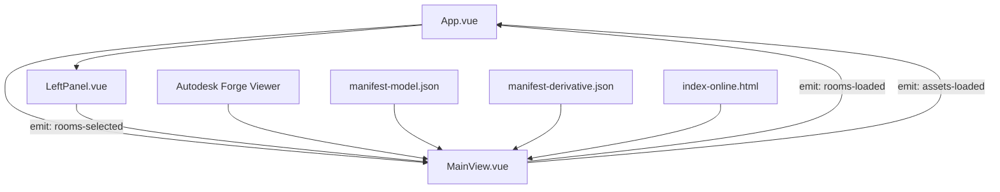
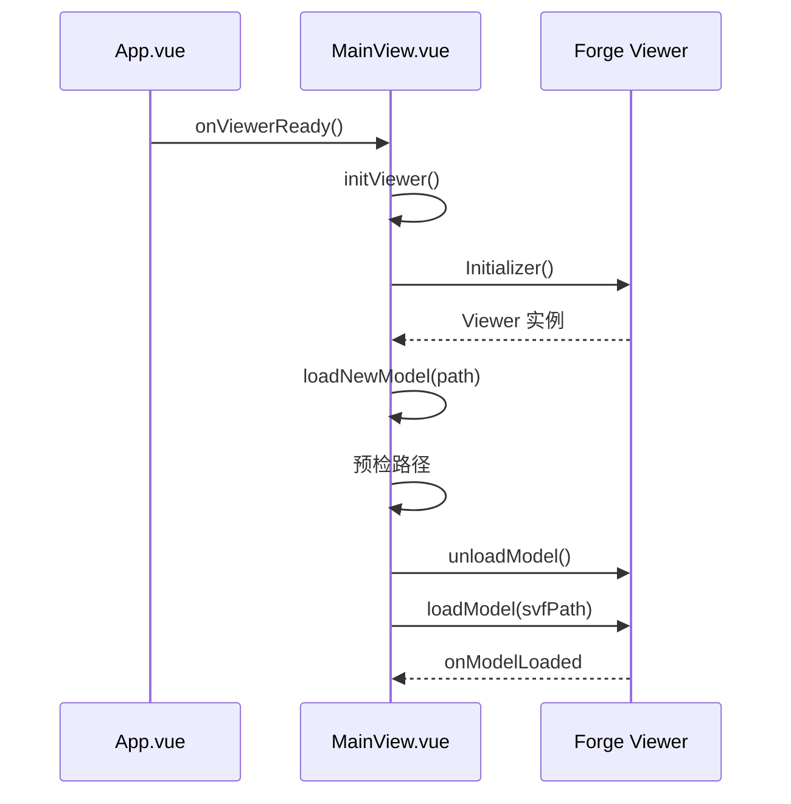
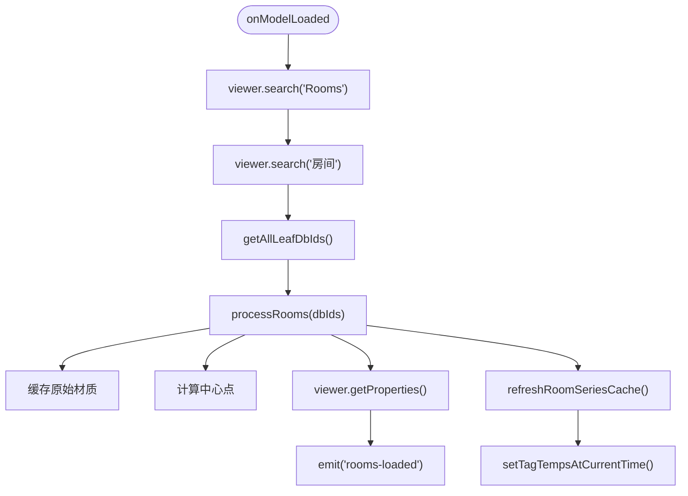
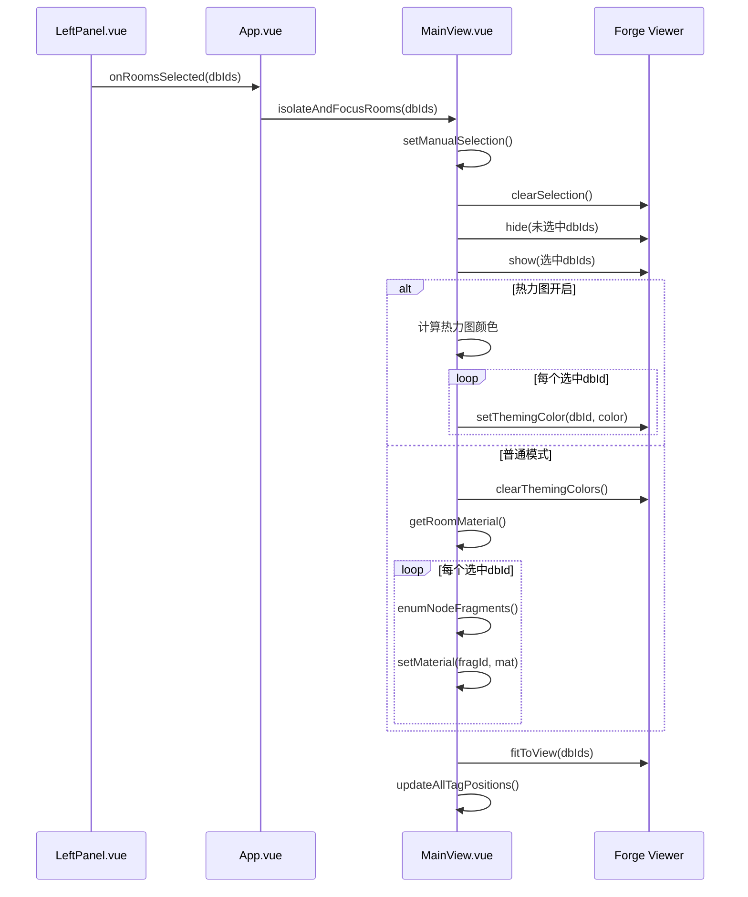
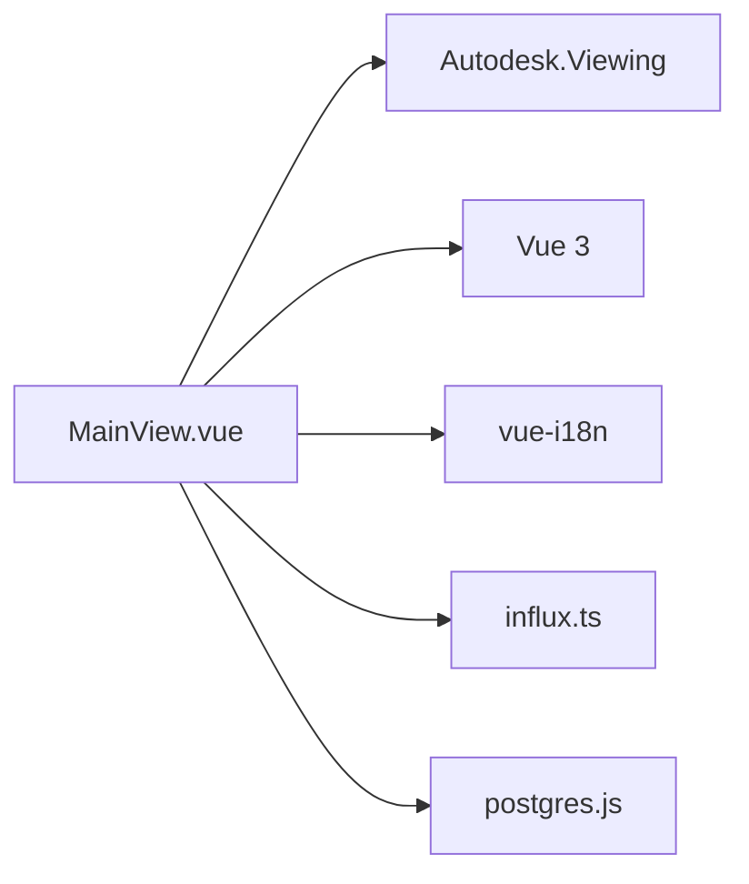

# MainView.vue 主视图

<cite>
**本文档引用的文件**   
- [MainView.vue](file://src/components/MainView.vue)
- [manifest-model.json](file://public/models/my-building/MFMIWRLCVUBF118E4A/output/manifest-model.json)
- [manifest-derivative.json](file://public/models/my-building/MFMIWRLCVUBF118E4A/output/manifest-derivative.json)
- [index-online.html](file://public/models/my-building/MFMIWRLCVUBF118E4A/output/index-online.html)
- [LeftPanel.vue](file://src/components/LeftPanel.vue)
- [App.vue](file://src/App.vue)
</cite>

## 目录
1. [简介](#简介)
2. [项目结构](#项目结构)
3. [核心组件](#核心组件)
4. [架构概述](#架构概述)
5. [详细组件分析](#详细组件分析)
6. [依赖分析](#依赖分析)
7. [性能考虑](#性能考虑)
8. [故障排除指南](#故障排除指南)
9. [结论](#结论)
10. [附录](#附录)（如有必要）

## 简介
MainView.vue 组件是本应用程序的核心视图组件，负责3D/2D模型的可视化展示。它集成了 Autodesk Forge Viewer 来加载和渲染3D全景模型，并通过 iframe 或动态加载方式展示2D平面图。该组件与模型文件（如 manifest-model.json 和 manifest-derivative.json）进行交互，解析模型元数据并初始化视图。它还响应来自 LeftPanel 的选择事件，高亮显示对应的空间或资产，并处理相机控制、图层切换和交互事件。

## 项目结构
MainView.vue 组件位于 `src/components/` 目录下，是应用程序的主视图。它通过 props 接收来自父组件的数据（如当前视图模式、资产列表和空间列表），并通过 emit 向父组件发送事件（如房间加载完成、资产加载完成、图表数据更新等）。该组件依赖于 Autodesk Forge Viewer 库来渲染3D模型，并与存储在 `public/models/` 目录下的模型文件进行交互。

## 核心组件
MainView.vue 是一个复杂的 Vue 3 组件，使用 `<script setup>` 语法。其核心功能包括：
- **3D 查看器初始化**：在组件挂载后，初始化 Autodesk Forge Viewer。
- **模型加载**：根据传入的模型路径，动态加载3D SVF模型。
- **数据提取**：从加载的3D模型中提取“房间”和“资产”相关的构件（dbId）。
- **视图控制**：提供方法来孤立、聚焦、显示所有房间或资产。
- **交互事件**：响应模型上的选择事件，并与左侧面板同步。
- **状态管理**：管理视图状态（如热力图开关、温度标签可见性）并支持保存和恢复。

**本文档引用的文件**
- [MainView.vue](file://src/components/MainView.vue)

## 架构概述
MainView.vue 组件构成了应用程序的可视化核心，其架构如下图所示：

**图表来源**
- [MainView.vue](file://src/components/MainView.vue)
- [App.vue](file://src/App.vue)
- [LeftPanel.vue](file://src/components/LeftPanel.vue)

## 详细组件分析

### MainView.vue 分析
MainView.vue 组件的实现机制可以分为以下几个关键部分：

#### 3D 查看器集成与模型加载
该组件通过 `initViewer()` 函数初始化 Autodesk Forge Viewer。`loadNewModel()` 函数负责加载新的3D模型。它会预检模型路径（如 `/output/3d.svf` 或 `/3d.svf`），并先卸载当前模型再加载新模型，以确保内存管理。

**图表来源**
- [MainView.vue](file://src/components/MainView.vue#L544-L703)

#### 模型元数据解析与视图初始化
组件通过 `onModelLoaded()` 事件触发一系列初始化流程。首先，它使用 `viewer.search()` 方法搜索名称为 "Rooms" 或 "房间" 的构件。然后，通过 `processRooms()` 函数递归获取所有叶子节点的 dbId，并缓存其原始材质。同时，`extractAssets()` 函数提取所有具有 "MC编码" 属性的资产构件。

**图表来源**
- [MainView.vue](file://src/components/MainView.vue#L786-L987)

#### 响应选择事件与高亮显示
当用户在 LeftPanel.vue 中选择一个或多个房间时，App.vue 会调用 MainView.vue 的 `isolateAndFocusRooms()` 方法。该方法会清除选择，隐藏未选中的房间，显示选中的房间，并根据热力图状态应用不同的颜色（主题颜色或自定义材质），最后将视角定位到选中的房间。

**图表来源**
- [MainView.vue](file://src/components/MainView.vue#L1167-L1271)
- [LeftPanel.vue](file://src/components/LeftPanel.vue#L140-L152)

#### 相机控制、图层切换与交互事件
组件提供了丰富的交互功能：
- **相机控制**：`animateToDefaultView()` 函数使用缓动动画将相机平滑地移动到默认视角。
- **图层切换**：通过 `toggleHeatmap()` 切换热力图模式，改变房间的渲染颜色。
- **交互事件**：`onSelectionChanged()` 监听模型上的选择事件，用于反向定位到左侧面板。`updateAllTagPositions()` 将3D世界坐标转换为2D屏幕坐标，以定位温度标签。

**本文档引用的文件**
- [MainView.vue](file://src/components/MainView.vue)

## 依赖分析
MainView.vue 组件有以下关键依赖：
- **Autodesk Forge Viewer**：核心的3D渲染库，通过全局 `Autodesk` 对象访问。
- **Vue 3 Composition API**：使用 `ref`, `computed`, `watch`, `onMounted` 等。
- **i18n**：用于多语言支持。
- **InfluxDB 服务**：用于查询时序数据（温度）。
- **PostgreSQL 服务**：用于从数据库获取资产和空间的元数据。

**图表来源**
- [MainView.vue](file://src/components/MainView.vue#L195-L196)
- [App.vue](file://src/App.vue#L158-L159)

## 性能考虑
为了优化性能，该组件采取了以下措施：
- **材质缓存**：使用 `roomFragData` 和 `heatmapMaterialCache` 对象缓存材质，避免重复创建。
- **批量属性查询**：使用 `getBulkProperties()` 方法一次性获取多个构件的属性，减少API调用次数。
- **防抖与节流**：在处理相机移动和窗口调整时，使用 `setTimeout` 和 `requestAnimationFrame` 进行优化。
- **自动刷新**：使用 `setInterval` 定期刷新数据，但会检查 InfluxDB 配置状态以避免不必要的请求。

**本文档引用的文件**
- [MainView.vue](file://src/components/MainView.vue)

## 故障排除指南
- **模型未加载**：检查 `loadNewModel()` 中的路径预检逻辑，确保 `fetch` 请求返回正确的 SVF 文件，而非 HTML 404 页面。
- **房间未高亮**：确保 `foundRoomDbIds` 已正确填充，并检查 `applyRoomStyle()` 中的 `getRoomMaterial()` 是否成功创建材质。
- **温度标签不显示**：检查 `areTagsVisible` 和 `isSettingsPanelOpen` 的状态，确保 `updateAllTagPositions()` 被正确调用。
- **热力图不更新**：检查 `applyHeatmapStyle()` 中的 `HEATMAP_EPS` 阈值，确保温度变化足够大以触发更新。

**本文档引用的文件**
- [MainView.vue](file://src/components/MainView.vue)

## 结论
MainView.vue 组件是一个功能强大且复杂的3D/2D可视化核心。它成功地集成了 Autodesk Forge Viewer，实现了模型的动态加载、元数据解析、视图控制和交互功能。通过与 manifest 文件和数据库的交互，它能够提供丰富的上下文信息和实时数据。该组件的设计考虑了性能和用户体验，为构建一个完整的数字孪生应用奠定了坚实的基础。