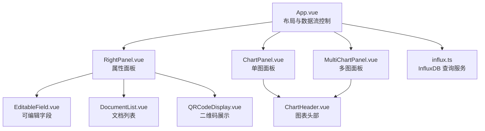
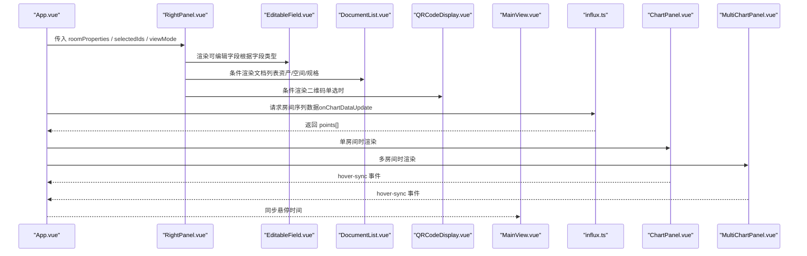
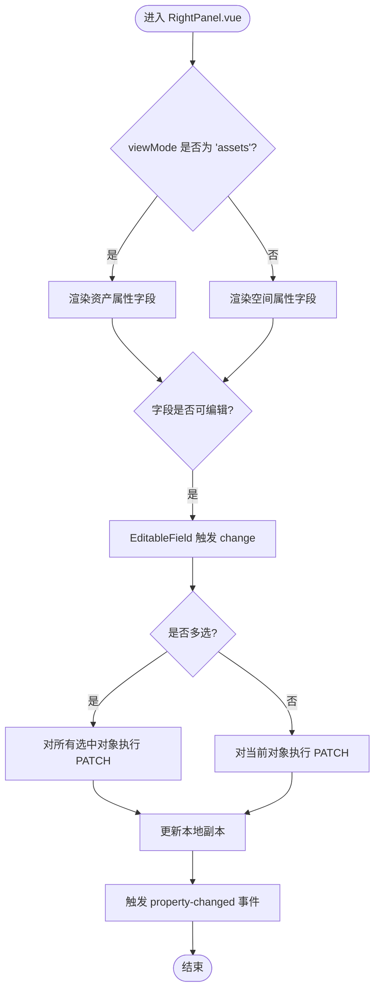
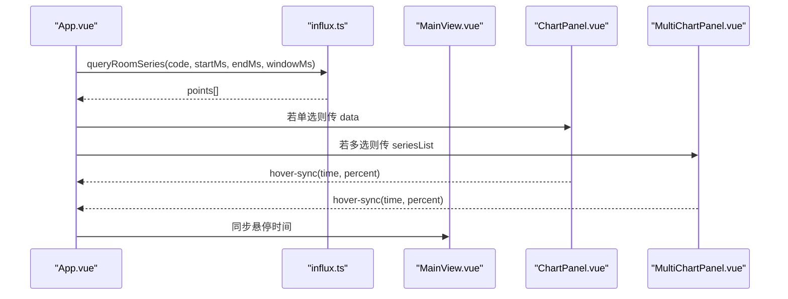
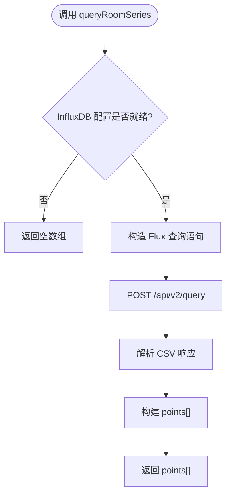
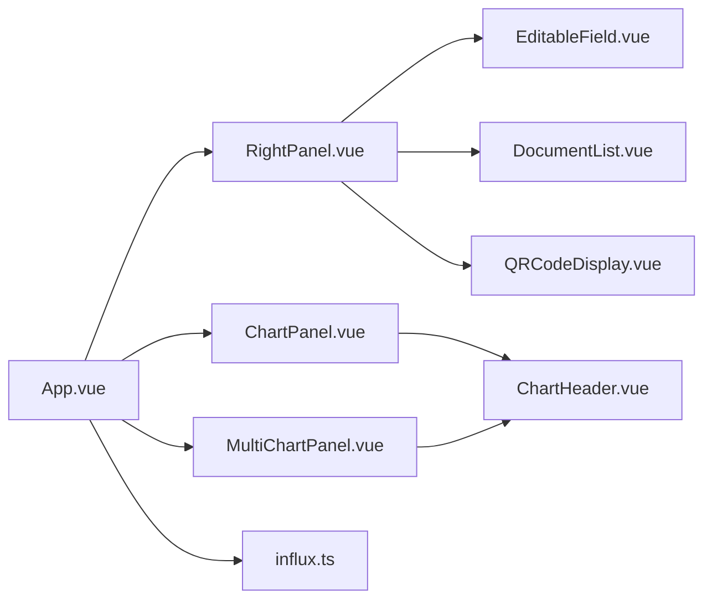

# RightPanel.vue 右侧面板

<cite>
**本文引用的文件**
- [RightPanel.vue](file://src/components/RightPanel.vue)
- [App.vue](file://src/App.vue)
- [influx.ts](file://src/services/influx.ts)
- [EditableField.vue](file://src/components/EditableField.vue)
- [ChartPanel.vue](file://src/components/ChartPanel.vue)
- [MultiChartPanel.vue](file://src/components/MultiChartPanel.vue)
- [ChartHeader.vue](file://src/components/ChartHeader.vue)
- [DocumentList.vue](file://src/components/DocumentList.vue)
- [QRCodeDisplay.vue](file://src/components/QRCodeDisplay.vue)
</cite>

## 目录
1. [简介](#简介)
2. [项目结构](#项目结构)
3. [核心组件](#核心组件)
4. [架构总览](#架构总览)
5. [详细组件分析](#详细组件分析)
6. [依赖关系分析](#依赖关系分析)
7. [性能考量](#性能考量)
8. [故障排查指南](#故障排查指南)
9. [结论](#结论)
10. [附录](#附录)

## 简介
本文件系统性梳理 RightPanel.vue 右侧面板的功能与实现，重点阐述其作为属性详情与数据可视化展示区的综合职责：
- 动态渲染属性字段：根据 App.vue 传入的选中对象类型（空间或资产）切换显示逻辑，并通过 EditableField.vue 支持属性编辑。
- 集成可视化图表：在 App.vue 控制下嵌入 ChartPanel.vue 或 MultiChartPanel.vue，查询 InfluxDB 时序数据并展示温度等指标趋势图。
- 与服务层交互：通过 influx.ts 构造 Flux 查询语句并解析 CSV 结果，形成前端可用的数据点数组。
- 响应式布局与自适应：在不同数据量与选中对象数量下保持良好的交互体验，并提供扩展新可视化类型的指导。

## 项目结构
RightPanel.vue 位于 src/components 目录，与 App.vue、ChartPanel.vue、MultiChartPanel.vue、EditableField.vue、DocumentList.vue、QRCodeDisplay.vue 等共同构成属性面板与可视化子系统。

**图表来源**
- [App.vue](file://src/App.vue#L92-L106)
- [RightPanel.vue](file://src/components/RightPanel.vue#L1-L106)
- [EditableField.vue](file://src/components/EditableField.vue#L1-L200)
- [DocumentList.vue](file://src/components/DocumentList.vue#L1-L155)
- [QRCodeDisplay.vue](file://src/components/QRCodeDisplay.vue#L1-L98)
- [ChartPanel.vue](file://src/components/ChartPanel.vue#L1-L98)
- [MultiChartPanel.vue](file://src/components/MultiChartPanel.vue#L1-L84)
- [ChartHeader.vue](file://src/components/ChartHeader.vue#L1-L46)
- [influx.ts](file://src/services/influx.ts#L1-L136)

**章节来源**
- [RightPanel.vue](file://src/components/RightPanel.vue#L1-L106)
- [App.vue](file://src/App.vue#L92-L106)

## 核心组件
- RightPanel.vue：负责属性面板的渲染、字段类型与可编辑性判定、字段变更事件处理、面包屑与分组折叠、以及文档与二维码的条件渲染。
- EditableField.vue：封装属性编辑 UI，支持文本/数字/日期输入，处理 VARIES 标记与占位符。
- ChartPanel.vue / MultiChartPanel.vue：展示温度趋势图，支持阈值高亮、悬浮提示、时间范围标注。
- ChartHeader.vue：统一图表头部标题与时间范围显示。
- DocumentList.vue：基于资产/空间/规格代码加载、上传、预览、删除文档。
- QRCodeDisplay.vue：基于选中对象码生成/下载二维码。
- influx.ts：封装 InfluxDB 写入与查询，提供平均序列与房间序列查询。

**章节来源**
- [RightPanel.vue](file://src/components/RightPanel.vue#L108-L414)
- [EditableField.vue](file://src/components/EditableField.vue#L1-L200)
- [ChartPanel.vue](file://src/components/ChartPanel.vue#L1-L98)
- [MultiChartPanel.vue](file://src/components/MultiChartPanel.vue#L1-L84)
- [ChartHeader.vue](file://src/components/ChartHeader.vue#L1-L46)
- [DocumentList.vue](file://src/components/DocumentList.vue#L1-L155)
- [QRCodeDisplay.vue](file://src/components/QRCodeDisplay.vue#L1-L98)
- [influx.ts](file://src/services/influx.ts#L1-L136)

## 架构总览
RightPanel.vue 作为 App.vue 的子面板，接收来自 App.vue 的选中对象属性与视图模式，动态决定属性字段与可编辑性，并在 App.vue 的控制下渲染图表面板。图表数据来源于 App.vue 通过 MainView 与 influx.ts 的协作。

**图表来源**
- [App.vue](file://src/App.vue#L509-L534)
- [RightPanel.vue](file://src/components/RightPanel.vue#L1-L106)
- [influx.ts](file://src/services/influx.ts#L72-L103)
- [ChartPanel.vue](file://src/components/ChartPanel.vue#L1-L98)
- [MultiChartPanel.vue](file://src/components/MultiChartPanel.vue#L1-L84)

## 详细组件分析

### RightPanel.vue：属性面板与可视化入口
- 属性渲染与模式切换
  - 根据 viewMode 切换“资产模式”与“空间模式”，分别渲染不同的字段集合。
  - 使用本地副本 localProperties 同步 props 变化，避免直接修改外部 props。
  - 支持多选场景：当 selectedIds 数量大于 1 时，进入批量编辑模式。
- 字段类型与可编辑性
  - 通过字段类型映射表区分只读与可编辑字段，保障安全更新。
  - 对 VARIES 标记进行格式化显示，编辑时允许用户输入新值。
- 属性编辑流程
  - EditableField.vue 触发 change 事件，RightPanel.vue 接收并发起后端 PATCH 请求。
  - 资产与空间分别映射到不同的数据库字段名，批量更新所有选中对象。
  - 成功/失败统计与用户反馈，必要时触发 property-changed 事件。
- 文档与二维码
  - 单选时渲染二维码与文档列表；多选或无选中时隐藏。
  - 文档列表根据资产码/空间码/规格码加载并支持上传、预览、删除。
- 面包屑与分组折叠
  - 根据当前模式与选中对象生成面包屑文本。
  - 分组头部点击切换折叠状态，提升长列表可读性。

**图表来源**
- [RightPanel.vue](file://src/components/RightPanel.vue#L194-L364)

**章节来源**
- [RightPanel.vue](file://src/components/RightPanel.vue#L108-L414)

### EditableField.vue：属性编辑器
- 输入类型与占位符：根据 fieldType 自动切换输入类型，支持 VARIES 与空值占位。
- 编辑态管理：点击进入编辑，失焦或回车确认，ESC 取消。
- 事件传播：向父组件发出 update:modelValue 与 change 事件，便于 RightPanel.vue 统一处理。

**章节来源**
- [EditableField.vue](file://src/components/EditableField.vue#L1-L200)

### ChartPanel.vue 与 MultiChartPanel.vue：温度趋势图
- 数据绑定：接收 points 数组与时间范围，渲染折线面积图与阈值线。
- 交互能力：鼠标悬停显示 Tooltip，计算越界段数并高亮阈值跨越点。
- 多图面板：Grid 布局展示多个房间序列，统一阈值与时间轴标注。

**图表来源**
- [App.vue](file://src/App.vue#L509-L534)
- [influx.ts](file://src/services/influx.ts#L72-L103)
- [ChartPanel.vue](file://src/components/ChartPanel.vue#L1-L98)
- [MultiChartPanel.vue](file://src/components/MultiChartPanel.vue#L1-L84)

**章节来源**
- [ChartPanel.vue](file://src/components/ChartPanel.vue#L1-L227)
- [MultiChartPanel.vue](file://src/components/MultiChartPanel.vue#L1-L225)

### influx.ts：InfluxDB 查询服务
- 配置校验：检查 InfluxDB URL、组织、桶与认证参数。
- 查询接口：
  - 平均序列：聚合所有房间温度，按窗口求均值。
  - 房间序列：按房间过滤，按窗口聚合最小值。
  - 最新值：按房间过滤，取最近值。
- 数据格式：返回 points[]，包含 timestamp 与 value，供图表组件消费。

**图表来源**
- [influx.ts](file://src/services/influx.ts#L72-L103)

**章节来源**
- [influx.ts](file://src/services/influx.ts#L1-L136)

### App.vue：图表数据驱动与面板控制
- 图表数据更新：onChartDataUpdate 收集 MainView 的数据与时间范围，调用 influx.ts 查询选中房间序列。
- 面板开关：通过 isRightPanelOpen 控制 RightPanel.vue 的显示与宽度调整。
- 与 MainView 通信：同步悬停时间、模型选择变化、视图切换等事件。

**章节来源**
- [App.vue](file://src/App.vue#L509-L534)
- [App.vue](file://src/App.vue#L92-L106)

## 依赖关系分析
- 组件耦合
  - RightPanel.vue 与 EditableField.vue：通过 props/modelValue 与 change 事件解耦。
  - RightPanel.vue 与 ChartPanel/MultiChartPanel：通过 App.vue 传递 data/seriesList 与 range，实现松耦合。
  - App.vue 与 influx.ts：仅通过查询函数调用，避免直接耦合到具体存储实现。
- 外部依赖
  - InfluxDB：通过 influx.ts 提供统一访问入口。
  - 文档与二维码：通过组件内部逻辑与 API 基础地址拼接实现。

**图表来源**
- [RightPanel.vue](file://src/components/RightPanel.vue#L1-L106)
- [App.vue](file://src/App.vue#L92-L106)
- [influx.ts](file://src/services/influx.ts#L1-L136)
- [ChartPanel.vue](file://src/components/ChartPanel.vue#L1-L98)
- [MultiChartPanel.vue](file://src/components/MultiChartPanel.vue#L1-L84)
- [ChartHeader.vue](file://src/components/ChartHeader.vue#L1-L46)

**章节来源**
- [RightPanel.vue](file://src/components/RightPanel.vue#L1-L106)
- [App.vue](file://src/App.vue#L92-L106)

## 性能考量
- 批量更新策略：RightPanel.vue 在多选场景下逐个对象 PATCH，建议在后端支持批量更新接口以减少往返次数。
- 图表渲染：ChartPanel/MultiChartPanel 采用 SVG 路径与阈值标记，数据量大时注意虚拟化或采样策略。
- 查询优化：influx.ts 的 Flux 查询已使用聚合窗口，建议在 UI 层限制时间范围与窗口大小，避免超大数据集。
- 响应式布局：右侧面板宽度与图表面板高度通过 App.vue 状态控制，合理设置初始尺寸与最小尺寸，避免频繁重排。

[本节为通用建议，无需特定文件引用]

## 故障排查指南
- 属性编辑失败
  - 检查后端 API 地址与权限配置，确认 PATCH 请求返回状态。
  - 查看 RightPanel.vue 的错误分支与用户提示逻辑。
- 图表无数据
  - 确认 App.vue 已正确调用 influx.ts 查询并传入正确的房间码与时间范围。
  - 检查 InfluxDB 配置与认证参数。
- 文档/二维码不显示
  - 确认 RightPanel.vue 的条件渲染逻辑：单选时才显示二维码与文档列表。
  - 检查 DocumentList.vue 的相关代码与 API 基础地址。

**章节来源**
- [RightPanel.vue](file://src/components/RightPanel.vue#L194-L364)
- [influx.ts](file://src/services/influx.ts#L1-L136)
- [DocumentList.vue](file://src/components/DocumentList.vue#L262-L283)
- [QRCodeDisplay.vue](file://src/components/QRCodeDisplay.vue#L38-L62)

## 结论
RightPanel.vue 通过清晰的模式切换、字段类型与可编辑性控制、以及与 EditableField.vue 的协作，实现了稳健的属性编辑体验；通过 App.vue 的调度与 influx.ts 的查询服务，无缝集成温度趋势图的可视化展示。其响应式布局与分组折叠提升了复杂场景下的可读性与易用性。未来可在批量更新、图表虚拟化与查询参数优化方面进一步增强性能与稳定性。

[本节为总结性内容，无需特定文件引用]

## 附录

### 与 influx.ts 的交互流程（代码级）
- App.vue 在 onChartDataUpdate 中调用 queryRoomSeries，得到 points[]。
- App.vue 将数据与时间范围传递给 ChartPanel.vue 或 MultiChartPanel.vue。
- ChartPanel.vue/MultiChartPanel.vue 通过 hover-sync 事件将悬停时间回传给 App.vue，再由 App.vue 同步到 MainView。

**章节来源**
- [App.vue](file://src/App.vue#L509-L534)
- [influx.ts](file://src/services/influx.ts#L72-L103)
- [ChartPanel.vue](file://src/components/ChartPanel.vue#L1-L98)
- [MultiChartPanel.vue](file://src/components/MultiChartPanel.vue#L1-L84)

### 扩展新的数据可视化类型指导
- 新增可视化组件
  - 在 App.vue 中新增条件渲染逻辑，根据当前选中对象与时间范围请求新类型数据。
  - 在 App.vue 的 onChartDataUpdate 中调用对应查询函数（如 influx.ts 的新方法）。
  - 将数据与时间范围传递给新组件，复用 ChartHeader.vue 的头部展示。
- 数据格式约定
  - 统一使用 points[] 结构（timestamp, value），便于与现有图表组件兼容。
- 交互一致性
  - 新组件应支持 hover-sync 事件，以便与 MainView 同步悬停时间。
  - 提供关闭按钮与必要的工具栏元素，保持 UI 一致性。

[本节为扩展指导，无需特定文件引用]