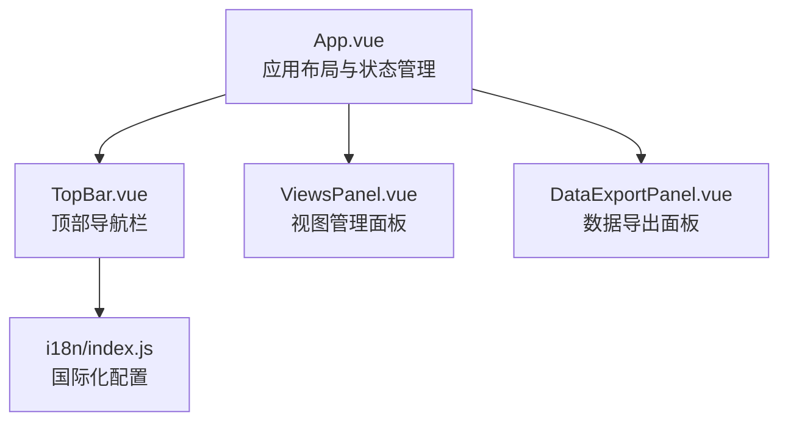
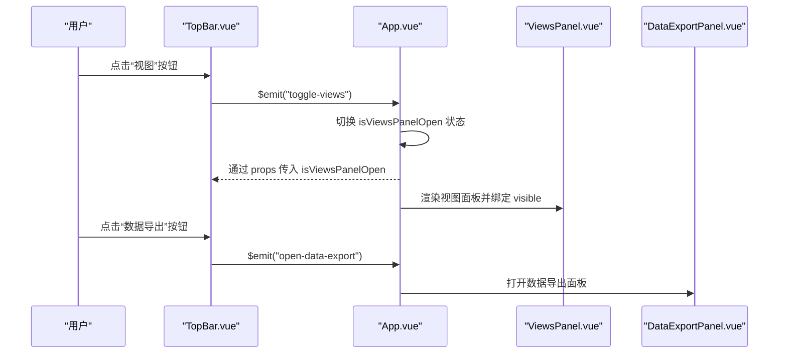
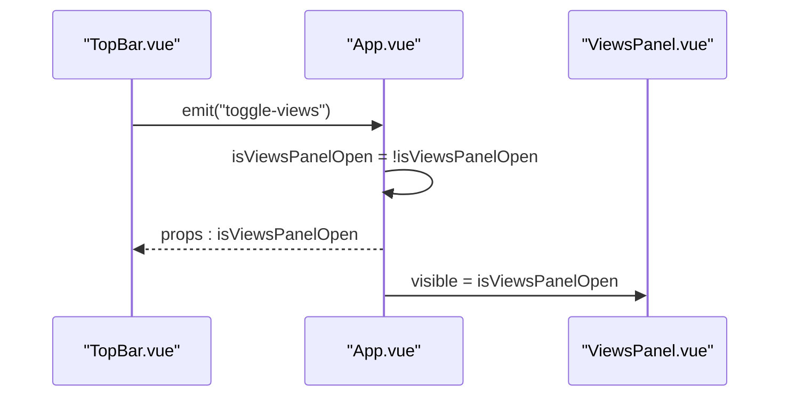
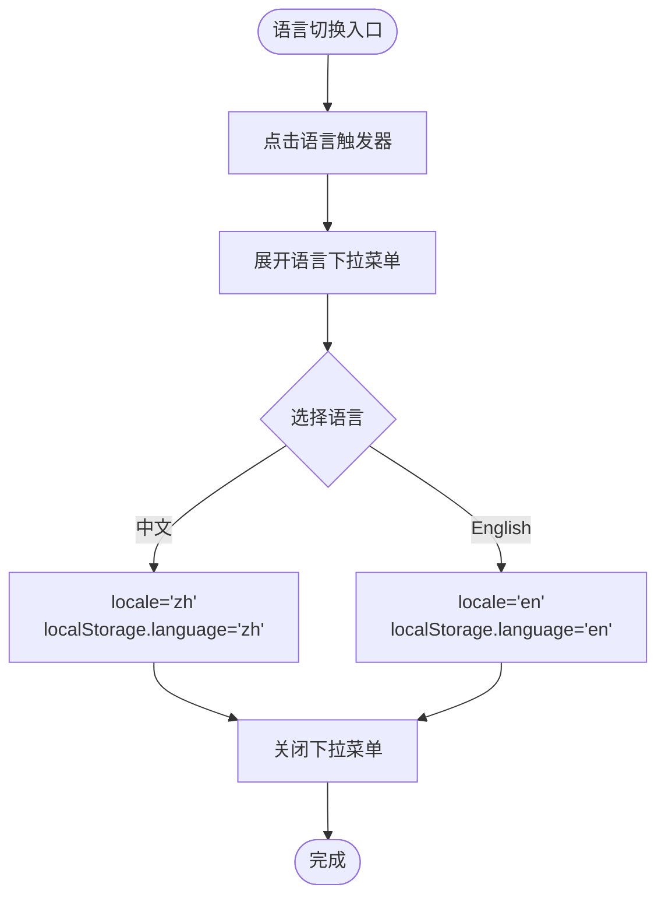
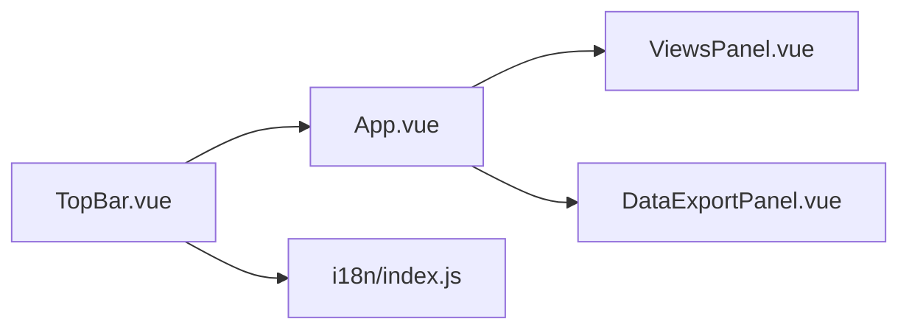

# TopBar.vue 顶部导航栏

<cite>
**本文引用的文件**
- [TopBar.vue](file://src/components/TopBar.vue)
- [App.vue](file://src/App.vue)
- [ViewsPanel.vue](file://src/components/ViewsPanel.vue)
- [DataExportPanel.vue](file://src/components/DataExportPanel.vue)
- [index.js](file://src/i18n/index.js)
</cite>

## 目录
1. [简介](#简介)
2. [项目结构](#项目结构)
3. [核心组件](#核心组件)
4. [架构总览](#架构总览)
5. [详细组件分析](#详细组件分析)
6. [依赖分析](#依赖分析)
7. [性能考虑](#性能考虑)
8. [故障排查指南](#故障排查指南)
9. [结论](#结论)
10. [附录](#附录)

## 简介
TopBar.vue 是本项目的全局导航与功能控制中心，位于应用顶部，承载品牌标识、搜索框、当前视图名称、视图管理入口、语言切换器、通知与提示、以及用户头像等元素。它通过事件发射机制与父组件 App.vue 通信，触发诸如打开视图面板、打开数据导出面板、切换视图等全局操作。同时，TopBar 集成了国际化服务，支持中英文切换，并通过样式与布局适配不同屏幕尺寸。

## 项目结构
TopBar 作为顶层导航组件，直接被 App.vue 引用并渲染。App.vue 负责协调左侧/中间/右侧面板、主视图、图表面板、以及弹窗面板（如数据导出面板、视图面板）。TopBar 通过 props 接收当前视图开关状态与视图名称，并通过 emit 事件向父组件传递交互信号。

**图表来源**
- [App.vue](file://src/App.vue#L1-L144)
- [TopBar.vue](file://src/components/TopBar.vue#L1-L138)
- [ViewsPanel.vue](file://src/components/ViewsPanel.vue#L1-L154)
- [DataExportPanel.vue](file://src/components/DataExportPanel.vue#L1-L92)
- [index.js](file://src/i18n/index.js#L1-L577)

**章节来源**
- [App.vue](file://src/App.vue#L1-L144)
- [TopBar.vue](file://src/components/TopBar.vue#L1-L138)

## 核心组件
- 顶部导航容器：包含左中右三段布局，分别放置品牌区、搜索区、功能区。
- 品牌区：Logo 与应用名称分隔显示，形成清晰的品牌识别。
- 搜索框：居中区域提供搜索入口，便于快速检索资源。
- 视图按钮：用于打开/关闭视图管理面板，支持高亮当前激活状态。
- 语言切换器：下拉菜单支持中英文切换，本地持久化语言偏好。
- 用户头像：展示当前用户标识，可扩展为用户菜单入口。
- 通知与提示：预留图标位，可用于消息提醒或状态指示。
- 事件通信：通过 emit 与父组件 App.vue 协作，实现全局操作。

**章节来源**
- [TopBar.vue](file://src/components/TopBar.vue#L1-L138)

## 架构总览
TopBar 与 App.vue 的交互采用单向数据流与事件驱动：
- App.vue 通过 props 向 TopBar 传递当前视图面板开关状态与当前视图名称。
- TopBar 通过 emit 事件向 App.vue 发送“打开视图面板”、“打开数据导出面板”等信号。
- App.vue 在收到事件后，负责更新自身状态并渲染对应面板。

**图表来源**
- [TopBar.vue](file://src/components/TopBar.vue#L1-L138)
- [App.vue](file://src/App.vue#L1-L144)
- [ViewsPanel.vue](file://src/components/ViewsPanel.vue#L1-L154)
- [DataExportPanel.vue](file://src/components/DataExportPanel.vue#L1-L92)

## 详细组件分析

### UI 元素与职责
- 品牌区
  - Logo 图片容器与应用名称文本，提供品牌识别与分隔线。
- 搜索框
  - 居中展示，包含搜索图标与输入框，用于全局搜索。
- 视图按钮
  - 用于打开/关闭视图管理面板；当视图面板开启时，按钮高亮显示。
- 语言切换器
  - 下拉菜单展示中英文选项，当前语言高亮；点击外部区域自动关闭。
- 通知与提示
  - 预留图标位，可用于消息提醒或状态指示。
- 用户头像
  - 展示当前用户标识，可扩展为用户菜单入口。

**章节来源**
- [TopBar.vue](file://src/components/TopBar.vue#L1-L138)

### 事件通信机制
- 事件定义
  - TopBar 使用 defineEmits 定义事件：open-data-export、toggle-views。
- 父组件订阅
  - App.vue 在模板中绑定 @open-data-export 与 @toggle-views，分别处理打开导出面板与切换视图面板。
- 状态同步
  - App.vue 通过 props 将 isViewsPanelOpen 与 currentViewName 传给 TopBar，使 TopBar 能够反映当前视图状态与名称。

**图表来源**
- [TopBar.vue](file://src/components/TopBar.vue#L92-L104)
- [App.vue](file://src/App.vue#L1-L144)
- [ViewsPanel.vue](file://src/components/ViewsPanel.vue#L1-L154)

**章节来源**
- [TopBar.vue](file://src/components/TopBar.vue#L92-L104)
- [App.vue](file://src/App.vue#L1-L144)

### 国际化集成
- i18n 配置
  - i18n/index.js 提供中英文两套消息，包含 views.title 等键值。
- TopBar 使用
  - TopBar 在视图按钮的 title 属性中使用 $t('views.title')，实现标题文案的国际化。
- 语言切换
  - TopBar 内部维护 locale，切换语言时写入 localStorage 并关闭下拉菜单，保证持久化与交互体验。

**图表来源**
- [TopBar.vue](file://src/components/TopBar.vue#L105-L122)
- [index.js](file://src/i18n/index.js#L1-L577)

**章节来源**
- [TopBar.vue](file://src/components/TopBar.vue#L105-L122)
- [index.js](file://src/i18n/index.js#L1-L577)

### 响应式设计与屏幕适配
- 布局结构
  - TopBar 采用 Flex 布局，left-section、center-section、right-section 三列自适应排列，具备良好的弹性与对齐能力。
- 搜索框宽度
  - 搜索框在 TopBar 中设置固定宽度，便于在不同分辨率下保持视觉平衡。
- 语言下拉菜单
  - 下拉菜单使用绝对定位与 z-index，避免遮挡主内容；点击外部自动关闭，提升移动端可用性。
- 视图按钮高亮
  - 当视图面板开启时，视图按钮 active 样式高亮，直观反馈当前状态。
- 用户头像
  - 用户头像使用圆角与紧凑布局，适合在窄屏环境下节省空间。

注意：仓库中未发现针对 TopBar 的媒体查询或断点规则，因此 TopBar 的响应式主要依赖于 Flex 布局与相对单位，以及外部容器的自适应行为。若需更严格的移动端适配，可在样式中增加媒体查询规则。

**章节来源**
- [TopBar.vue](file://src/components/TopBar.vue#L1-L138)

### 扩展新功能按钮的指导
- 事件注册
  - 在模板中为新按钮绑定点击事件，并在事件处理器中通过 $emit('your-event') 发射自定义事件。
  - 在父组件 App.vue 中通过 @your-event 绑定处理函数，实现全局操作。
- 样式规范
  - 新按钮建议复用 .icon-btn 基础样式，保持统一尺寸与悬停效果。
  - 若需高亮状态，可参考 .views-btn.active 的实现方式，添加 active 类并在样式中定义高亮态。
- 国际化
  - 如需文案国际化，使用 $t('your.key')，并在 i18n/index.js 中添加对应键值。
- 交互细节
  - 如需下拉菜单，可参考语言切换器的实现，使用 ref 与点击外部关闭逻辑，确保交互一致性。

**章节来源**
- [TopBar.vue](file://src/components/TopBar.vue#L1-L138)
- [App.vue](file://src/App.vue#L1-L144)
- [index.js](file://src/i18n/index.js#L1-L577)

### 用户体验要点
- 快捷操作入口
  - 视图按钮与数据导出按钮均位于顶部右侧，符合用户对“常用功能在右上角”的认知。
- 全局状态指示
  - 视图按钮的 active 状态直观反映视图面板的开启/关闭，降低用户认知负担。
- 语言切换便捷性
  - 下拉菜单与点击外部关闭的设计，兼顾桌面端与移动端的易用性。
- 品牌识别
  - Logo 与应用名称的组合，强化品牌记忆点。

**章节来源**
- [TopBar.vue](file://src/components/TopBar.vue#L1-L138)

## 依赖分析
- 组件依赖
  - TopBar 依赖 App.vue 通过 props 传入的状态与通过 emit 事件进行通信。
  - TopBar 依赖 i18n 服务实现多语言文案。
  - TopBar 与 ViewsPanel.vue、DataExportPanel.vue 通过 App.vue 协同工作。
- 外部依赖
  - vue-i18n：提供 $t 文案翻译能力。
  - Vue 响应式系统：通过 ref/computed/watch 实现语言切换与外部点击关闭。

**图表来源**
- [TopBar.vue](file://src/components/TopBar.vue#L1-L138)
- [App.vue](file://src/App.vue#L1-L144)
- [ViewsPanel.vue](file://src/components/ViewsPanel.vue#L1-L154)
- [DataExportPanel.vue](file://src/components/DataExportPanel.vue#L1-L92)
- [index.js](file://src/i18n/index.js#L1-L577)

**章节来源**
- [TopBar.vue](file://src/components/TopBar.vue#L1-L138)
- [App.vue](file://src/App.vue#L1-L144)

## 性能考虑
- 事件发射频率
  - 语言切换与视图面板开关均为轻量交互，事件发射频率低，对性能影响可忽略。
- DOM 操作
  - 语言下拉菜单使用过渡动画与条件渲染，避免不必要的 DOM 挂载。
- 外部点击关闭
  - 通过 document 级事件监听实现点击外部关闭，生命周期内正确注册与清理，避免内存泄漏风险。

[本节为通用建议，无需特定文件引用]

## 故障排查指南
- 语言切换无效
  - 检查 localStorage 是否正确写入 language 键；确认 i18n locale 是否被更新。
  - 参考路径：[TopBar.vue](file://src/components/TopBar.vue#L118-L122)、[index.js](file://src/i18n/index.js#L566-L577)
- 语言下拉菜单不关闭
  - 确认 mounted/Unmounted 生命周期中是否正确注册/移除 document.click 监听。
  - 参考路径：[TopBar.vue](file://src/components/TopBar.vue#L124-L137)
- 视图面板未响应
  - 确认 App.vue 是否正确接收 toggle-views 事件并更新 isViewsPanelOpen。
  - 参考路径：[TopBar.vue](file://src/components/TopBar.vue#L31-L39)、[App.vue](file://src/App.vue#L1-L144)
- 国际化文案未生效
  - 确认 $t('views.title') 对应键值存在于 i18n/index.js 中。
  - 参考路径：[TopBar.vue](file://src/components/TopBar.vue#L31-L39)、[index.js](file://src/i18n/index.js#L209-L229)

**章节来源**
- [TopBar.vue](file://src/components/TopBar.vue#L118-L137)
- [App.vue](file://src/App.vue#L1-L144)
- [index.js](file://src/i18n/index.js#L209-L229)

## 结论
TopBar.vue 作为全局导航与功能控制中心，承担着品牌识别、搜索、视图管理、语言切换与用户标识等关键职责。通过简洁的事件通信与国际化集成，TopBar 与 App.vue 协同实现了高效的全局操作流程。尽管当前未包含媒体查询规则，但其基于 Flex 的布局与合理的交互细节，已能在多种屏幕尺寸下提供良好的可用性。未来可在样式层面引入媒体查询，进一步优化移动端体验。

[本节为总结性内容，无需特定文件引用]

## 附录

### 事件与状态对照
- 事件
  - open-data-export：打开数据导出面板
  - toggle-views：切换视图面板
- 状态
  - isViewsPanelOpen：视图面板开关
  - currentViewName：当前视图名称

**章节来源**
- [TopBar.vue](file://src/components/TopBar.vue#L92-L104)
- [App.vue](file://src/App.vue#L1-L144)