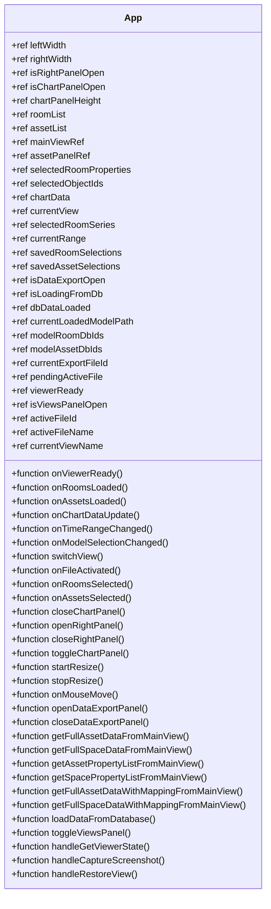
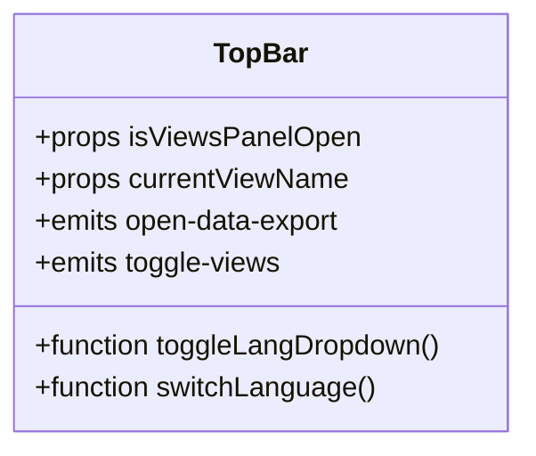
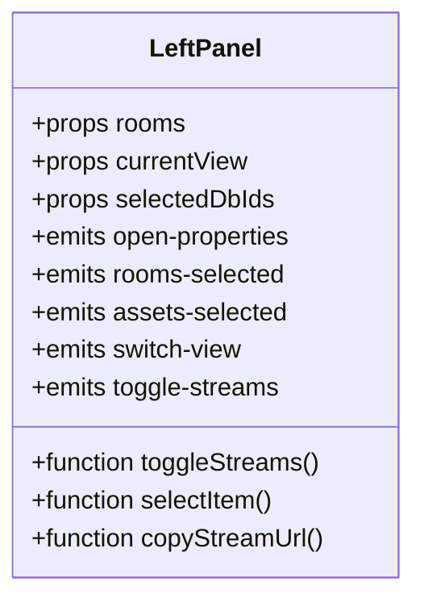
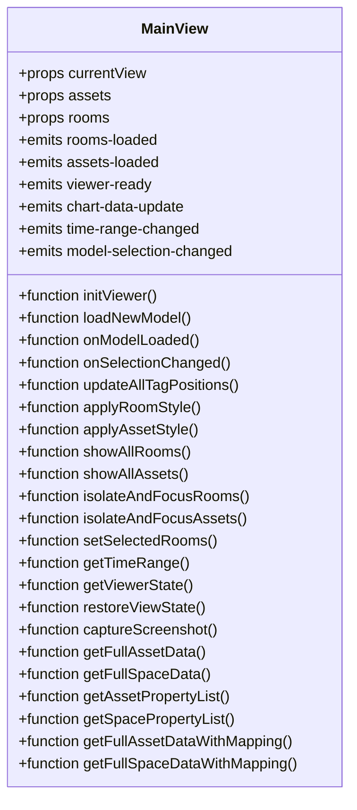
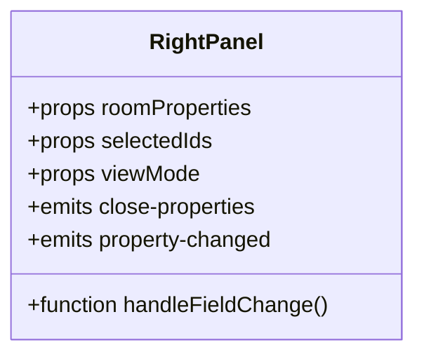
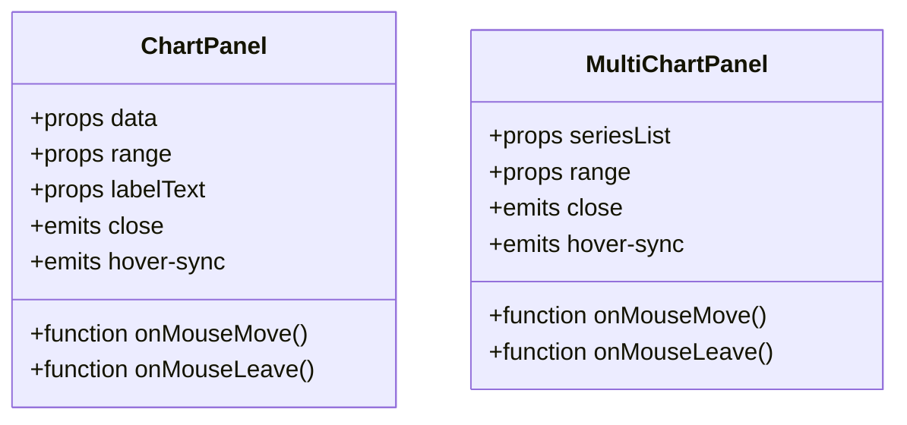
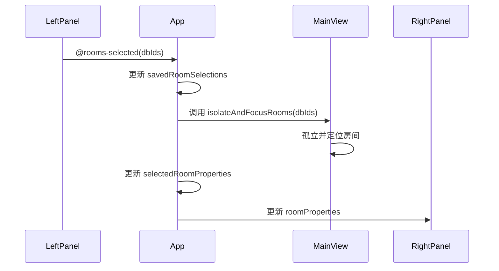
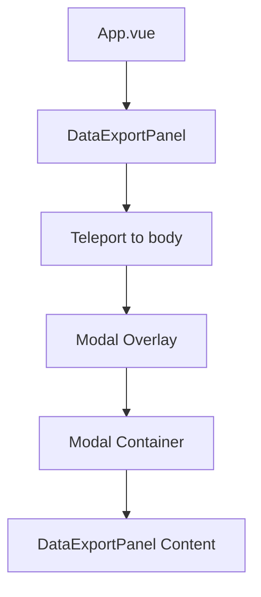
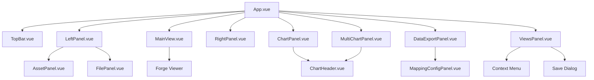
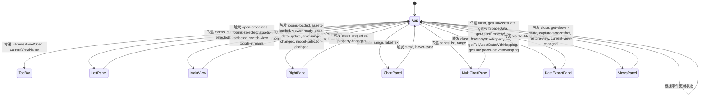

# 前端组件架构

<cite>
**本文档引用文件**   
- [App.vue](file://src/App.vue)
- [main.js](file://src/main.js)
- [TopBar.vue](file://src/components/TopBar.vue)
- [LeftPanel.vue](file://src/components/LeftPanel.vue)
- [AssetPanel.vue](file://src/components/AssetPanel.vue)
- [FilePanel.vue](file://src/components/FilePanel.vue)
- [MainView.vue](file://src/components/MainView.vue)
- [RightPanel.vue](file://src/components/RightPanel.vue)
- [ChartPanel.vue](file://src/components/ChartPanel.vue)
- [MultiChartPanel.vue](file://src/components/MultiChartPanel.vue)
- [DataExportPanel.vue](file://src/components/DataExportPanel.vue)
- [ViewsPanel.vue](file://src/components/ViewsPanel.vue)
</cite>

## 目录
1. [项目结构](#项目结构)
2. [根组件与状态管理](#根组件与状态管理)
3. [核心布局组件](#核心布局组件)
4. [组件间通信机制](#组件间通信机制)
5. [Teleport应用](#teleport应用)
6. [组件调用关系图](#组件调用关系图)
7. [状态流转示意图](#状态流转示意图)

## 项目结构

本项目采用Vue 3组合式API和组件化开发模式，主要组件位于`src/components/`目录下。`App.vue`作为根组件，通过条件渲染和状态管理集成`TopBar`、`LeftPanel`、`MainView`、`RightPanel`等核心布局组件，构建完整的用户界面。

**Section sources**
- [App.vue](file://src/App.vue)
- [main.js](file://src/main.js)

## 根组件与状态管理

`App.vue`作为应用的根组件，负责全局状态的管理与核心布局组件的集成。它通过`<script setup>`语法定义了多个响应式状态变量，如`currentView`用于管理当前视图（'connect'或'assets'），`isRightPanelOpen`和`isChartPanelOpen`用于控制右侧面板和图表面板的显示状态，`leftWidth`和`rightWidth`用于管理左右面板的宽度。

**Diagram sources**
- [App.vue](file://src/App.vue#L147-L353)

**Section sources**
- [App.vue](file://src/App.vue#L147-L353)

## 核心布局组件

### TopBar组件

`TopBar`组件处理全局导航与功能触发。它接收`isViewsPanelOpen`和`currentViewName`作为props，并通过`@open-data-export`和`@toggle-views`事件与父组件通信。

**Diagram sources**
- [TopBar.vue](file://src/components/TopBar.vue#L97-L103)

**Section sources**
- [TopBar.vue](file://src/components/TopBar.vue#L97-L103)

### LeftPanel组件

`LeftPanel`组件提供空间/资产/文件的多视图切换与选择。它根据`currentView`的值动态渲染`LeftPanel`、`AssetPanel`或`FilePanel`，并通过`@open-properties`、`@rooms-selected`、`@assets-selected`和`@switch-view`事件与父组件通信。

**Diagram sources**
- [LeftPanel.vue](file://src/components/LeftPanel.vue#L87-L93)

**Section sources**
- [LeftPanel.vue](file://src/components/LeftPanel.vue#L87-L93)

### MainView组件

`MainView`组件集成3D/2D模型查看器并负责可视化渲染。它接收`currentView`、`assets`和`rooms`作为props，并通过`@rooms-loaded`、`@assets-loaded`、`@viewer-ready`、`@chart-data-update`、`@time-range-changed`和`@model-selection-changed`事件与父组件通信。

**Diagram sources**
- [MainView.vue](file://src/components/MainView.vue#L201-L208)

**Section sources**
- [MainView.vue](file://src/components/MainView.vue#L201-L208)

### RightPanel组件

`RightPanel`组件展示选中对象的属性详情。它接收`roomProperties`、`selectedIds`和`viewMode`作为props，并通过`@close-properties`和`@property-changed`事件与父组件通信。

**Diagram sources**
- [RightPanel.vue](file://src/components/RightPanel.vue#L117-L132)

**Section sources**
- [RightPanel.vue](file://src/components/RightPanel.vue#L117-L132)

### ChartPanel与MultiChartPanel组件

`ChartPanel`和`MultiChartPanel`组件实现时序数据的单个与多个图表展示。`ChartPanel`接收`data`、`range`和`labelText`作为props，并通过`@close`和`@hover-sync`事件与父组件通信。`MultiChartPanel`接收`seriesList`和`range`作为props，并通过`@close`和`@hover-sync`事件与父组件通信。

**Diagram sources**
- [ChartPanel.vue](file://src/components/ChartPanel.vue#L107-L113)
- [MultiChartPanel.vue](file://src/components/MultiChartPanel.vue#L93-L94)

**Section sources**
- [ChartPanel.vue](file://src/components/ChartPanel.vue#L107-L113)
- [MultiChartPanel.vue](file://src/components/MultiChartPanel.vue#L93-L94)

## 组件间通信机制

组件间通过props和事件（$emit）进行通信。`App.vue`作为根组件，通过props向下传递状态，通过事件监听子组件的事件。例如，当`LeftPanel`中的房间被选中时，会触发`onRoomsSelected`事件，`App.vue`接收到该事件后更新`savedRoomSelections`状态，并调用`MainView`的方法来孤立并定位选中的房间。

**Diagram sources**
- [App.vue](file://src/App.vue#L637-L779)
- [LeftPanel.vue](file://src/components/LeftPanel.vue#L150-L151)
- [MainView.vue](file://src/components/MainView.vue#L640-L645)

**Section sources**
- [App.vue](file://src/App.vue#L637-L779)
- [LeftPanel.vue](file://src/components/LeftPanel.vue#L150-L151)
- [MainView.vue](file://src/components/MainView.vue#L640-L645)

## Teleport应用

`Teleport`在`DataExportPanel`和`ViewsPanel`中被用来实现模态框的DOM脱离渲染。`DataExportPanel`通过`<Teleport to="body">`将模态框渲染到body元素下，避免了z-index和overflow的问题。

**Diagram sources**
- [App.vue](file://src/App.vue#L110-L130)
- [DataExportPanel.vue](file://src/components/DataExportPanel.vue#L1-L92)

**Section sources**
- [App.vue](file://src/App.vue#L110-L130)
- [DataExportPanel.vue](file://src/components/DataExportPanel.vue#L1-L92)

## 组件调用关系图

**Diagram sources**
- [App.vue](file://src/App.vue#L3-L143)
- [LeftPanel.vue](file://src/components/LeftPanel.vue#L19-L36)
- [FilePanel.vue](file://src/components/FilePanel.vue#L30-L36)

**Section sources**
- [App.vue](file://src/App.vue#L3-L143)
- [LeftPanel.vue](file://src/components/LeftPanel.vue#L19-L36)
- [FilePanel.vue](file://src/components/FilePanel.vue#L30-L36)

## 状态流转示意图

**Diagram sources**
- [App.vue](file://src/App.vue#L147-L353)
- [TopBar.vue](file://src/components/TopBar.vue#L97-L103)
- [LeftPanel.vue](file://src/components/LeftPanel.vue#L87-L93)
- [MainView.vue](file://src/components/MainView.vue#L201-L208)
- [RightPanel.vue](file://src/components/RightPanel.vue#L117-L132)
- [ChartPanel.vue](file://src/components/ChartPanel.vue#L107-L113)
- [MultiChartPanel.vue](file://src/components/MultiChartPanel.vue#L93-L94)
- [DataExportPanel.vue](file://src/components/DataExportPanel.vue#L104-L112)
- [ViewsPanel.vue](file://src/components/ViewsPanel.vue#L163-L169)

**Section sources**
- [App.vue](file://src/App.vue#L147-L353)
- [TopBar.vue](file://src/components/TopBar.vue#L97-L103)
- [LeftPanel.vue](file://src/components/LeftPanel.vue#L87-L93)
- [MainView.vue](file://src/components/MainView.vue#L201-L208)
- [RightPanel.vue](file://src/components/RightPanel.vue#L117-L132)
- [ChartPanel.vue](file://src/components/ChartPanel.vue#L107-L113)
- [MultiChartPanel.vue](file://src/components/MultiChartPanel.vue#L93-L94)
- [DataExportPanel.vue](file://src/components/DataExportPanel.vue#L104-L112)
- [ViewsPanel.vue](file://src/components/ViewsPanel.vue#L163-L169)