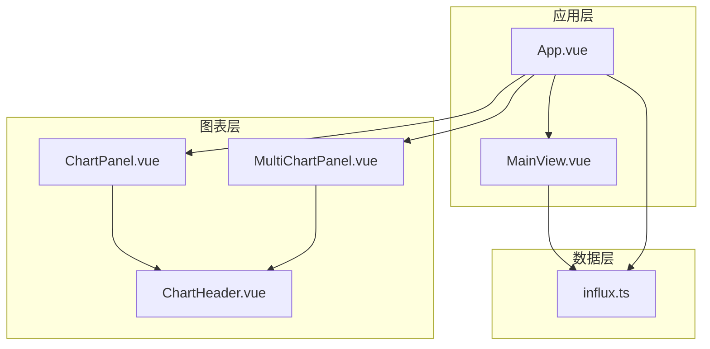
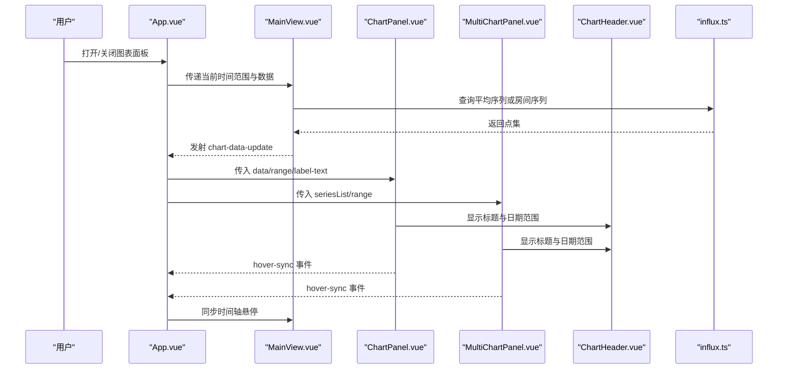
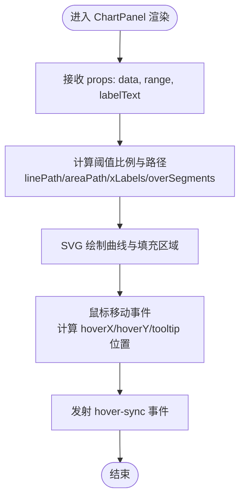
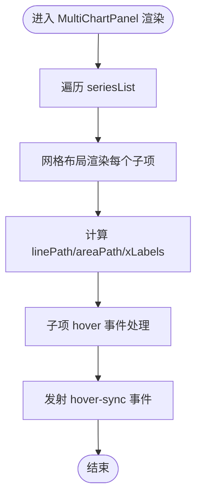
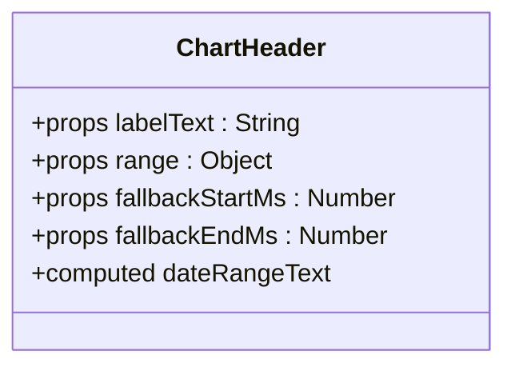
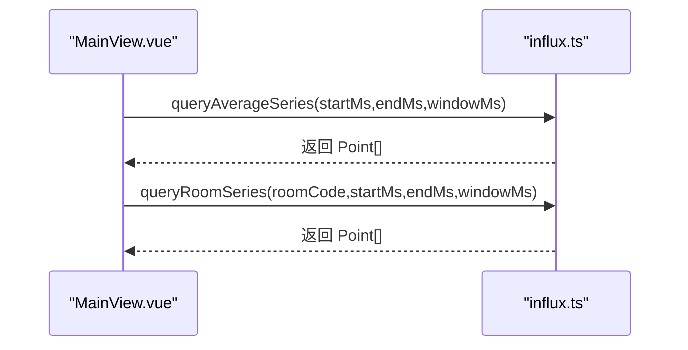
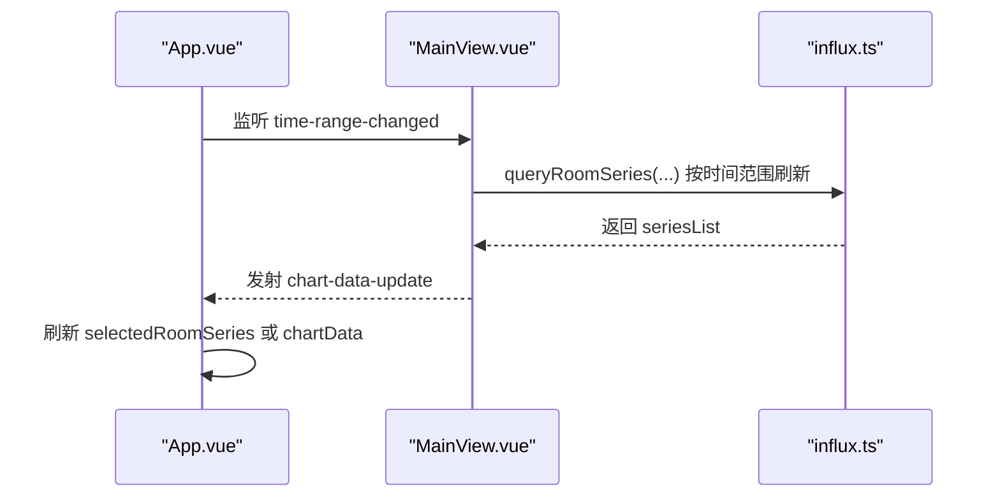
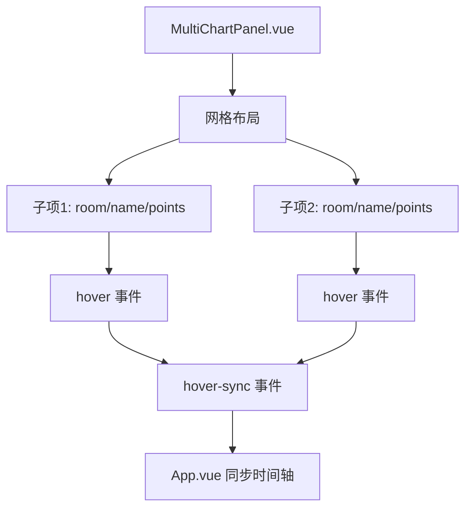
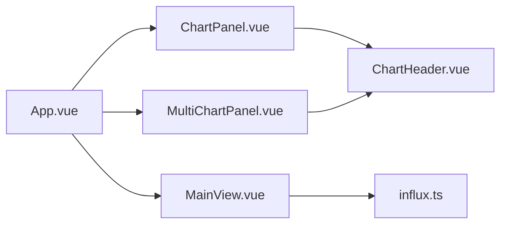

# 图表组件（ChartPanel & MultiChartPanel）

<cite>
**本文引用的文件**
- [ChartPanel.vue](file://src/components/ChartPanel.vue)
- [MultiChartPanel.vue](file://src/components/MultiChartPanel.vue)
- [ChartHeader.vue](file://src/components/ChartHeader.vue)
- [influx.ts](file://src/services/influx.ts)
- [App.vue](file://src/App.vue)
- [MainView.vue](file://src/components/MainView.vue)
</cite>

## 目录
1. [简介](#简介)
2. [项目结构](#项目结构)
3. [核心组件](#核心组件)
4. [架构总览](#架构总览)
5. [组件详解](#组件详解)
6. [依赖关系分析](#依赖关系分析)
7. [性能考量](#性能考量)
8. [故障排查指南](#故障排查指南)
9. [结论](#结论)
10. [附录](#附录)

## 简介
本文件面向开发者，系统性梳理图表组件的设计与实现，重点覆盖：
- 单图表组件 ChartPanel.vue 如何渲染单条房间温度曲线，支持悬停交互、阈值告警、时间范围显示与导出能力。
- 多图表组件 MultiChartPanel.vue 如何协调多个 ChartPanel 实例，统一时间轴控制与布局管理。
- ChartHeader.vue 作为可复用头部组件，在图表中承担标题、时间范围显示与操作按钮集成。
- 结合 InfluxDB 查询服务，说明如何从时序数据库拉取数据并驱动图表渲染。
- 提供性能优化建议，包括大数据量下的采样策略与内存管理。

## 项目结构
图表组件位于 src/components 下，配合 App.vue 与 MainView.vue 在应用层面进行编排与数据流传递。

图表来源
- [App.vue](file://src/App.vue#L60-L82)
- [ChartPanel.vue](file://src/components/ChartPanel.vue#L1-L40)
- [MultiChartPanel.vue](file://src/components/MultiChartPanel.vue#L1-L25)
- [ChartHeader.vue](file://src/components/ChartHeader.vue#L1-L20)
- [influx.ts](file://src/services/influx.ts#L1-L40)

章节来源
- [App.vue](file://src/App.vue#L60-L82)
- [ChartPanel.vue](file://src/components/ChartPanel.vue#L1-L40)
- [MultiChartPanel.vue](file://src/components/MultiChartPanel.vue#L1-L25)
- [ChartHeader.vue](file://src/components/ChartHeader.vue#L1-L20)
- [influx.ts](file://src/services/influx.ts#L1-L40)

## 核心组件
- ChartPanel.vue：单图表渲染，基于 SVG 路径绘制折线与填充区域，支持悬停交互、阈值告警、时间范围显示与关闭按钮。
- MultiChartPanel.vue：多图表网格布局，统一阈值线与网格线，支持悬停同步与关闭按钮。
- ChartHeader.vue：通用头部组件，负责标题文本、时间范围显示与插槽扩展（如关闭按钮）。
- influx.ts：封装 InfluxDB 写入与查询接口，提供平均值与房间级序列查询，CSV 解析与点集转换。

章节来源
- [ChartPanel.vue](file://src/components/ChartPanel.vue#L1-L120)
- [MultiChartPanel.vue](file://src/components/MultiChartPanel.vue#L1-L120)
- [ChartHeader.vue](file://src/components/ChartHeader.vue#L1-L35)
- [influx.ts](file://src/services/influx.ts#L1-L136)

## 架构总览
应用通过 App.vue 控制图表面板的显隐与尺寸，MainView.vue 负责时间范围选择、播放控制与数据拉取，ChartPanel/MultiChartPanel 负责具体图表渲染与交互。InfluxDB 作为数据源，提供房间温度时序数据。

图表来源
- [App.vue](file://src/App.vue#L60-L82)
- [MainView.vue](file://src/components/MainView.vue#L346-L365)
- [influx.ts](file://src/services/influx.ts#L39-L103)
- [ChartPanel.vue](file://src/components/ChartPanel.vue#L1-L40)
- [MultiChartPanel.vue](file://src/components/MultiChartPanel.vue#L1-L25)
- [ChartHeader.vue](file://src/components/ChartHeader.vue#L1-L20)

## 组件详解

### ChartPanel.vue
- 渲染方式：基于 SVG 路径绘制折线与填充区域，使用渐变色与阈值线增强可读性。
- 交互机制：鼠标悬停时显示垂直参考线与悬浮圆点，计算对应值与时间，支持跨组件 hover 同步。
- 数据绑定：接收 data 数组（Point[]）、range 对象与 labelText，内部维护 hoverX/Y、tooltip 位置与值。
- 阈值告警：当数据越过阈值时在曲线上标注警示圆点，底部图例显示超阈计数。
- 头部集成：通过 ChartHeader.vue 显示标题与时间范围，右侧提供关闭按钮。

图表来源
- [ChartPanel.vue](file://src/components/ChartPanel.vue#L100-L226)

章节来源
- [ChartPanel.vue](file://src/components/ChartPanel.vue#L1-L226)
- [ChartHeader.vue](file://src/components/ChartHeader.vue#L1-L35)

### MultiChartPanel.vue
- 渲染方式：网格布局，每个子项独立绘制 SVG 曲线与阈值线，统一阈值比例与网格线。
- 交互机制：每个子项独立维护 hoverX/Y、tooltip 位置与值，统一发射 hover-sync 事件。
- 数据绑定：接收 seriesList（每项包含 room/name/points），range 与 labelText。
- 布局管理：固定两列网格，支持滚动与滚动条样式定制。

图表来源
- [MultiChartPanel.vue](file://src/components/MultiChartPanel.vue#L1-L179)

章节来源
- [MultiChartPanel.vue](file://src/components/MultiChartPanel.vue#L1-L179)
- [ChartHeader.vue](file://src/components/ChartHeader.vue#L1-L35)

### ChartHeader.vue
- 职责：统一图表头部，显示标题与日期范围，支持插槽注入操作按钮。
- 日期范围：优先使用传入 range，否则回退到传入的起止时间戳。
- 样式：简洁的工具栏样式，便于与图表容器融合。

图表来源
- [ChartHeader.vue](file://src/components/ChartHeader.vue#L1-L35)

章节来源
- [ChartHeader.vue](file://src/components/ChartHeader.vue#L1-L35)

### 数据来源与查询（influx.ts）
- 配置校验：检查 InfluxDB URL、组织、桶与 Token 或 Basic 认证配置。
- 写入接口：将房间温度写入指定桶，按毫秒精度存储。
- 查询接口：
  - 平均序列：按窗口聚合返回平均值序列。
  - 房间序列：按房间过滤并聚合返回序列。
  - 最新值：按房间集合返回最新温度值。
- CSV 解析：解析响应 CSV，提取 _time 与 _value，构建 Point[]。

图表来源
- [influx.ts](file://src/services/influx.ts#L39-L103)
- [MainView.vue](file://src/components/MainView.vue#L346-L365)

章节来源
- [influx.ts](file://src/services/influx.ts#L1-L136)
- [MainView.vue](file://src/components/MainView.vue#L346-L365)

### 时间范围选择、数据刷新与导出
- 时间范围选择：MainView.vue 提供时间范围菜单与自定义日期范围弹窗，支持缩放、播放与循环播放。
- 数据刷新：App.vue 监听时间范围变化与图表数据更新，按需刷新单图或多图系列。
- 导出能力：App.vue 集成数据导出面板，可导出资产与空间数据，图表组件本身不直接导出数据，但可与导出面板联动。

图表来源
- [App.vue](file://src/App.vue#L509-L534)
- [App.vue](file://src/App.vue#L1269-L1279)
- [MainView.vue](file://src/components/MainView.vue#L346-L365)
- [influx.ts](file://src/services/influx.ts#L72-L103)

章节来源
- [App.vue](file://src/App.vue#L509-L534)
- [App.vue](file://src/App.vue#L1269-L1279)
- [MainView.vue](file://src/components/MainView.vue#L346-L365)
- [influx.ts](file://src/services/influx.ts#L72-L103)

### MultiChartPanel 的统一时间轴控制与布局
- 统一阈值：多图共享阈值比例与阈值线，保证视觉一致性。
- 布局管理：两列网格，子项独立 hover，统一通过 hover-sync 事件同步到时间轴。
- 数据结构：seriesList 为数组，每项包含 room/name/points，便于按房间维度对比。

图表来源
- [MultiChartPanel.vue](file://src/components/MultiChartPanel.vue#L1-L179)
- [App.vue](file://src/App.vue#L1263-L1267)

章节来源
- [MultiChartPanel.vue](file://src/components/MultiChartPanel.vue#L1-L179)
- [App.vue](file://src/App.vue#L1263-L1267)

## 依赖关系分析
- 组件耦合：
  - ChartPanel/MultiChartPanel 依赖 ChartHeader.vue 提供统一头部。
  - App.vue 作为编排者，向 ChartPanel/MultiChartPanel 传递 data/seriesList/range/label-text，并监听 hover-sync 事件。
  - MainView.vue 作为数据提供方，负责时间范围与数据拉取，通过事件向 App.vue 传递。
- 外部依赖：
  - influx.ts 提供时序数据查询与解析。
  - 浏览器环境的 fetch API 与 SVG 渲染。

图表来源
- [App.vue](file://src/App.vue#L60-L82)
- [ChartPanel.vue](file://src/components/ChartPanel.vue#L1-L40)
- [MultiChartPanel.vue](file://src/components/MultiChartPanel.vue#L1-L25)
- [ChartHeader.vue](file://src/components/ChartHeader.vue#L1-L20)
- [MainView.vue](file://src/components/MainView.vue#L346-L365)
- [influx.ts](file://src/services/influx.ts#L39-L103)

章节来源
- [App.vue](file://src/App.vue#L60-L82)
- [ChartPanel.vue](file://src/components/ChartPanel.vue#L1-L40)
- [MultiChartPanel.vue](file://src/components/MultiChartPanel.vue#L1-L25)
- [ChartHeader.vue](file://src/components/ChartHeader.vue#L1-L20)
- [MainView.vue](file://src/components/MainView.vue#L346-L365)
- [influx.ts](file://src/services/influx.ts#L39-L103)

## 性能考量
- 大数据量采样策略
  - 使用窗口聚合：查询时通过窗口大小（windowMs）降低点数，减少渲染压力。参见平均序列与房间序列查询。
  - 自适应窗口：根据时间跨度动态计算窗口大小，避免点数过多导致卡顿。
- 渲染优化
  - SVG 路径复用：linePath/areaPath 为计算属性，避免重复计算。
  - 事件节流：悬停事件在组件内直接计算索引与坐标，避免频繁 DOM 查询。
- 内存管理
  - seriesList 与 chartData 为响应式数组，及时清理不需要的 series，避免内存泄漏。
  - 多图场景下，统一阈值与网格线复用，减少重复资源占用。
- I/O 优化
  - Promise.all 并行拉取多个房间序列，缩短等待时间。
  - 缓存最近一次时间范围与窗口参数，避免重复计算。

章节来源
- [MainView.vue](file://src/components/MainView.vue#L346-L365)
- [MainView.vue](file://src/components/MainView.vue#L367-L387)
- [influx.ts](file://src/services/influx.ts#L39-L103)

## 故障排查指南
- InfluxDB 未配置
  - 现象：图表数据为空，控制台提示未配置。
  - 处理：检查环境变量配置，确保 URL、组织、桶与 Token/Basic 认证齐全。
- 查询失败
  - 现象：查询返回空数组或异常。
  - 处理：确认 Flux 查询语法与测量名称/字段名称一致；检查网络连通性与权限。
- 悬停不同步
  - 现象：图表悬停与时间轴不同步。
  - 处理：确认 App.vue 的 hover-sync 事件监听与 MainView.vue 的同步方法已正确调用。
- 多图布局异常
  - 现象：网格布局错位或滚动条不生效。
  - 处理：检查容器高度与网格列数，确保图表容器尺寸变化后触发 resize。

章节来源
- [influx.ts](file://src/services/influx.ts#L1-L20)
- [App.vue](file://src/App.vue#L1263-L1267)
- [MainView.vue](file://src/components/MainView.vue#L1382-L1449)

## 结论
本图表体系以 ChartPanel/MultiChartPanel 为核心，借助 ChartHeader.vue 提供统一头部，配合 App.vue 与 MainView.vue 实现时间范围选择、数据刷新与悬停同步。influx.ts 作为数据层，提供稳定的时序查询能力。整体设计具备良好的可扩展性与可维护性，适合在大型可视化场景中进一步拓展（如接入 ECharts、引入更多交互与导出能力）。

## 附录
- 关键实现路径
  - 单图渲染与交互：[ChartPanel.vue](file://src/components/ChartPanel.vue#L100-L226)
  - 多图渲染与交互：[MultiChartPanel.vue](file://src/components/MultiChartPanel.vue#L1-L179)
  - 头部组件：[ChartHeader.vue](file://src/components/ChartHeader.vue#L1-L35)
  - 数据查询与解析：[influx.ts](file://src/services/influx.ts#L39-L103)
  - 应用编排与事件流：[App.vue](file://src/App.vue#L509-L534), [App.vue](file://src/App.vue#L1269-L1279)
  - 时间范围与数据刷新：[MainView.vue](file://src/components/MainView.vue#L346-L365)