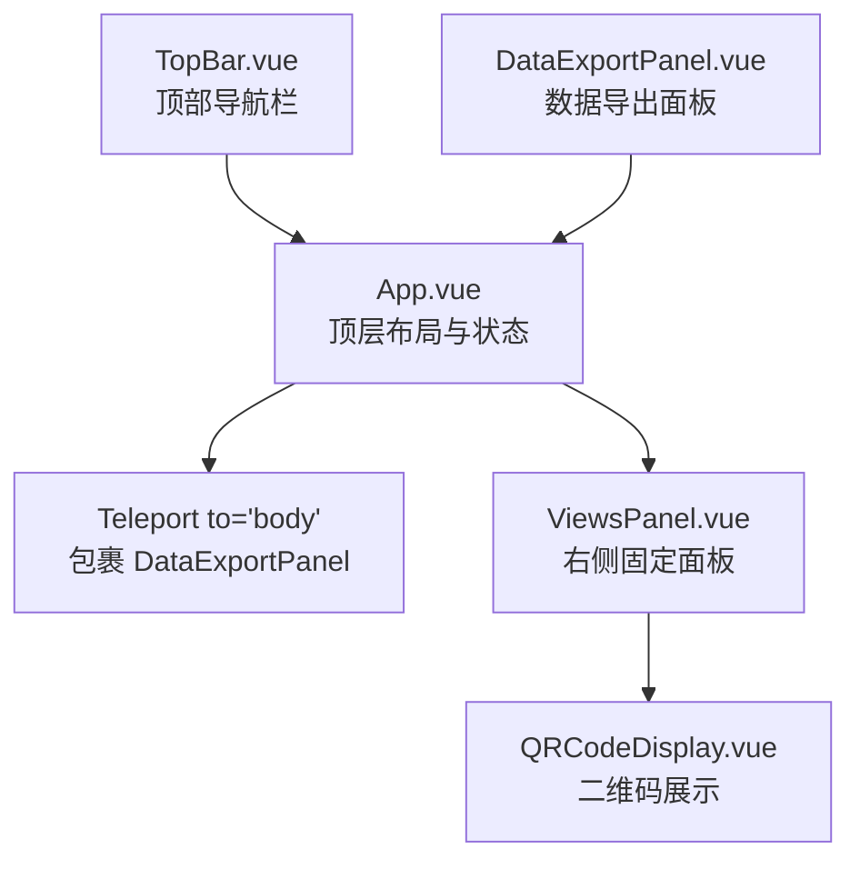
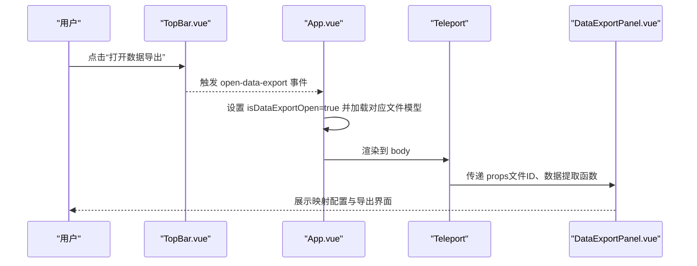
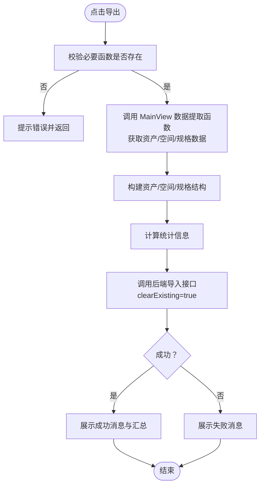
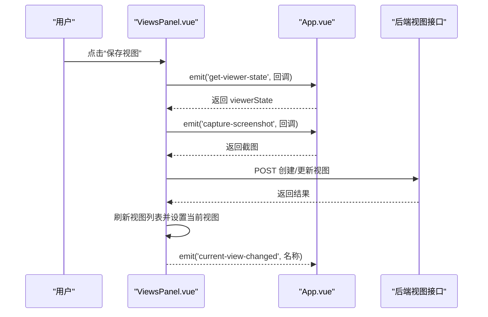
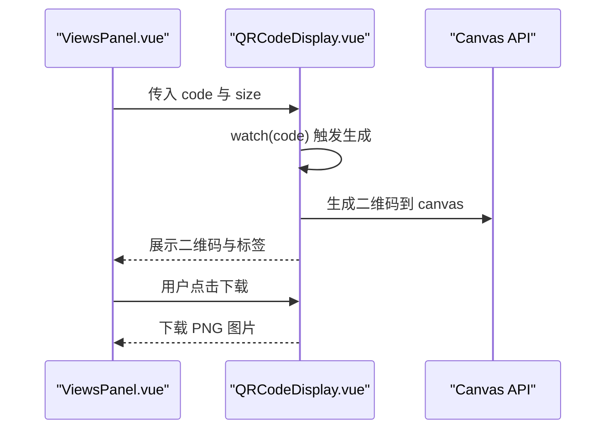
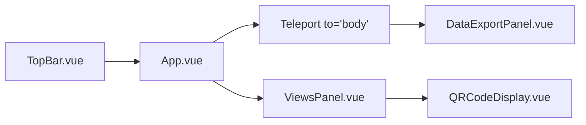

# 模态框组件（DataExportPanel & ViewsPanel）

<cite>
**本文引用的文件**
- [App.vue](file://src/App.vue)
- [TopBar.vue](file://src/components/TopBar.vue)
- [DataExportPanel.vue](file://src/components/DataExportPanel.vue)
- [ViewsPanel.vue](file://src/components/ViewsPanel.vue)
- [QRCodeDisplay.vue](file://src/components/QRCodeDisplay.vue)
</cite>

## 目录
1. [简介](#简介)
2. [项目结构](#项目结构)
3. [核心组件](#核心组件)
4. [架构总览](#架构总览)
5. [详细组件分析](#详细组件分析)
6. [依赖分析](#依赖分析)
7. [性能考量](#性能考量)
8. [故障排查指南](#故障排查指南)
9. [结论](#结论)
10. [附录](#附录)

## 简介
本文件聚焦于两个基于 Teleport 实现的模态框组件：DataExportPanel.vue 和 ViewsPanel.vue。文档说明它们如何脱离常规 DOM 结构渲染到 body 底部，从而避免样式冲突与 z-index 问题；阐述 DataExportPanel 的数据导出能力（含 CSV 生成与批量操作选项）；解释 ViewsPanel 如何管理用户创建的视图状态与分享链接，并集成 QRCodeDisplay.vue 生成二维码；最后给出通过 v-model 或事件控制显示/隐藏的机制、与 App.vue/TopBar.vue 的调用关系，以及创建新 Teleport 模态框的最佳实践。

## 项目结构
- DataExportPanel 作为 Teleport 弹窗，由 App.vue 在 body 内进行挂载渲染，避免与页面其他布局产生层级与样式干扰。
- ViewsPanel 是固定在右侧的面板组件，直接作为 App.vue 的子组件渲染，具备独立的定位与层级控制。

**图表来源**
- [App.vue](file://src/App.vue#L109-L130)
- [ViewsPanel.vue](file://src/components/ViewsPanel.vue#L1-L154)
- [TopBar.vue](file://src/components/TopBar.vue#L1-L120)

**章节来源**
- [App.vue](file://src/App.vue#L109-L142)
- [TopBar.vue](file://src/components/TopBar.vue#L1-L120)

## 核心组件
- DataExportPanel.vue
  - 作用：提供数据导出流程，包括映射配置、连接检查、提取与导入 PostgreSQL、结果反馈等。
  - 特点：通过 Teleport 渲染到 body，避免与父级布局的 z-index 冲突；内部包含 MappingConfigPanel 子组件用于字段映射配置。
  - 关键交互：暴露方法供父组件触发导出与连接检查；通过 props 接收来自 MainView 的数据提取函数，保证“所见即所得”。

- ViewsPanel.vue
  - 作用：管理用户视图（视口状态+截图），支持保存、更新、删除、重命名、恢复视图；支持画廊/列表两种展示模式；支持搜索与排序。
  - 特点：固定定位在右侧，拥有独立的 z-index；通过事件与 App.vue 通信，实现视图状态捕获与恢复。
  - 集成：可选地集成 QRCodeDisplay.vue 展示分享二维码（如需扩展）。

**章节来源**
- [DataExportPanel.vue](file://src/components/DataExportPanel.vue#L1-L120)
- [ViewsPanel.vue](file://src/components/ViewsPanel.vue#L1-L120)

## 架构总览
DataExportPanel 与 ViewsPanel 分别采用不同的渲染策略：
- DataExportPanel 使用 Teleport 渲染到 body，形成独立的弹窗层，避免受父容器样式与 z-index 影响。
- ViewsPanel 作为固定面板直接渲染，具备独立的定位与层级，适合长期驻留的侧边工具。

**图表来源**
- [TopBar.vue](file://src/components/TopBar.vue#L1-L120)
- [App.vue](file://src/App.vue#L109-L130)
- [DataExportPanel.vue](file://src/components/DataExportPanel.vue#L1-L120)

## 详细组件分析

### DataExportPanel.vue 分析
- 渲染与层级
  - 通过 Teleport 渲染到 body，外层包裹遮罩层与关闭按钮，避免与页面其他元素发生 z-index 冲突。
- 功能模块
  - 映射配置区：嵌入 MappingConfigPanel，支持资产、资产规格、空间三类映射；支持保存到数据库（若存在 fileId）。
  - 导出操作区：包含连接检查、导出按钮、统计信息与结果反馈；导出时会调用 MainView 的数据提取函数，构建资产/空间/规格数据并发送到后端。
  - 生命周期：组件挂载时自动检查 API 连接、加载属性列表、根据 fileId 从数据库加载或使用默认映射配置。
- 事件与方法
  - 暴露方法：extractAndExport、checkConnection，便于父组件直接触发。
  - 通过 props 注入数据提取函数，确保导出的数据与当前模型一致。

**图表来源**
- [DataExportPanel.vue](file://src/components/DataExportPanel.vue#L194-L297)

**章节来源**
- [DataExportPanel.vue](file://src/components/DataExportPanel.vue#L1-L120)
- [DataExportPanel.vue](file://src/components/DataExportPanel.vue#L120-L220)
- [DataExportPanel.vue](file://src/components/DataExportPanel.vue#L220-L351)

### ViewsPanel.vue 分析
- 渲染与层级
  - 直接作为 App.vue 的子组件渲染，固定定位在右侧，具备独立的 z-index 与阴影，避免与主内容层产生层级问题。
- 功能模块
  - 视图列表：支持画廊/列表两种展示模式；支持搜索与排序；支持上下文菜单（重命名、更新、删除）。
  - 保存与恢复：通过事件向 App.vue 请求当前 viewer 状态与截图，保存为视图；支持覆盖保存与确认提示；恢复时将视图数据回传给 App.vue。
  - 当前视图名：实时显示当前选中视图名称，便于用户感知。
- 事件与状态
  - 通过 visible prop 控制显示/隐藏；通过 emit 事件与 App.vue 通信（close、get-viewer-state、capture-screenshot、restore-view、current-view-changed）。

**图表来源**
- [ViewsPanel.vue](file://src/components/ViewsPanel.vue#L236-L339)
- [ViewsPanel.vue](file://src/components/ViewsPanel.vue#L369-L420)
- [App.vue](file://src/App.vue#L205-L226)

**章节来源**
- [ViewsPanel.vue](file://src/components/ViewsPanel.vue#L1-L154)
- [ViewsPanel.vue](file://src/components/ViewsPanel.vue#L154-L339)
- [ViewsPanel.vue](file://src/components/ViewsPanel.vue#L339-L470)
- [ViewsPanel.vue](file://src/components/ViewsPanel.vue#L800-L933)

### QRCodeDisplay.vue 集成建议
- 用途：将字符串编码为二维码并支持下载，适合在 ViewsPanel 中展示视图分享链接二维码。
- 机制：监听 code 变化并生成二维码；提供下载为 PNG 的方法。
- 集成方式：在 ViewsPanel 中添加 QRCodeDisplay 组件，传入分享链接 code 与 size，即可展示二维码与下载按钮。

**图表来源**
- [QRCodeDisplay.vue](file://src/components/QRCodeDisplay.vue#L1-L98)

**章节来源**
- [QRCodeDisplay.vue](file://src/components/QRCodeDisplay.vue#L1-L98)

## 依赖分析
- App.vue 对 DataExportPanel 的依赖
  - 通过 Teleport 将 DataExportPanel 渲染到 body，避免层级与样式冲突。
  - 通过 props 向 DataExportPanel 注入文件 ID 与数据提取函数，确保导出数据与当前模型一致。
  - 通过 isDataExportOpen 控制显隐；openDataExportPanel/closeDataExportPanel 管理生命周期。
- App.vue 对 ViewsPanel 的依赖
  - 通过 visible 控制显隐；通过事件与 MainView 交互，实现视图状态捕获与恢复。
- TopBar.vue 对 App.vue 的依赖
  - 通过事件 open-data-export/toggle-views 触发 App.vue 的状态变更。

**图表来源**
- [TopBar.vue](file://src/components/TopBar.vue#L1-L120)
- [App.vue](file://src/App.vue#L109-L142)
- [DataExportPanel.vue](file://src/components/DataExportPanel.vue#L1-L120)
- [ViewsPanel.vue](file://src/components/ViewsPanel.vue#L1-L154)
- [QRCodeDisplay.vue](file://src/components/QRCodeDisplay.vue#L1-L98)

**章节来源**
- [App.vue](file://src/App.vue#L109-L142)
- [TopBar.vue](file://src/components/TopBar.vue#L1-L120)

## 性能考量
- Teleport 渲染到 body 的优势
  - 避免父容器的 overflow、transform、clip-path 等样式对弹窗布局的影响。
  - 减少 z-index 层级管理复杂度，降低样式冲突风险。
- DataExportPanel 导出流程
  - 数据提取与导入过程涉及网络请求与数据处理，建议在导出前进行必要的校验与提示，避免重复导出。
  - 统计信息与结果反馈应尽量异步展示，避免阻塞主线程。
- ViewsPanel 列表渲染
  - 画廊模式使用网格布局，注意在大量视图时的虚拟化或分页策略，减少 DOM 节点数量。
  - 搜索与排序采用防抖，避免频繁请求后端。

[本节为通用指导，无需特定文件引用]

## 故障排查指南
- DataExportPanel
  - API 连接失败：检查 checkConnection 的返回状态；确认后端健康状态。
  - 导出失败：查看导出结果消息，确认映射配置是否正确；检查后端导入接口返回。
  - 映射配置未保存：若无 fileId，仅会保存到当前会话；确认文件是否已激活。
- ViewsPanel
  - 无法保存视图：确认已激活文件且当前 viewer 状态与截图可用；检查后端接口返回。
  - 上下文菜单不消失：确认点击外部关闭逻辑是否生效；检查事件绑定。
  - 列表为空：确认搜索条件与排序参数；检查后端返回数据结构。

**章节来源**
- [DataExportPanel.vue](file://src/components/DataExportPanel.vue#L150-L190)
- [DataExportPanel.vue](file://src/components/DataExportPanel.vue#L194-L297)
- [ViewsPanel.vue](file://src/components/ViewsPanel.vue#L236-L339)
- [ViewsPanel.vue](file://src/components/ViewsPanel.vue#L369-L470)

## 结论
DataExportPanel 与 ViewsPanel 分别承担“一次性弹窗”与“长期驻留面板”的职责。前者通过 Teleport 渲染到 body，有效规避样式与层级问题；后者通过固定定位与独立事件流，提供稳定的视图管理体验。二者均通过 App.vue 进行状态协调与数据桥接，配合 TopBar.vue 的入口触发，构成清晰的交互闭环。

[本节为总结性内容，无需特定文件引用]

## 附录

### v-model 与事件控制显示/隐藏机制
- DataExportPanel
  - 通过 App.vue 的 isDataExportOpen 控制显隐；通过 openDataExportPanel/closeDataExportPanel 方法管理生命周期。
  - 通过 Teleport 渲染到 body，外层遮罩层支持点击外部关闭。
- ViewsPanel
  - 通过 visible 控制显隐；通过 @close 事件通知 App.vue 更新状态。
  - 通过 @current-view-changed 事件同步当前视图名称。

**章节来源**
- [App.vue](file://src/App.vue#L109-L142)
- [ViewsPanel.vue](file://src/components/ViewsPanel.vue#L132-L142)

### 与 App.vue/TopBar.vue 的调用关系
- TopBar.vue 触发 open-data-export 与 toggle-views 事件，App.vue 响应并更新状态。
- App.vue 作为中枢，负责：
  - 管理 isDataExportOpen/isViewsPanelOpen 等状态；
  - 通过 props 向 DataExportPanel 注入数据提取函数；
  - 通过事件与 MainView 交互，实现视图状态捕获与恢复。

**章节来源**
- [TopBar.vue](file://src/components/TopBar.vue#L1-L120)
- [App.vue](file://src/App.vue#L109-L142)
- [App.vue](file://src/App.vue#L205-L226)

### 创建新的 Teleport 模态框最佳实践
- 渲染位置
  - 使用 Teleport to="body" 将弹窗渲染到 body，避免父容器样式与 z-index 干扰。
- 显隐控制
  - 使用布尔状态变量控制 v-if；外层遮罩层支持点击外部关闭。
- 事件与数据
  - 通过 props 向子组件注入必要的数据与回调函数；必要时通过事件与父组件通信。
- 样式与层级
  - 为弹窗设置合适的 z-index；确保与页面其他层级不冲突。
- 可访问性
  - 提供键盘关闭（Esc）与焦点管理；为按钮提供明确的标题与 aria-label。

[本节为通用指导，无需特定文件引用]