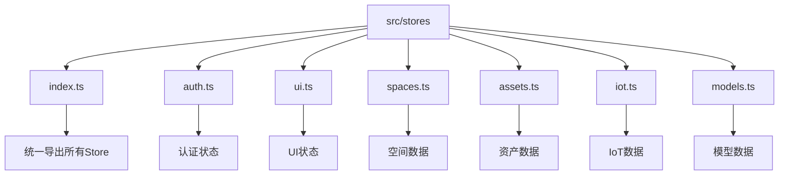
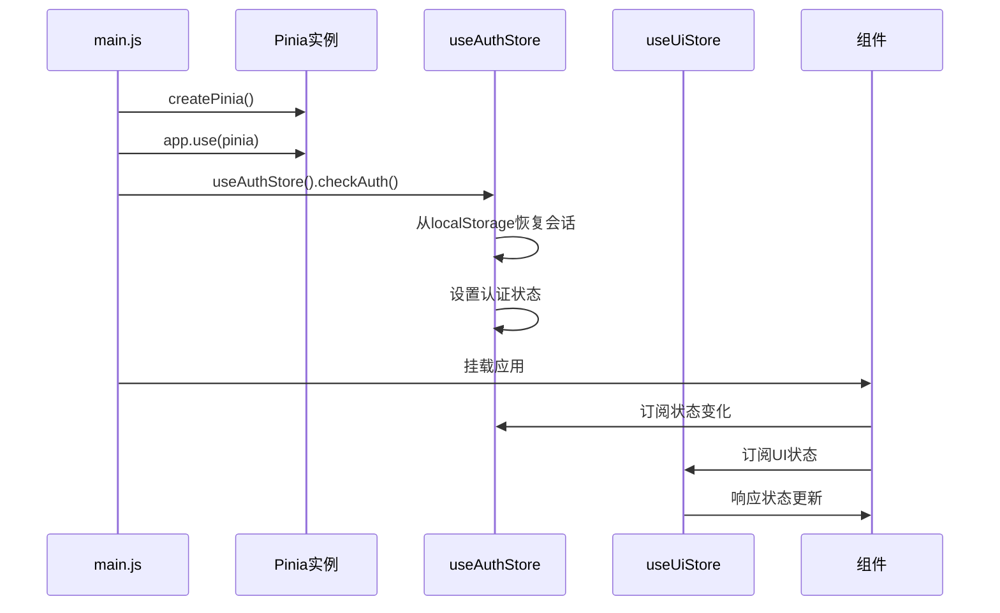
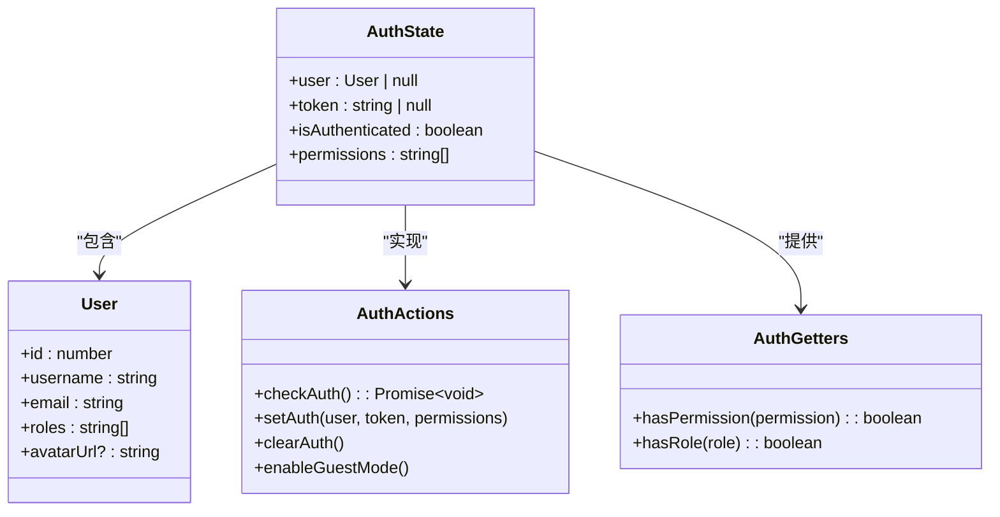
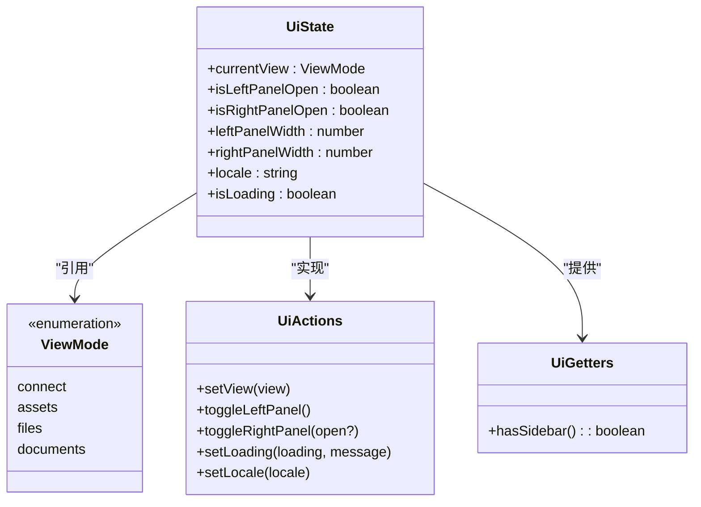
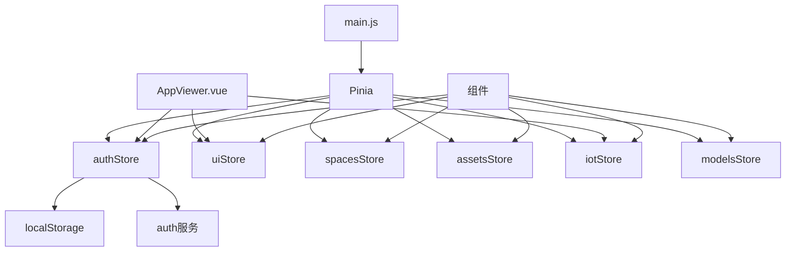

# 状态管理

<cite>
**本文档引用的文件**   
- [index.ts](file://src/stores/index.ts)
- [auth.ts](file://src/stores/auth.ts)
- [ui.ts](file://src/stores/ui.ts)
- [spaces.ts](file://src/stores/spaces.ts)
- [assets.ts](file://src/stores/assets.ts)
- [iot.ts](file://src/stores/iot.ts)
- [models.ts](file://src/stores/models.ts)
- [auth.ts](file://src/services/auth.ts)
- [useViewer.ts](file://src/composables/useViewer.ts)
- [useIoTData.ts](file://src/composables/useIoTData.ts)
- [main.js](file://src/main.js)
- [AppViewer.vue](file://src/AppViewer.vue)
</cite>

## 目录
1. [项目结构](#项目结构)
2. [核心组件](#核心组件)
3. [架构概述](#架构概述)
4. [详细组件分析](#详细组件分析)
5. [依赖分析](#依赖分析)
6. [性能考虑](#性能考虑)
7. [故障排除指南](#故障排除指南)
8. [结论](#结论)

## 项目结构

项目中的状态管理采用模块化设计，所有store文件位于`src/stores/`目录下，通过`index.ts`统一导出。这种结构实现了关注点分离，每个store模块负责特定领域的状态管理。



**图示来源**
- [index.ts](file://src/stores/index.ts#L1-L17)
- 各store文件

**本节来源**
- [index.ts](file://src/stores/index.ts#L1-L17)

## 核心组件

系统采用Pinia作为状态管理解决方案，实现了模块化的状态管理架构。核心store模块包括认证(auth)、用户界面(ui)、空间(spaces)、资产(assets)、IoT(iot)和模型(models)等，每个模块都有明确的职责划分。

**本节来源**
- [auth.ts](file://src/stores/auth.ts#L1-L115)
- [ui.ts](file://src/stores/ui.ts#L1-L145)
- [spaces.ts](file://src/stores/spaces.ts#L1-L167)

## 架构概述

整个状态管理架构采用分层设计，从应用初始化到各模块store的协作，形成了完整的状态管理生态系统。



**图示来源**
- [main.js](file://src/main.js#L1-L40)
- [auth.ts](file://src/stores/auth.ts#L50-L78)

## 详细组件分析

### 认证状态管理分析

认证状态管理模块负责用户认证相关状态的管理，包括用户信息、令牌和权限等。



**图示来源**
- [auth.ts](file://src/stores/auth.ts#L15-L115)

**本节来源**
- [auth.ts](file://src/stores/auth.ts#L1-L115)
- [auth.ts](file://src/services/auth.ts#L1-L191)

### UI状态管理分析

UI状态管理模块负责管理界面布局、面板状态和用户交互相关的状态。



**图示来源**
- [ui.ts](file://src/stores/ui.ts#L9-L145)

**本节来源**
- [ui.ts](file://src/stores/ui.ts#L1-L145)

### IoT数据状态管理分析

IoT数据状态管理模块负责管理时序数据、温度标签和时间轴控制等状态。

```mermaid
classDiagram
class IoTState {
+isTimelineOpen : boolean
+isLive : boolean
+rangeStartMs : number
+rangeEndMs : number
+currentTimeMs : number
+roomTags : RoomTag[]
+influxConfig : object | null
}
class RoomTag {
+dbId : number
+code : string
+name : string
+screenPos : {x, y} | null
+currentTemp : number | null
+visible : boolean
}
class IoTActions {
+toggleTimeline(open?)
+goLive()
+togglePlayback()
+setTimeRange(startMs, endMs)
+setCurrentTime(timeMs)
+setRoomTags(tags)
+updateRoomTag(code, updates)
+toggleHeatmap()
}
class IoTGetters {
+getTagByCode(code) : RoomTag | undefined
+visibleTags() : RoomTag[]
+hasInfluxConfig() : boolean
}
IoTState --> RoomTag : "包含"
IoTState --> IoTActions : "实现"
IoTState --> IoTGetters : "提供"
```

**图示来源**
- [iot.ts](file://src/stores/iot.ts#L21-L206)

**本节来源**
- [iot.ts](file://src/stores/iot.ts#L1-L206)
- [useIoTData.ts](file://src/composables/useIoTData.ts#L1-L173)

## 依赖分析

各store模块之间保持松耦合，通过明确的接口进行交互。同时，store与服务层和组件层有清晰的依赖关系。



**图示来源**
- [main.js](file://src/main.js#L1-L40)
- [index.ts](file://src/stores/index.ts#L1-L17)

**本节来源**
- [main.js](file://src/main.js#L1-L40)
- [AppViewer.vue](file://src/AppViewer.vue#L162)

## 性能考虑

状态管理架构在性能方面有以下考虑：
- 使用shallowRef优化大型对象的响应式性能
- 通过getter实现计算属性的缓存
- 合理使用持久化策略减少重复请求
- 模块化设计降低状态树的复杂度

## 故障排除指南

常见问题及解决方案：
- 状态未正确更新：检查是否正确使用store实例
- 持久化失效：验证localStorage权限和存储限制
- 类型错误：确保接口定义与实际数据匹配
- 循环依赖：避免store之间直接相互引用

**本节来源**
- [auth.ts](file://src/stores/auth.ts#L90-L103)
- [main.js](file://src/main.js#L28-L38)

## 结论

基于Pinia的状态管理架构实现了良好的模块化设计，各store职责清晰，通过统一的初始化流程确保应用状态的一致性。持久化策略和状态重置机制保证了用户体验的连续性，而模块化的结构为未来的扩展提供了良好的基础。