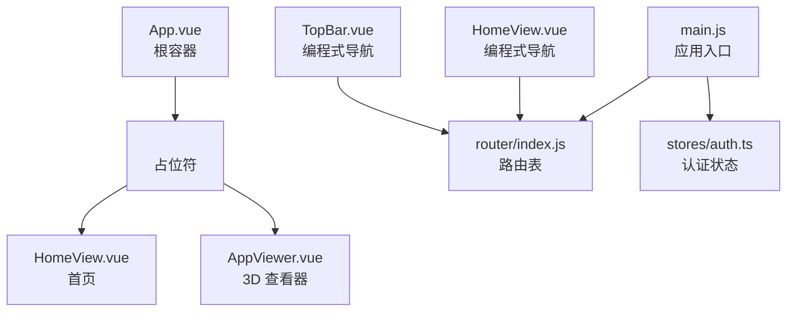
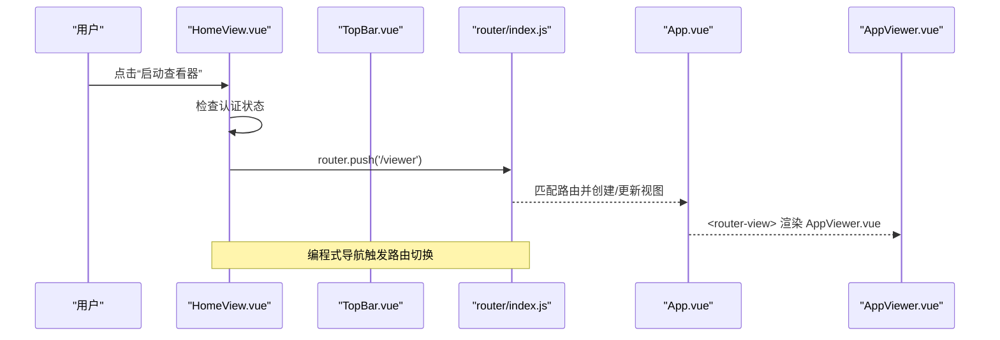
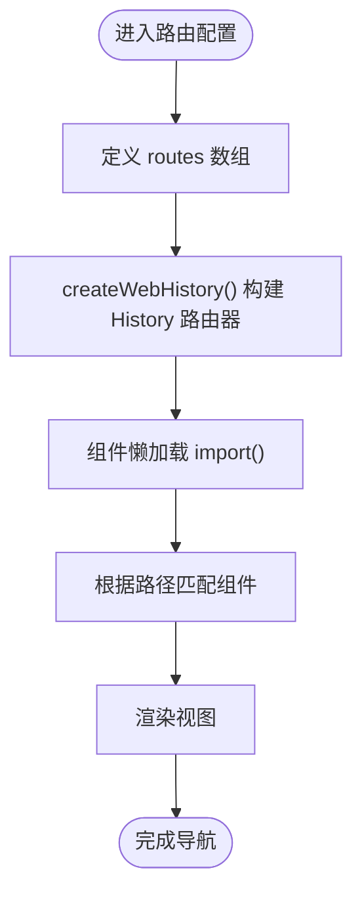
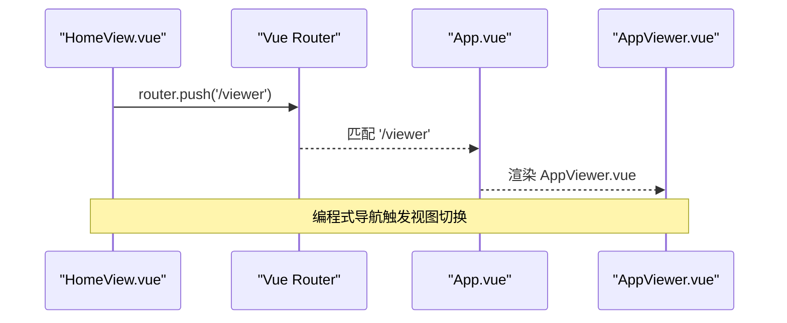
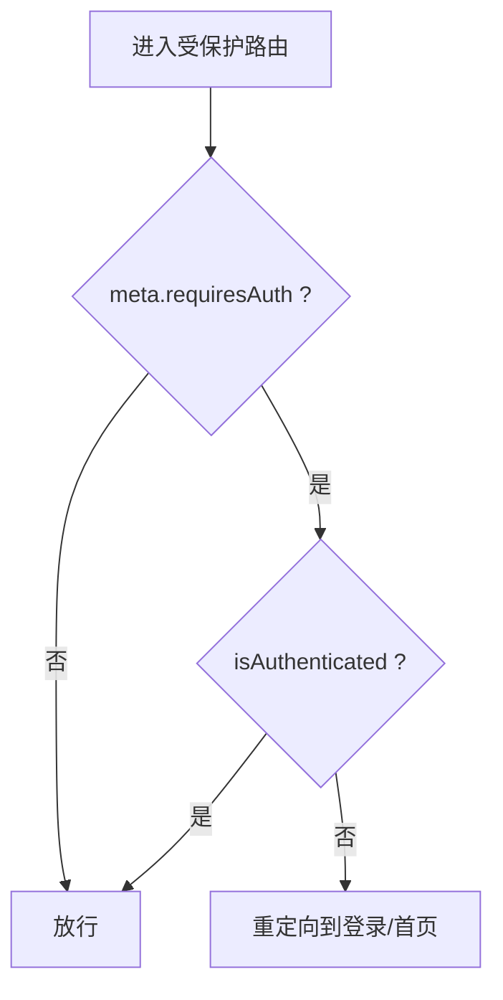
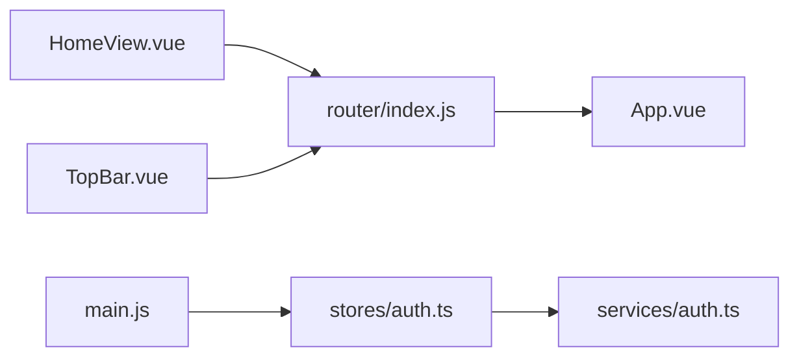

# 路由与导航

<cite>
**本文引用的文件**
- [src/router/index.js](file://src/router/index.js)
- [src/App.vue](file://src/App.vue)
- [src/AppViewer.vue](file://src/AppViewer.vue)
- [src/views/HomeView.vue](file://src/views/HomeView.vue)
- [src/main.js](file://src/main.js)
- [src/stores/auth.ts](file://src/stores/auth.ts)
- [src/services/auth.ts](file://src/services/auth.ts)
- [src/components/TopBar.vue](file://src/components/TopBar.vue)
</cite>

## 目录
1. [引言](#引言)
2. [项目结构](#项目结构)
3. [核心组件](#核心组件)
4. [架构总览](#架构总览)
5. [详细组件分析](#详细组件分析)
6. [依赖分析](#依赖分析)
7. [性能考虑](#性能考虑)
8. [故障排查指南](#故障排查指南)
9. [结论](#结论)

## 引言
本章节系统性描述前端路由配置与页面导航机制，围绕 src/router/index.js 的路由表定义，解析 Vue Router 的懒加载策略（import() 语法）、路由与视图组件的映射关系，以及 <router-view> 在 App.vue 中的渲染机制。文档还涵盖编程式导航（router.push）的使用方法、动态路由参数与嵌套路由的现状说明、权限控制需求下的路由级拦截实现思路，并提供典型路由配置示例与性能优化、错误处理策略建议。

## 项目结构
- 路由定义集中于 src/router/index.js，采用 createRouter + createWebHistory 的 History 模式，定义了根路径、Viewer 与资产视图等路由。
- App.vue 作为应用根容器，内部仅包含 <router-view />，负责承载当前路由匹配到的视图组件。
- 视图组件包括 HomeView.vue（首页）与 AppViewer.vue（3D 查看器主界面），两者分别对应不同的路由路径。
- 编程式导航广泛存在于组件中，例如 HomeView.vue 与 TopBar.vue 使用 useRouter().push 进行页面跳转。

**图表来源**
- [src/App.vue](file://src/App.vue#L1-L12)
- [src/router/index.js](file://src/router/index.js#L1-L27)
- [src/views/HomeView.vue](file://src/views/HomeView.vue#L1-L210)
- [src/components/TopBar.vue](file://src/components/TopBar.vue#L1-L165)
- [src/main.js](file://src/main.js#L1-L40)

**Section sources**
- [src/router/index.js](file://src/router/index.js#L1-L27)
- [src/App.vue](file://src/App.vue#L1-L12)
- [src/main.js](file://src/main.js#L1-L40)

## 核心组件
- 路由表（src/router/index.js）
  - 定义了三条基础路由：根路径 '/'、'/viewer'、'/assets'，均采用懒加载组件（import(...) 形式）。
  - 使用 createWebHistory() 构建 History 模式路由器。
- 根容器（src/App.vue）
  - 仅包含 <router-view />，用于渲染当前匹配到的视图组件。
- 视图组件
  - HomeView.vue：首页，包含编程式导航到 '/viewer' 的逻辑。
  - AppViewer.vue：3D 查看器主界面，作为 '/viewer' 与 '/assets' 的承载组件。
- 权限与认证
  - stores/auth.ts 提供认证状态与权限检查能力（hasPermission、hasRole）。
  - main.js 在应用初始化阶段调用 authStore.checkAuth() 恢复登录态。
  - services/auth.ts 提供登录、登出、刷新令牌、获取当前用户等 API。

**Section sources**
- [src/router/index.js](file://src/router/index.js#L1-L27)
- [src/App.vue](file://src/App.vue#L1-L12)
- [src/views/HomeView.vue](file://src/views/HomeView.vue#L1-L210)
- [src/AppViewer.vue](file://src/AppViewer.vue#L1-L120)
- [src/stores/auth.ts](file://src/stores/auth.ts#L1-L115)
- [src/main.js](file://src/main.js#L1-L40)
- [src/services/auth.ts](file://src/services/auth.ts#L1-L120)

## 架构总览
下图展示从用户交互到视图渲染的端到端流程，包括编程式导航与路由懒加载的关键节点。

**图表来源**
- [src/views/HomeView.vue](file://src/views/HomeView.vue#L180-L205)
- [src/components/TopBar.vue](file://src/components/TopBar.vue#L140-L150)
- [src/router/index.js](file://src/router/index.js#L1-L27)
- [src/App.vue](file://src/App.vue#L1-L12)
- [src/AppViewer.vue](file://src/AppViewer.vue#L1-L120)

## 详细组件分析

### 路由表与懒加载策略
- 路由表定义
  - '/' 映射到 HomeView.vue（懒加载）。
  - '/viewer' 映射到 AppViewer.vue（懒加载）。
  - '/assets' 映射到 AppViewer.vue（懒加载）。
- 懒加载实现
  - 采用 import() 语法进行动态导入，配合 createWebHistory() 的 History 模式，实现按需加载与代码分割，减少首屏体积。
- 嵌套路由与动态参数
  - 当前路由表未定义嵌套路由与动态参数（如 :id）。若需支持，可在现有 routes 数组中扩展子路由数组 children，并在路径中使用占位符（如 '/user/:id'）。

**图表来源**
- [src/router/index.js](file://src/router/index.js#L1-L27)
- [src/App.vue](file://src/App.vue#L1-L12)

**Section sources**
- [src/router/index.js](file://src/router/index.js#L1-L27)

### 路由与视图组件映射
- '/' -> HomeView.vue（懒加载）
- '/viewer' -> AppViewer.vue（懒加载）
- '/assets' -> AppViewer.vue（懒加载）

上述映射关系由路由表直接声明，<router-view> 在 App.vue 中负责渲染当前匹配到的组件。

**Section sources**
- [src/router/index.js](file://src/router/index.js#L1-L27)
- [src/App.vue](file://src/App.vue#L1-L12)

### <router-view> 渲染机制
- App.vue 仅包含 <router-view />，作为全局路由容器，所有路由切换都会在此处渲染对应组件。
- 由于 AppViewer.vue 作为 '/viewer' 与 '/assets' 的承载组件，切换这两个路由时会渲染同一组件实例，但可通过查询参数或路由元信息区分不同视图状态。

**Section sources**
- [src/App.vue](file://src/App.vue#L1-L12)
- [src/AppViewer.vue](file://src/AppViewer.vue#L1-L120)

### 编程式导航（router.push）
- HomeView.vue
  - 在按钮点击事件中，使用 useRouter() 获取路由实例，并通过 router.push('/viewer') 进行导航。
  - 若用户未认证，会弹出登录对话框；登录成功后再次触发 router.push('/viewer')。
- TopBar.vue
  - 顶部栏包含返回首页的导航按钮，使用 router.push('/') 实现。

**图表来源**
- [src/views/HomeView.vue](file://src/views/HomeView.vue#L180-L205)
- [src/components/TopBar.vue](file://src/components/TopBar.vue#L140-L150)
- [src/router/index.js](file://src/router/index.js#L1-L27)
- [src/App.vue](file://src/App.vue#L1-L12)

**Section sources**
- [src/views/HomeView.vue](file://src/views/HomeView.vue#L180-L205)
- [src/components/TopBar.vue](file://src/components/TopBar.vue#L140-L150)

### 动态路由参数与嵌套路由
- 动态参数
  - 当前路由表未定义动态参数（如 :id）。若需支持，可在路由配置中添加路径占位符并在组件中通过 $route.params 访问。
- 嵌套路由
  - 当前路由表未定义 children 子路由。若需支持嵌套视图，可在父路由下新增 children 数组，并在父组件中放置 <router-view> 接受子视图渲染。

提示：以上为基于现有代码的现状分析，如需扩展，应在 src/router/index.js 中增加相应配置。

**Section sources**
- [src/router/index.js](file://src/router/index.js#L1-L27)

### 权限控制与路由级拦截
- 认证状态管理
  - stores/auth.ts 提供认证状态（token、isAuthenticated）与权限检查（hasPermission、hasRole）。
  - main.js 在应用启动时调用 authStore.checkAuth() 恢复登录态。
  - services/auth.ts 提供登录、登出、刷新令牌、获取当前用户等 API。
- 路由级拦截实现思路
  - 当前未在路由层实现全局前置守卫（如 beforeEach）。可参考以下思路：
    - 在路由表中为需要保护的路由添加 meta 字段（如 meta.requiresAuth: true）。
    - 在路由实例上注册全局前置守卫，读取 meta.requiresAuth 并结合 authStore.isAuthenticated 判断是否放行。
    - 若未认证且访问受保护路由，重定向至登录页或首页。
  - 该实现属于扩展设计，当前仓库未包含全局守卫代码。

**图表来源**
- [src/stores/auth.ts](file://src/stores/auth.ts#L1-L115)
- [src/main.js](file://src/main.js#L20-L40)
- [src/services/auth.ts](file://src/services/auth.ts#L1-L120)

**Section sources**
- [src/stores/auth.ts](file://src/stores/auth.ts#L1-L115)
- [src/main.js](file://src/main.js#L20-L40)
- [src/services/auth.ts](file://src/services/auth.ts#L1-L120)

### 典型路由配置示例（思路）
- 基础路由
  - '/' -> HomeView.vue（懒加载）
  - '/viewer' -> AppViewer.vue（懒加载）
  - '/assets' -> AppViewer.vue（懒加载）
- 受保护路由示例
  - '/dashboard' -> DashboardView.vue（meta.requiresAuth: true）
  - '/admin' -> AdminView.vue（meta.requiresAuth: true, meta.roles: ['admin']）
- 嵌套路由示例
  - '/user' -> UserLayout.vue（含 <router-view>）
    - '/user/profile' -> UserProfile.vue
    - '/user/settings' -> UserSettings.vue

注：以上为扩展设计示例，非当前仓库实现。

## 依赖分析
- 路由与视图
  - src/router/index.js 定义路由表，App.vue 通过 <router-view> 渲染视图。
  - HomeView.vue 与 TopBar.vue 通过 useRouter() 使用编程式导航。
- 权限与认证
  - main.js 初始化时调用 authStore.checkAuth()。
  - stores/auth.ts 提供 hasPermission、hasRole 等权限检查。
  - services/auth.ts 提供登录、登出、刷新令牌等 API。

**图表来源**
- [src/router/index.js](file://src/router/index.js#L1-L27)
- [src/App.vue](file://src/App.vue#L1-L12)
- [src/views/HomeView.vue](file://src/views/HomeView.vue#L1-L210)
- [src/components/TopBar.vue](file://src/components/TopBar.vue#L1-L165)
- [src/main.js](file://src/main.js#L1-L40)
- [src/stores/auth.ts](file://src/stores/auth.ts#L1-L115)
- [src/services/auth.ts](file://src/services/auth.ts#L1-L120)

**Section sources**
- [src/router/index.js](file://src/router/index.js#L1-L27)
- [src/App.vue](file://src/App.vue#L1-L12)
- [src/views/HomeView.vue](file://src/views/HomeView.vue#L1-L210)
- [src/components/TopBar.vue](file://src/components/TopBar.vue#L1-L165)
- [src/main.js](file://src/main.js#L1-L40)
- [src/stores/auth.ts](file://src/stores/auth.ts#L1-L115)
- [src/services/auth.ts](file://src/services/auth.ts#L1-L120)

## 性能考虑
- 懒加载与代码分割
  - 路由组件采用 import() 懒加载，减少首屏加载体积，提升初始渲染性能。
- 路由切换开销
  - AppViewer.vue 作为多个路由的承载组件，切换 '/viewer' 与 '/assets' 时复用同一组件实例，避免重复初始化。
- 图表与模型加载
  - AppViewer.vue 在初始化时按需加载文件数据与 3D 模型，避免不必要的资源占用。
- 建议
  - 对频繁切换的视图可考虑 keep-alive 缓存（在 <router-view> 上包裹）以进一步降低切换成本。
  - 对大组件拆分与按需引入，确保路由懒加载生效。

**Section sources**
- [src/router/index.js](file://src/router/index.js#L1-L27)
- [src/AppViewer.vue](file://src/AppViewer.vue#L1-L120)

## 故障排查指南
- 路由无法匹配或空白页
  - 检查路由路径是否与组件懒加载路径一致，确认 import() 路径正确。
  - 确认 App.vue 中存在 <router-view />。
- 编程式导航无效
  - 确认组件内已通过 useRouter() 获取路由实例，并在正确的生命周期或事件中调用 router.push。
- 权限拦截未生效
  - 当前未实现全局前置守卫，如需路由级拦截，需在路由实例上注册守卫并结合 authStore.isAuthenticated 判断。
- 认证状态异常
  - 检查 main.js 中 authStore.checkAuth() 是否在应用挂载前执行。
  - 确认 localStorage 中是否存在 accessToken，必要时清理后重新登录。

**Section sources**
- [src/App.vue](file://src/App.vue#L1-L12)
- [src/views/HomeView.vue](file://src/views/HomeView.vue#L180-L205)
- [src/components/TopBar.vue](file://src/components/TopBar.vue#L140-L150)
- [src/main.js](file://src/main.js#L20-L40)
- [src/stores/auth.ts](file://src/stores/auth.ts#L1-L115)
- [src/services/auth.ts](file://src/services/auth.ts#L1-L120)

## 结论
本项目采用 History 模式的 Vue Router，通过懒加载与 <router-view> 实现清晰的路由与视图映射。编程式导航在 HomeView.vue 与 TopBar.vue 中得到广泛应用。当前未实现全局前置守卫，权限拦截可在路由层扩展实现。整体架构简洁、职责清晰，具备良好的扩展性以支持动态参数、嵌套路由与更细粒度的权限控制。