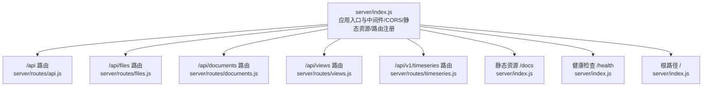
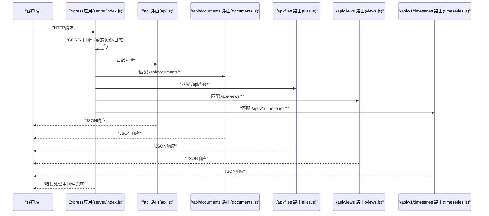
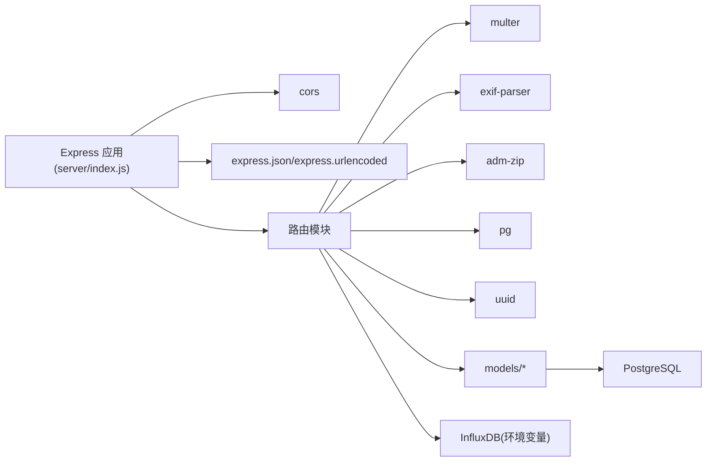

# API端点

<cite>
**本文引用的文件**
- [server/index.js](file://server/index.js)
- [server/routes/api.js](file://server/routes/api.js)
- [server/routes/documents.js](file://server/routes/documents.js)
- [server/routes/files.js](file://server/routes/files.js)
- [server/routes/timeseries.js](file://server/routes/timeseries.js)
- [server/routes/views.js](file://server/routes/views.js)
- [server/models/document.js](file://server/models/document.js)
- [server/models/model-file.js](file://server/models/model-file.js)
- [server/models/view.js](file://server/models/view.js)
- [server/package.json](file://server/package.json)
</cite>

## 目录
1. [简介](#简介)
2. [项目结构](#项目结构)
3. [核心组件](#核心组件)
4. [架构总览](#架构总览)
5. [详细组件分析](#详细组件分析)
6. [依赖分析](#依赖分析)
7. [性能考虑](#性能考虑)
8. [故障排查指南](#故障排查指南)
9. [结论](#结论)
10. [附录](#附录)

## 简介
本文件系统性梳理基于Express的RESTful API设计与实现，聚焦以下方面：
- server/index.js中通过app.use()注册/api、/api/files、/api/documents、/api/views、/api/v1/timeseries等路由模块的方式与控制流。
- api.js作为根API路由，提供分类、资产、空间等核心数据接口及综合导入能力。
- documents.js实现文档上传、列表获取、元数据处理（EXIF）与下载。
- files.js对模型文件的上传、断点续传、解压、激活与关联数据查询。
- timeseries.js与InfluxDB的时序数据集成，含API Key生成与校验。
- views.js对视图状态的持久化与查询。
- CORS策略与错误处理中间件的工作机制，帮助开发者正确调用与扩展API。

## 项目结构
后端采用Express + PostgreSQL架构，路由按功能拆分为独立模块并通过server/index.js集中注册。静态资源通过Express静态中间件提供，健康检查与根路径返回API概览。

图表来源
- [server/index.js](file://server/index.js#L22-L53)
- [server/index.js](file://server/index.js#L44-L49)

章节来源
- [server/index.js](file://server/index.js#L22-L53)
- [server/index.js](file://server/index.js#L44-L49)

## 核心组件
- 应用入口与中间件
  - CORS策略：允许本地开发源，支持凭据。
  - 请求体解析：JSON与URL编码，限制200MB。
  - 静态资源：/docs指向public/docs，用于文档下载。
  - 请求日志中间件：记录每次请求的方法与路径。
  - 根路径与健康检查：返回API概览与健康状态。
  - 全局错误处理：捕获异常并返回统一500响应。
- 路由模块注册
  - /api -> api.js
  - /api/files -> files.js
  - /api/documents -> documents.js
  - /api/views -> views.js
  - /api/v1/timeseries -> timeseries.js

章节来源
- [server/index.js](file://server/index.js#L22-L53)
- [server/index.js](file://server/index.js#L44-L49)
- [server/index.js](file://server/index.js#L51-L70)
- [server/index.js](file://server/index.js#L72-L77)

## 架构总览
下图展示请求在Express中的流转与各路由模块的职责边界。

图表来源
- [server/index.js](file://server/index.js#L22-L53)
- [server/index.js](file://server/index.js#L44-L49)
- [server/routes/api.js](file://server/routes/api.js#L1-L517)
- [server/routes/documents.js](file://server/routes/documents.js#L1-L386)
- [server/routes/files.js](file://server/routes/files.js#L1-L436)
- [server/routes/views.js](file://server/routes/views.js#L1-L181)
- [server/routes/timeseries.js](file://server/routes/timeseries.js#L1-L263)

## 详细组件分析

### /api 根路由（分类、资产、空间、导入）
- 功能概览
  - 分类编码：获取全部分类编码；批量导入。
  - 资产规格：获取全部、按编码获取、批量导入。
  - 资产：获取全部、按编码获取、按楼层/房间筛选、批量导入、部分字段更新。
  - 空间：获取全部、按编码获取、按楼层筛选、批量导入、部分字段更新。
  - 综合导入：从模型数据批量导入分类、规格、资产、空间，并可选择清理旧数据。
  - 映射配置：按fileId获取与保存资产/规格/空间映射配置。
- 关键端点与行为
  - GET /api/classifications?type=asset|space
  - POST /api/classifications/batch
  - GET /api/asset-specs
  - GET /api/asset-specs/:code
  - POST /api/asset-specs/batch
  - GET /api/assets
  - GET /api/assets/:code
  - GET /api/assets/floor/:floor
  - GET /api/assets/room/:room
  - POST /api/assets/batch
  - PATCH /api/assets/:code（允许字段：spec_code, spec_name, name, floor, room, classification_code, classification_desc, category, family, type, manufacturer, address, phone）
  - GET /api/spaces
  - GET /api/spaces/:code
  - GET /api/spaces/floor/:floor
  - POST /api/spaces/batch
  - PATCH /api/spaces/:code（允许字段：name, classification_code, classification_desc, floor, area, perimeter）
  - POST /api/import/model-data（请求体含fileId、assets、spaces、clearExisting）
  - GET /api/mapping-config/:fileId
  - POST /api/mapping-config/:fileId（请求体含assetMapping、assetSpecMapping、spaceMapping）

- 请求与响应要点
  - 成功响应统一结构：{ success: true, data|message|summary }
  - 失败响应统一结构：{ success: false, error }
  - 导入端点支持可选清理旧数据（按fileId删除相关记录），并返回汇总统计。
  - 更新端点对字段进行白名单校验，避免非法字段写入。

- curl示例
  - 获取资产列表
    - curl "http://localhost:3001/api/assets"
  - 按编码获取资产
    - curl "http://localhost:3001/api/assets/ASSET_001"
  - 按楼层筛选资产
    - curl "http://localhost:3001/api/assets/floor/F1"
  - 批量导入资产
    - curl -X POST "http://localhost:3001/api/assets/batch" -H "Content-Type: application/json" -d '{"assets":[{"mcCode":"ASSET_001","typeComments":"SPEC_A","name":"设备A","floor":"F1","room":"R101","dbId":123}]}'
  - 更新资产属性
    - curl -X PATCH "http://localhost:3001/api/assets/ASSET_001" -H "Content-Type: application/json" -d '{"name":"新名称","floor":"F2"}'
  - 获取空间列表
    - curl "http://localhost:3001/api/spaces"
  - 批量导入空间
    - curl -X POST "http://localhost:3001/api/spaces/batch" -H "Content-Type: application/json" -d '{"spaces":[{"spaceCode":"SPACE_001","name":"会议室A","classificationCode":"CL01","area":50,"perimeter":30}]}'
  - 综合导入模型数据
    - curl -X POST "http://localhost:3001/api/import/model-data" -H "Content-Type: application/json" -d '{"fileId":1,"assets":[],"spaces":[],"clearExisting":true}'
  - 获取映射配置
    - curl "http://localhost:3001/api/mapping-config/1"
  - 保存映射配置
    - curl -X POST "http://localhost:3001/api/mapping-config/1" -H "Content-Type: application/json" -d '{"assetMapping":{},"assetSpecMapping":{},"spaceMapping":{}}'

章节来源
- [server/routes/api.js](file://server/routes/api.js#L18-L30)
- [server/routes/api.js](file://server/routes/api.js#L36-L47)
- [server/routes/api.js](file://server/routes/api.js#L57-L64)
- [server/routes/api.js](file://server/routes/api.js#L70-L80)
- [server/routes/api.js](file://server/routes/api.js#L86-L97)
- [server/routes/api.js](file://server/routes/api.js#L107-L114)
- [server/routes/api.js](file://server/routes/api.js#L120-L130)
- [server/routes/api.js](file://server/routes/api.js#L136-L143)
- [server/routes/api.js](file://server/routes/api.js#L149-L156)
- [server/routes/api.js](file://server/routes/api.js#L162-L173)
- [server/routes/api.js](file://server/routes/api.js#L179-L201)
- [server/routes/api.js](file://server/routes/api.js#L211-L218)
- [server/routes/api.js](file://server/routes/api.js#L224-L234)
- [server/routes/api.js](file://server/routes/api.js#L240-L247)
- [server/routes/api.js](file://server/routes/api.js#L253-L264)
- [server/routes/api.js](file://server/routes/api.js#L270-L291)
- [server/routes/api.js](file://server/routes/api.js#L297-L301)
- [server/routes/api.js](file://server/routes/api.js#L302-L464)
- [server/routes/api.js](file://server/routes/api.js#L470-L487)
- [server/routes/api.js](file://server/routes/api.js#L490-L514)

### /api/documents 文档管理
- 功能概览
  - 单文件上传：支持PDF、JPG、PNG、SVG、MP4，限制200MB；自动重命名并保存至public/docs。
  - EXIF提取：仅对JPG/JPEG提取并保存元数据。
  - 列表查询：按资产/空间/规格编码查询文档（带EXIF信息）。
  - 详情查询、更新标题、删除文档（同时删除物理文件）、下载文档。
- 关键端点与行为
  - POST /api/documents/upload（multipart/form-data，字段：file、assetCode|spaceCode|specCode、title）
  - GET /api/documents?assetCode|spaceCode|specCode
  - GET /api/documents/:id
  - GET /api/documents/:id/exif
  - PUT /api/documents/:id（body: { title }）
  - DELETE /api/documents/:id
  - GET /api/documents/:id/download

- 请求与响应要点
  - 成功响应统一结构：{ success: true, data|exif }
  - 失败响应统一结构：{ success: false, error }
  - 上传时若未提供关联对象，返回400并清理临时文件。
  - EXIF仅对JPG/JPEG提取，其他类型返回null。
  - 下载时若物理文件不存在，返回404。

- curl示例
  - 上传文档（关联资产）
    - curl -X POST "http://localhost:3001/api/documents/upload" -H "Content-Type: multipart/form-data" -F "file=@/path/to/doc.pdf" -F "assetCode=ASSET_001" -F "title=文档标题"
  - 获取文档列表（按资产）
    - curl "http://localhost:3001/api/documents?assetCode=ASSET_001"
  - 获取文档EXIF
    - curl "http://localhost:3001/api/documents/1/exif"
  - 更新文档标题
    - curl -X PUT "http://localhost:3001/api/documents/1" -H "Content-Type: application/json" -d '{"title":"新标题"}'
  - 删除文档
    - curl -X DELETE "http://localhost:3001/api/documents/1"
  - 下载文档
    - curl -O -J "http://localhost:3001/api/documents/1/download"

章节来源
- [server/routes/documents.js](file://server/routes/documents.js#L146-L215)
- [server/routes/documents.js](file://server/routes/documents.js#L217-L237)
- [server/routes/documents.js](file://server/routes/documents.js#L243-L257)
- [server/routes/documents.js](file://server/routes/documents.js#L263-L292)
- [server/routes/documents.js](file://server/routes/documents.js#L299-L319)
- [server/routes/documents.js](file://server/routes/documents.js#L325-L353)
- [server/routes/documents.js](file://server/routes/documents.js#L359-L383)
- [server/models/document.js](file://server/models/document.js#L12-L35)
- [server/models/document.js](file://server/models/document.js#L42-L48)
- [server/models/document.js](file://server/models/document.js#L55-L78)
- [server/models/document.js](file://server/models/document.js#L86-L96)
- [server/models/document.js](file://server/models/document.js#L103-L110)
- [server/models/document.js](file://server/models/document.js#L117-L144)

### /api/files 模型文件访问
- 功能概览
  - 单文件上传：仅允许zip/svfzip，移动至public/files并生成唯一fileCode。
  - 断点续传：检查已上传分片、接收分片并合并。
  - 文件管理：获取全部、获取当前激活、按ID查询、更新标题、删除（含解压目录清理）、解压至public/models/my-building/<fileCode>、激活（互斥激活）。
  - 关联数据：按fileId查询资产与空间。
- 关键端点与行为
  - POST /api/files/upload（multipart/form-data，字段：file、title）
  - GET /api/files/upload/check/:identifier
  - POST /api/files/upload/chunk（multipart/form-data，字段：chunk、identifier、chunkIndex、totalChunks、fileName、title）
  - GET /api/files
  - GET /api/files/active
  - GET /api/files/:id
  - PUT /api/files/:id（body: { title }）
  - DELETE /api/files/:id
  - POST /api/files/:id/extract
  - POST /api/files/:id/activate
  - GET /api/files/:id/assets
  - GET /api/files/:id/spaces

- 请求与响应要点
  - 成功响应统一结构：{ success: true, data|message }
  - 失败响应统一结构：{ success: false, error }
  - 断点续传目录：temp/<identifier>/chunk_<index>，完成后合并并清理。
  - 解压后更新状态为ready并记录extracted_path。
  - 激活时自动取消其他文件的激活状态。

- curl示例
  - 上传模型文件
    - curl -X POST "http://localhost:3001/api/files/upload" -H "Content-Type: multipart/form-data" -F "file=@/path/to/model.zip" -F "title=建筑模型"
  - 检查分片
    - curl "http://localhost:3001/api/files/upload/check/IDENTIFIER"
  - 上传分片
    - curl -X POST "http://localhost:3001/api/files/upload/chunk" -H "Content-Type: multipart/form-data" -F "chunk=@chunk.bin" -F "identifier=IDENTIFIER" -F "chunkIndex=0" -F "totalChunks=5" -F "fileName=model.svfzip" -F "title=建筑模型"
  - 获取文件列表
    - curl "http://localhost:3001/api/files"
  - 获取当前激活文件
    - curl "http://localhost:3001/api/files/active"
  - 解压文件
    - curl -X POST "http://localhost:3001/api/files/1/extract"
  - 激活文件
    - curl -X POST "http://localhost:3001/api/files/1/activate"
  - 获取文件关联资产
    - curl "http://localhost:3001/api/files/1/assets"
  - 获取文件关联空间
    - curl "http://localhost:3001/api/files/1/spaces"

章节来源
- [server/routes/files.js](file://server/routes/files.js#L72-L116)
- [server/routes/files.js](file://server/routes/files.js#L122-L136)
- [server/routes/files.js](file://server/routes/files.js#L142-L223)
- [server/routes/files.js](file://server/routes/files.js#L233-L240)
- [server/routes/files.js](file://server/routes/files.js#L246-L253)
- [server/routes/files.js](file://server/routes/files.js#L259-L269)
- [server/routes/files.js](file://server/routes/files.js#L275-L297)
- [server/routes/files.js](file://server/routes/files.js#L303-L331)
- [server/routes/files.js](file://server/routes/files.js#L337-L378)
- [server/routes/files.js](file://server/routes/files.js#L384-L405)
- [server/routes/files.js](file://server/routes/files.js#L411-L433)
- [server/models/model-file.js](file://server/models/model-file.js#L19-L35)
- [server/models/model-file.js](file://server/models/model-file.js#L40-L47)
- [server/models/model-file.js](file://server/models/model-file.js#L52-L56)
- [server/models/model-file.js](file://server/models/model-file.js#L70-L74)
- [server/models/model-file.js](file://server/models/model-file.js#L79-L100)
- [server/models/model-file.js](file://server/models/model-file.js#L105-L127)
- [server/models/model-file.js](file://server/models/model-file.js#L132-L136)
- [server/models/model-file.js](file://server/models/model-file.js#L141-L149)
- [server/models/model-file.js](file://server/models/model-file.js#L155-L164)

### /api/views 视图状态持久化
- 功能概览
  - 获取文件下的视图列表（支持搜索、排序）。
  - 获取单个视图（包含完整状态数据）。
  - 创建视图（支持thumbnail、viewer_state、other_settings等字段）。
  - 更新视图（字段白名单校验，JSON字段自动序列化）。
  - 删除视图。
- 关键端点与行为
  - GET /api/views?fileId&sortBy&sortOrder&search
  - GET /api/views/:id
  - POST /api/views（body: { fileId, name, thumbnail, viewer_state|viewerState, other_settings|otherSettings }）
  - PUT /api/views/:id（body: 更新字段）
  - DELETE /api/views/:id

- 请求与响应要点
  - 成功响应统一结构：{ success: true, data }
  - 失败响应统一结构：{ success: false, error }
  - 创建/更新时对viewer_state与other_settings进行JSON序列化。
  - 更新时对字段名进行驼峰转下划线兼容处理。

- curl示例
  - 获取视图列表（按名称搜索）
    - curl "http://localhost:3001/api/views?fileId=1&search=视图A"
  - 获取单个视图
    - curl "http://localhost:3001/api/views/1"
  - 创建视图
    - curl -X POST "http://localhost:3001/api/views" -H "Content-Type: application/json" -d '{"fileId":1,"name":"视图A","viewer_state":{"camera":{"position":[0,0,0]}},"other_settings":{}}'
  - 更新视图
    - curl -X PUT "http://localhost:3001/api/views/1" -H "Content-Type: application/json" -d '{"name":"视图A-改","thumbnail":"thumb.png"}'
  - 删除视图
    - curl -X DELETE "http://localhost:3001/api/views/1"

章节来源
- [server/routes/views.js](file://server/routes/views.js#L14-L41)
- [server/routes/views.js](file://server/routes/views.js#L47-L64)
- [server/routes/views.js](file://server/routes/views.js#L70-L110)
- [server/routes/views.js](file://server/routes/views.js#L116-L154)
- [server/routes/views.js](file://server/routes/views.js#L160-L178)
- [server/models/view.js](file://server/models/view.js#L14-L29)
- [server/models/view.js](file://server/models/view.js#L38-L48)
- [server/models/view.js](file://server/models/view.js#L55-L59)
- [server/models/view.js](file://server/models/view.js#L66-L96)
- [server/models/view.js](file://server/models/view.js#L104-L147)
- [server/models/view.js](file://server/models/view.js#L154-L158)
- [server/models/view.js](file://server/models/view.js#L167-L178)

### /api/v1/timeseries 时序数据集成
- 功能概览
  - 生成Stream API Key（基于空间编码与密钥的HMAC-SHA256，Base64URL截断为22字符）。
  - 校验API Key（支持查询参数?key=xxx或Authorization: Bearer xxx）。
  - 接收时序数据（JSON，数值字段），写入InfluxDB（Line Protocol）。
  - 生成Stream URL（含API Key）。
  - 批量生成多个空间的Stream URL。
- 关键端点与行为
  - POST /api/v1/timeseries/streams/:spaceCode（查询参数或Authorization头携带API Key；请求体为JSON数值字段，可包含timestamp）
  - GET /api/v1/timeseries/stream-url/:spaceCode
  - POST /api/v1/timeseries/stream-urls（请求体：{ spaceCodes: [...] }）

- 请求与响应要点
  - 成功响应统一结构：{ success: true, message|spaceCode|fieldsWritten }
  - 失败响应统一结构：{ success: false, error }
  - 当未配置InfluxDB Token时返回503提示未配置。
  - 仅数值字段写入，非数值字段忽略。
  - timestamp默认使用当前时间，可选覆盖。

- curl示例
  - 写入时序数据（查询参数API Key）
    - curl -X POST "http://localhost:3001/api/v1/timeseries/streams/SPACE_001?key=API_KEY" -H "Content-Type: application/json" -d '{"room_temp":25.8,"room_humi":65,"timestamp":1702648800000}'
  - 写入时序数据（Authorization头）
    - curl -X POST "http://localhost:3001/api/v1/timeseries/streams/SPACE_001" -H "Authorization: Bearer API_KEY" -H "Content-Type: application/json" -d '{"room_temp":25.8}'
  - 生成单个Stream URL
    - curl "http://localhost:3001/api/v1/timeseries/stream-url/SPACE_001"
  - 批量生成Stream URL
    - curl -X POST "http://localhost:3001/api/v1/timeseries/stream-urls" -H "Content-Type: application/json" -d '{"spaceCodes":["SPACE_001","SPACE_002"]}'

章节来源
- [server/routes/timeseries.js](file://server/routes/timeseries.js#L23-L28)
- [server/routes/timeseries.js](file://server/routes/timeseries.js#L33-L39)
- [server/routes/timeseries.js](file://server/routes/timeseries.js#L45-L49)
- [server/routes/timeseries.js](file://server/routes/timeseries.js#L54-L104)
- [server/routes/timeseries.js](file://server/routes/timeseries.js#L125-L206)
- [server/routes/timeseries.js](file://server/routes/timeseries.js#L212-L230)
- [server/routes/timeseries.js](file://server/routes/timeseries.js#L237-L260)

### CORS策略与错误处理
- CORS策略
  - 允许来源：http://localhost:5173、http://localhost:3000、http://127.0.0.1:5173
  - 支持凭据（credentials: true）
- 错误处理中间件
  - 捕获所有未处理异常，记录错误日志并返回统一500响应
- 建议
  - 生产环境应根据部署域名调整CORS白名单
  - 对跨域预检请求（OPTIONS）可按需补充中间件

章节来源
- [server/index.js](file://server/index.js#L26-L31)
- [server/index.js](file://server/index.js#L72-L77)

## 依赖分析
- Express中间件与模块
  - cors：跨域支持
  - express.json/express.urlencoded：请求体解析
  - multer：文件上传（文档与文件路由均使用）
  - exif-parser：JPG EXIF提取
  - adm-zip：模型文件解压
  - pg：PostgreSQL驱动
  - uuid：生成唯一标识
- 路由与模型耦合
  - 各路由模块依赖对应model文件进行数据访问
  - timeseries.js依赖环境变量进行InfluxDB写入
- 依赖关系图

图表来源
- [server/package.json](file://server/package.json#L13-L24)
- [server/index.js](file://server/index.js#L22-L53)
- [server/routes/documents.js](file://server/routes/documents.js#L1-L20)
- [server/routes/files.js](file://server/routes/files.js#L1-L20)
- [server/routes/timeseries.js](file://server/routes/timeseries.js#L10-L18)

章节来源
- [server/package.json](file://server/package.json#L13-L24)

## 性能考虑
- 文件上传
  - 限制单文件大小与MIME类型，避免过大或恶意文件。
  - 断点续传减少网络波动影响，建议客户端按固定分片大小传输。
- 数据库写入
  - 批量导入端点（/api/assets/batch、/api/spaces/batch、/api/import/model-data）建议控制批次大小，避免单次事务过大。
  - 导入时的清理逻辑涉及多表删除，建议在模型层增加批量删除优化或事务封装。
- 时序数据
  - 写入InfluxDB前仅保留数值字段，避免冗余字段导致Line Protocol体积增大。
  - 建议客户端聚合高频数据，降低写入频率。
- 响应一致性
  - 统一success/error结构，便于前端处理与错误定位。

## 故障排查指南
- CORS相关
  - 现象：浏览器报跨域错误
  - 排查：确认请求来源在CORS白名单内，且凭证设置正确
- 文件上传失败
  - 现象：上传400或500
  - 排查：检查文件类型与大小限制；查看路由中文件过滤器与错误处理
- 文档EXIF提取失败
  - 现象：EXIF为空
  - 排查：确认文件为JPG/JPEG；检查EXIF解析逻辑与文件权限
- 模型文件解压失败
  - 现象：/extract返回500
  - 排查：确认zip包完整；检查解压目录权限与磁盘空间
- 时序数据写入失败
  - 现象：返回500或503
  - 排查：检查INFLUX_TOKEN、URL、桶与组织配置；确认API Key生成与校验逻辑
- 视图名称冲突
  - 现象：创建/更新返回409
  - 排查：确认同一文件下名称唯一性

章节来源
- [server/index.js](file://server/index.js#L26-L31)
- [server/index.js](file://server/index.js#L72-L77)
- [server/routes/documents.js](file://server/routes/documents.js#L146-L215)
- [server/routes/files.js](file://server/routes/files.js#L337-L378)
- [server/routes/timeseries.js](file://server/routes/timeseries.js#L54-L104)
- [server/routes/views.js](file://server/routes/views.js#L70-L110)

## 结论
本项目以Express为核心，采用模块化路由设计，清晰划分了数据接口、文档管理、模型文件处理、视图状态与时序数据集成五大功能域。通过统一的响应结构与错误处理机制，提升了API的可用性与可维护性。建议在生产环境中完善CORS白名单、数据库事务优化与监控告警，并持续评估文件上传与时序写入的性能瓶颈。

## 附录
- 常用curl命令汇总
  - 获取资产列表：curl "http://localhost:3001/api/assets"
  - 批量导入资产：curl -X POST "http://localhost:3001/api/assets/batch" -H "Content-Type: application/json" -d '{"assets":[]}'
  - 上传文档：curl -X POST "http://localhost:3001/api/documents/upload" -H "Content-Type: multipart/form-data" -F "file=@doc.pdf" -F "assetCode=ASSET_001"
  - 上传模型文件：curl -X POST "http://localhost:3001/api/files/upload" -H "Content-Type: multipart/form-data" -F "file=@model.zip" -F "title=建筑模型"
  - 写入时序数据：curl -X POST "http://localhost:3001/api/v1/timeseries/streams/SPACE_001?key=API_KEY" -H "Content-Type: application/json" -d '{"room_temp":25.8}'
  - 获取视图列表：curl "http://localhost:3001/api/views?fileId=1&search=视图A"