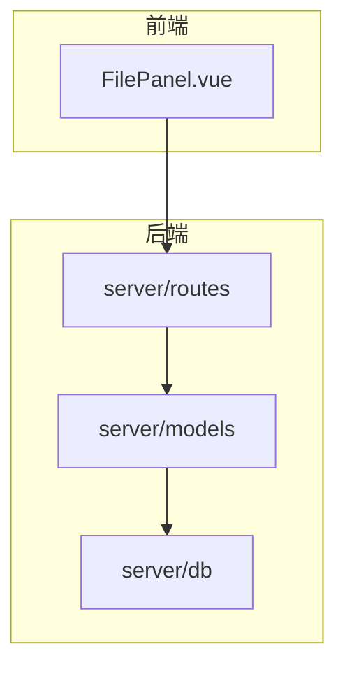
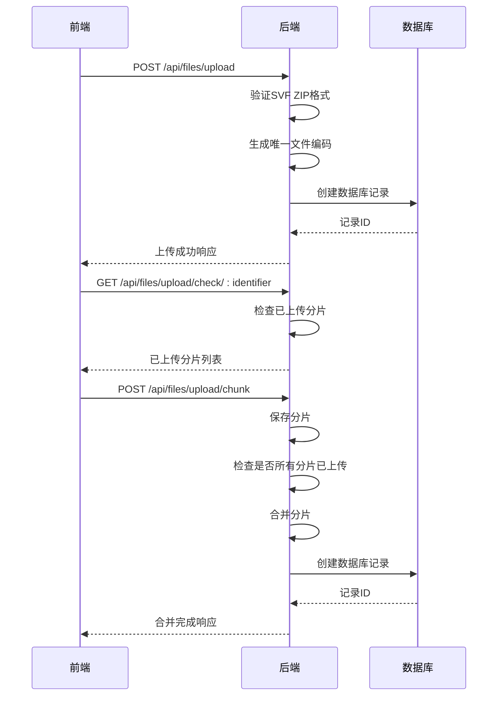
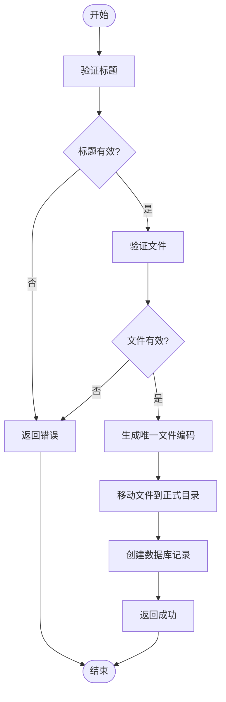
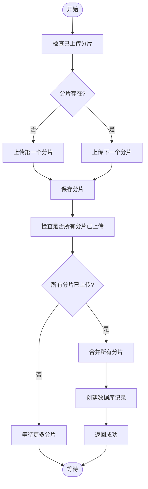
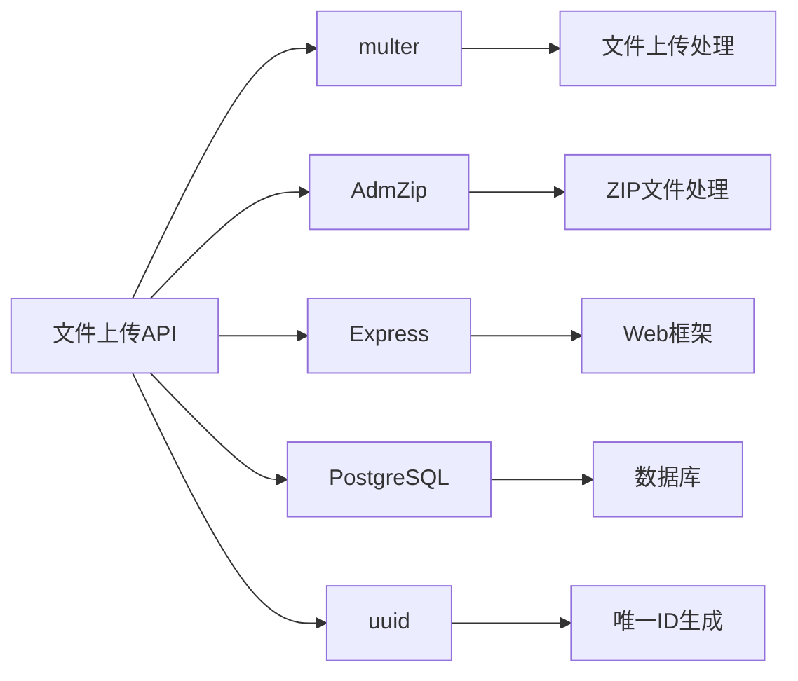

# 文件上传API

<cite>
**本文档引用的文件**
- [files.js](file://server/routes/files.js)
- [model-file.js](file://server/models/model-file.js)
- [api.js](file://server/routes/api.js)
- [index.js](file://server/index.js)
- [schema.sql](file://server/db/schema.sql)
- [FilePanel.vue](file://src/components/FilePanel.vue)
</cite>

## 目录
1. [简介](#简介)
2. [项目结构](#项目结构)
3. [核心组件](#核心组件)
4. [架构概述](#架构概述)
5. [详细组件分析](#详细组件分析)
6. [依赖分析](#依赖分析)
7. [性能考虑](#性能考虑)
8. [故障排除指南](#故障排除指南)
9. [结论](#结论)

## 简介
本文档详细描述了文件上传API的实现，重点介绍模型文件上传和断点续传功能。文档涵盖了POST /api/files/upload接口的实现细节，包括SVF ZIP文件格式验证、唯一文件编码生成和数据库记录创建。同时阐述了断点续传机制：GET /api/files/upload/check/:identifier检查已上传分片，POST /api/files/upload/chunk上传分片并自动合并的实现逻辑。

## 项目结构
项目结构包含前端和后端两个主要部分。后端服务位于server目录，包含路由、模型、数据库脚本等。前端位于src目录，包含Vue组件、服务等。文件上传功能主要涉及后端的routes和models目录，以及前端的FilePanel.vue组件。

**图表来源**
- [FilePanel.vue](file://src/components/FilePanel.vue)
- [files.js](file://server/routes/files.js)
- [model-file.js](file://server/models/model-file.js)
- [schema.sql](file://server/db/schema.sql)

**章节来源**
- [files.js](file://server/routes/files.js)
- [model-file.js](file://server/models/model-file.js)
- [schema.sql](file://server/db/schema.sql)

## 核心组件
文件上传API的核心组件包括文件上传路由、模型文件模型、断点续传机制和前端文件上传面板。这些组件协同工作，实现了完整的文件上传功能。

**章节来源**
- [files.js](file://server/routes/files.js#L1-L436)
- [model-file.js](file://server/models/model-file.js#L1-L179)

## 架构概述
文件上传API采用典型的前后端分离架构。前端通过HTTP请求与后端交互，后端处理文件上传、验证、存储和数据库操作。断点续传功能通过分片上传和合并机制实现。

**图表来源**
- [files.js](file://server/routes/files.js#L68-L223)
- [model-file.js](file://server/models/model-file.js#L10-L14)

**章节来源**
- [files.js](file://server/routes/files.js#L1-L436)

## 详细组件分析
### 文件上传功能分析
文件上传功能实现了SVF ZIP文件的上传、验证和存储。通过multer中间件处理文件上传，AdmZip库验证ZIP格式。

#### 文件上传接口

**图表来源**
- [files.js](file://server/routes/files.js#L72-L116)
- [model-file.js](file://server/models/model-file.js#L10-L14)

### 断点续传功能分析
断点续传功能通过分片上传和合并机制实现，支持大文件的可靠上传。

#### 断点续传流程

**图表来源**
- [files.js](file://server/routes/files.js#L119-L223)
- [model-file.js](file://server/models/model-file.js#L10-L14)

**章节来源**
- [files.js](file://server/routes/files.js#L119-L223)
- [model-file.js](file://server/models/model-file.js#L10-L14)

## 依赖分析
文件上传API依赖于多个外部库和内部模块。主要依赖包括multer（文件上传处理）、AdmZip（ZIP文件处理）、Express（Web框架）和PostgreSQL（数据库）。

**图表来源**
- [files.js](file://server/routes/files.js#L6-L10)
- [model-file.js](file://server/models/model-file.js#L5)
- [package.json](file://package.json)

**章节来源**
- [files.js](file://server/routes/files.js#L6-L10)
- [model-file.js](file://server/models/model-file.js#L5)

## 性能考虑
文件上传API在设计时考虑了性能因素。通过分片上传机制支持大文件上传，避免内存溢出。文件存储采用流式写入，减少内存占用。数据库操作使用参数化查询，提高查询效率。

## 故障排除指南
常见问题包括文件格式错误、上传超时和数据库连接失败。对于文件格式错误，确保上传的文件是有效的SVF ZIP格式。对于上传超时，检查网络连接和服务器配置。对于数据库连接失败，检查数据库服务状态和连接配置。

**章节来源**
- [files.js](file://server/routes/files.js#L113-L115)
- [files.js](file://server/routes/files.js#L220-L222)

## 结论
文件上传API提供了完整的模型文件上传和断点续传功能。通过合理的架构设计和错误处理机制，确保了文件上传的可靠性和稳定性。API设计简洁明了，易于集成和使用。