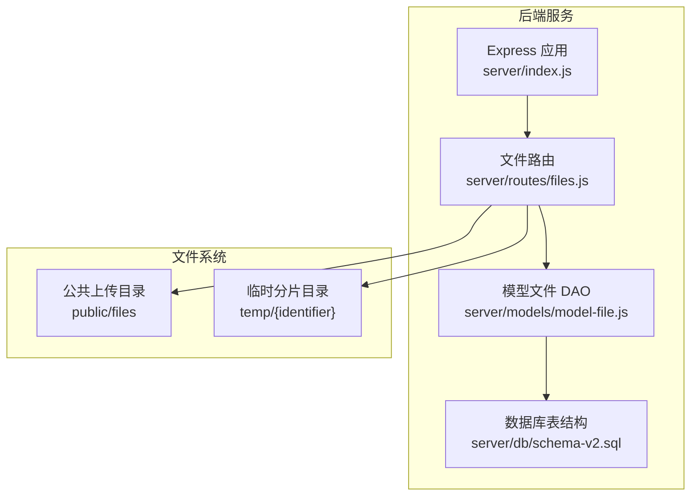
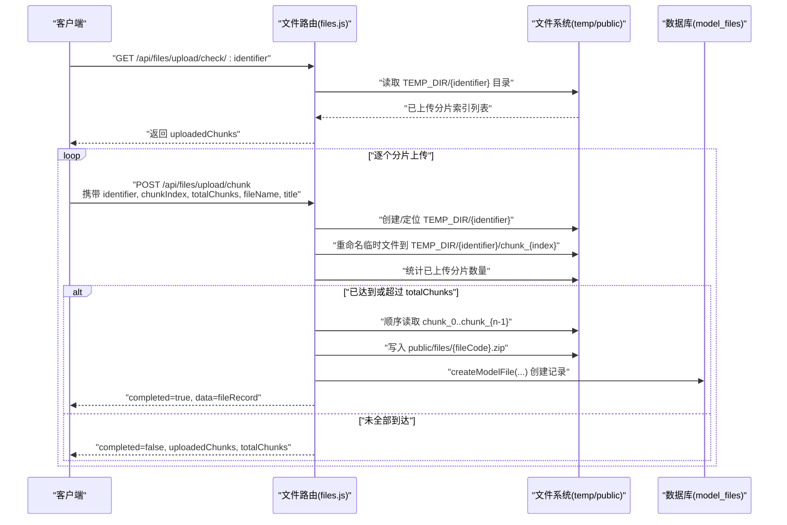
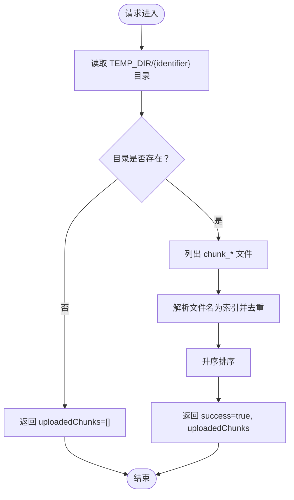
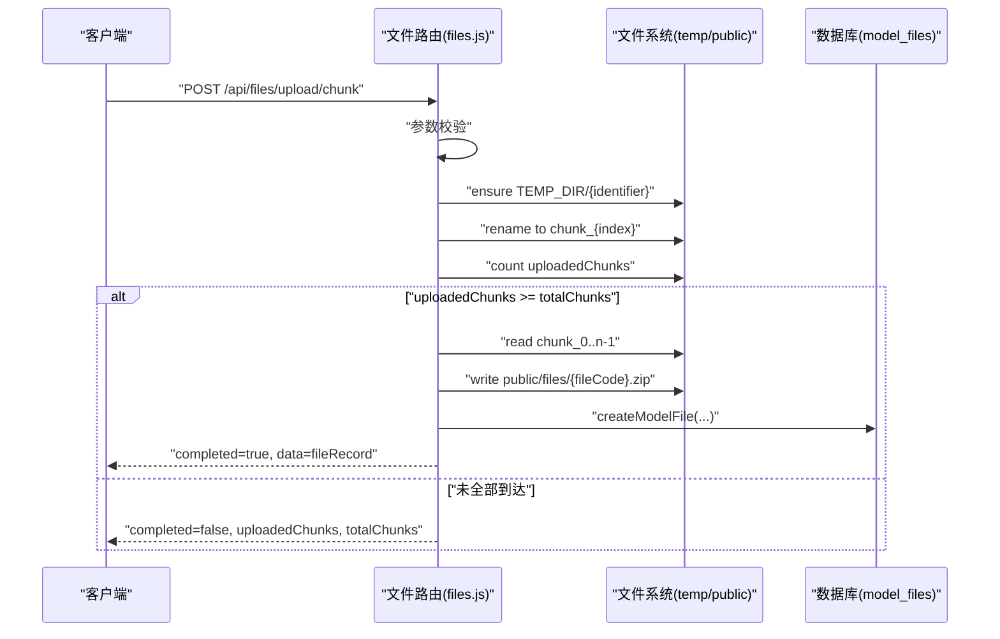
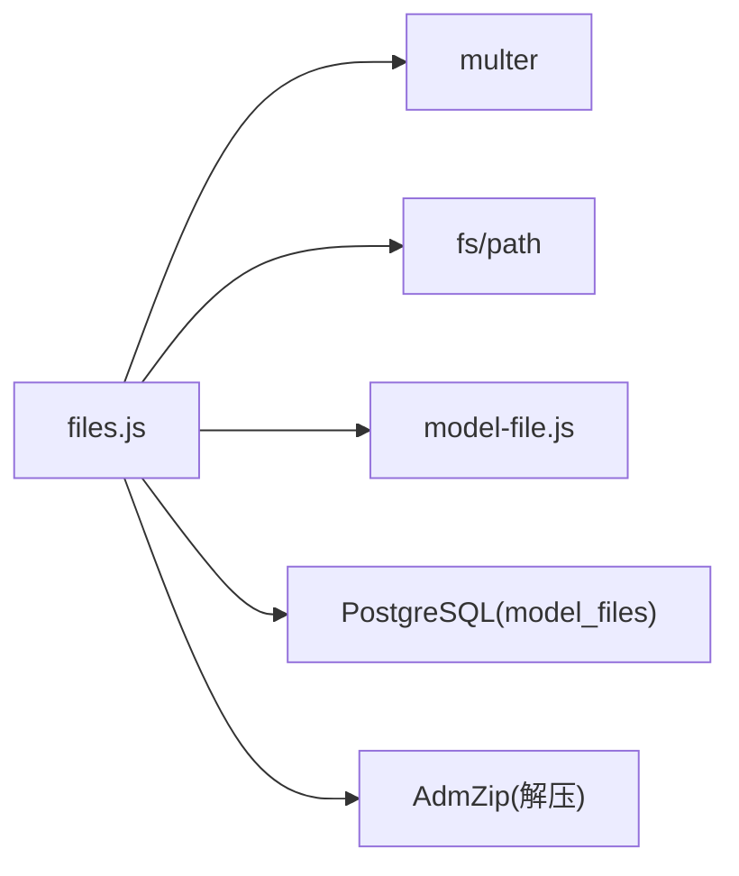

# 断点续传机制

<cite>
**本文引用的文件**
- [server/routes/files.js](file://server/routes/files.js)
- [server/models/model-file.js](file://server/models/model-file.js)
- [server/db/schema-v2.sql](file://server/db/schema-v2.sql)
- [server/index.js](file://server/index.js)
</cite>

## 目录
1. [简介](#简介)
2. [项目结构](#项目结构)
3. [核心组件](#核心组件)
4. [架构总览](#架构总览)
5. [详细组件分析](#详细组件分析)
6. [依赖关系分析](#依赖关系分析)
7. [性能考量](#性能考量)
8. [故障排查指南](#故障排查指南)
9. [结论](#结论)
10. [附录](#附录)

## 简介
本文件面向“断点续传”功能的实现进行深入文档化，覆盖以下关键端点：
- GET /api/files/upload/check/:identifier：查询指定 identifier 的已上传分片列表
- POST /api/files/upload/chunk：上传单个分片，并在全部分片到达后自动合并为完整 ZIP 文件，生成新的 fileCode，更新数据库记录，并清理临时分片目录

文档将详细说明：
- 基于唯一 identifier 的分片管理机制（TEMP_DIR 下的分片目录组织）
- 已上传分片列表的检查与返回
- 分片接收与存储流程
- 全部分片上传完成后的合并逻辑（顺序读取 chunk_0 至 chunk_n，写入最终文件）
- 数据库记录创建与状态更新
- 响应中 completed 标志位的语义
- 错误处理策略（如网络中断后的恢复）
- 前端分片上传的参考实现思路

## 项目结构
断点续传相关代码集中在后端服务的文件路由模块中，配合模型层与数据库表结构共同完成文件上传、分片管理与合并。

图表来源
- [server/index.js](file://server/index.js#L1-L92)
- [server/routes/files.js](file://server/routes/files.js#L1-L120)
- [server/models/model-file.js](file://server/models/model-file.js#L1-L179)
- [server/db/schema-v2.sql](file://server/db/schema-v2.sql#L1-L70)

章节来源
- [server/index.js](file://server/index.js#L1-L92)
- [server/routes/files.js](file://server/routes/files.js#L1-L120)
- [server/db/schema-v2.sql](file://server/db/schema-v2.sql#L1-L70)

## 核心组件
- 文件路由（files.js）：提供断点续传相关接口，负责分片目录创建、分片接收、合并与清理、数据库记录创建
- 模型文件 DAO（model-file.js）：封装 model_files 表的数据库操作，包括生成 fileCode、插入记录、查询等
- 数据库表（schema-v2.sql）：定义 model_files 表结构及索引，支撑文件元数据持久化
- 服务器入口（index.js）：配置中间件、静态资源与路由挂载

章节来源
- [server/routes/files.js](file://server/routes/files.js#L1-L245)
- [server/models/model-file.js](file://server/models/model-file.js#L1-L179)
- [server/db/schema-v2.sql](file://server/db/schema-v2.sql#L1-L70)
- [server/index.js](file://server/index.js#L1-L92)

## 架构总览
断点续传的整体流程如下：
- 客户端发起检查请求，查询 identifier 对应的已上传分片索引集合
- 客户端按顺序上传分片（chunkIndex 从 0 到 totalChunks-1）
- 服务端接收分片并保存至 TEMP_DIR/{identifier}/chunk_{index}
- 当已上传分片数量达到或超过 totalChunks 时，服务端开始合并流程
- 合并完成后，将完整 ZIP 文件移动到 public/files，并创建数据库记录
- 返回 completed=true 的响应；否则返回 completed=false 并报告已上传分片数与总数

图表来源
- [server/routes/files.js](file://server/routes/files.js#L118-L223)
- [server/models/model-file.js](file://server/models/model-file.js#L1-L179)

## 详细组件分析

### 组件A：断点续传检查接口 GET /api/files/upload/check/:identifier
- 功能：根据 identifier 查询该分片目录下已上传的分片索引集合
- 实现要点：
  - 读取 TEMP_DIR/{identifier} 目录
  - 将 chunk_* 文件名解析为分片索引并排序返回
  - 若目录不存在，返回空数组
- 响应字段：
  - success：布尔
  - uploadedChunks：已上传分片索引数组（升序）

图表来源
- [server/routes/files.js](file://server/routes/files.js#L118-L136)

章节来源
- [server/routes/files.js](file://server/routes/files.js#L118-L136)

### 组件B：分片上传接口 POST /api/files/upload/chunk
- 功能：接收单个分片，按 identifier 创建/定位分片目录，保存为 chunk_{index}，并在满足条件时执行合并
- 请求参数：
  - identifier：字符串，唯一标识本次上传任务
  - chunkIndex：整数，当前分片索引（从 0 开始）
  - totalChunks：整数，总分片数
  - fileName：字符串，原始文件名（用于生成最终文件名）
  - title：字符串，文件标题（用于数据库记录）
- 参数校验：
  - 必填项：identifier、chunkIndex、chunk（multipart 字段）
  - 若缺少必要参数，删除临时文件并返回 400
- 分片目录：
  - TEMP_DIR/{identifier}，不存在则创建
- 分片存储：
  - 将上传的临时文件重命名为 TEMP_DIR/{identifier}/chunk_{chunkIndex}
- 合并触发条件：
  - 已上传分片数量 ≥ totalChunks
- 合并流程：
  - 生成新的 fileCode（见模型层）
  - 以 fileName 扩展名为依据确定最终文件扩展名（默认 .zip）
  - 顺序读取 chunk_0..chunk_{totalChunks-1} 并写入 public/files/{fileCode}.zip
  - 获取文件大小 stat
  - 清理 TEMP_DIR/{identifier} 目录
  - 调用 createModelFile(...) 写入数据库记录
  - 返回 completed=true
- 未完成场景：
  - 返回 completed=false，并包含 uploadedChunks、totalChunks

图表来源
- [server/routes/files.js](file://server/routes/files.js#L138-L223)
- [server/models/model-file.js](file://server/models/model-file.js#L1-L179)

章节来源
- [server/routes/files.js](file://server/routes/files.js#L138-L223)

### 组件C：分片目录与临时文件管理
- 目录结构：
  - TEMP_DIR/{identifier}/chunk_{index}
- 生命周期：
  - 接收阶段：临时文件被重命名为对应 chunk_{index}
  - 合并阶段：顺序读取并写入最终文件
  - 清理阶段：删除 TEMP_DIR/{identifier} 目录
- 安全性：
  - 仅允许 ZIP 类型文件上传（通过 multer fileFilter 过滤）
  - 限制单次上传大小（multer limits）

章节来源
- [server/routes/files.js](file://server/routes/files.js#L1-L117)

### 组件D：数据库记录与 fileCode 生成
- fileCode 生成策略：
  - 结合时间戳与 UUID 片段，确保全局唯一性
- model_files 表字段：
  - file_code：唯一编码
  - title：文件标题
  - original_name：原始文件名
  - file_path：最终文件存储路径（public/files/{fileCode}.zip）
  - file_size：文件大小
  - status：状态（默认 uploaded）
  - is_active：是否为当前激活文件
  - extracted_path：解压后路径（用于后续解压流程）
- createModelFile(...)：
  - 插入新记录并返回

章节来源
- [server/models/model-file.js](file://server/models/model-file.js#L1-L179)
- [server/db/schema-v2.sql](file://server/db/schema-v2.sql#L1-L70)

## 依赖关系分析
- 文件路由依赖：
  - 文件系统：读写 TEMP_DIR 与 public/files
  - 模型文件 DAO：生成 fileCode、创建数据库记录
  - 数据库：model_files 表
- 外部依赖：
  - multer：文件上传与过滤
  - fs：文件系统操作
  - path：路径拼接
  - AdmZip：后续解压（与断点续传同属文件管理范畴）

图表来源
- [server/routes/files.js](file://server/routes/files.js#L1-L117)
- [server/models/model-file.js](file://server/models/model-file.js#L1-L179)
- [server/db/schema-v2.sql](file://server/db/schema-v2.sql#L1-L70)

章节来源
- [server/routes/files.js](file://server/routes/files.js#L1-L117)
- [server/models/model-file.js](file://server/models/model-file.js#L1-L179)
- [server/db/schema-v2.sql](file://server/db/schema-v2.sql#L1-L70)

## 性能考量
- 合并策略：
  - 顺序读取并写入，适合大文件但会占用磁盘 IO
  - 建议在高并发场景下控制单次合并任务数量，避免磁盘争用
- 目录扫描：
  - 检查已上传分片时对目录进行 readdir，分片较多时建议限制 totalChunks 或采用更高效的索引方式
- 文件大小限制：
  - multer 限制单次上传大小，避免内存压力
- 并发安全：
  - 通过 identifier 命名空间隔离不同上传任务，避免跨任务干扰
- 清理策略：
  - 合并完成后立即删除临时目录，防止磁盘膨胀

[本节为通用指导，无需特定文件引用]

## 故障排查指南
- 常见错误与处理：
  - 缺少必要参数：返回 400，删除临时文件
  - 目录不存在：检查 identifier 是否正确传递
  - 文件类型不符：仅允许 ZIP 类型，否则拒绝
  - 网络中断后恢复：
    - 客户端在上传前先调用检查接口获取已上传分片列表
    - 仅上传缺失的分片，避免重复写入
  - 合并失败：
    - 检查 TEMP_DIR 权限与磁盘空间
    - 确认 chunk 数量与 totalChunks 一致
    - 查看数据库记录是否创建成功
- 日志与调试：
  - 服务器启动时输出健康检查与路由挂载信息
  - 路由层捕获异常并返回统一错误格式

章节来源
- [server/routes/files.js](file://server/routes/files.js#L118-L223)
- [server/index.js](file://server/index.js#L1-L92)

## 结论
断点续传功能通过唯一 identifier 将分片组织在 TEMP_DIR 下的独立目录中，结合检查接口与分片上传接口实现了可靠的断点续传能力。当全部分片到达后，服务端顺序合并为完整 ZIP 文件并创建数据库记录，最后清理临时目录。该设计具备良好的可恢复性与可维护性，适合在大文件上传场景中应用。

[本节为总结，无需特定文件引用]

## 附录

### 请求参数与校验规则
- GET /api/files/upload/check/:identifier
  - 路径参数：identifier（必填）
  - 响应：success、uploadedChunks（数组，升序）
- POST /api/files/upload/chunk
  - 表单字段：identifier（必填）、chunkIndex（必填）、totalChunks（必填）、fileName（必填）、title（可选）
  - multipart 字段：chunk（必填）
  - 校验：
    - 缺少任一必填项或未上传 chunk，返回 400 并删除临时文件
    - 仅允许 ZIP 类型文件
    - 单次上传大小受限制

章节来源
- [server/routes/files.js](file://server/routes/files.js#L118-L223)

### 响应中 completed 标志位语义
- completed=false：表示尚未全部分片到达，返回 uploadedChunks 与 totalChunks，客户端据此决定继续上传哪些分片
- completed=true：表示全部分片已到达并完成合并，返回 data（数据库记录），客户端可继续后续流程（如解压、激活）

章节来源
- [server/routes/files.js](file://server/routes/files.js#L162-L223)

### 前端分片上传参考实现思路
- 计算分片大小与数量：
  - 根据文件总大小与网络状况设定分片大小（如 10–50MB）
  - totalChunks = ceil(totalSize / chunkSize)
- 生成 identifier：
  - 使用随机字符串或基于文件内容的哈希作为 identifier
- 上传流程：
  - 先调用检查接口获取已上传分片列表
  - 仅上传缺失的分片（chunkIndex 属于 [0, totalChunks-1] 且不在已上传列表中）
  - 逐个发送 POST /api/files/upload/chunk，携带 identifier、chunkIndex、totalChunks、fileName、title
  - 监听 completed=true 时继续后续步骤
- 错误与重试：
  - 对单个分片失败进行重试，失败次数超过阈值则终止并提示用户
  - 使用断线重连策略，恢复后继续上传缺失分片

[本节为概念性指导，无需特定文件引用]