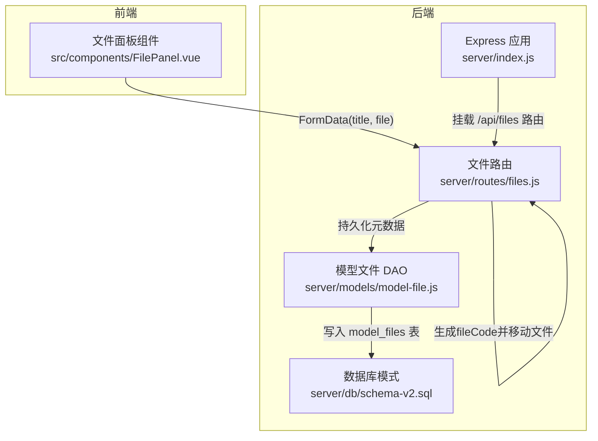
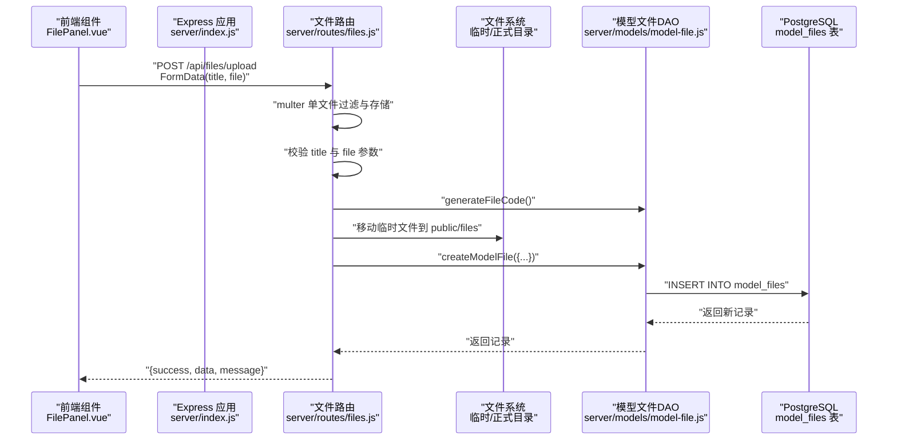
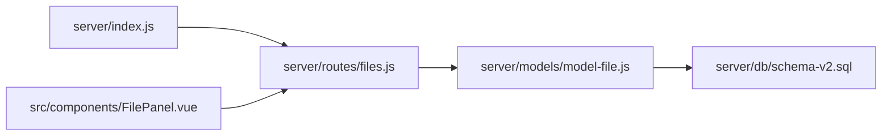

# 模型文件上传

<cite>
**本文引用的文件**
- [server/index.js](file://server/index.js)
- [server/routes/files.js](file://server/routes/files.js)
- [server/models/model-file.js](file://server/models/model-file.js)
- [server/db/schema-v2.sql](file://server/db/schema-v2.sql)
- [src/components/FilePanel.vue](file://src/components/FilePanel.vue)
</cite>

## 目录
1. [简介](#简介)
2. [项目结构](#项目结构)
3. [核心组件](#核心组件)
4. [架构总览](#架构总览)
5. [详细组件分析](#详细组件分析)
6. [依赖分析](#依赖分析)
7. [性能考量](#性能考量)
8. [故障排查指南](#故障排查指南)
9. [结论](#结论)
10. [附录](#附录)

## 简介
本文件围绕 POST /api/files/upload 接口，系统性说明模型文件上传的实现机制与流程。重点涵盖：
- 使用 multer 处理文件上传、过滤 SVF ZIP 格式、限制大小
- 生成唯一 fileCode 并将文件从临时目录移动到正式存储路径
- 在上传完成后创建数据库记录（modelFileModel.createModelFile），持久化标题、原始文件名、文件大小、存储路径等元数据
- 错误处理策略（如缺少标题或文件时返回 400）
- curl 示例演示完整上传流程
- 文件存储目录 public/files 的组织方式与安全注意事项

## 项目结构
该功能涉及后端路由、模型层、数据库模式以及前端交互组件的协同工作。



图表来源
- [server/index.js](file://server/index.js#L44-L49)
- [server/routes/files.js](file://server/routes/files.js#L22-L32)
- [server/models/model-file.js](file://server/models/model-file.js#L19-L35)
- [server/db/schema-v2.sql](file://server/db/schema-v2.sql#L7-L20)
- [src/components/FilePanel.vue](file://src/components/FilePanel.vue#L351-L395)

章节来源
- [server/index.js](file://server/index.js#L44-L49)
- [server/routes/files.js](file://server/routes/files.js#L22-L32)

## 核心组件
- Express 应用与路由挂载：后端应用在启动时挂载 /api/files 路由，使上传接口可被访问。
- 文件上传路由：负责接收 multipart/form-data，使用 multer 进行过滤与存储，执行业务流程（生成 fileCode、移动文件、创建数据库记录）。
- 模型文件 DAO：封装对 model_files 表的数据库操作，包括生成唯一编码、创建记录、查询与更新。
- 数据库模式：定义 model_files 表结构及索引，确保文件元数据的持久化与检索效率。
- 前端组件：提供拖拽选择、表单提交、进度反馈，最终以 FormData 形式调用 /api/files/upload。

章节来源
- [server/index.js](file://server/index.js#L44-L49)
- [server/routes/files.js](file://server/routes/files.js#L46-L62)
- [server/models/model-file.js](file://server/models/model-file.js#L19-L35)
- [server/db/schema-v2.sql](file://server/db/schema-v2.sql#L7-L20)
- [src/components/FilePanel.vue](file://src/components/FilePanel.vue#L351-L395)

## 架构总览
POST /api/files/upload 的端到端流程如下：



图表来源
- [server/index.js](file://server/index.js#L44-L49)
- [server/routes/files.js](file://server/routes/files.js#L46-L62)
- [server/routes/files.js](file://server/routes/files.js#L72-L116)
- [server/models/model-file.js](file://server/models/model-file.js#L19-L35)
- [server/db/schema-v2.sql](file://server/db/schema-v2.sql#L7-L20)

## 详细组件分析

### 上传接口：POST /api/files/upload
- 请求方法与路径：POST /api/files/upload
- 内容类型：multipart/form-data
- 必填参数：
  - title：字符串，文件标题（用于展示与后续检索）
  - file：二进制文件，SVF ZIP 格式（.zip 或 .svfzip）
- 可选参数：无
- 成功响应结构：
  - success：布尔值，true 表示成功
  - data：对象，包含刚创建的 model_files 记录（含 file_code、title、original_name、file_path、file_size、status 等）
  - message：字符串，提示信息
- 错误响应结构：
  - success：布尔值，false
  - error：字符串，错误原因
- 业务流程要点：
  - 参数校验：若缺少 title 或 file，立即返回 400
  - 文件过滤：仅允许 application/zip、application/x-zip-compressed 或以 .zip/.svfzip 结尾的文件
  - 生成唯一编码：调用 modelFileModel.generateFileCode()
  - 移动文件：将临时文件从临时目录移动到 public/files 目录
  - 创建记录：调用 modelFileModel.createModelFile()，持久化标题、原始文件名、文件大小、存储路径与状态
  - 返回结果：返回 { success: true, data, message }

章节来源
- [server/routes/files.js](file://server/routes/files.js#L46-L62)
- [server/routes/files.js](file://server/routes/files.js#L72-L116)
- [server/models/model-file.js](file://server/models/model-file.js#L19-L35)

### multer 配置与文件过滤
- 存储策略：使用磁盘存储，destination 指向临时目录，filename 生成随机临时文件名
- 文件过滤：仅允许 zip 或 svfzip 类型，防止非目标格式上传
- 大小限制：最大 500MB
- 临时目录：用于接收上传的原始文件，随后移动至正式存储

章节来源
- [server/routes/files.js](file://server/routes/files.js#L22-L32)
- [server/routes/files.js](file://server/routes/files.js#L35-L62)

### 唯一编码生成与文件移动
- 唯一编码：modelFileModel.generateFileCode() 生成 fileCode，作为文件在存储中的稳定标识
- 存储路径：public/files 下以 fileCode.zip 或 fileCode.svfzip 命名
- 移动操作：将临时文件从临时目录重命名为正式文件，避免跨分区复制带来的性能问题

章节来源
- [server/models/model-file.js](file://server/models/model-file.js#L10-L14)
- [server/routes/files.js](file://server/routes/files.js#L87-L95)

### 数据库记录创建：modelFileModel.createModelFile
- 字段映射：
  - file_code：唯一编码
  - title：请求体中的标题
  - original_name：原始文件名
  - file_path：相对路径 /files/{fileCode}.(zip|svfzip)
  - file_size：文件大小（字节）
  - status：默认 uploaded
- 返回值：新插入的 model_files 记录

章节来源
- [server/models/model-file.js](file://server/models/model-file.js#L19-L35)
- [server/db/schema-v2.sql](file://server/db/schema-v2.sql#L7-L20)

### 前端交互与上传流程
- 前端通过 FormData 传递 title 与 file
- 使用 XMLHttpRequest 发送请求，支持进度回调
- 成功后刷新文件列表，失败弹出错误提示

章节来源
- [src/components/FilePanel.vue](file://src/components/FilePanel.vue#L351-L395)

## 依赖分析
- 路由依赖：/api/files 路由由 server/index.js 挂载，上传接口位于 server/routes/files.js
- 模块依赖：files.js 依赖 model-file.js 进行数据库操作；model-file.js 依赖数据库连接工具进行查询
- 文件系统依赖：临时目录与正式存储目录的创建与维护
- 数据库依赖：model_files 表结构定义了字段与约束



图表来源
- [server/index.js](file://server/index.js#L44-L49)
- [server/routes/files.js](file://server/routes/files.js#L1-L16)
- [server/models/model-file.js](file://server/models/model-file.js#L1-L10)
- [server/db/schema-v2.sql](file://server/db/schema-v2.sql#L7-L20)
- [src/components/FilePanel.vue](file://src/components/FilePanel.vue#L351-L395)

章节来源
- [server/index.js](file://server/index.js#L44-L49)
- [server/routes/files.js](file://server/routes/files.js#L1-L16)
- [server/models/model-file.js](file://server/models/model-file.js#L1-L10)
- [server/db/schema-v2.sql](file://server/db/schema-v2.sql#L7-L20)
- [src/components/FilePanel.vue](file://src/components/FilePanel.vue#L351-L395)

## 性能考量
- 临时文件到正式文件的移动采用 fs.renameSync，避免大文件复制，减少 IO 开销
- 文件过滤与大小限制在上传阶段即拦截，降低数据库压力
- 建议：
  - 对于超大文件，优先使用断点续传接口（/api/files/upload/chunk），避免单次传输失败导致重传成本过高
  - 合理设置客户端超时与重试策略，提升用户体验

[本节为通用建议，无需特定文件来源]

## 故障排查指南
- 缺少标题或文件
  - 现象：返回 400，error 包含“请提供文件标题”或“请选择要上传的文件”
  - 处理：确认前端 FormData 中包含 title 与 file 字段
- 文件类型不被允许
  - 现象：multer 抛出错误，阻止上传
  - 处理：确保文件扩展名为 .zip 或 .svfzip，或 MIME 类型为 zip
- 服务器内部错误
  - 现象：返回 500，error 包含具体异常信息
  - 处理：查看后端日志定位异常；检查临时目录与正式目录权限、磁盘空间

章节来源
- [server/routes/files.js](file://server/routes/files.js#L72-L116)

## 结论
POST /api/files/upload 接口通过 multer 实现严格的文件过滤与大小限制，结合唯一编码生成与文件移动，最终将文件元数据持久化到 model_files 表。该流程简洁可靠，配合前端交互与错误处理，能够满足模型文件上传的常见需求。对于超大文件，建议结合断点续传接口以获得更佳的稳定性与性能。

[本节为总结，无需特定文件来源]

## 附录

### 请求参数与响应结构
- 请求参数
  - title：字符串，必填
  - file：二进制文件，必填（SVF ZIP）
- 成功响应
  - success：true
  - data：model_files 记录
  - message：字符串
- 失败响应
  - success：false
  - error：字符串

章节来源
- [server/routes/files.js](file://server/routes/files.js#L72-L116)
- [server/models/model-file.js](file://server/models/model-file.js#L19-L35)

### curl 示例
以下示例展示如何使用 curl 完整上传一个 SVF ZIP 文件：
- 将本地文件替换为实际路径
- 确保 title 与 file 字段正确传递

```bash
curl -X POST http://localhost:3001/api/files/upload \
  -H "Content-Type: multipart/form-data" \
  -F "title=我的建筑模型" \
  -F "file=@/path/to/your/model.svfzip"
```

章节来源
- [server/index.js](file://server/index.js#L23-L31)
- [server/routes/files.js](file://server/routes/files.js#L46-L62)
- [src/components/FilePanel.vue](file://src/components/FilePanel.vue#L351-L395)

### 文件存储目录与安全
- 存储位置
  - 临时目录：用于接收上传的原始文件
  - 正式目录：public/files，文件以 fileCode.(zip|svfzip) 命名
- 安全建议
  - 仅允许 .zip 与 .svfzip 类型，避免任意文件写入
  - 限制文件大小，防止磁盘耗尽
  - 严格控制 public/files 的读取权限，避免直接暴露敏感路径
  - 对上传文件进行病毒扫描与内容校验（建议在生产环境实施）

章节来源
- [server/routes/files.js](file://server/routes/files.js#L22-L32)
- [server/routes/files.js](file://server/routes/files.js#L87-L95)
- [server/db/schema-v2.sql](file://server/db/schema-v2.sql#L7-L20)