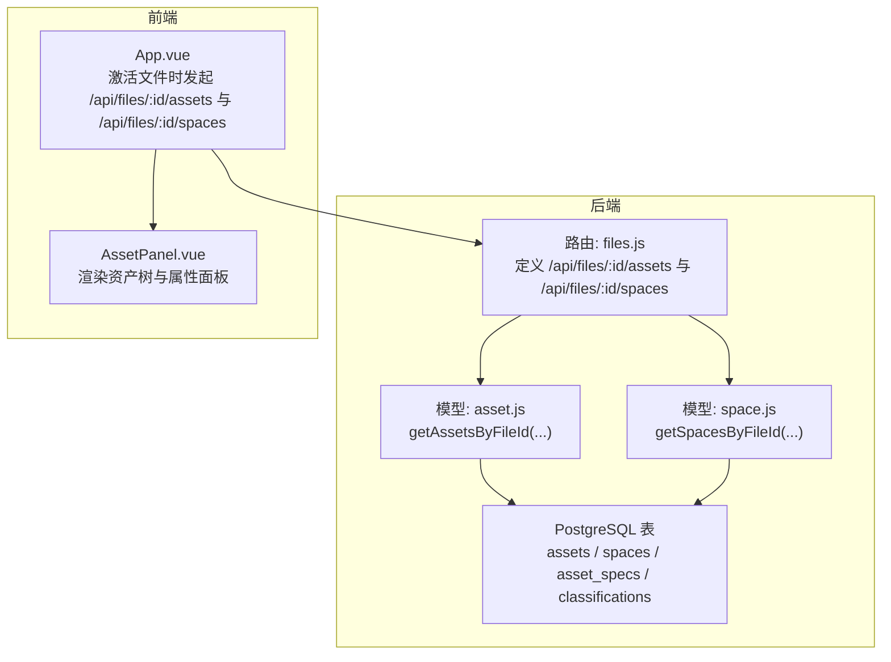
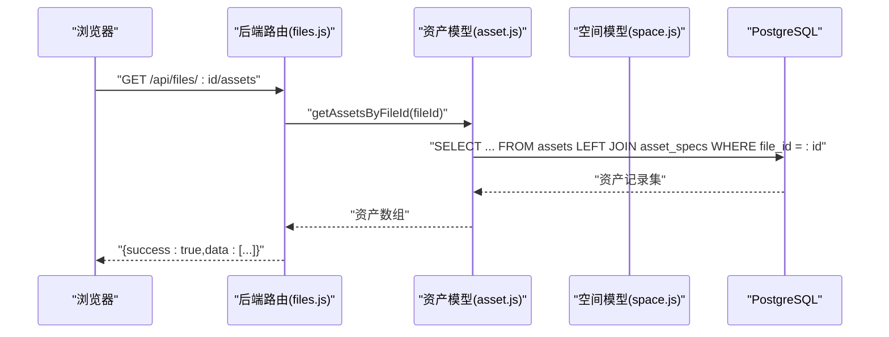
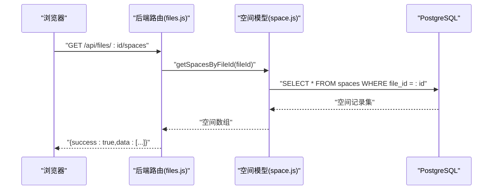
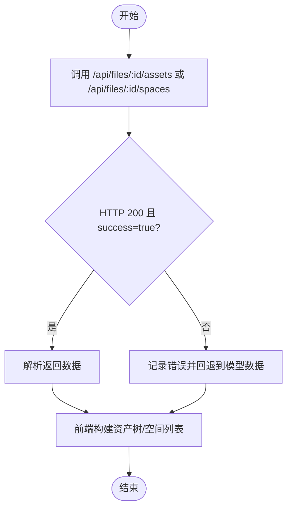
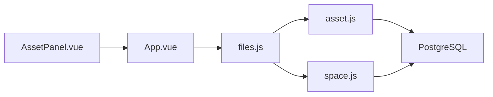

# 文件关联数据查询API

<cite>
**本文引用的文件**
- [server/routes/files.js](file://server/routes/files.js)
- [server/models/asset.js](file://server/models/asset.js)
- [server/models/space.js](file://server/models/space.js)
- [server/db/schema.sql](file://server/db/schema.sql)
- [src\App.vue](file://src\App.vue)
- [src\components\AssetPanel.vue](file://src\components\AssetPanel.vue)
</cite>

## 目录
1. [简介](#简介)
2. [项目结构](#项目结构)
3. [核心组件](#核心组件)
4. [架构总览](#架构总览)
5. [详细组件分析](#详细组件分析)
6. [依赖分析](#依赖分析)
7. [性能考虑](#性能考虑)
8. [故障排查指南](#故障排查指南)
9. [结论](#结论)
10. [附录](#附录)

## 简介
本文档聚焦于“文件关联数据查询API”，围绕以下两个端点进行深入说明：
- GET /api/files/:id/assets：根据文件ID查询该文件关联的资产集合
- GET /api/files/:id/spaces：根据文件ID查询该文件关联的空间集合

文档内容涵盖：
- 端点实现与调用链路
- 数据检索过程（路由层到模型层）
- 返回数据结构与字段说明
- curl 示例与常见使用方式
- 前端如何消费这些数据构建模型树状结构与属性面板
- 外键关联关系与查询失败的错误处理机制

## 项目结构
后端采用 Express 路由 + 数据访问对象（DAO）模式，数据库为 PostgreSQL，表结构支持按文件维度隔离资产与空间数据。前端通过 App.vue 在激活文件时主动拉取该文件的资产与空间数据，用于构建左侧资产树与属性面板。

**图表来源**
- [server/routes/files.js](file://server/routes/files.js#L407-L433)
- [server/models/asset.js](file://server/models/asset.js#L144-L160)
- [server/models/space.js](file://server/models/space.js#L117-L124)
- [server/db/schema.sql](file://server/db/schema.sql#L38-L70)
- [src\App.vue](file://src\App.vue#L387-L435)
- [src\components\AssetPanel.vue](file://src\components\AssetPanel.vue#L1-L120)

**章节来源**
- [server/routes/files.js](file://server/routes/files.js#L407-L433)
- [server/models/asset.js](file://server/models/asset.js#L144-L160)
- [server/models/space.js](file://server/models/space.js#L117-L124)
- [server/db/schema.sql](file://server/db/schema.sql#L38-L70)
- [src\App.vue](file://src\App.vue#L387-L435)
- [src\components\AssetPanel.vue](file://src\components\AssetPanel.vue#L1-L120)

## 核心组件
- 路由层（files.js）
  - 定义 GET /api/files/:id/assets 与 GET /api/files/:id/spaces
  - 调用 assetModel.getAssetsByFileId() 与 spaceModel.getSpacesByFileId()
  - 统一返回 { success: true, data: [...] } 结构，异常时返回 { success: false, error: "..." }

- 模型层（asset.js / space.js）
  - asset.js：getAssetsByFileId(fileId) 查询资产表并左连接资产规格表（按 file_id 过滤）
  - space.js：getSpacesByFileId(fileId) 查询空间表（按 file_id 过滤）

- 数据库层（schema.sql）
  - assets、spaces、asset_specs、classifications 表均包含 file_id 字段，并建立对 model_files 的外键级联删除
  - 资产与空间的唯一性约束为 (file_id, asset_code) 与 (file_id, space_code)，避免同一文件内的重复

- 前端消费（App.vue / AssetPanel.vue）
  - App.vue 在激活文件或页面刷新时，优先拉取该文件的资产与空间数据，构建资产树与属性面板
  - AssetPanel.vue 将资产数据按分类编码分组，形成树状结构，支持搜索与多选

**章节来源**
- [server/routes/files.js](file://server/routes/files.js#L407-L433)
- [server/models/asset.js](file://server/models/asset.js#L144-L160)
- [server/models/space.js](file://server/models/space.js#L117-L124)
- [server/db/schema.sql](file://server/db/schema.sql#L38-L70)
- [src\App.vue](file://src\App.vue#L387-L435)
- [src\components\AssetPanel.vue](file://src\components\AssetPanel.vue#L120-L200)

## 架构总览
下图展示了从浏览器到数据库的完整调用链路，以及数据在前端的使用方式。

**图表来源**
- [server/routes/files.js](file://server/routes/files.js#L407-L419)
- [server/models/asset.js](file://server/models/asset.js#L144-L160)

**图表来源**
- [server/routes/files.js](file://server/routes/files.js#L421-L433)
- [server/models/space.js](file://server/models/space.js#L117-L124)

## 详细组件分析

### 端点：GET /api/files/:id/assets
- 路由定义与实现
  - 路由：GET /api/files/:id/assets
  - 实现：调用 assetModel.getAssetsByFileId(fileId)，返回 { success: true, data: assets }

- 数据检索过程
  - SQL 查询：从资产表左连接资产规格表，按 file_id 过滤，返回资产与规格字段
  - 返回数据：资产数组，每条资产包含资产基础字段与规格字段

- 错误处理
  - 捕获异常并返回 { success: false, error: "..." }，HTTP 状态码为 500

- curl 示例
  - curl -i http://localhost:3001/api/files/{fileId}/assets

- 前端使用场景
  - App.vue 在激活文件或页面刷新时，优先拉取该文件的资产数据，构建资产树与属性面板
  - AssetPanel.vue 将资产按分类编码分组，支持搜索与多选

**章节来源**
- [server/routes/files.js](file://server/routes/files.js#L407-L419)
- [server/models/asset.js](file://server/models/asset.js#L144-L160)
- [src\App.vue](file://src\App.vue#L387-L435)
- [src\components\AssetPanel.vue](file://src\components\AssetPanel.vue#L120-L200)

### 端点：GET /api/files/:id/spaces
- 路由定义与实现
  - 路由：GET /api/files/:id/spaces
  - 实现：调用 spaceModel.getSpacesByFileId(fileId)，返回 { success: true, data: spaces }

- 数据检索过程
  - SQL 查询：从空间表按 file_id 过滤，返回空间数组

- 错误处理
  - 捕获异常并返回 { success: false, error: "..." }，HTTP 状态码为 500

- curl 示例
  - curl -i http://localhost:3001/api/files/{fileId}/spaces

- 前端使用场景
  - App.vue 在激活文件或页面刷新时，拉取该文件的空间数据，构建右侧空间列表与属性面板

**章节来源**
- [server/routes/files.js](file://server/routes/files.js#L421-L433)
- [server/models/space.js](file://server/models/space.js#L117-L124)
- [src\App.vue](file://src\App.vue#L588-L610)

### 返回数据结构与字段说明
- 资产（assets）字段
  - 基础字段：asset_code、name、floor、room、db_id、spec_code 等
  - 规格字段：spec_name、classification_code、classification_desc、category、family、type、manufacturer、address、phone
  - 关联：通过 file_id 与 model_files 关联，左连接 asset_specs（按 file_id 过滤）

- 空间（spaces）字段
  - 基础字段：space_code、name、classification_code、classification_desc、floor、area、perimeter、db_id
  - 关联：通过 file_id 与 model_files 关联

- 唯一性与外键
  - 资产唯一性：(file_id, asset_code)
  - 空间唯一性：(file_id, space_code)
  - 外键：assets.file_id、spaces.file_id、asset_specs.file_id、classifications.file_id 引用 model_files(id)，ON DELETE CASCADE

**章节来源**
- [server/models/asset.js](file://server/models/asset.js#L144-L160)
- [server/models/space.js](file://server/models/space.js#L117-L124)
- [server/db/schema.sql](file://server/db/schema.sql#L38-L70)

### 外键关联关系与查询失败处理
- 外键关系
  - assets.file_id → model_files(id)（ON DELETE CASCADE）
  - spaces.file_id → model_files(id)（ON DELETE CASCADE）
  - asset_specs.file_id → model_files(id)（ON DELETE CASCADE）
  - classifications.file_id → model_files(id)（ON DELETE CASCADE）

- 查询失败处理
  - 路由层捕获异常，统一返回 { success: false, error: "..." }，HTTP 500
  - 前端在 App.vue 中对数据库数据加载失败时回退到模型数据，避免界面空白

**图表来源**
- [server/routes/files.js](file://server/routes/files.js#L407-L433)
- [src\App.vue](file://src\App.vue#L387-L435)

**章节来源**
- [server/db/schema.sql](file://server/db/schema.sql#L38-L70)
- [server/routes/files.js](file://server/routes/files.js#L407-L433)
- [src\App.vue](file://src\App.vue#L387-L435)

## 依赖分析
- 组件耦合
  - 路由层仅负责参数校验与调用模型层，职责单一
  - 模型层封装 SQL 查询，便于复用与测试
  - 前端通过 App.vue 统一拉取数据，减少分散调用

- 外部依赖
  - PostgreSQL：存储资产、空间、规格与分类数据
  - Express：提供 REST API

**图表来源**
- [server/routes/files.js](file://server/routes/files.js#L407-L433)
- [server/models/asset.js](file://server/models/asset.js#L144-L160)
- [server/models/space.js](file://server/models/space.js#L117-L124)
- [src\App.vue](file://src\App.vue#L387-L435)
- [src\components\AssetPanel.vue](file://src\components\AssetPanel.vue#L1-L120)

**章节来源**
- [server/routes/files.js](file://server/routes/files.js#L407-L433)
- [server/models/asset.js](file://server/models/asset.js#L144-L160)
- [server/models/space.js](file://server/models/space.js#L117-L124)
- [src\App.vue](file://src\App.vue#L387-L435)
- [src\components\AssetPanel.vue](file://src\components\AssetPanel.vue#L1-L120)

## 性能考虑
- 索引与唯一性
  - 资产与空间表均按 file_id 建立索引，加速按文件过滤
  - 唯一性约束为 (file_id, code)，避免重复并提升查询稳定性

- 批量导入与事务
  - 资产与空间的批量导入采用事务，保证一致性
  - 导入流程中先清理旧数据，再批量写入，减少冲突

- 前端缓存策略
  - App.vue 在激活文件时优先使用数据库数据，避免 Viewer 数据覆盖
  - 若数据库数据加载失败，回退到模型数据，保证可用性

**章节来源**
- [server/db/schema.sql](file://server/db/schema.sql#L72-L96)
- [server/models/asset.js](file://server/models/asset.js#L160-L200)
- [server/models/space.js](file://server/models/space.js#L126-L168)
- [src\App.vue](file://src\App.vue#L387-L435)

## 故障排查指南
- 常见问题
  - 文件ID无效或不存在：路由层返回 { success: false, error: "..." }，前端应提示用户选择有效文件
  - 数据库连接异常：模型层抛出异常，路由层捕获并返回 500
  - 查询超时：检查索引与唯一性约束是否生效，确认 file_id 是否正确

- 前端回退机制
  - 当数据库资产/空间数据加载失败时，App.vue 会回退到模型数据，确保界面正常显示

- 排查步骤
  - 使用 curl 验证端点返回
  - 检查数据库中 assets/spaces 是否存在对应 file_id 记录
  - 查看后端日志中的错误堆栈

**章节来源**
- [server/routes/files.js](file://server/routes/files.js#L407-L433)
- [src\App.vue](file://src\App.vue#L387-L435)

## 结论
- GET /api/files/:id/assets 与 GET /api/files/:id/spaces 通过明确的路由与模型层实现，返回按文件维度隔离的资产与空间数据
- 前端在激活文件时优先使用数据库数据构建模型树与属性面板，具备良好的可用性与一致性
- 外键与唯一性约束保障了数据完整性，配合索引提升了查询性能
- 错误处理与回退机制确保系统在异常情况下仍可稳定运行

## 附录

### curl 命令示例
- 获取资产
  - curl -i http://localhost:3001/api/files/{fileId}/assets
- 获取空间
  - curl -i http://localhost:3001/api/files/{fileId}/spaces

### 前端使用场景补充
- 资产树构建
  - App.vue 将资产按分类编码分组，AssetPanel.vue 支持搜索与多选
- 属性面板
  - 选中资产或空间后，前端可联动展示属性详情

**章节来源**
- [src\App.vue](file://src\App.vue#L387-L435)
- [src\components\AssetPanel.vue](file://src\components\AssetPanel.vue#L120-L200)