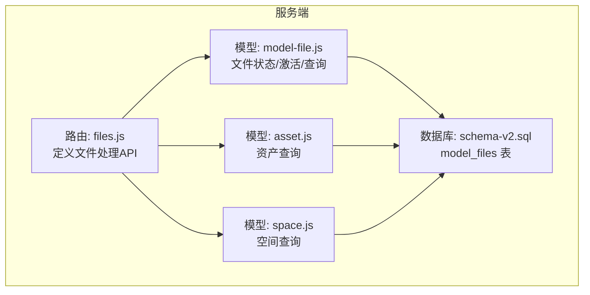
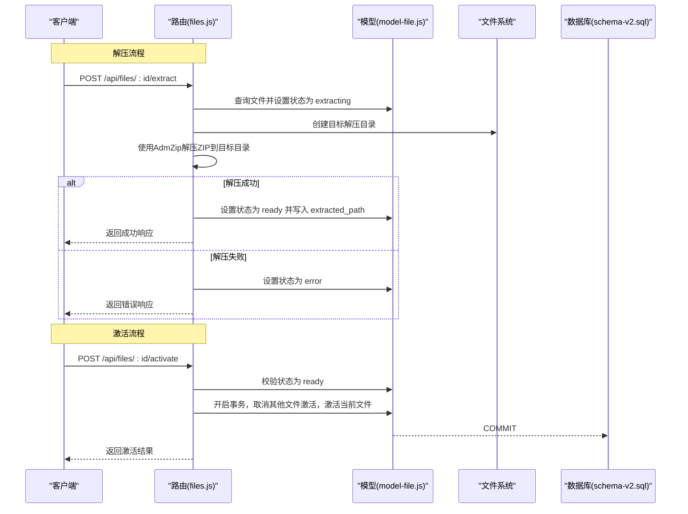
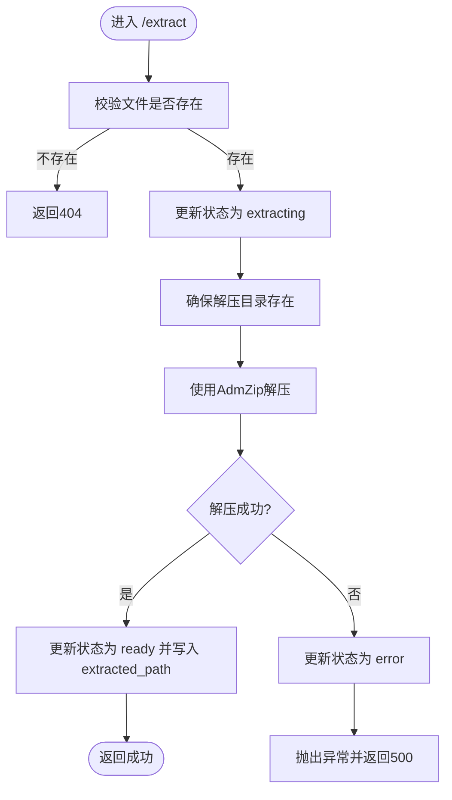
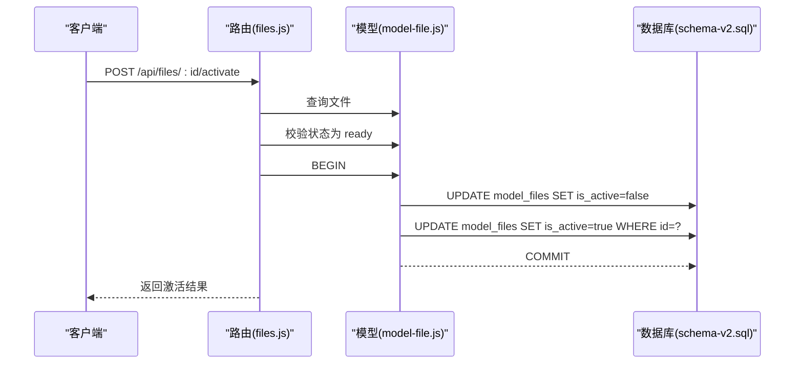
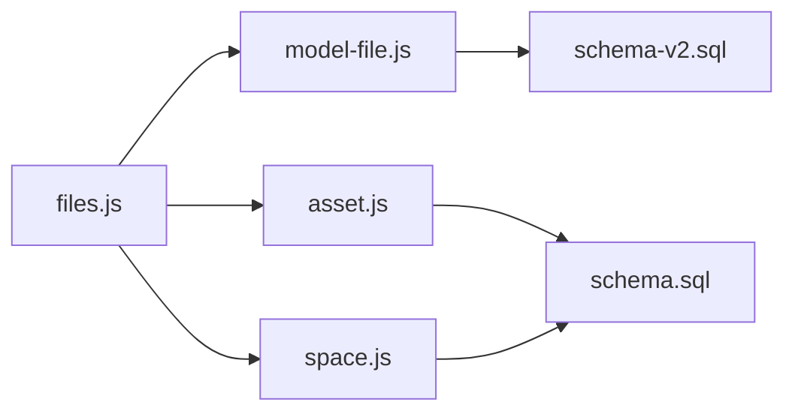

# 文件处理API

<cite>
**本文引用的文件**
- [server/routes/files.js](file://server/routes/files.js)
- [server/models/model-file.js](file://server/models/model-file.js)
- [server/models/asset.js](file://server/models/asset.js)
- [server/models/space.js](file://server/models/space.js)
- [server/db/schema-v2.sql](file://server/db/schema-v2.sql)
- [server/db/schema.sql](file://server/db/schema.sql)
</cite>

## 目录
1. [简介](#简介)
2. [项目结构](#项目结构)
3. [核心组件](#核心组件)
4. [架构总览](#架构总览)
5. [详细组件分析](#详细组件分析)
6. [依赖分析](#依赖分析)
7. [性能考虑](#性能考虑)
8. [故障排查指南](#故障排查指南)
9. [结论](#结论)
10. [附录](#附录)

## 简介
本文件处理API围绕“模型文件”的上传、解压与激活流程展开，重点覆盖以下端点：
- POST /api/files/:id/extract：将ZIP/SVF ZIP文件解压至 /public/models/my-building/<file_code>/ 目录，并更新数据库状态与解压路径
- POST /api/files/:id/activate：在文件处于“就绪”状态时将其设为当前激活文件（同时取消其他文件的激活状态）
- GET /api/files/:id/assets：返回与该文件关联的资产数据
- GET /api/files/:id/spaces：返回与该文件关联的空间数据

文档将结合代码实现，说明AdmZip解压库的使用、目录创建策略、状态机流转、异常处理与回滚机制，并提供curl调用示例与常见问题排查建议。

## 项目结构
文件处理API位于服务端路由层，核心文件如下：
- 路由层：server/routes/files.js
- 数据访问层：server/models/model-file.js、server/models/asset.js、server/models/space.js
- 数据库模式：server/db/schema-v2.sql（新增模型文件表）、server/db/schema.sql（历史模式）

图表来源
- [server/routes/files.js](file://server/routes/files.js#L333-L433)
- [server/models/model-file.js](file://server/models/model-file.js#L76-L127)
- [server/models/asset.js](file://server/models/asset.js#L144-L160)
- [server/models/space.js](file://server/models/space.js#L117-L124)
- [server/db/schema-v2.sql](file://server/db/schema-v2.sql#L1-L40)

章节来源
- [server/routes/files.js](file://server/routes/files.js#L1-L120)
- [server/db/schema-v2.sql](file://server/db/schema-v2.sql#L1-L40)

## 核心组件
- 文件路由（files.js）：负责接收HTTP请求、校验参数、调用模型层、返回标准化响应
- 模型文件DAO（model-file.js）：封装对 model_files 表的CRUD与状态变更，提供激活事务
- 资产DAO（asset.js）：提供按文件ID查询资产列表的能力
- 空间DAO（space.js）：提供按文件ID查询空间列表的能力
- 数据库模式（schema-v2.sql）：定义 model_files 表及状态字段、激活标志、解压路径字段

章节来源
- [server/models/model-file.js](file://server/models/model-file.js#L76-L127)
- [server/models/asset.js](file://server/models/asset.js#L144-L160)
- [server/models/space.js](file://server/models/space.js#L117-L124)
- [server/db/schema-v2.sql](file://server/db/schema-v2.sql#L1-L40)

## 架构总览
文件处理API采用“路由层-模型层-数据库层”的分层设计，状态机贯穿解压与激活流程，异常时通过状态回退保障一致性。

图表来源
- [server/routes/files.js](file://server/routes/files.js#L333-L405)
- [server/models/model-file.js](file://server/models/model-file.js#L76-L127)
- [server/db/schema-v2.sql](file://server/db/schema-v2.sql#L1-L40)

## 详细组件分析

### POST /api/files/:id/extract：解压文件
- 功能概述
  - 将指定ID的模型文件从公共存储目录解压到 /public/models/my-building/<file_code>/ 目录
  - 在解压前后更新数据库状态：extracting -> ready 或 error
  - 返回解压后的相对路径

- 关键实现要点
  - 参数与校验：路由接收路径参数 :id，先查询文件是否存在
  - 状态机：先将状态置为 extracting，再尝试解压；若解压异常则回滚为 error
  - 目录创建：确保目标目录存在，不存在则递归创建
  - 解压库：使用AdmZip库进行解压，解压完成后写入 extracted_path 并置为 ready
  - 响应：返回success、message与extractedPath

- curl示例
  - curl -X POST http://localhost:3000/api/files/{id}/extract -H "Content-Type: application/json"

- 异常与回滚
  - 解压过程中抛出异常时，路由捕获并回写状态为 error，随后向上抛出错误，最终以500响应返回

图表来源
- [server/routes/files.js](file://server/routes/files.js#L333-L378)

章节来源
- [server/routes/files.js](file://server/routes/files.js#L333-L378)
- [server/models/model-file.js](file://server/models/model-file.js#L76-L100)

### POST /api/files/:id/activate：激活文件
- 功能概述
  - 将指定ID的模型文件设为当前激活文件
  - 事务内：先将所有文件的 is_active 置为false，再将当前文件置为true
  - 仅当文件状态为 ready 时允许激活

- 关键实现要点
  - 状态校验：若状态不为 ready，返回400并提示先解压
  - 事务：使用数据库客户端开启事务，确保原子性
  - 响应：返回激活后的文件记录

- curl示例
  - curl -X POST http://localhost:3000/api/files/{id}/activate -H "Content-Type: application/json"

图表来源
- [server/routes/files.js](file://server/routes/files.js#L380-L405)
- [server/models/model-file.js](file://server/models/model-file.js#L102-L127)
- [server/db/schema-v2.sql](file://server/db/schema-v2.sql#L1-L40)

章节来源
- [server/routes/files.js](file://server/routes/files.js#L380-L405)
- [server/models/model-file.js](file://server/models/model-file.js#L102-L127)

### GET /api/files/:id/assets：获取文件关联的资产
- 功能概述
  - 返回与指定文件ID关联的资产列表（含规格信息）

- 实现要点
  - DAO层提供按文件ID查询资产的方法，内部通过LEFT JOIN关联资产规格表
  - 路由层直接调用DAO并返回JSON

- curl示例
  - curl http://localhost:3000/api/files/{id}/assets

章节来源
- [server/routes/files.js](file://server/routes/files.js#L407-L419)
- [server/models/asset.js](file://server/models/asset.js#L144-L160)

### GET /api/files/:id/spaces：获取文件关联的空间
- 功能概述
  - 返回与指定文件ID关联的空间列表

- 实现要点
  - DAO层提供按文件ID查询空间的方法
  - 路由层直接调用DAO并返回JSON

- curl示例
  - curl http://localhost:3000/api/files/{id}/spaces

章节来源
- [server/routes/files.js](file://server/routes/files.js#L421-L433)
- [server/models/space.js](file://server/models/space.js#L117-L124)

## 依赖分析
- 路由层依赖模型层：files.js 调用 model-file.js、asset.js、space.js
- 模型层依赖数据库：model-file.js、asset.js、space.js 通过统一查询接口访问数据库
- 数据库模式：schema-v2.sql 定义 model_files 表及其状态字段、激活标志、解压路径字段；schema.sql 定义资产/空间/分类等表

图表来源
- [server/routes/files.js](file://server/routes/files.js#L1-L60)
- [server/models/model-file.js](file://server/models/model-file.js#L1-L35)
- [server/models/asset.js](file://server/models/asset.js#L1-L30)
- [server/models/space.js](file://server/models/space.js#L1-L30)
- [server/db/schema-v2.sql](file://server/db/schema-v2.sql#L1-L40)
- [server/db/schema.sql](file://server/db/schema.sql#L1-L40)

章节来源
- [server/routes/files.js](file://server/routes/files.js#L1-L60)
- [server/db/schema-v2.sql](file://server/db/schema-v2.sql#L1-L40)
- [server/db/schema.sql](file://server/db/schema.sql#L1-L40)

## 性能考虑
- 解压性能
  - AdmZip为纯JavaScript实现，适合中小规模ZIP；对于超大文件建议评估内存占用与磁盘IO瓶颈
  - 解压目录采用递归创建，避免重复IO
- 状态更新
  - 更新状态与写入解压路径为单次写入，开销较小
- 事务
  - 激活流程使用事务，确保多条更新的一致性，避免竞态条件

## 故障排查指南
- 解压失败
  - 现象：/extract 返回500，状态回写为 error
  - 排查：确认ZIP文件完整、目标目录权限可写、磁盘空间充足
  - 复现：可在路由层捕获异常后打印日志，定位具体异常原因
- 激活失败
  - 现象：/activate 返回400，提示先解压
  - 排查：确认文件状态为 ready，否则先执行 /extract
- 数据不一致
  - 现象：激活后其他文件仍标记为激活
  - 排查：确认事务提交成功，检查数据库触发器与索引是否正常

章节来源
- [server/routes/files.js](file://server/routes/files.js#L333-L405)
- [server/models/model-file.js](file://server/models/model-file.js#L102-L127)

## 结论
本文档梳理了文件处理API的解压与激活流程，明确了AdmZip解压库的使用方式、目录创建策略、状态机流转与异常回滚机制，并给出了各端点的HTTP方法、请求路径、参数格式与响应结构。通过事务与状态控制，系统在并发场景下也能保持一致性与可靠性。

## 附录

### 端点一览与规范
- POST /api/files/:id/extract
  - 请求：无请求体
  - 响应：success、message、extractedPath
  - 状态：extracting -> ready/error
- POST /api/files/:id/activate
  - 请求：无请求体
  - 响应：success、data（激活后的文件记录）、message
  - 状态：仅当状态为 ready 时允许激活
- GET /api/files/:id/assets
  - 请求：无请求体
  - 响应：success、data（资产列表）
- GET /api/files/:id/spaces
  - 请求：无请求体
  - 响应：success、data（空间列表）

章节来源
- [server/routes/files.js](file://server/routes/files.js#L333-L433)