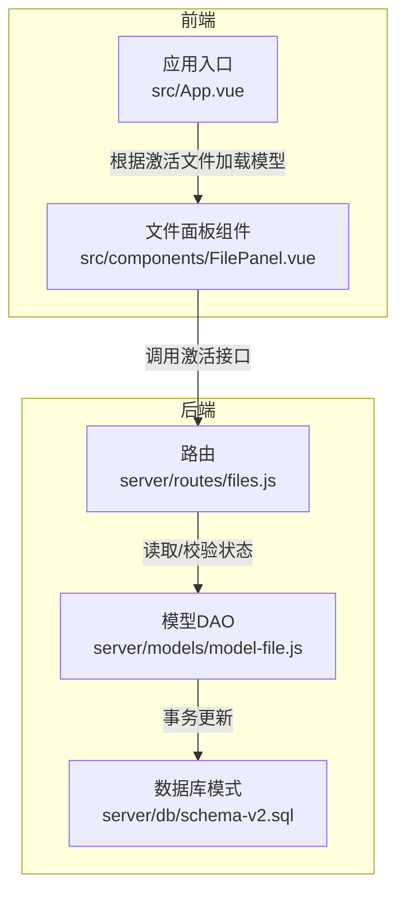
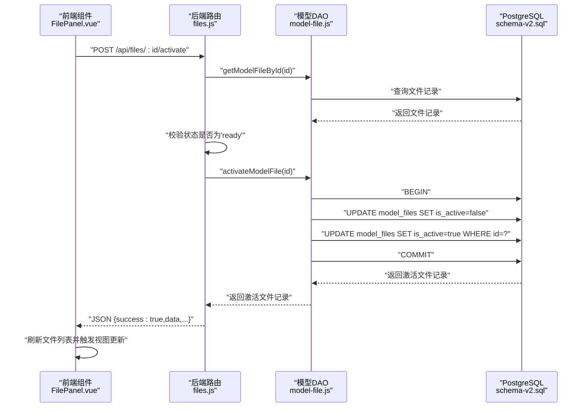
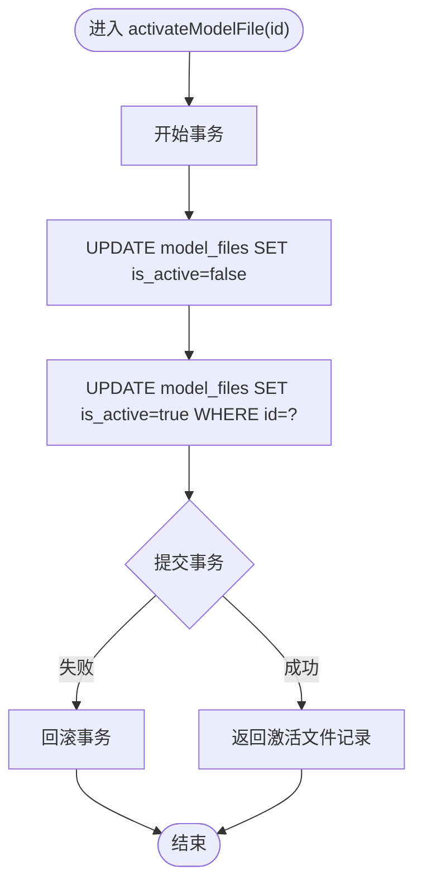
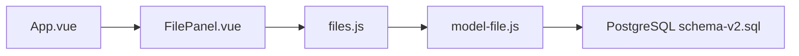

# 文件激活API

<cite>
**本文引用的文件**
- [server/routes/files.js](file://server/routes/files.js)
- [server/models/model-file.js](file://server/models/model-file.js)
- [server/db/schema-v2.sql](file://server/db/schema-v2.sql)
- [src/components/FilePanel.vue](file://src/components/FilePanel.vue)
- [src/App.vue](file://src/App.vue)
</cite>

## 目录
1. [简介](#简介)
2. [项目结构](#项目结构)
3. [核心组件](#核心组件)
4. [架构总览](#架构总览)
5. [详细组件分析](#详细组件分析)
6. [依赖关系分析](#依赖关系分析)
7. [性能考量](#性能考量)
8. [故障排查指南](#故障排查指南)
9. [结论](#结论)
10. [附录](#附录)

## 简介
本文件聚焦于文件激活API的实现与使用，详细说明POST /api/files/:id/activate端点的工作机制。内容涵盖：
- 激活前的状态校验逻辑（仅当文件状态为'ready'时可激活）
- 调用modelFileModel.activateModelFile()方法的实现过程（将目标文件状态更新为'active'，并确保系统中仅有一个激活文件）
- 激活成功后的响应数据结构
- curl调用示例
- 前端在接收到激活成功响应后应如何刷新模型视图
- 如何通过代码保证系统中始终只有一个激活的模型文件

## 项目结构
与文件激活API直接相关的代码分布在以下位置：
- 后端路由：server/routes/files.js
- 数据访问层：server/models/model-file.js
- 数据库模式：server/db/schema-v2.sql
- 前端交互：src/components/FilePanel.vue、src/App.vue

图表来源
- [server/routes/files.js](file://server/routes/files.js#L380-L405)
- [server/models/model-file.js](file://server/models/model-file.js#L102-L127)
- [server/db/schema-v2.sql](file://server/db/schema-v2.sql#L7-L20)
- [src/components/FilePanel.vue](file://src/components/FilePanel.vue#L415-L437)
- [src/App.vue](file://src/App.vue#L349-L382)

章节来源
- [server/routes/files.js](file://server/routes/files.js#L380-L405)
- [server/models/model-file.js](file://server/models/model-file.js#L102-L127)
- [server/db/schema-v2.sql](file://server/db/schema-v2.sql#L7-L20)
- [src/components/FilePanel.vue](file://src/components/FilePanel.vue#L415-L437)
- [src/App.vue](file://src/App.vue#L349-L382)

## 核心组件
- 路由层：负责接收HTTP请求、进行基础校验（文件是否存在）、调用模型层并返回标准化响应。
- 模型层：封装数据库操作，提供激活文件的核心逻辑，确保互斥性（仅一个激活文件）。
- 前端组件：负责触发激活请求、处理响应并刷新视图。

章节来源
- [server/routes/files.js](file://server/routes/files.js#L380-L405)
- [server/models/model-file.js](file://server/models/model-file.js#L102-L127)
- [src/components/FilePanel.vue](file://src/components/FilePanel.vue#L415-L437)

## 架构总览
激活流程从HTTP请求开始，经过路由层校验，进入模型层执行数据库事务，最后返回给前端。前端在收到成功响应后刷新文件列表并驱动Viewer加载新模型。

图表来源
- [server/routes/files.js](file://server/routes/files.js#L380-L405)
- [server/models/model-file.js](file://server/models/model-file.js#L102-L127)
- [server/db/schema-v2.sql](file://server/db/schema-v2.sql#L7-L20)
- [src/components/FilePanel.vue](file://src/components/FilePanel.vue#L415-L437)

## 详细组件分析

### 路由层：POST /api/files/:id/activate
- 请求处理流程
  - 读取文件ID并查询文件记录
  - 若文件不存在，返回404
  - 校验文件状态必须为'ready'，否则返回400
  - 调用模型层激活方法
  - 返回成功响应，包含激活文件的完整信息
- 错误处理
  - 文件不存在：404
  - 状态不为'ready'：400
  - 其他异常：500

章节来源
- [server/routes/files.js](file://server/routes/files.js#L380-L405)

### 模型层：activateModelFile(id)
- 实现要点
  - 使用数据库事务确保原子性
  - 先将所有文件的is_active置为false
  - 再将目标文件的is_active置为true
  - 提交事务并返回最新记录
- 互斥保障
  - 通过UPDATE全表清零+单行置位，确保系统中仅有一个激活文件
  - 事务回滚保证一致性

图表来源
- [server/models/model-file.js](file://server/models/model-file.js#L102-L127)

章节来源
- [server/models/model-file.js](file://server/models/model-file.js#L102-L127)

### 前端：FilePanel.vue中的激活交互
- 触发方式
  - 用户在文件列表右键菜单选择“激活”
  - 前端检查文件状态是否为'ready'，否则提示需先解压
  - 发起POST /api/files/:id/activate请求
- 成功处理
  - 刷新文件列表
  - 通过事件通知父组件进行后续视图更新
- 与App.vue联动
  - 应用启动或切换视图时，会根据当前激活文件加载对应模型

章节来源
- [src/components/FilePanel.vue](file://src/components/FilePanel.vue#L415-L437)
- [src/App.vue](file://src/App.vue#L349-L382)

### 数据库模式：model_files表
- 关键字段
  - is_active：布尔值，标记当前激活的模型文件
  - status：枚举字符串，支持'uploaded'、'extracting'、'ready'、'error'
- 索引
  - 对status和is_active建立索引，优化查询与更新性能

章节来源
- [server/db/schema-v2.sql](file://server/db/schema-v2.sql#L7-L20)

## 依赖关系分析
- 路由依赖模型层：files.js依赖model-file.js提供的DAO方法
- 模型层依赖数据库：model-file.js通过数据库客户端执行SQL
- 前端依赖后端API：FilePanel.vue通过fetch调用激活接口
- 视图依赖激活文件：App.vue根据激活文件决定加载哪个模型

图表来源
- [server/routes/files.js](file://server/routes/files.js#L380-L405)
- [server/models/model-file.js](file://server/models/model-file.js#L102-L127)
- [server/db/schema-v2.sql](file://server/db/schema-v2.sql#L7-L20)
- [src/components/FilePanel.vue](file://src/components/FilePanel.vue#L415-L437)
- [src/App.vue](file://src/App.vue#L349-L382)

章节来源
- [server/routes/files.js](file://server/routes/files.js#L380-L405)
- [server/models/model-file.js](file://server/models/model-file.js#L102-L127)
- [server/db/schema-v2.sql](file://server/db/schema-v2.sql#L7-L20)
- [src/components/FilePanel.vue](file://src/components/FilePanel.vue#L415-L437)
- [src/App.vue](file://src/App.vue#L349-L382)

## 性能考量
- 事务范围小且操作简单，对性能影响有限
- 建议在高并发场景下：
  - 保持数据库连接池合理配置
  - 确保model_files表的is_active索引有效
  - 控制文件数量规模，避免大量UPDATE带来的锁竞争

[本节为通用建议，无需特定文件引用]

## 故障排查指南
- 404 文件不存在
  - 确认文件ID正确且文件未被删除
- 400 状态不是'ready'
  - 先执行解压流程（POST /api/files/:id/extract），等待状态变为'ready'
- 500 服务器内部错误
  - 检查数据库连接与事务日志
  - 确认model-file.js的activateModelFile方法未抛出异常

章节来源
- [server/routes/files.js](file://server/routes/files.js#L380-L405)
- [server/models/model-file.js](file://server/models/model-file.js#L102-L127)

## 结论
POST /api/files/:id/activate端点通过严格的前置校验与数据库事务，确保了“仅有一个激活文件”的一致性约束。前端在收到成功响应后刷新文件列表并驱动Viewer加载新模型，形成完整的激活闭环。

[本节为总结性内容，无需特定文件引用]

## 附录

### 响应数据结构
- 成功响应包含字段
  - success: true
  - data: 激活文件的完整记录（包含id、file_code、title、status、is_active、extracted_path等）
  - message: "文件已激活"

章节来源
- [server/routes/files.js](file://server/routes/files.js#L380-L405)

### curl调用示例
- 示例命令
  - curl -X POST http://localhost:3001/api/files/{id}/activate
- 注意事项
  - 将{id}替换为实际文件ID
  - 仅当文件状态为'ready'时才会成功

章节来源
- [server/routes/files.js](file://server/routes/files.js#L380-L405)

### 前端刷新与视图更新
- FilePanel.vue
  - 收到成功响应后调用loadFiles()刷新列表
  - 通过事件通知父组件进行后续处理
- App.vue
  - 在Viewer初始化完成后，根据当前激活文件加载对应模型

章节来源
- [src/components/FilePanel.vue](file://src/components/FilePanel.vue#L415-L437)
- [src/App.vue](file://src/App.vue#L349-L382)