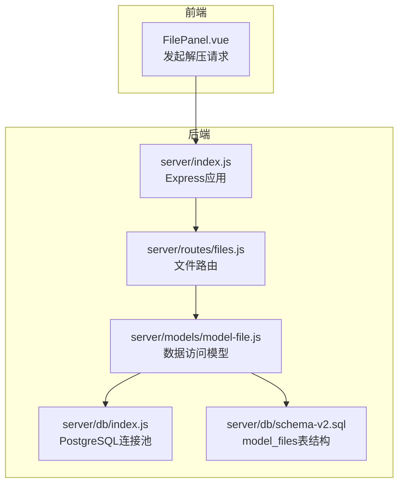
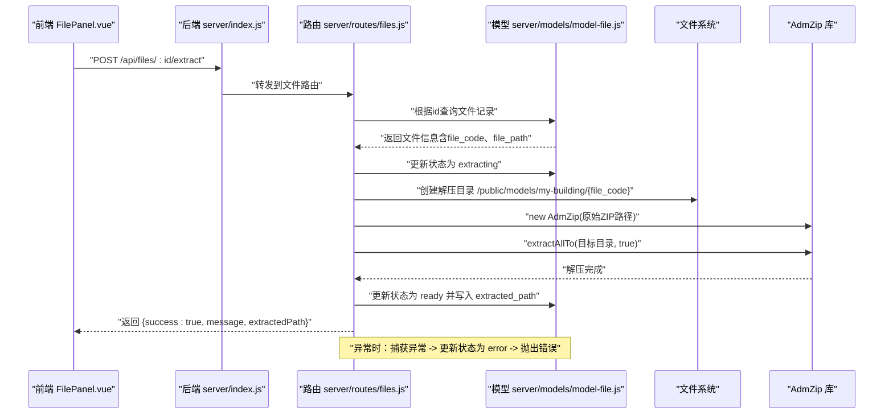
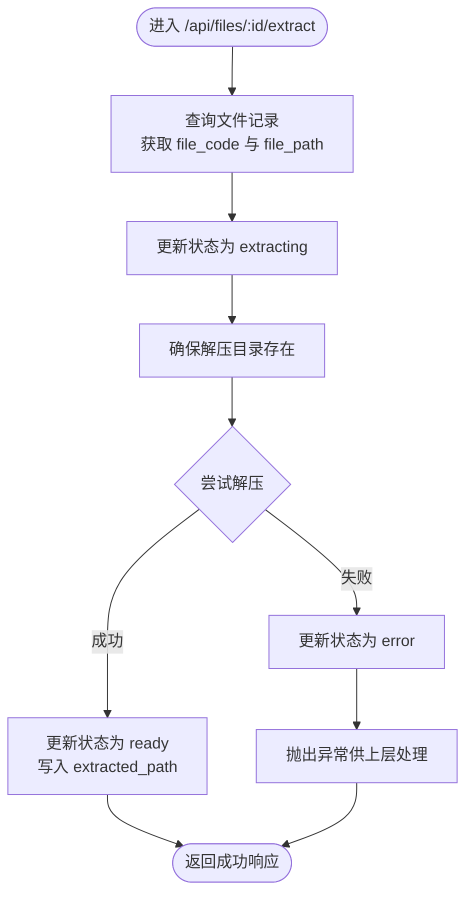
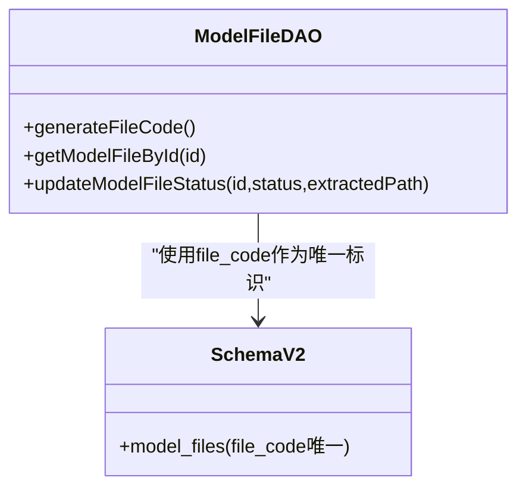
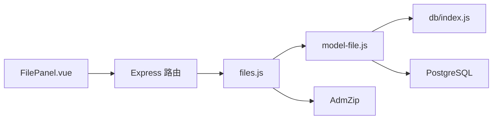

# 文件解压API

<cite>
**本文引用的文件**
- [server/index.js](file://server/index.js)
- [server/routes/files.js](file://server/routes/files.js)
- [server/models/model-file.js](file://server/models/model-file.js)
- [server/db/index.js](file://server/db/index.js)
- [server/db/schema-v2.sql](file://server/db/schema-v2.sql)
- [src/components/FilePanel.vue](file://src/components/FilePanel.vue)
</cite>

## 目录
1. [简介](#简介)
2. [项目结构](#项目结构)
3. [核心组件](#核心组件)
4. [架构总览](#架构总览)
5. [详细组件分析](#详细组件分析)
6. [依赖关系分析](#依赖关系分析)
7. [性能考虑](#性能考虑)
8. [故障排查指南](#故障排查指南)
9. [结论](#结论)
10. [附录](#附录)

## 简介
本文档围绕“POST /api/files/:id/extract”端点，系统化阐述SVF ZIP文件解压流程，包括：
- 解压前将状态更新为“extracting”
- 基于file_code生成唯一解压目录/public/models/my-building/{file_code}
- 使用AdmZip库调用extractAllTo()完成解压
- 解压成功后将状态更新为“ready”，并记录extracted_path
- 解压失败时通过try-catch捕获异常并回滚状态为“error”
- 提供curl调用示例与成功响应说明
- 结合代码解释file_code如何保证目录唯一性，以及如何从数据库获取原始文件路径进行解压

## 项目结构
后端采用Express + PostgreSQL架构，文件解压逻辑集中在文件路由模块；数据访问通过模型层封装；前端通过FilePanel组件发起解压请求。

图表来源
- [server/index.js](file://server/index.js#L44-L49)
- [server/routes/files.js](file://server/routes/files.js#L333-L378)
- [server/models/model-file.js](file://server/models/model-file.js#L1-L179)
- [server/db/index.js](file://server/db/index.js#L1-L70)
- [server/db/schema-v2.sql](file://server/db/schema-v2.sql#L1-L40)

章节来源
- [server/index.js](file://server/index.js#L44-L49)
- [server/routes/files.js](file://server/routes/files.js#L333-L378)
- [server/models/model-file.js](file://server/models/model-file.js#L1-L179)
- [server/db/schema-v2.sql](file://server/db/schema-v2.sql#L1-L40)

## 核心组件
- 文件路由（files.js）：实现POST /api/files/:id/extract端点，负责状态流转、目录创建、AdmZip解压与异常回滚。
- 模型文件DAO（model-file.js）：提供生成file_code、查询/更新文件状态、激活文件等能力。
- 数据库连接（db/index.js）：提供query与getClient，支撑事务与状态更新。
- 前端组件（FilePanel.vue）：调用后端解压接口，展示状态与结果。

章节来源
- [server/routes/files.js](file://server/routes/files.js#L333-L378)
- [server/models/model-file.js](file://server/models/model-file.js#L1-L179)
- [server/db/index.js](file://server/db/index.js#L1-L70)
- [src/components/FilePanel.vue](file://src/components/FilePanel.vue#L478-L509)

## 架构总览
POST /api/files/:id/extract的端到端流程如下：

图表来源
- [server/index.js](file://server/index.js#L44-L49)
- [server/routes/files.js](file://server/routes/files.js#L333-L378)
- [server/models/model-file.js](file://server/models/model-file.js#L76-L100)

## 详细组件分析

### 端点：POST /api/files/:id/extract
- 功能概述
  - 将指定ID的模型文件状态从“uploaded”更新为“extracting”
  - 基于file_code生成唯一解压目录
  - 使用AdmZip解压原始ZIP到目标目录
  - 解压成功后将状态更新为“ready”，并记录extracted_path
  - 解压失败时捕获异常并将状态回滚为“error”

- 关键实现要点
  - 状态更新：先将状态置为“extracting”，再执行解压，最后将状态置为“ready”并写入extracted_path
  - 目录唯一性：解压目录为/public/models/my-building/{file_code}，file_code由generateFileCode()生成，具备唯一性
  - 异常回滚：try-catch包裹解压过程，失败时将状态置为“error”，并抛出异常供上层统一处理
  - 成功响应：返回success、message与extractedPath字段

- curl调用示例
  - 示例命令（请替换实际服务器地址与文件ID）
    - curl -X POST "http://localhost:3001/api/files/{id}/extract" -H "Content-Type: application/json"
  - 成功响应字段说明
    - success：布尔值，true表示操作成功
    - message：字符串，提示信息
    - extractedPath：字符串，解压后的相对路径，如“/models/my-building/{file_code}”

- 代码片段路径
  - 端点实现位置：[server/routes/files.js](file://server/routes/files.js#L333-L378)
  - 状态更新方法：[server/models/model-file.js](file://server/models/model-file.js#L76-L100)
  - 目录创建与解压调用：[server/routes/files.js](file://server/routes/files.js#L344-L368)
  - 异常回滚逻辑：[server/routes/files.js](file://server/routes/files.js#L369-L372)

章节来源
- [server/routes/files.js](file://server/routes/files.js#L333-L378)
- [server/models/model-file.js](file://server/models/model-file.js#L76-L100)

### AdmZip解压流程细节
- 目录创建
  - 若目标目录不存在则递归创建
- 解压调用
  - new AdmZip(原始ZIP路径)
  - extractAllTo(目标目录, true)：覆盖同名文件
- 成功后写入extracted_path
  - extracted_path为“/models/my-building/{file_code}”，便于前端后续访问

图表来源
- [server/routes/files.js](file://server/routes/files.js#L333-L378)

章节来源
- [server/routes/files.js](file://server/routes/files.js#L344-L368)

### file_code确保目录唯一性的机制
- file_code生成策略
  - 由generateFileCode()生成，包含时间戳与UUID片段，保证全局唯一性
- 目录命名规则
  - 解压目录固定为/public/models/my-building/{file_code}，避免冲突
- 数据库约束
  - model_files表的file_code字段唯一，进一步保障唯一性

图表来源
- [server/models/model-file.js](file://server/models/model-file.js#L1-L20)
- [server/db/schema-v2.sql](file://server/db/schema-v2.sql#L1-L20)

章节来源
- [server/models/model-file.js](file://server/models/model-file.js#L1-L20)
- [server/db/schema-v2.sql](file://server/db/schema-v2.sql#L1-L20)

### 从数据库获取原始文件路径进行解压
- 步骤
  - 路由根据id查询文件记录，读取file_path字段
  - 将file_path拼接为绝对路径，作为AdmZip构造参数
- 作用
  - 保证解压源文件定位准确，避免路径错误导致解压失败

章节来源
- [server/routes/files.js](file://server/routes/files.js#L339-L348)
- [server/db/schema-v2.sql](file://server/db/schema-v2.sql#L1-L20)

### 前端集成与状态展示
- 前端通过FilePanel.vue调用解压接口
- 当文件状态为“ready”时，前端直接打开数据导出面板
- 状态文本映射：uploaded、extracting、ready、error

章节来源
- [src/components/FilePanel.vue](file://src/components/FilePanel.vue#L478-L509)
- [src/components/FilePanel.vue](file://src/components/FilePanel.vue#L289-L295)

## 依赖关系分析
- 组件耦合
  - 路由依赖模型层进行文件状态更新
  - 模型层依赖数据库连接池执行SQL
  - 前端依赖后端API返回的extractedPath进行后续操作
- 外部依赖
  - AdmZip用于ZIP解压
  - PostgreSQL用于持久化文件元数据

图表来源
- [server/index.js](file://server/index.js#L44-L49)
- [server/routes/files.js](file://server/routes/files.js#L333-L378)
- [server/models/model-file.js](file://server/models/model-file.js#L1-L179)
- [server/db/index.js](file://server/db/index.js#L1-L70)

章节来源
- [server/index.js](file://server/index.js#L44-L49)
- [server/routes/files.js](file://server/routes/files.js#L333-L378)
- [server/models/model-file.js](file://server/models/model-file.js#L1-L179)
- [server/db/index.js](file://server/db/index.js#L1-L70)

## 性能考虑
- 解压耗时
  - 大型SVF ZIP解压可能耗时较长，建议在前端显示“解压中”状态并提供进度反馈
- 目录层级
  - 解压目录采用两级子目录（my-building/{file_code}），有利于文件系统性能与可维护性
- 并发控制
  - 对同一文件的并发解压应避免，可在路由层增加互斥或幂等判断

## 故障排查指南
- 常见问题与处理
  - 文件不存在：返回404，检查文件ID是否正确
  - 解压失败：查看后端日志中的异常堆栈，确认ZIP完整性与权限
  - 目录权限不足：确保运行用户对/public/models拥有写权限
  - 磁盘空间不足：监控磁盘容量，清理历史解压产物
- 错误回滚
  - 解压异常时状态自动回滚为“error”，前端可据此提示用户重试或联系管理员

章节来源
- [server/routes/files.js](file://server/routes/files.js#L339-L378)
- [server/routes/files.js](file://server/routes/files.js#L369-L372)

## 结论
POST /api/files/:id/extract端点通过明确的状态机与严格的异常回滚机制，实现了SVF ZIP文件的可靠解压。借助file_code确保解压目录唯一性，配合AdmZip的extractAllTo()方法，能够稳定地将模型文件解压至/public/models/my-building/{file_code}目录，并在成功后记录extracted_path供前端使用。整体设计清晰、可维护性强，适合在生产环境中部署与扩展。

## 附录

### API定义
- 端点：POST /api/files/:id/extract
- 请求参数
  - 路径参数：id（模型文件ID）
- 成功响应
  - 字段：success（布尔）、message（字符串）、extractedPath（字符串）
  - 示例：{ "success": true, "message": "解压完成", "extractedPath": "/models/my-building/MFXXXXXX" }

章节来源
- [server/routes/files.js](file://server/routes/files.js#L333-L378)