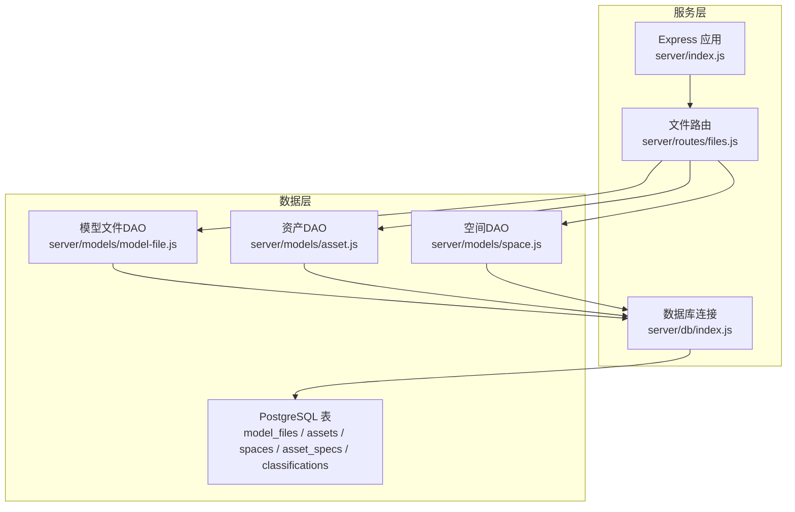
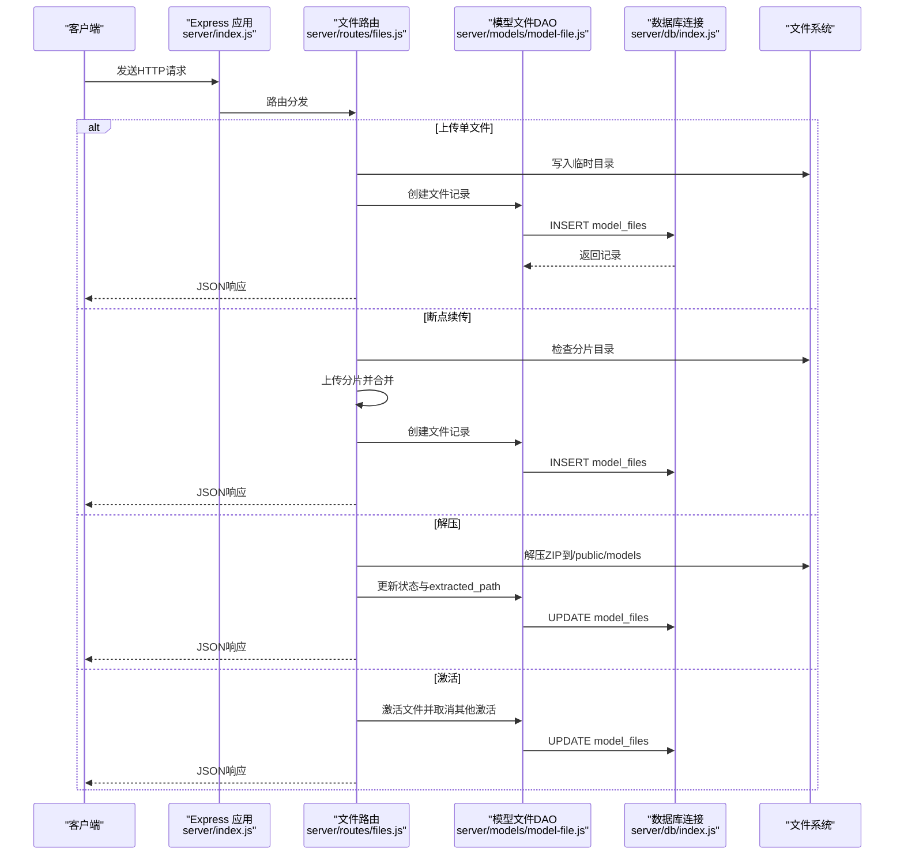
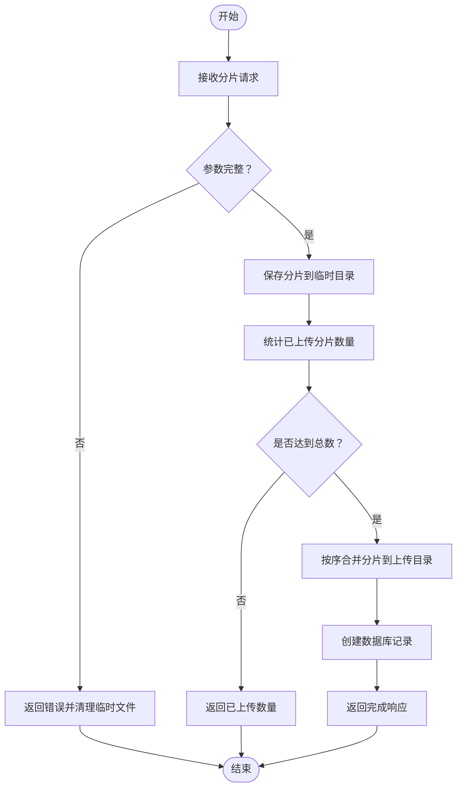
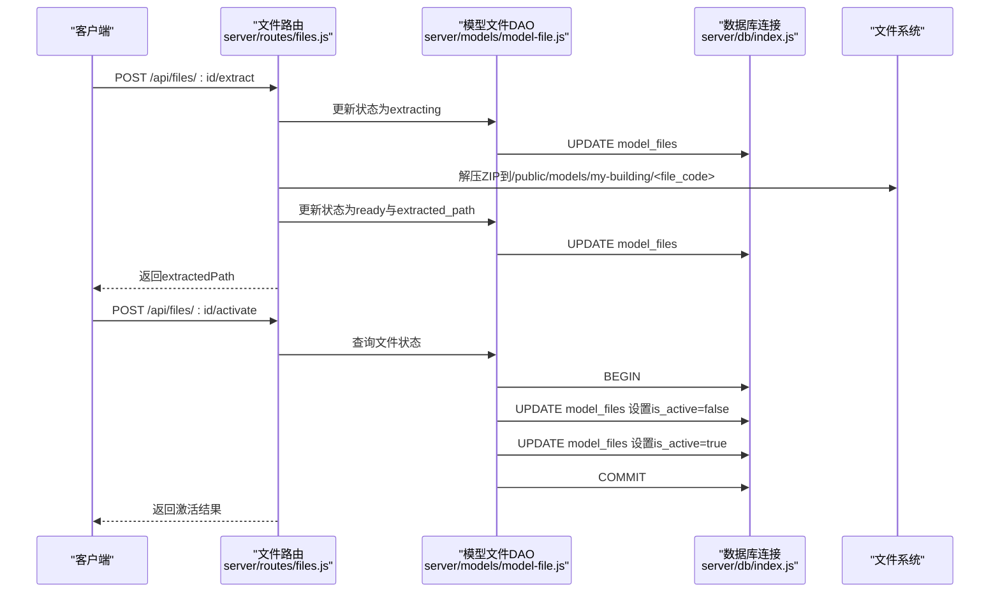
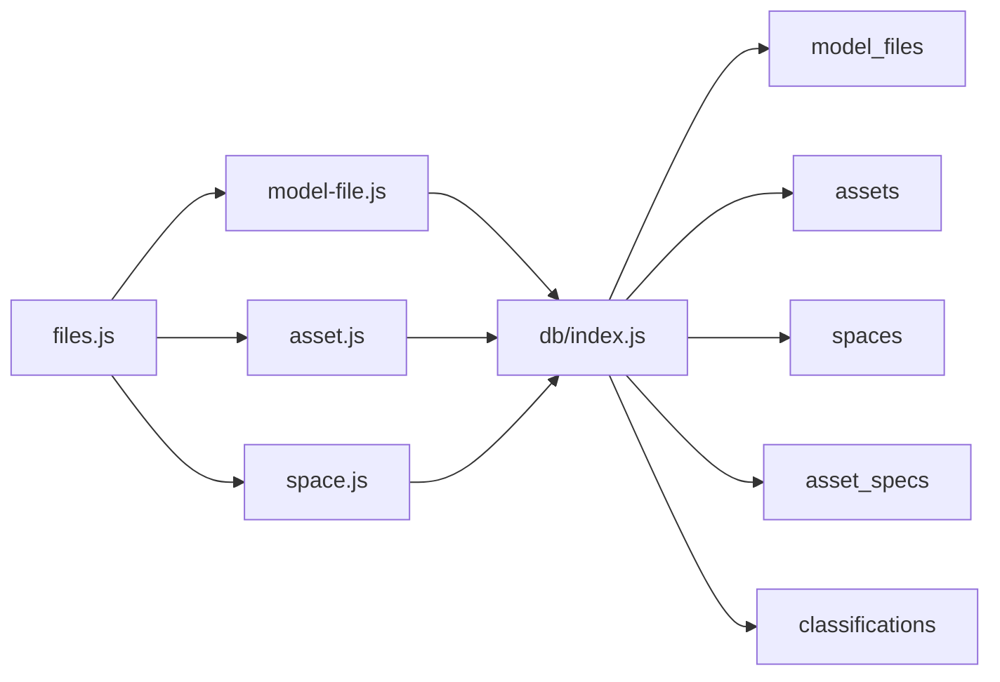
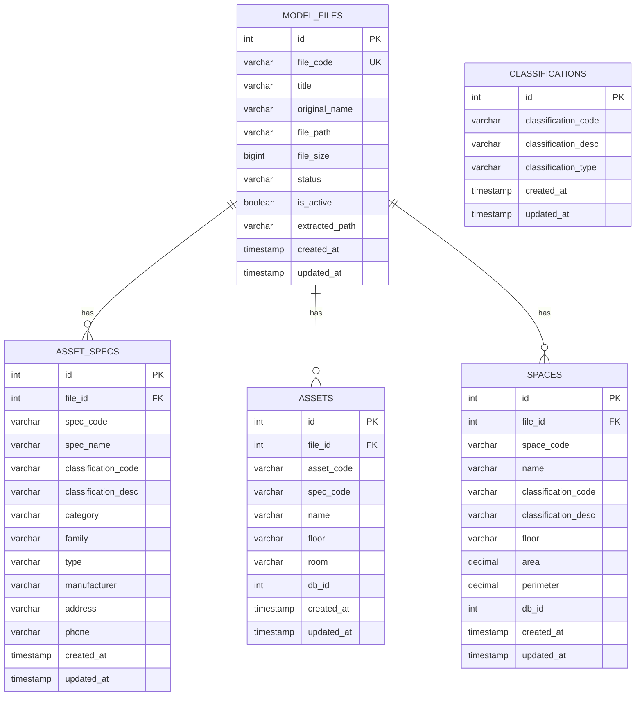

# 文件管理API

<cite>
**本文引用的文件**
- [server/index.js](file://server/index.js)
- [server/routes/files.js](file://server/routes/files.js)
- [server/models/model-file.js](file://server/models/model-file.js)
- [server/db/index.js](file://server/db/index.js)
- [server/db/schema-v2.sql](file://server/db/schema-v2.sql)
- [server/db/schema.sql](file://server/db/schema.sql)
- [server/models/asset.js](file://server/models/asset.js)
- [server/models/space.js](file://server/models/space.js)
</cite>

## 目录
1. [简介](#简介)
2. [项目结构](#项目结构)
3. [核心组件](#核心组件)
4. [架构总览](#架构总览)
5. [详细组件分析](#详细组件分析)
6. [依赖分析](#依赖分析)
7. [性能考虑](#性能考虑)
8. [故障排查指南](#故障排查指南)
9. [结论](#结论)
10. [附录](#附录)

## 简介
本文件管理API围绕“模型文件”（SVF ZIP）的上传、断点续传、解压与激活进行设计，提供完整的CRUD与关联数据查询能力。核心目标：
- 上传SVF ZIP文件并生成唯一文件编码，创建数据库记录
- 支持断点续传：检查已上传分片、上传分片并自动合并
- 解压至/public/models目录，更新文件状态
- 激活文件为当前系统使用的模型
- 查询文件关联的资产与空间数据
- 提供标准REST风格接口，返回统一的success/data/error结构

## 项目结构
后端采用Express + PostgreSQL，文件管理路由位于server/routes/files.js，数据访问层位于server/models/model-file.js，数据库连接与查询封装在server/db/index.js，数据库表结构定义在server/db/schema*.sql中。

图表来源
- [server/index.js](file://server/index.js#L1-L92)
- [server/routes/files.js](file://server/routes/files.js#L1-L436)
- [server/models/model-file.js](file://server/models/model-file.js#L1-L179)
- [server/db/index.js](file://server/db/index.js#L1-L70)
- [server/db/schema-v2.sql](file://server/db/schema-v2.sql#L1-L70)
- [server/db/schema.sql](file://server/db/schema.sql#L1-L160)

章节来源
- [server/index.js](file://server/index.js#L1-L92)
- [server/routes/files.js](file://server/routes/files.js#L1-L436)
- [server/db/schema-v2.sql](file://server/db/schema-v2.sql#L1-L70)

## 核心组件
- 文件路由（/api/files）：负责上传、断点续传、CRUD、解压、激活、关联查询
- 模型文件DAO：封装文件记录的创建、查询、状态更新、激活、删除
- 数据库连接：基于PostgreSQL连接池，提供query与事务支持
- 关联DAO：资产与空间DAO，支持按文件ID查询关联数据

章节来源
- [server/routes/files.js](file://server/routes/files.js#L1-L436)
- [server/models/model-file.js](file://server/models/model-file.js#L1-L179)
- [server/db/index.js](file://server/db/index.js#L1-L70)
- [server/models/asset.js](file://server/models/asset.js#L1-L253)
- [server/models/space.js](file://server/models/space.js#L1-L220)

## 架构总览
文件管理API的控制流如下：
- 客户端发起请求到/…/files路由
- 路由根据HTTP方法分派到具体处理器
- 处理器调用DAO执行数据库操作
- DAO通过数据库连接池执行SQL
- 对于解压与激活，路由直接操作文件系统

图表来源
- [server/index.js](file://server/index.js#L1-L92)
- [server/routes/files.js](file://server/routes/files.js#L1-L436)
- [server/models/model-file.js](file://server/models/model-file.js#L1-L179)
- [server/db/index.js](file://server/db/index.js#L1-L70)

## 详细组件分析

### 1) 上传模型文件（POST /api/files/upload）
- 功能要点
  - 仅允许ZIP/SVFZIP文件，限制最大500MB
  - 生成唯一文件编码（前缀+时间戳+UUID片段），移动到上传目录
  - 创建数据库记录（file_code/title/original_name/file_path/file_size/status）
- 请求与响应
  - 方法：POST
  - 路径：/api/files/upload
  - 表单字段：file（二进制）、title（字符串）
  - 成功响应：包含data（文件记录）与message
  - 失败响应：包含error
- curl示例
  - curl -X POST http://localhost:3001/api/files/upload -F "file=@your.svfzip" -F "title=我的建筑模型"

章节来源
- [server/routes/files.js](file://server/routes/files.js#L72-L116)
- [server/models/model-file.js](file://server/models/model-file.js#L19-L35)

### 2) 断点续传
- 检查已上传分片（GET /api/files/upload/check/:identifier）
  - 路径参数：identifier（分片标识符）
  - 返回：uploadedChunks（已上传分片子数组）
- 上传分片（POST /api/files/upload/chunk）
  - 表单字段：chunk（二进制）、identifier、chunkIndex、totalChunks、fileName、title
  - 逻辑：将分片保存到临时目录；当全部分片到达时，按序合并到上传目录，生成唯一文件编码，创建数据库记录
  - 返回：completed标志与data（文件记录）

图表来源
- [server/routes/files.js](file://server/routes/files.js#L118-L223)

章节来源
- [server/routes/files.js](file://server/routes/files.js#L118-L223)

### 3) CRUD操作
- 获取所有模型文件（GET /api/files）
  - 返回：data（文件记录数组）
- 获取当前激活文件（GET /api/files/active）
  - 返回：data（当前激活文件）
- 获取单个文件（GET /api/files/:id）
  - 返回：data（文件记录）
- 更新文件标题（PUT /api/files/:id）
  - 请求体：title（字符串）
  - 返回：data（更新后的文件记录）
- 删除文件（DELETE /api/files/:id）
  - 逻辑：删除物理文件与解压目录（如存在），删除数据库记录（外键级联删除关联资产/空间/规格/分类）
  - 返回：message

章节来源
- [server/routes/files.js](file://server/routes/files.js#L229-L331)
- [server/models/model-file.js](file://server/models/model-file.js#L40-L100)
- [server/db/schema-v2.sql](file://server/db/schema-v2.sql#L1-L70)
- [server/db/schema.sql](file://server/db/schema.sql#L1-L160)

### 4) 解压与激活
- 解压文件（POST /api/files/:id/extract）
  - 逻辑：更新状态为extracting；解压到/public/models/my-building/<file_code>；更新状态为ready并记录extracted_path
  - 返回：message与extractedPath
- 激活文件（POST /api/files/:id/activate）
  - 逻辑：校验状态为ready；使用事务取消其他文件激活，设置当前文件为激活
  - 返回：data（激活后的文件记录）

图表来源
- [server/routes/files.js](file://server/routes/files.js#L333-L405)
- [server/models/model-file.js](file://server/models/model-file.js#L76-L127)
- [server/db/index.js](file://server/db/index.js#L57-L66)

章节来源
- [server/routes/files.js](file://server/routes/files.js#L333-L405)
- [server/models/model-file.js](file://server/models/model-file.js#L76-L127)

### 5) 关联数据查询
- 获取文件关联的资产（GET /api/files/:id/assets）
  - 返回：data（资产列表，含规格信息）
- 获取文件关联的空间（GET /api/files/:id/spaces）
  - 返回：data（空间列表）

章节来源
- [server/routes/files.js](file://server/routes/files.js#L407-L433)
- [server/models/asset.js](file://server/models/asset.js#L144-L157)
- [server/models/space.js](file://server/models/space.js#L117-L124)

## 依赖分析
- 路由依赖
  - files.js依赖model-file.js、asset.js、space.js、AdmZip、multer、fs、path
- DAO依赖
  - model-file.js依赖db/index.js的query与getClient
  - asset.js与space.js依赖db/index.js的query与getClient
- 数据库
  - model_files表：存储文件元数据与状态
  - assets/spaces/asset_specs/classifications：与model_files通过file_id关联，支持按文件维度隔离数据

图表来源
- [server/routes/files.js](file://server/routes/files.js#L1-L436)
- [server/models/model-file.js](file://server/models/model-file.js#L1-L179)
- [server/models/asset.js](file://server/models/asset.js#L1-L253)
- [server/models/space.js](file://server/models/space.js#L1-L220)
- [server/db/index.js](file://server/db/index.js#L1-L70)
- [server/db/schema-v2.sql](file://server/db/schema-v2.sql#L1-L70)
- [server/db/schema.sql](file://server/db/schema.sql#L1-L160)

章节来源
- [server/routes/files.js](file://server/routes/files.js#L1-L436)
- [server/models/model-file.js](file://server/models/model-file.js#L1-L179)
- [server/db/schema-v2.sql](file://server/db/schema-v2.sql#L1-L70)

## 性能考虑
- 文件上传
  - 单文件上传使用multer磁盘存储，建议在生产环境配置更高性能的存储（如云存储）以减少本地磁盘压力
  - 限制500MB，避免过大文件占用过多内存与IO
- 断点续传
  - 分片合并采用顺序读写，建议在高并发场景下限制同时进行的合并任务数量
  - 合并完成后立即清理临时目录，防止磁盘膨胀
- 数据库
  - model_files表对status与is_active建立索引，有利于查询与激活操作
  - 事务用于激活操作，确保原子性
- I/O
  - 解压到/public/models目录，注意磁盘空间与权限
  - 资产/空间查询使用LEFT JOIN与索引，建议定期维护索引与统计信息

[本节为通用指导，不涉及具体文件分析]

## 故障排查指南
- 上传失败
  - 检查文件类型与大小限制（仅允许ZIP/SVFZIP，最大500MB）
  - 查看路由中的错误处理与日志输出
- 断点续传异常
  - 确认identifier一致且分片索引连续
  - 检查临时目录是否存在与权限
- 解压失败
  - 确认ZIP文件有效且可解压
  - 检查目标目录权限与磁盘空间
- 激活失败
  - 确认文件状态为ready
  - 查看事务回滚日志
- 关联数据为空
  - 确认文件已正确解压并激活
  - 检查assets/spaces表是否包含file_id关联

章节来源
- [server/routes/files.js](file://server/routes/files.js#L118-L223)
- [server/routes/files.js](file://server/routes/files.js#L333-L405)
- [server/models/model-file.js](file://server/models/model-file.js#L102-L127)

## 结论
该文件管理API围绕SVF ZIP模型文件提供从上传、断点续传、解压、激活到关联数据查询的完整链路。通过唯一文件编码与状态机管理，配合数据库事务与外键级联，确保数据一致性与可追溯性。建议在生产环境中进一步优化I/O与存储策略，并完善监控与告警机制。

[本节为总结，不涉及具体文件分析]

## 附录

### A. 接口清单与示例
- 上传模型文件
  - 方法：POST
  - 路径：/api/files/upload
  - 表单字段：file（二进制）、title（字符串）
  - curl示例：参见“上传模型文件（POST /api/files/upload）”
- 断点续传
  - 检查分片：GET /api/files/upload/check/:identifier
  - 上传分片：POST /api/files/upload/chunk（表单字段：chunk、identifier、chunkIndex、totalChunks、fileName、title）
- 文件管理
  - 获取所有：GET /api/files
  - 获取当前激活：GET /api/files/active
  - 获取单个：GET /api/files/:id
  - 更新标题：PUT /api/files/:id（JSON：title）
  - 删除文件：DELETE /api/files/:id
- 解压与激活
  - 解压：POST /api/files/:id/extract
  - 激活：POST /api/files/:id/activate
- 关联数据
  - 资产：GET /api/files/:id/assets
  - 空间：GET /api/files/:id/spaces

章节来源
- [server/routes/files.js](file://server/routes/files.js#L72-L433)

### B. 数据模型概览

图表来源
- [server/db/schema-v2.sql](file://server/db/schema-v2.sql#L1-L70)
- [server/db/schema.sql](file://server/db/schema.sql#L1-L160)