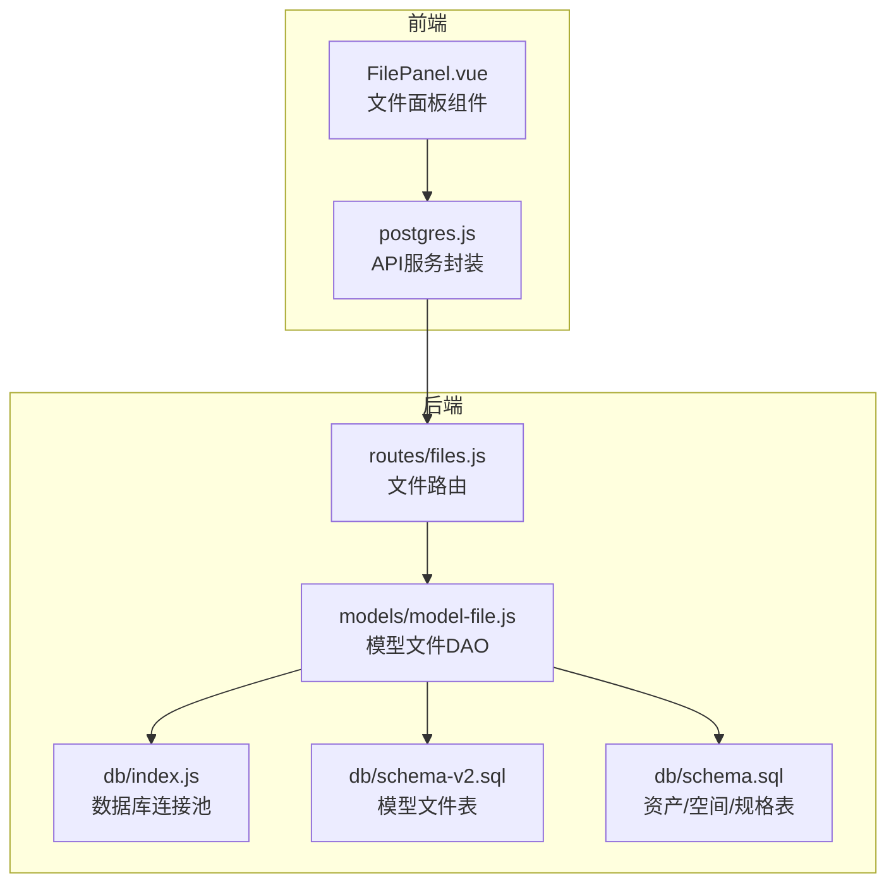
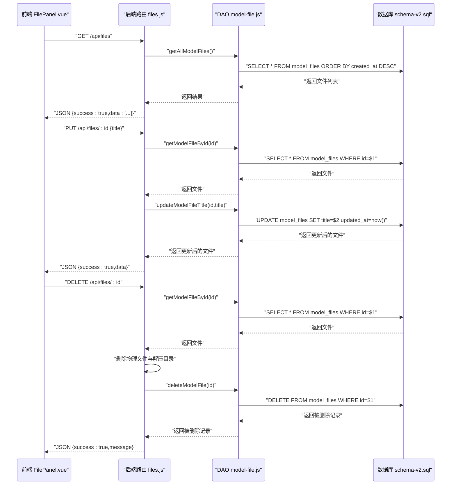
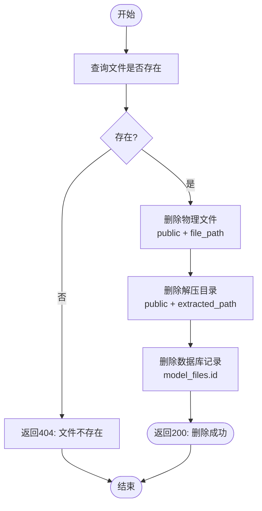
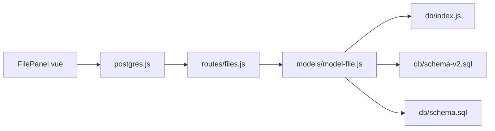

# 文件管理CRUD操作

<cite>
**本文引用的文件**
- [server/routes/files.js](file://server/routes/files.js)
- [server/models/model-file.js](file://server/models/model-file.js)
- [server/db/index.js](file://server/db/index.js)
- [server/db/schema-v2.sql](file://server/db/schema-v2.sql)
- [server/db/schema.sql](file://server/db/schema.sql)
- [src/components/FilePanel.vue](file://src/components/FilePanel.vue)
- [src/services/postgres.js](file://src/services/postgres.js)
</cite>

## 目录
1. [简介](#简介)
2. [项目结构](#项目结构)
3. [核心组件](#核心组件)
4. [架构总览](#架构总览)
5. [详细组件分析](#详细组件分析)
6. [依赖分析](#依赖分析)
7. [性能考虑](#性能考虑)
8. [故障排查指南](#故障排查指南)
9. [结论](#结论)
10. [附录](#附录)

## 简介
本文件面向“文件管理CRUD操作”的完整说明，聚焦于模型文件的增删改查能力，涵盖以下端点：
- GET /api/files：获取所有模型文件列表
- GET /api/files/:id：获取单个文件信息
- PUT /api/files/:id：更新文件标题
- DELETE /api/files/:id：删除文件（包括物理文件、解压目录和数据库记录）
- GET /api/files/active：获取当前激活文件

文档将结合后端路由、数据访问层、数据库模式以及前端交互组件，给出端点规范、请求/响应结构、错误边界与级联处理策略，并提供curl示例以便快速验证。

## 项目结构
围绕文件管理的核心代码分布如下：
- 路由层：server/routes/files.js 定义了文件相关的REST接口
- 数据访问层：server/models/model-file.js 封装对model_files表的操作
- 数据库：server/db/schema-v2.sql 定义模型文件表；server/db/schema.sql 定义资产/空间/规格等关联表
- 前端：src/components/FilePanel.vue 展示文件列表、上传、编辑、解压、激活、删除等交互
- 服务封装：src/services/postgres.js 提供与后端API的统一调用入口

图表来源
- [server/routes/files.js](file://server/routes/files.js#L229-L331)
- [server/models/model-file.js](file://server/models/model-file.js#L1-L179)
- [server/db/index.js](file://server/db/index.js#L1-L70)
- [server/db/schema-v2.sql](file://server/db/schema-v2.sql#L1-L70)
- [server/db/schema.sql](file://server/db/schema.sql#L1-L160)
- [src/components/FilePanel.vue](file://src/components/FilePanel.vue#L297-L546)
- [src/services/postgres.js](file://src/services/postgres.js#L1-L245)

章节来源
- [server/routes/files.js](file://server/routes/files.js#L229-L331)
- [server/models/model-file.js](file://server/models/model-file.js#L1-L179)
- [server/db/schema-v2.sql](file://server/db/schema-v2.sql#L1-L70)
- [server/db/schema.sql](file://server/db/schema.sql#L1-L160)
- [src/components/FilePanel.vue](file://src/components/FilePanel.vue#L297-L546)
- [src/services/postgres.js](file://src/services/postgres.js#L1-L245)

## 核心组件
- 文件路由（server/routes/files.js）
  - 提供文件列表、单个文件、更新标题、删除、解压、激活、关联资产/空间等接口
- 模型文件DAO（server/models/model-file.js）
  - 封装生成文件编码、创建记录、查询、更新状态/标题、激活、删除等
- 数据库连接（server/db/index.js）
  - 提供连接池、query、getClient、closePool等
- 数据库模式（server/db/schema-v2.sql）
  - 定义model_files表及外键级联约束
- 前端文件面板（src/components/FilePanel.vue）
  - 展示文件列表、上传、编辑标题、解压、激活、删除等交互
- API服务封装（src/services/postgres.js）
  - 统一封装后端API调用，便于前端复用

章节来源
- [server/routes/files.js](file://server/routes/files.js#L229-L331)
- [server/models/model-file.js](file://server/models/model-file.js#L1-L179)
- [server/db/index.js](file://server/db/index.js#L1-L70)
- [server/db/schema-v2.sql](file://server/db/schema-v2.sql#L1-L70)
- [src/components/FilePanel.vue](file://src/components/FilePanel.vue#L297-L546)
- [src/services/postgres.js](file://src/services/postgres.js#L1-L245)

## 架构总览
文件管理的端到端流程如下：
- 前端通过FilePanel.vue发起HTTP请求
- Express路由files.js接收请求并校验参数
- DAO层model-file.js执行数据库操作（含事务）
- 数据库schema-v2.sql定义的model_files表承载文件元数据
- 删除时，DAO层删除数据库记录，路由层同步删除物理文件与解压目录

图表来源
- [server/routes/files.js](file://server/routes/files.js#L233-L331)
- [server/models/model-file.js](file://server/models/model-file.js#L40-L178)
- [server/db/schema-v2.sql](file://server/db/schema-v2.sql#L1-L70)

## 详细组件分析

### GET /api/files 获取所有模型文件列表
- 方法与路径：GET /api/files
- 请求参数：无
- 响应结构：
  - 成功：{ success: true, data: [ { id, file_code, title, original_name, file_path, file_size, status, is_active, extracted_path, created_at, updated_at }, ... ] }
  - 失败：{ success: false, error: string }
- 实现要点：
  - 路由层调用DAO的getAllModelFiles()
  - DAO执行SQL查询model_files表并按创建时间倒序返回
- curl示例：
  - curl -i http://localhost:3001/api/files

章节来源
- [server/routes/files.js](file://server/routes/files.js#L233-L240)
- [server/models/model-file.js](file://server/models/model-file.js#L40-L66)

### GET /api/files/:id 获取单个文件信息
- 方法与路径：GET /api/files/:id
- 路径参数：id（整数）
- 响应结构：
  - 成功：{ success: true, data: { ... } }
  - 不存在：{ success: false, error: "文件不存在" }
  - 失败：{ success: false, error: string }
- 实现要点：
  - 路由层调用DAO的getModelFileById(id)
  - 若不存在则返回404
- curl示例：
  - curl -i http://localhost:3001/api/files/123

章节来源
- [server/routes/files.js](file://server/routes/files.js#L259-L269)
- [server/models/model-file.js](file://server/models/model-file.js#L52-L66)

### PUT /api/files/:id 更新文件标题
- 方法与路径：PUT /api/files/:id
- 路径参数：id（整数）
- 请求体：{ title: string }
- 响应结构：
  - 成功：{ success: true, data: { ... }, message: "标题更新成功" }
  - 缺少标题：{ success: false, error: "请提供文件标题" }
  - 不存在：{ success: false, error: "文件不存在" }
  - 失败：{ success: false, error: string }
- 实现要点：
  - 路由层校验title，查询文件是否存在，存在则调用DAO的updateModelFileTitle(id,title)
  - DAO执行UPDATE并返回最新记录
- curl示例：
  - curl -i -X PUT http://localhost:3001/api/files/123 -H "Content-Type: application/json" -d '{"title":"新标题"}'

章节来源
- [server/routes/files.js](file://server/routes/files.js#L275-L297)
- [server/models/model-file.js](file://server/models/model-file.js#L155-L164)

### DELETE /api/files/:id 删除文件（物理文件+解压目录+数据库记录）
- 方法与路径：DELETE /api/files/:id
- 路径参数：id（整数）
- 响应结构：
  - 成功：{ success: true, message: "文件删除成功" }
  - 不存在：{ success: false, error: "文件不存在" }
  - 失败：{ success: false, error: string }
- 实现要点（关键流程）：
  - 路由层先查询文件是否存在
  - 物理删除：删除public目录下的压缩文件（file_path）
  - 解压目录删除：若存在extracted_path，则删除对应解压目录
  - 数据库删除：调用DAO的deleteModelFile(id)，由于model_files与资产/空间/规格表存在ON DELETE CASCADE，关联记录也会级联删除
- 级联处理与约束：
  - schema-v2.sql中model_files与资产/空间/规格表通过file_id外键并设置ON DELETE CASCADE，删除模型文件会自动清理关联数据
- 错误边界：
  - 文件不存在：返回404
  - 文件路径不存在：静默跳过删除
  - 数据库异常：返回500
- curl示例：
  - curl -i -X DELETE http://localhost:3001/api/files/123

图表来源
- [server/routes/files.js](file://server/routes/files.js#L303-L331)
- [server/db/schema-v2.sql](file://server/db/schema-v2.sql#L43-L70)

章节来源
- [server/routes/files.js](file://server/routes/files.js#L303-L331)
- [server/db/schema-v2.sql](file://server/db/schema-v2.sql#L43-L70)

### GET /api/files/active 获取当前激活文件
- 方法与路径：GET /api/files/active
- 请求参数：无
- 响应结构：
  - 成功：{ success: true, data: { ... } }
  - 失败：{ success: false, error: string }
- 实现要点：
  - 路由层调用DAO的getActiveModelFile()
  - DAO执行SQL查询is_active=true的记录（LIMIT 1）
- curl示例：
  - curl -i http://localhost:3001/api/files/active

章节来源
- [server/routes/files.js](file://server/routes/files.js#L246-L253)
- [server/models/model-file.js](file://server/models/model-file.js#L69-L74)

### 关联资产与空间查询（辅助功能）
- GET /api/files/:id/assets：获取文件关联的资产列表
- GET /api/files/:id/spaces：获取文件关联的空间列表
- 实现要点：
  - 路由层调用assetModel与spaceModel的按文件ID查询方法
  - 由于model_files与资产/空间表通过file_id外键并设置ON DELETE CASCADE，删除文件会级联删除关联数据
- curl示例：
  - curl -i http://localhost:3001/api/files/123/assets
  - curl -i http://localhost:3001/api/files/123/spaces

章节来源
- [server/routes/files.js](file://server/routes/files.js#L411-L433)
- [server/db/schema-v2.sql](file://server/db/schema-v2.sql#L43-L70)

## 依赖分析
- 路由依赖DAO：files.js中的每个端点均依赖model-file.js提供的数据访问方法
- DAO依赖数据库：model-file.js通过db/index.js的query与getClient进行SQL执行与事务控制
- 数据库模式：schema-v2.sql定义model_files表及其外键约束；schema.sql定义资产/空间/规格表及外键约束
- 前端依赖后端：FilePanel.vue通过fetch调用后端API；postgres.js提供统一的API封装

图表来源
- [server/routes/files.js](file://server/routes/files.js#L229-L331)
- [server/models/model-file.js](file://server/models/model-file.js#L1-L179)
- [server/db/index.js](file://server/db/index.js#L1-L70)
- [server/db/schema-v2.sql](file://server/db/schema-v2.sql#L1-L70)
- [server/db/schema.sql](file://server/db/schema.sql#L1-L160)
- [src/components/FilePanel.vue](file://src/components/FilePanel.vue#L297-L546)
- [src/services/postgres.js](file://src/services/postgres.js#L1-L245)

章节来源
- [server/routes/files.js](file://server/routes/files.js#L229-L331)
- [server/models/model-file.js](file://server/models/model-file.js#L1-L179)
- [server/db/index.js](file://server/db/index.js#L1-L70)
- [server/db/schema-v2.sql](file://server/db/schema-v2.sql#L1-L70)
- [server/db/schema.sql](file://server/db/schema.sql#L1-L160)
- [src/components/FilePanel.vue](file://src/components/FilePanel.vue#L297-L546)
- [src/services/postgres.js](file://src/services/postgres.js#L1-L245)

## 性能考虑
- 数据库查询
  - model_files表已建立索引（status、is_active），有利于筛选与排序
  - 建议在高频查询场景下保持索引维护与定期统计信息更新
- 事务与并发
  - 激活文件采用BEGIN/COMMIT/ROLLBACK确保原子性，避免竞态导致多文件同时激活
- 文件IO
  - 删除文件时涉及磁盘IO，建议在批量删除场景下合并操作并避免阻塞主线程
- 前端交互
  - FilePanel.vue在删除、解压、激活等操作中展示进度与提示，提升用户体验

[本节为通用指导，无需列出具体文件来源]

## 故障排查指南
- 常见错误与处理
  - 文件不存在：路由层在查询不到文件时返回404，前端应提示用户刷新或检查ID
  - 缺少标题：更新标题时未提供title，返回400，前端应引导用户填写
  - 解压失败：解压过程抛错会回滚状态为error，前端应提示重新解压
  - 数据库异常：query捕获错误并抛出，路由层返回500，建议查看后端日志定位SQL问题
- 级联删除注意事项
  - 删除模型文件会级联删除资产/空间/规格等关联数据，确认业务上允许该行为
- 前端调用参考
  - FilePanel.vue中封装了上传、编辑、解压、激活、删除等调用方式，可作为前端集成参考

章节来源
- [server/routes/files.js](file://server/routes/files.js#L233-L331)
- [server/models/model-file.js](file://server/models/model-file.js#L105-L127)
- [src/components/FilePanel.vue](file://src/components/FilePanel.vue#L416-L531)

## 结论
本文档系统梳理了文件管理CRUD操作的端点规范、实现机制与错误边界，明确了删除操作的级联处理策略与数据库约束。结合前端交互组件，开发者可快速集成并验证文件的增删改查能力。建议在生产环境中配合完善的日志与监控，确保事务一致性与文件IO稳定性。

[本节为总结性内容，无需列出具体文件来源]

## 附录

### 端点一览与curl示例
- GET /api/files
  - curl -i http://localhost:3001/api/files
- GET /api/files/:id
  - curl -i http://localhost:3001/api/files/123
- PUT /api/files/:id
  - curl -i -X PUT http://localhost:3001/api/files/123 -H "Content-Type: application/json" -d '{"title":"新标题"}'
- DELETE /api/files/:id
  - curl -i -X DELETE http://localhost:3001/api/files/123
- GET /api/files/active
  - curl -i http://localhost:3001/api/files/active
- GET /api/files/:id/assets
  - curl -i http://localhost:3001/api/files/123/assets
- GET /api/files/:id/spaces
  - curl -i http://localhost:3001/api/files/123/spaces

章节来源
- [server/routes/files.js](file://server/routes/files.js#L233-L331)