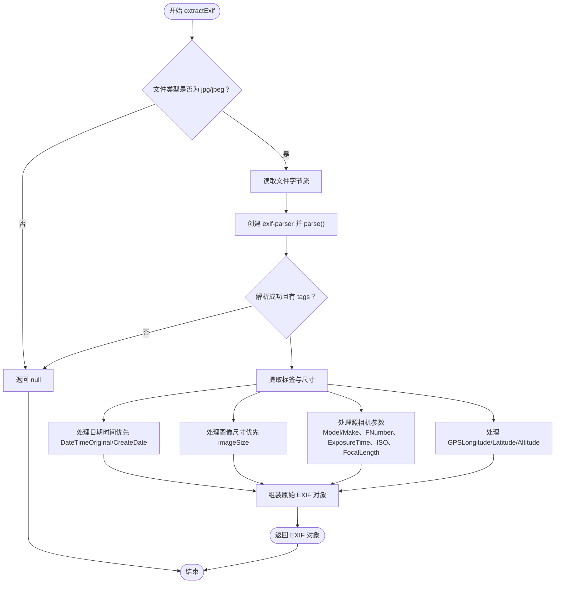

# 文档EXIF信息API

<cite>
**本文引用的文件**
- [server/routes/documents.js](file://server/routes/documents.js)
- [server/models/document-exif.js](file://server/models/document-exif.js)
- [server/db/create_document_exif_table.sql](file://server/db/create_document_exif_table.sql)
- [server/package.json](file://server/package.json)
</cite>

## 目录
1. [简介](#简介)
2. [项目结构](#项目结构)
3. [核心组件](#核心组件)
4. [架构总览](#架构总览)
5. [详细组件分析](#详细组件分析)
6. [依赖关系分析](#依赖关系分析)
7. [性能考量](#性能考量)
8. [故障排查指南](#故障排查指南)
9. [结论](#结论)
10. [附录](#附录)

## 简介
本文件面向“文档EXIF信息API”的GET /api/documents/:id/exif接口，系统性说明其设计与实现要点：
- 接口职责：在验证文档存在性的前提下，从document_exif表中查询对应EXIF数据，并返回原始EXIF字段与按“文件组/照相机组/GPS组”组织的分组结构。
- EXIF解析：使用exif-parser库对JPG/JPEG文件进行解析，提取日期时间、图像尺寸、照相机型号/光圈/曝光时间/ISO/焦距、GPS经纬度与海拔等关键元数据。
- 返回结构：同时返回原始EXIF对象与通过formatExifGroups生成的分组视图；对于非JPG/JPEG文件或无EXIF记录的情况，返回空或提示信息。
- 错误处理：对文档不存在、数据库查询异常、解析失败等情况进行统一处理与状态码返回。

## 项目结构
围绕EXIF功能的相关文件分布如下：
- 路由层：负责HTTP请求处理与业务流程编排（GET /api/documents/:id/exif）。
- 模型层：封装数据库访问与EXIF数据格式化。
- 数据库脚本：定义EXIF表结构及索引。
- 依赖声明：后端运行所需的第三方库（含exif-parser）。

图表来源
- [server/routes/documents.js](file://server/routes/documents.js#L263-L292)
- [server/models/document-exif.js](file://server/models/document-exif.js#L71-L168)
- [server/db/create_document_exif_table.sql](file://server/db/create_document_exif_table.sql#L1-L47)
- [server/package.json](file://server/package.json#L13-L21)

章节来源
- [server/routes/documents.js](file://server/routes/documents.js#L263-L292)
- [server/models/document-exif.js](file://server/models/document-exif.js#L71-L168)
- [server/db/create_document_exif_table.sql](file://server/db/create_document_exif_table.sql#L1-L47)
- [server/package.json](file://server/package.json#L13-L21)

## 核心组件
- 路由处理器：实现GET /api/documents/:id/exif，包含文档存在性校验、EXIF查询、分组格式化与错误处理。
- EXIF模型：提供数据库访问方法（按文档ID查询EXIF、批量查询带EXIF的文档列表、格式化分组结构）。
- EXIF解析器：基于exif-parser库，仅对JPG/JPEG文件进行解析，提取日期时间、图像尺寸、照相机参数、GPS坐标等。
- 数据库表：document_exif，存储与文档一一对应的EXIF字段，包含文件组、照相机组、GPS组三类字段。

章节来源
- [server/routes/documents.js](file://server/routes/documents.js#L263-L292)
- [server/models/document-exif.js](file://server/models/document-exif.js#L71-L168)
- [server/db/create_document_exif_table.sql](file://server/db/create_document_exif_table.sql#L1-L47)

## 架构总览
下图展示了GET /api/documents/:id/exif的调用链路与数据流向。

图表来源
- [server/routes/documents.js](file://server/routes/documents.js#L263-L292)
- [server/models/document-exif.js](file://server/models/document-exif.js#L71-L168)

## 详细组件分析

### 接口：GET /api/documents/:id/exif
- 功能概述：先校验文档存在性，再查询EXIF记录；若存在则返回原始EXIF与分组结构，否则返回空与提示信息。
- 关键步骤：
  1) 参数解析与文档存在性校验。
  2) 查询document_exif表中的EXIF记录。
  3) 若无记录，返回空与友好提示；若有记录，调用formatExifGroups生成分组视图。
  4) 统一错误处理与状态码返回。

图表来源
- [server/routes/documents.js](file://server/routes/documents.js#L263-L292)

章节来源
- [server/routes/documents.js](file://server/routes/documents.js#L263-L292)

### EXIF解析：extractExif函数（JPG/JPEG）
- 解析范围：仅对JPG/JPEG文件启用解析，PNG等其他格式直接返回空。
- 解析流程：
  1) 读取文件字节流，创建exif-parser实例并解析。
  2) 从解析结果中提取标签与图像尺寸。
  3) 日期时间：优先DateTimeOriginal，其次CreateDate，均按Unix时间戳转换为本地时间。
  4) 图像尺寸：优先使用解析器提供的imageSize，其次尝试ImageWidth/ExifImageWidth与ImageHeight/ExifImageHeight。
  5) 照相机组：Model/Make、FNumber、ExposureTime（转换为分数形式）、ISO、FocalLength。
  6) GPS组：GPSLongitude、GPSLatitude、GPSAltitude。
  7) 异常捕获：解析失败或无标签时返回空，避免中断流程。
- 返回字段（原始EXIF）：
  - 文件组：date_time、image_width、image_height
  - 照相机组：equip_model、f_number、exposure_time、iso_speed、focal_length
  - GPS组：gps_longitude、gps_latitude、gps_altitude

图表来源
- [server/routes/documents.js](file://server/routes/documents.js#L72-L139)

章节来源
- [server/routes/documents.js](file://server/routes/documents.js#L72-L139)

### 数据模型：document-exif.js
- 数据库访问方法：
  - createExif：插入或更新一条EXIF记录（按document_id去重），字段映射与SQL一致。
  - getExifByDocumentId：按文档ID查询EXIF记录。
  - deleteExifByDocumentId：删除EXIF记录（依赖外键级联删除）。
  - getDocumentsWithExif：联接documents与document_exif，返回带EXIF的文档列表。
- 分组格式化：formatExifGroups将原始EXIF对象转换为三组结构（文件/照相机/GPS），每组包含label与属性数组（含key、label、value、unit）。

图表来源
- [server/models/document-exif.js](file://server/models/document-exif.js#L1-L168)

章节来源
- [server/models/document-exif.js](file://server/models/document-exif.js#L1-L168)

### 数据库表：document_exif
- 字段分组：
  - 文件组：date_time、image_width、image_height
  - 照相机组：equip_model、f_number、exposure_time、iso_speed、focal_length
  - GPS组：gps_longitude、gps_latitude、gps_altitude
- 约束与索引：外键引用documents(id)，UNIQUE(document_id)，并为document_id与date_time建立索引。
- 注释：为表与各列添加中文注释，便于理解用途。

章节来源
- [server/db/create_document_exif_table.sql](file://server/db/create_document_exif_table.sql#L1-L47)

## 依赖关系分析
- 后端依赖：
  - exif-parser：用于解析JPG/JPEG文件的EXIF元数据。
  - express/multer/pg/cors/uuid：通用Web服务与数据库交互依赖。
- 路由到模型：
  - 路由层调用文档模型与EXIF模型，EXIF模型通过pg驱动访问PostgreSQL。
- 路由到解析器：
  - 路由层在上传时调用extractExif解析JPG/JPEG，解析结果写入document_exif表。

图表来源
- [server/package.json](file://server/package.json#L13-L21)
- [server/routes/documents.js](file://server/routes/documents.js#L1-L20)
- [server/models/document-exif.js](file://server/models/document-exif.js#L1-L10)

章节来源
- [server/package.json](file://server/package.json#L13-L21)
- [server/routes/documents.js](file://server/routes/documents.js#L1-L20)
- [server/models/document-exif.js](file://server/models/document-exif.js#L1-L10)

## 性能考量
- 解析成本：JPG/JPEG解析涉及I/O与CPU计算，建议仅对JPG/JPEG启用解析，避免对PNG等无EXIF的文件进行解析。
- 数据库访问：getExifByDocumentId使用document_id索引，查询开销较低；formatExifGroups为纯内存操作，开销极小。
- 批量查询：getDocumentsWithExif采用LEFT JOIN，结合索引可提升列表查询性能。
- 建议：
  - 在高并发场景下，控制解析并发数量，避免阻塞。
  - 对频繁访问的文档，可在应用层增加缓存策略（如Redis）以减少数据库压力。

## 故障排查指南
- 常见错误与处理：
  - 文档不存在：返回404并提示“文档不存在”。
  - 无EXIF记录：返回200但data为null，并附带“无EXIF”提示。
  - 解析失败：extractExif捕获异常并返回null，路由层不会抛出异常，确保接口稳定。
  - 数据库异常：统一捕获并返回500与错误信息。
- 排查步骤：
  1) 确认文档ID有效且存在。
  2) 检查document_exif表中是否存在对应记录。
  3) 确认文件类型为jpg/jpeg，否则不会解析EXIF。
  4) 查看后端日志中的解析错误信息（如exif-parser报错）。
  5) 核对数据库连接与权限配置。

章节来源
- [server/routes/documents.js](file://server/routes/documents.js#L263-L292)
- [server/models/document-exif.js](file://server/models/document-exif.js#L71-L168)

## 结论
GET /api/documents/:id/exif接口通过清晰的流程控制与健壮的错误处理，实现了对文档EXIF信息的可靠查询。其设计遵循“仅对JPG/JPEG解析”的原则，兼顾了性能与准确性；返回的原始EXIF与分组结构满足不同前端展示需求。配合数据库索引与模型层的格式化能力，整体具备良好的可维护性与扩展性。

## 附录

### curl示例
- 获取指定文档的EXIF信息：
  - curl -i "http://localhost:3000/api/documents/{id}/exif"
- 示例响应格式说明：
  - 当存在EXIF：返回包含success、data（原始EXIF对象）、groups（按文件/照相机/GPS分组）。
  - 当无EXIF：返回success为true、data为null、message为“无EXIF”。
  - 当文档不存在：返回404与错误信息。
  - 当服务器内部错误：返回500与错误信息。

章节来源
- [server/routes/documents.js](file://server/routes/documents.js#L263-L292)