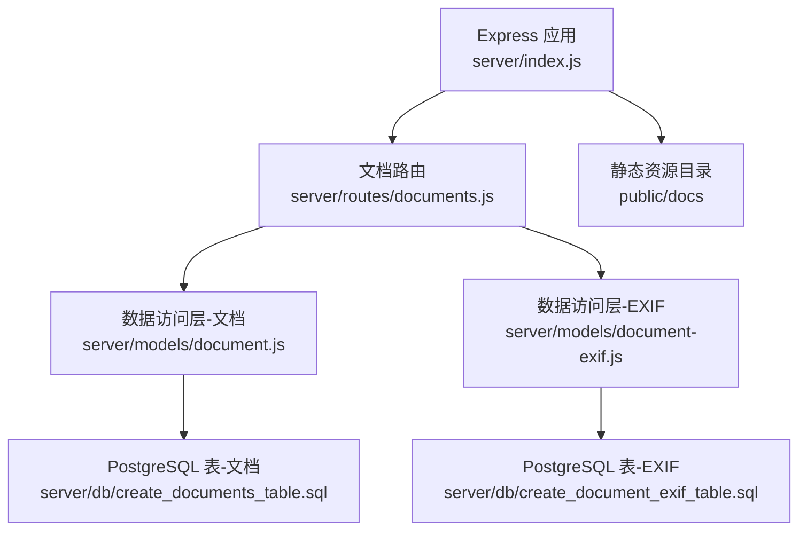
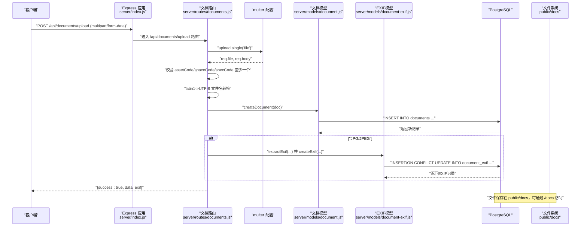
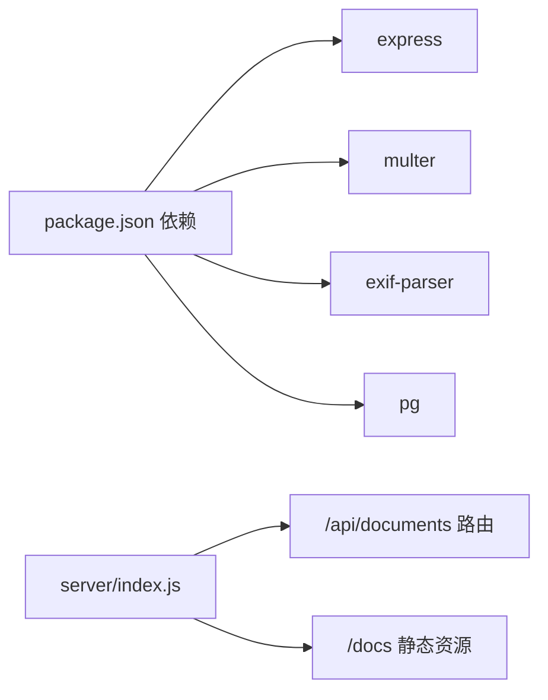
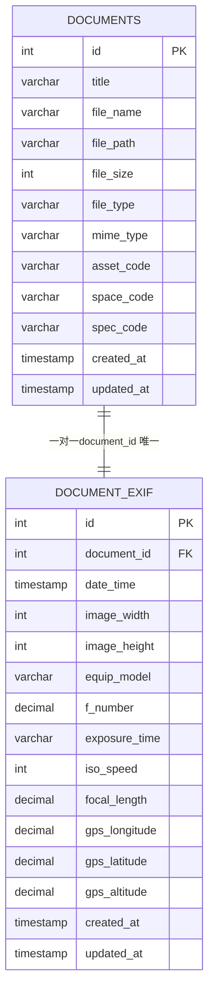

# 文档上传API

<cite>
**本文引用的文件**
- [server/routes/documents.js](file://server/routes/documents.js)
- [server/models/document.js](file://server/models/document.js)
- [server/models/document-exif.js](file://server/models/document-exif.js)
- [server/db/create_documents_table.sql](file://server/db/create_documents_table.sql)
- [server/db/create_document_exif_table.sql](file://server/db/create_document_exif_table.sql)
- [server/index.js](file://server/index.js)
- [server/package.json](file://server/package.json)
</cite>

## 目录
1. [简介](#简介)
2. [项目结构](#项目结构)
3. [核心组件](#核心组件)
4. [架构总览](#架构总览)
5. [详细组件分析](#详细组件分析)
6. [依赖关系分析](#依赖关系分析)
7. [性能考虑](#性能考虑)
8. [故障排查指南](#故障排查指南)
9. [结论](#结论)
10. [附录](#附录)

## 简介
本文件面向“文档上传API”的POST /api/documents/upload接口，提供从设计到实现的完整说明。内容涵盖：
- 使用multer处理multipart/form-data文件上传的配置与行为
- 存储策略与命名规则（时间戳_随机字符串.扩展名）
- 200MB大小限制
- 文件类型过滤（PDF、JPG、PNG、SVG、MP4）
- 中文文件名编码问题（latin1到UTF-8转换）
- 表单参数校验（assetCode、spaceCode、specCode至少一个必填；可选title）
- 成功响应结构（文档元数据与EXIF信息）
- curl示例与错误处理（含删除临时文件）

## 项目结构
该接口位于后端服务的文档路由模块中，配合数据访问层与数据库表结构共同完成文件上传、持久化与EXIF解析。

图表来源
- [server/index.js](file://server/index.js#L22-L50)
- [server/routes/documents.js](file://server/routes/documents.js#L146-L215)
- [server/models/document.js](file://server/models/document.js#L55-L78)
- [server/models/document-exif.js](file://server/models/document-exif.js#L12-L69)
- [server/db/create_documents_table.sql](file://server/db/create_documents_table.sql#L1-L49)
- [server/db/create_document_exif_table.sql](file://server/db/create_document_exif_table.sql#L1-L48)

章节来源
- [server/index.js](file://server/index.js#L22-L50)
- [server/routes/documents.js](file://server/routes/documents.js#L146-L215)

## 核心组件
- 路由与中间件：负责接收multipart请求、应用multer配置、执行业务逻辑与返回响应。
- 数据访问层：封装SQL操作，完成文档记录创建与EXIF记录写入。
- 数据库表：定义文档与EXIF字段及约束，确保数据一致性。
- 静态资源：提供上传文件的公开访问路径。

章节来源
- [server/routes/documents.js](file://server/routes/documents.js#L146-L215)
- [server/models/document.js](file://server/models/document.js#L55-L78)
- [server/models/document-exif.js](file://server/models/document-exif.js#L12-L69)
- [server/db/create_documents_table.sql](file://server/db/create_documents_table.sql#L1-L49)
- [server/db/create_document_exif_table.sql](file://server/db/create_document_exif_table.sql#L1-L48)

## 架构总览
POST /api/documents/upload的端到端流程如下：

图表来源
- [server/index.js](file://server/index.js#L22-L50)
- [server/routes/documents.js](file://server/routes/documents.js#L146-L215)
- [server/models/document.js](file://server/models/document.js#L55-L78)
- [server/models/document-exif.js](file://server/models/document-exif.js#L12-L69)

## 详细组件分析

### 1) 路由与控制器（POST /api/documents/upload）
- 请求类型：multipart/form-data
- 必填参数：file（二进制文件）
- 可选参数：assetCode、spaceCode、specCode（至少一个必填）、title（默认使用原始文件名）
- 业务流程：
  - 校验是否上传了文件
  - 校验至少一个关联字段（assetCode/spaceCode/specCode）
  - 处理中文文件名编码（latin1->UTF-8）
  - 构造文档元数据并调用数据访问层创建记录
  - 对JPG/JPEG提取EXIF并写入EXIF表
  - 返回成功响应（包含文档元数据与EXIF信息）
- 错误处理：
  - 无文件或类型不支持：返回400
  - 校验失败：删除临时文件并返回400
  - 其他异常：删除临时文件并返回500

章节来源
- [server/routes/documents.js](file://server/routes/documents.js#L146-L215)

### 2) 文件存储与命名策略
- 存储位置：public/docs（通过静态中间件对外提供访问）
- 唯一文件名生成：时间戳_随机字符串.扩展名
- 目录创建：首次上传自动创建目标目录
- 访问路径：/docs/{filename}

章节来源
- [server/routes/documents.js](file://server/routes/documents.js#L16-L35)
- [server/index.js](file://server/index.js#L33-L36)

### 3) 文件大小限制与类型过滤
- 大小限制：200MB
- 类型过滤：仅允许PDF、JPG、PNG、SVG、MP4
- 过滤依据：mimetype与扩展名同时校验

章节来源
- [server/routes/documents.js](file://server/routes/documents.js#L58-L65)
- [server/routes/documents.js](file://server/routes/documents.js#L38-L56)

### 4) 中文文件名编码处理
- 问题背景：multer在某些环境下会将UTF-8文件名以latin1方式存储
- 解决方案：尝试将originalname以latin1解码再转回UTF-8；失败则保留原始文件名

章节来源
- [server/routes/documents.js](file://server/routes/documents.js#L164-L174)

### 5) 文档元数据与EXIF响应结构
- 成功响应包含：
  - data：文档记录（字段见下表）
  - exif：当为JPG/JPEG时返回EXIF记录（否则为null）
- 文档记录字段（data）：
  - id：自增主键
  - title：标题（来自请求title或原始文件名）
  - file_name：原始文件名（已转换为UTF-8）
  - file_path：相对路径 /docs/{唯一文件名}
  - file_size：字节数
  - file_type：扩展名（小写）
  - mime_type：MIME类型
  - asset_code/space_code/spec_code：关联字段（三选一）
  - created_at/updated_at：时间戳
- EXIF记录字段（exif）（仅JPG/JPEG）：
  - date_time：拍摄时间
  - image_width/image_height：图像尺寸
  - equip_model：设备型号
  - f_number：光圈值
  - exposure_time：曝光时间
  - iso_speed：ISO速度
  - focal_length：焦距
  - gps_longitude/gps_latitude/gps_altitude：GPS坐标与海拔

章节来源
- [server/models/document.js](file://server/models/document.js#L55-L78)
- [server/models/document-exif.js](file://server/models/document-exif.js#L12-L69)
- [server/db/create_documents_table.sql](file://server/db/create_documents_table.sql#L1-L49)
- [server/db/create_document_exif_table.sql](file://server/db/create_document_exif_table.sql#L1-L48)

### 6) 数据库表结构与约束
- documents表：
  - 主键：id
  - 关联字段：asset_code、space_code、spec_code（三选一）
  - 索引：按三个关联字段与created_at排序
- document_exif表：
  - 外键：document_id -> documents(id)，级联删除
  - 唯一约束：document_id唯一
  - 索引：document_id、date_time

章节来源
- [server/db/create_documents_table.sql](file://server/db/create_documents_table.sql#L1-L49)
- [server/db/create_document_exif_table.sql](file://server/db/create_document_exif_table.sql#L1-L48)

### 7) curl示例
以下为上传文件的典型curl命令（multipart/form-data），请根据实际环境调整：
- 上传文件并指定关联字段（任选其一）：
  - curl -X POST "http://localhost:3001/api/documents/upload" -F "file=@/path/to/your/file.pdf" -F "assetCode=ASSET001" -F "title=我的文档"
- 上传图片并指定spaceCode：
  - curl -X POST "http://localhost:3001/api/documents/upload" -F "file=@/path/to/your/photo.jpg" -F "spaceCode=S001"
- 上传视频并指定specCode：
  - curl -X POST "http://localhost:3001/api/documents/upload" -F "file=@/path/to/your/video.mp4" -F "specCode=SPEC001"

注意：
- 请确保文件路径正确且文件大小不超过200MB
- 至少提供assetCode、spaceCode或specCode中的一个
- 若未提供title，系统将使用原始文件名作为标题

章节来源
- [server/routes/documents.js](file://server/routes/documents.js#L146-L215)
- [server/index.js](file://server/index.js#L22-L50)

### 8) 错误处理与清理
- 当缺少文件或类型不被支持时：返回400并删除临时文件
- 当创建文档记录失败或EXIF解析异常时：删除临时文件并返回500
- 删除物理文件的时机：
  - 上传失败时主动删除
  - 删除文档记录时同步删除对应物理文件

章节来源
- [server/routes/documents.js](file://server/routes/documents.js#L146-L215)
- [server/routes/documents.js](file://server/routes/documents.js#L321-L353)

## 依赖关系分析
- 依赖库：
  - express：Web框架
  - multer：文件上传中间件
  - exif-parser：EXIF解析
  - pg：PostgreSQL驱动
- 路由挂载：
  - /api/documents -> 文档路由
  - /docs -> 静态资源（public/docs）

图表来源
- [server/package.json](file://server/package.json#L14-L21)
- [server/index.js](file://server/index.js#L22-L50)

章节来源
- [server/package.json](file://server/package.json#L14-L21)
- [server/index.js](file://server/index.js#L22-L50)

## 性能考虑
- 上传限制：200MB，避免过大文件导致内存压力与超时
- 存储策略：磁盘存储于public/docs，建议结合NFS或云存储优化I/O
- EXIF解析：仅对JPG/JPEG执行，避免对其他格式进行无意义解析
- 并发上传：multer默认单文件处理，若需并发可评估多实例部署
- 数据库：documents与document_exif均建有索引，查询性能良好

## 故障排查指南
- 400 错误（缺少文件或类型不支持）
  - 检查multipart请求是否包含file字段
  - 确认文件扩展名与MIME类型在允许列表内
- 400 错误（未提供关联字段）
  - 至少提供assetCode、spaceCode或specCode之一
- 500 错误（服务器内部错误）
  - 查看服务端日志定位异常
  - 确认数据库连接正常
- 文件名乱码
  - 确认客户端发送的文件名编码符合预期
  - 服务端会尝试latin1->UTF-8转换，失败则保留原始名称
- EXIF为空
  - 仅JPG/JPEG支持EXIF提取
  - 若无EXIF信息，返回null属正常

章节来源
- [server/routes/documents.js](file://server/routes/documents.js#L146-L215)
- [server/db/index.js](file://server/db/index.js#L1-L70)

## 结论
POST /api/documents/upload接口通过multer实现稳定高效的文件上传，结合严格的类型过滤、大小限制与中文文件名编码处理，确保跨平台兼容性与安全性。文档元数据与EXIF信息的分离存储，既满足通用文档管理需求，又为图像类文档提供额外的元数据能力。建议在生产环境中配合静态资源CDN、数据库备份与监控告警，进一步提升可用性与可观测性。

## 附录

### A. 接口定义与参数说明
- 方法：POST
- 路径：/api/documents/upload
- 内容类型：multipart/form-data
- 表单字段：
  - file：必填，二进制文件
  - assetCode：可选，与文档关联的资产编码
  - spaceCode：可选，与文档关联的空间编码
  - specCode：可选，与文档关联的规格编码
  - title：可选，文档标题，默认使用原始文件名
- 成功响应：
  - data：文档记录（包含id、title、file_name、file_path、file_size、file_type、mime_type、asset_code、space_code、spec_code、created_at、updated_at）
  - exif：当为JPG/JPEG时返回EXIF记录，否则为null
- 失败响应：
  - 400：缺少文件、类型不支持、未提供关联字段
  - 500：服务器内部错误（含异常堆栈）

章节来源
- [server/routes/documents.js](file://server/routes/documents.js#L146-L215)

### B. 数据模型图

图表来源
- [server/db/create_documents_table.sql](file://server/db/create_documents_table.sql#L1-L49)
- [server/db/create_document_exif_table.sql](file://server/db/create_document_exif_table.sql#L1-L48)