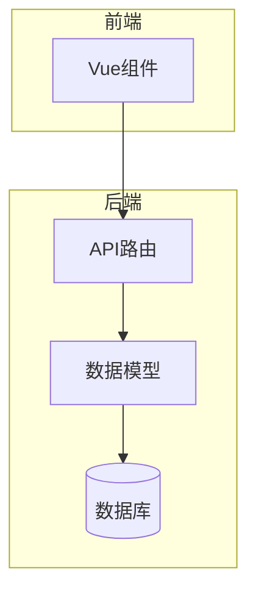
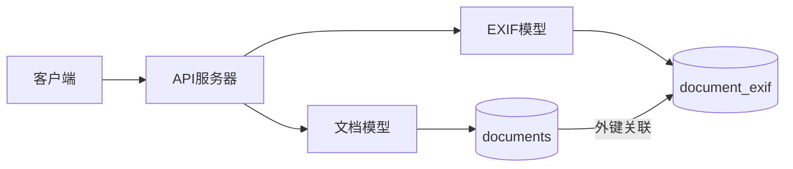
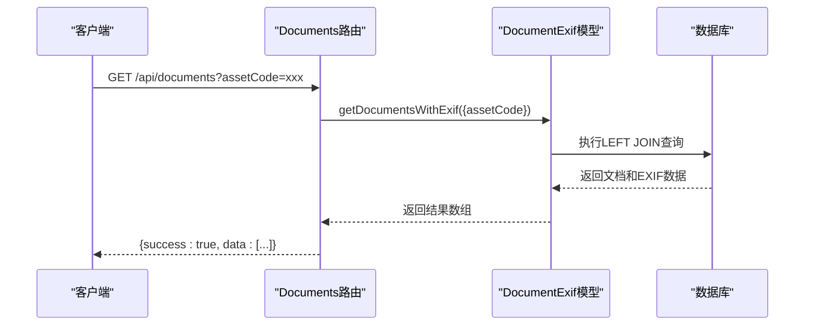
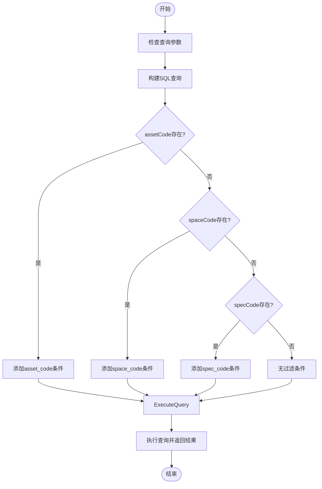
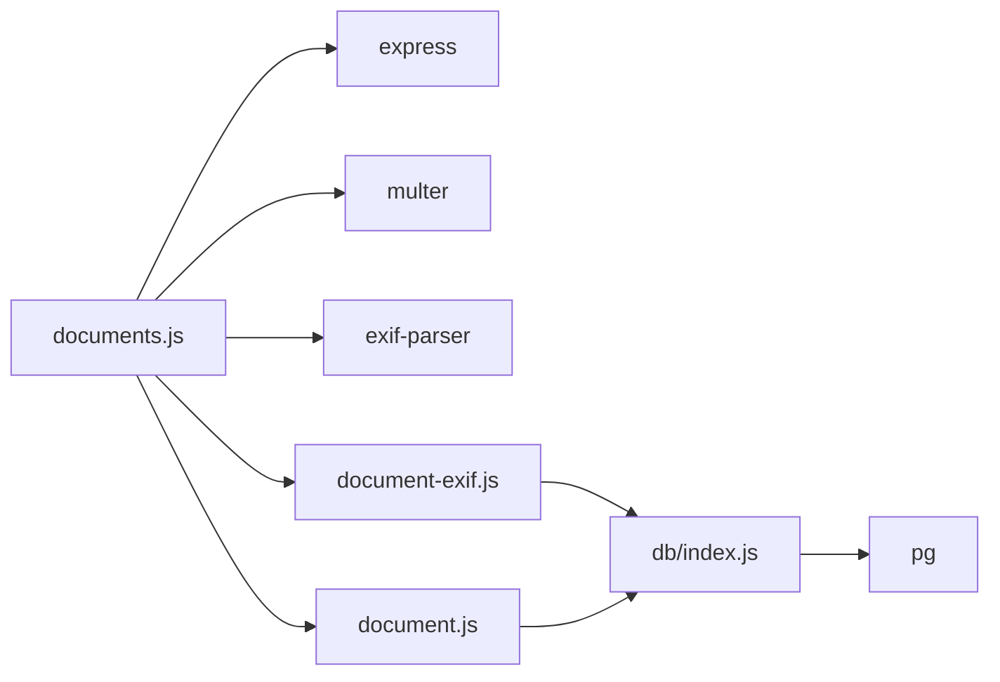

# 文档查询API

<cite>
**本文档引用的文件**
- [documents.js](file://server/routes/documents.js)
- [document-exif.js](file://server/models/document-exif.js)
- [document.js](file://server/models/document.js)
- [create_documents_table.sql](file://server/db/create_documents_table.sql)
- [create_document_exif_table.sql](file://server/db/create_document_exif_table.sql)
- [index.js](file://server/index.js)
</cite>

## 目录
1. [简介](#简介)
2. [项目结构](#项目结构)
3. [核心组件](#核心组件)
4. [架构概述](#架构概述)
5. [详细组件分析](#详细组件分析)
6. [依赖分析](#依赖分析)
7. [性能考虑](#性能考虑)
8. [故障排除指南](#故障排除指南)
9. [结论](#结论)

## 简介
本文档详细描述了文档查询API的实现，重点介绍GET /api/documents接口的功能。该API允许通过assetCode、spaceCode和specCode参数过滤文档列表，并返回包含EXIF信息的完整文档数据。文档将阐述后端如何调用documentExifModel.getDocumentsWithExif方法执行文档表与EXIF表的联合查询，说明返回数据的结构，包括文档基本信息和EXIF元数据，并描述空查询参数时的行为及错误处理机制。

## 项目结构
项目采用分层架构，后端服务位于server目录下，包含路由、模型和数据库相关文件。文档管理功能主要由routes/documents.js处理HTTP请求，models/document.js和models/document-exif.js提供数据访问层，数据库表结构定义在db目录下的SQL文件中。

**图表来源**
- [index.js](file://server/index.js#L10-L14)
- [documents.js](file://server/routes/documents.js#L7-L8)
- [document.js](file://server/models/document.js#L1)
- [document-exif.js](file://server/models/document-exif.js#L5)

**章节来源**
- [index.js](file://server/index.js#L1-L92)
- [documents.js](file://server/routes/documents.js#L1-L386)

## 核心组件
核心组件包括文档路由处理、文档模型和EXIF模型。documents.js文件定义了所有文档相关的API端点，其中GET /api/documents是主要的查询接口。document.js提供基本的文档数据访问功能，而document-exif.js则专门处理与EXIF元数据相关的操作，包括联合查询功能。

**章节来源**
- [documents.js](file://server/routes/documents.js#L217-L237)
- [document-exif.js](file://server/models/document-exif.js#L95-L128)
- [document.js](file://server/models/document.js#L12-L35)

## 架构概述
系统采用Express框架构建RESTful API，通过PostgreSQL数据库存储文档及其元数据。文档基本信息存储在documents表中，而图像的EXIF元数据则存储在独立的document_exif表中，两表通过document_id字段关联。这种分离设计提高了查询效率和数据组织的清晰度。

**图表来源**
- [create_documents_table.sql](file://server/db/create_documents_table.sql#L4-L30)
- [create_document_exif_table.sql](file://server/db/create_document_exif_table.sql#L4-L29)
- [documents.js](file://server/routes/documents.js#L226-L230)

## 详细组件分析

### GET /api/documents 接口分析
该接口是文档查询的核心，支持通过assetCode、spaceCode或specCode参数过滤文档列表。当查询参数为空时，返回所有文档记录。接口通过调用documentExifModel.getDocumentsWithExif方法执行LEFT JOIN查询，确保即使没有EXIF数据的文档也能被返回。

#### 接口工作流程

**图表来源**
- [documents.js](file://server/routes/documents.js#L221-L237)
- [document-exif.js](file://server/models/document-exif.js#L99-L128)

#### 数据库查询实现

**图表来源**
- [document-exif.js](file://server/models/document-exif.js#L100-L128)

**章节来源**
- [document-exif.js](file://server/models/document-exif.js#L95-L128)
- [documents.js](file://server/routes/documents.js#L221-L237)

## 依赖分析
文档查询功能依赖多个组件协同工作。express框架提供路由功能，multer处理文件上传，pg模块管理PostgreSQL数据库连接。exif-parser库用于提取图像文件的EXIF元数据。这些依赖在package.json中定义，并通过模块导入在代码中使用。

**图表来源**
- [documents.js](file://server/routes/documents.js#L1-L8)
- [document-exif.js](file://server/models/document-exif.js#L5)
- [document.js](file://server/models/document.js#L1)
- [index.js](file://server/db/index.js#L5)

**章节来源**
- [documents.js](file://server/routes/documents.js#L1-L8)
- [package.json](file://package.json)

## 性能考虑
为提高查询性能，数据库表已创建适当的索引。documents表在asset_code、space_code和spec_code字段上创建了索引，确保基于这些字段的查询能够快速执行。document_exif表在document_id字段上创建了索引，优化了JOIN操作的性能。此外，查询结果按创建时间降序排列，符合大多数使用场景的需求。

## 故障排除指南
常见问题包括文件上传失败、查询无结果和EXIF提取失败。文件上传失败通常由于文件类型不支持或大小超过200MB限制。查询无结果可能是由于查询参数与文档关联的assetCode、spaceCode或specCode不匹配。EXIF提取失败通常发生在非JPG/JPEG图像文件上，因为这些格式通常不包含EXIF数据。

**章节来源**
- [documents.js](file://server/routes/documents.js#L38-L56)
- [documents.js](file://server/routes/documents.js#L72-L138)
- [documents.js](file://server/routes/documents.js#L234-L236)

## 结论
文档查询API提供了强大的功能，支持通过多种条件过滤文档列表，并能返回丰富的EXIF元数据。通过合理的数据库设计和查询优化，系统能够高效地处理文档查询请求。联合查询的设计确保了即使没有EXIF数据的文档也能被正确返回，保证了数据的完整性。