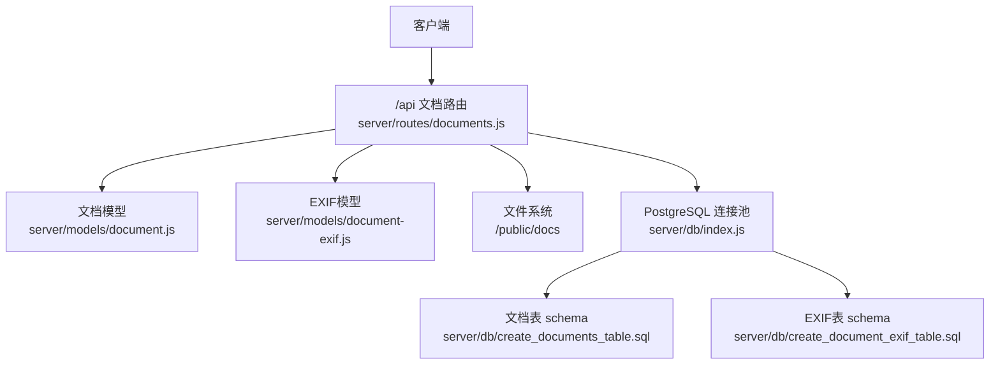
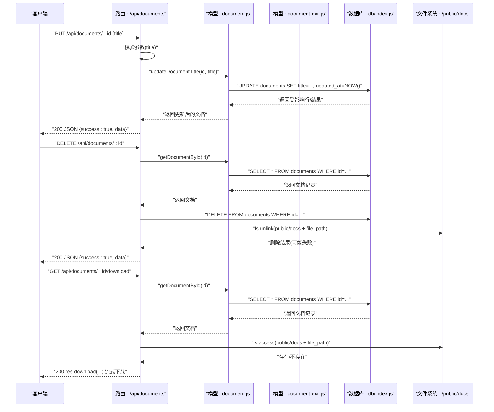
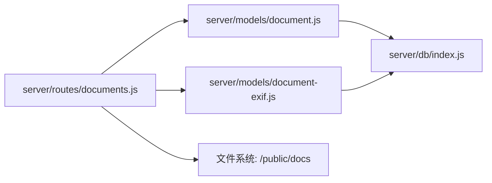

# 文档管理API

<cite>
**本文引用的文件**
- [server/index.js](file://server/index.js)
- [server/routes/documents.js](file://server/routes/documents.js)
- [server/models/document.js](file://server/models/document.js)
- [server/models/document-exif.js](file://server/models/document-exif.js)
- [server/db/index.js](file://server/db/index.js)
- [server/db/create_documents_table.sql](file://server/db/create_documents_table.sql)
- [server/db/create_document_exif_table.sql](file://server/db/create_document_exif_table.sql)
</cite>

## 目录
1. [简介](#简介)
2. [项目结构](#项目结构)
3. [核心组件](#核心组件)
4. [架构总览](#架构总览)
5. [详细组件分析](#详细组件分析)
6. [依赖分析](#依赖分析)
7. [性能考虑](#性能考虑)
8. [故障排查指南](#故障排查指南)
9. [结论](#结论)
10. [附录](#附录)

## 简介
本文件面向后端开发者与集成方，系统化梳理文档管理API的更新、删除与下载能力，覆盖以下接口：
- PUT /api/documents/:id：更新文档标题（含参数校验与数据库更新）
- DELETE /api/documents/:id：删除文档（先删数据库记录，再删物理文件；对文件删除失败进行容错）
- GET /api/documents/:id/download：下载文档（校验存在性、检查文件系统、使用流式下载）

同时给出错误处理策略（如文档不存在返回404）、数据模型与数据库约束说明，以及curl示例。

## 项目结构
后端采用Express + PostgreSQL架构，文档相关路由挂载在 /api/documents 下，静态资源通过 /docs 暴露至 public/docs 目录。

图表来源
- [server/index.js](file://server/index.js#L44-L49)
- [server/routes/documents.js](file://server/routes/documents.js#L1-L386)
- [server/models/document.js](file://server/models/document.js#L1-L163)
- [server/models/document-exif.js](file://server/models/document-exif.js#L1-L169)
- [server/db/index.js](file://server/db/index.js#L1-L70)
- [server/db/create_documents_table.sql](file://server/db/create_documents_table.sql#L1-L49)
- [server/db/create_document_exif_table.sql](file://server/db/create_document_exif_table.sql#L1-L48)

章节来源
- [server/index.js](file://server/index.js#L22-L50)
- [server/routes/documents.js](file://server/routes/documents.js#L1-L386)

## 核心组件
- 路由层（/api/documents）：负责接收HTTP请求、参数校验、调用模型层、返回响应与错误处理。
- 模型层（document.js、document-exif.js）：封装数据库读写操作，提供按ID查询、更新标题、删除记录等方法。
- 数据库层（db/index.js）：提供连接池与SQL执行包装，统一记录查询耗时与错误。
- 数据表（schema）：documents与document_exif两张表，定义字段、约束与索引。

章节来源
- [server/routes/documents.js](file://server/routes/documents.js#L294-L383)
- [server/models/document.js](file://server/models/document.js#L42-L110)
- [server/models/document-exif.js](file://server/models/document-exif.js#L71-L128)
- [server/db/index.js](file://server/db/index.js#L40-L51)
- [server/db/create_documents_table.sql](file://server/db/create_documents_table.sql#L1-L49)
- [server/db/create_document_exif_table.sql](file://server/db/create_document_exif_table.sql#L1-L48)

## 架构总览
文档管理API的控制流如下：客户端请求到达 /api/documents 路由，路由根据HTTP方法分派到对应处理器；处理器调用模型层执行数据库操作，必要时访问文件系统；最终返回JSON响应或触发流式下载。

图表来源
- [server/routes/documents.js](file://server/routes/documents.js#L294-L383)
- [server/models/document.js](file://server/models/document.js#L80-L110)
- [server/models/document-exif.js](file://server/models/document-exif.js#L71-L128)
- [server/db/index.js](file://server/db/index.js#L40-L51)

## 详细组件分析

### PUT /api/documents/:id 更新文档标题
- 功能概述
  - 接收请求体中的标题字段，进行非空校验（去除空白后判空），若为空则返回400。
  - 调用模型层更新数据库中的文档标题，并设置updated_at为当前时间。
  - 若数据库未找到对应记录，返回404；否则返回200及更新后的文档数据。
- 参数与校验
  - 路径参数：id（数字）
  - 请求体：{ title: string }，必填且不可为空白
- 数据库更新
  - 执行UPDATE语句，返回被更新的文档记录
- 错误处理
  - 400：标题为空
  - 404：文档不存在
  - 500：数据库异常
- curl示例
  - curl -X PUT http://localhost:3001/api/documents/{id} -H "Content-Type: application/json" -d '{"title":"新标题"}'

章节来源
- [server/routes/documents.js](file://server/routes/documents.js#L299-L319)
- [server/models/document.js](file://server/models/document.js#L80-L96)
- [server/db/index.js](file://server/db/index.js#L40-L51)

### DELETE /api/documents/:id 删除文档
- 功能概述
  - 先按ID查询文档，若不存在返回404。
  - 删除数据库记录（DELETE FROM documents WHERE id=...）。
  - 再尝试删除物理文件（/public/docs 目录下的实际文件路径来自数据库记录的file_path字段）。
  - 即使文件删除失败也不影响数据库删除结果（继续返回成功），并在服务端记录错误日志。
- 参数与行为
  - 路径参数：id（数字）
  - 物理文件路径拼接规则：/public + 文档记录的file_path
- 错误处理
  - 404：文档不存在
  - 500：数据库异常
  - 文件删除失败：记录错误但不阻断响应
- curl示例
  - curl -X DELETE http://localhost:3001/api/documents/{id}

章节来源
- [server/routes/documents.js](file://server/routes/documents.js#L325-L353)
- [server/models/document.js](file://server/models/document.js#L103-L110)
- [server/db/index.js](file://server/db/index.js#L40-L51)

### GET /api/documents/:id/download 下载文档
- 功能概述
  - 先按ID查询文档，若不存在返回404。
  - 拼接物理文件路径（/public + file_path），检查文件是否存在。
  - 存在则使用res.download触发流式下载，文件名为原始file_name。
  - 文件不存在返回404；其他异常返回500。
- 参数与行为
  - 路径参数：id（数字）
  - 静态资源映射：/docs 对应 /public/docs，便于浏览器直接访问；下载接口通过fs直接读取并流式输出
- 错误处理
  - 404：文档不存在或文件不存在
  - 500：其他异常
- curl示例
  - curl -L -o 输出文件名 http://localhost:3001/api/documents/{id}/download

章节来源
- [server/routes/documents.js](file://server/routes/documents.js#L359-L383)
- [server/models/document.js](file://server/models/document.js#L42-L48)
- [server/index.js](file://server/index.js#L33-L35)

### 数据模型与约束
- 文档表（documents）
  - 字段：id、title、file_name、file_path、file_size、file_type、mime_type、asset_code、space_code、spec_code、created_at、updated_at
  - 约束：三者选一的关联字段约束（asset_code、space_code、spec_code）
  - 索引：按三个关联字段与创建时间排序的索引
- EXIF表（document_exif）
  - 字段：document_id（外键，级联删除）、拍摄时间、图像宽高、照相机参数、GPS坐标与海拔、创建/更新时间
  - 约束：UNIQUE(document_id)，确保每个文档仅有一条EXIF记录
  - 索引：document_id、date_time

章节来源
- [server/db/create_documents_table.sql](file://server/db/create_documents_table.sql#L1-L49)
- [server/db/create_document_exif_table.sql](file://server/db/create_document_exif_table.sql#L1-L48)

## 依赖分析
- 路由依赖
  - /api/documents 路由依赖文档模型与EXIF模型，二者均通过db/index.js提供的query方法访问数据库
- 文件系统依赖
  - 删除与下载均依赖fs模块对/public/docs目录进行文件操作
- 数据库依赖
  - db/index.js提供连接池与query包装，统一记录查询耗时与错误

图表来源
- [server/routes/documents.js](file://server/routes/documents.js#L1-L386)
- [server/models/document.js](file://server/models/document.js#L1-L163)
- [server/models/document-exif.js](file://server/models/document-exif.js#L1-L169)
- [server/db/index.js](file://server/db/index.js#L1-L70)

章节来源
- [server/routes/documents.js](file://server/routes/documents.js#L1-L386)
- [server/models/document.js](file://server/models/document.js#L1-L163)
- [server/models/document-exif.js](file://server/models/document-exif.js#L1-L169)
- [server/db/index.js](file://server/db/index.js#L1-L70)

## 性能考虑
- 查询优化
  - documents表针对关联字段与创建时间建立了索引，有利于按资产/空间/规格筛选与排序
- I/O与并发
  - 删除与下载涉及文件系统I/O，建议在高并发场景下：
    - 控制文件大小与数量，避免单次I/O过大
    - 对频繁下载的热点文件可考虑缓存策略（应用层或CDN）
- 数据库负载
  - 更新标题时仅更新title与updated_at，开销较小
  - 删除文档时先删记录再删文件，避免重复扫描

## 故障排查指南
- 404 文档不存在
  - 检查ID是否正确，确认数据库中是否存在对应记录
  - 下载接口还会检查文件是否存在，若文件缺失也会返回404
- 400 标题为空
  - 确认请求体包含title字段且非空白
- 文件删除失败
  - 服务端会记录错误日志，但不会阻断响应；可手动检查/public/docs目录对应文件是否存在
- 数据库异常
  - 查看db/index.js的统一错误处理与日志输出，定位SQL执行问题

章节来源
- [server/routes/documents.js](file://server/routes/documents.js#L299-L383)
- [server/db/index.js](file://server/db/index.js#L40-L51)

## 结论
本文档对文档管理API的更新、删除与下载进行了完整梳理，明确了参数校验、数据库更新、文件系统操作与错误处理策略，并给出了curl示例。结合数据库表结构与模型职责，可快速定位问题并进行扩展与维护。

## 附录

### curl 示例汇总
- 更新标题
  - curl -X PUT http://localhost:3001/api/documents/{id} -H "Content-Type: application/json" -d '{"title":"新标题"}'
- 删除文档
  - curl -X DELETE http://localhost:3001/api/documents/{id}
- 下载文档
  - curl -L -o 输出文件名 http://localhost:3001/api/documents/{id}/download

章节来源
- [server/routes/documents.js](file://server/routes/documents.js#L299-L383)